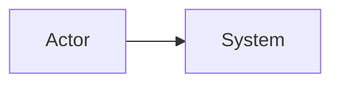
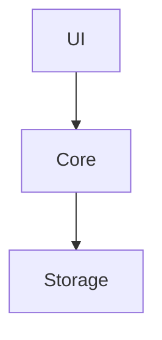

---
title: "C4: <System Name>"
doc_id: "C4-<slug>"
status: "draft"
version: "0.1.0"
updated: "YYYY-MM-DD"
owner: "<owner>"
source_of_truth: false
source_prd: "<path>"
related_docs: []
---

# C4: <System Name>

## 1. Purpose
Describe why this C4 view exists and which PRD/SRS/SDD it supports.

## 2. C1 - System Context


## 3. C2 - Container View


## 4. C3 - Component View
```text
Container
+-- Component
|   +-- Responsibility
```

## 5. C4 - Code / Low-Level Skeleton
```text
Service
+-- method(input)
+-- validate()
+-- persist()
```

## 6. Traceability Matrix
| PRD/SRS Requirement | Container | Component | Supporting Doc |
|---|---|---|---|

## 7. Open Questions
-

## Changelog
| Version | Date | Summary |
|---|---|---|
| 0.1.0 | 2026-06-15 | Initial template scaffold aligned with document versioning governance. |

