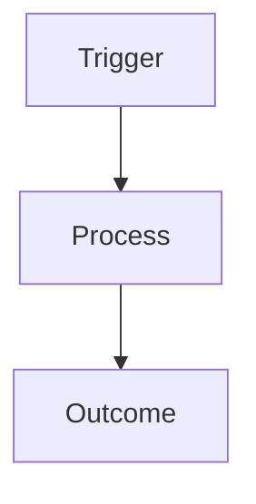

---
title: {{TITLE}}
summary: {{SUMMARY}}
doc_id: {{DOC_ID}}
created: "{{TIMESTAMP}},{{USER}}"
updated: "{{TIMESTAMP}},{{USER}}"
version: "1.0.0-beta"
status: active
state: active
type: genesis
vault_id: default
source_type: axiomatic
tags:
  - genesis
  - cognitive-engine
  - manifest
block_manifest:
  core:
    module:
      id: [[MOD::{{MODULE_ID}}]]
      version: "1.0"
      masterplan: "{{MP_ID}}"
      roadmap: "{{RM_ID}}"
      phase: "{{PH_ID}}"
      epic: "{{EP_ID}}"
      sprint: "{{SP_ID}}"
      task: "{{TASK_ID}}"
      retrieval_radius: "R3"
      cluster: "{{CLUSTER}}"
      domain: "{{DOMAIN}}"
      layer: "Module"
      role: "orchestrator"
      status: "ACTIVE"

---

# {{MOD_NAME}} [L1-Module] {{MODULE_ID}}

## DESCRIPTION
{{MOD_DESCRIPTION}}

## EXECUTION FLOW


## ATOMS

### FEAT: {{FEAT_NAME}} [L2-Feature] {{FEAT_ID}}
- **Metadata:**
  ```yaml
  id: [[FEAT::{{FEAT_ID}}]]
  retrieval_radius: "R2"
  role: "worker"
  ```
- **Logic:**
  {{FEAT_LOGIC}}

### ALGO: {{ALGO_NAME}} [L3-Logic] {{ALGO_ID}}
- **Metadata:**
  ```yaml
  id: [[ALGO::{{ALGO_ID}}]]
  retrieval_radius: "R1"
  role: "calculator"
  ```
- **Logic:**
  {{ALGO_LOGIC}}

### ENTITY: {{ENTITY_NAME}} [L3-Storage] {{ENTITY_ID}}
- **Metadata:**
  ```yaml
  id: [[ENTITY::{{ENTITY_ID}}]]
  retrieval_radius: "R2"
  role: "repository"
  ```
- **Schema:**
  {{ENTITY_SCHEMA}}

## Changelog
| Version | Date | Summary |
|---|---|---|
| 0.1.1 | 2026-08-19 | Corrected abolished H-axis semantics per ADR-021/AUD-14 (TASK-PRD-022 sweep): the field previously named `context_scaling_tier` is renamed `retrieval_radius` (values `H1-H3` renamed `R1-R3`) — the per-atom values decrease with containment depth exactly as `GenesisBlock.md`'s worked example, whose inline comments confirm the field measures graph-hop reach, not the executor tool-permission ceiling. Documents generated from this template that also need a governed Access Scope declaration should add an independent `access_scope: "H0"-"H4"` field per ADR-021's axis separation — this template does not currently emit one. |
| 0.1.0 | 2026-06-15 | Initial template scaffold aligned with document versioning governance. |

