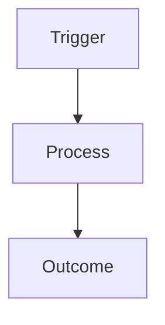

# {{MOD_NAME}} [L1-Module] {{MODULE_ID}}

## DESCRIPTION
{{MOD_DESCRIPTION}}

## EXECUTION FLOW


## ATOMS

### FEAT: {{FEAT_NAME}} [L2-Feature] {{FEAT_ID}}
- **Metadata:**
  ```yaml
  id: [[FEAT::{{FEAT_ID}}]]
  context_scaling_tier: "H2"
  role: "worker"
  ```
- **Logic:**
  {{FEAT_LOGIC}}

### ALGO: {{ALGO_NAME}} [L3-Logic] {{ALGO_ID}}
- **Metadata:**
  ```yaml
  id: [[ALGO::{{ALGO_ID}}]]
  context_scaling_tier: "H1"
  role: "calculator"
  ```
- **Logic:**
  {{ALGO_LOGIC}}

### ENTITY: {{ENTITY_NAME}} [L3-Storage] {{ENTITY_ID}}
- **Metadata:**
  ```yaml
  id: [[ENTITY::{{ENTITY_ID}}]]
  context_scaling_tier: "H2"
  role: "repository"
  ```
- **Schema:**
  {{ENTITY_SCHEMA}}
