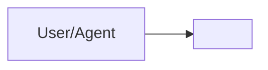
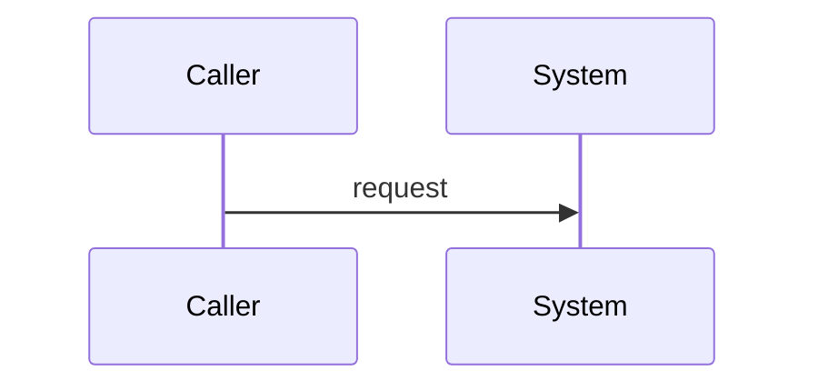

---
title: "SDD: <System or Module Name>"
doc_id: "SDD-<slug>"
status: "draft"
version: "0.1.0"
updated: "YYYY-MM-DD"
owner: "<owner>"
source_of_truth: true
prd_system: "SYSTEM-XX::<name>"
related_docs: []
---

# SDD: <System or Module Name>

## 1. System Overview
Describe the system boundary and role in GoVibe.

## 2. Architecture Context

## 3. Components
| Component | Responsibility | Interfaces |
|---|---|---|

## 4. Data Flow

## 5. Data Model
-

## 6. Interfaces
- API:
- MCP:
- Events:
- Files:

## 7. Security and Governance
- RBAC:
- ABAC:
- Audit:

## 8. Failure Modes
| Failure | Impact | Mitigation |
|---|---|---|

## 9. Verification Plan
-
