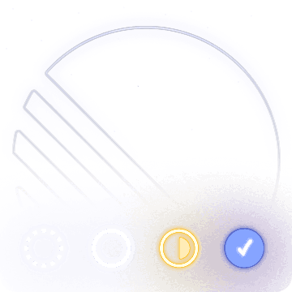
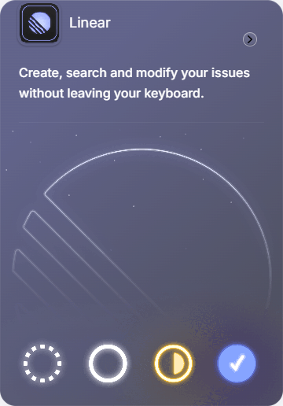

# Premium Raycast Linear Extension Card Component

A premium, modern **Dark Mode Feature Card** recreating the Raycast Linear Extension showcase. It features 3D perspective mouse tracking, absolute mockup depth layering (using CSS 3D Transforms), and an interactive simulated command palette.

---

## 📂 File Structure

```text
g:/covibe/UI Components/card01/
├── index.html        # Interactive card showcase and command palette modal
├── style.css         # Dark theme tokens, glassmorphism card, 3D perspective, and search overlay styles
├── README.md         # This documentation
├── Icon.png          # Small extension header icon (Linear logo stub)
├── Linear.png        # Floating accent brand logo
├── Stack.png         # Layered issues list mockup window
└── Image.png         # Base mockup background grid
```

---

## 🎨 Design Tokens & Properties

The visual aesthetics are mapped as follows:

| Property | Value | Description |
|---|---|---|
| **Base Background** | `#070709` | Solid space dark background with overlay grid |
| **Card Glass** | `rgba(18, 18, 22, 0.45)` | Semi-translucent black with `blur(24px)` |
| **Primary Accent** | `#F3553C` | Raycast branding coral color |
| **Secondary Accent** | `#5E6AD2` | Linear branding purple color |
| **Card Borders** | `rgba(255, 255, 255, 0.06)` | Ultra-thin borders with inset high-lights |
| **Glow Highlights** | `rgba(94, 106, 210, 0.15)` | Neon backdrop halo on hover |

---

## 💻 Code Integration & Layout Techniques

### 1. HTML Layering

We stack local image assets inside the `.mockup-area` container to form the layered interface preview:

```html
<div class="mockup-area">
    <!-- Base backdrop image -->
    
    
    <!-- Floating list window -->
    
    
    <!-- Top-right brand accent logo -->
    
</div>
```

### 2. 3D Parallax Tilt (CSS)

To enable perspective depth on hover, we declare `perspective` on the wrapper, and tell the card to preserve 3D layers:

```css
.showcase-wrapper {
    perspective: 1200px;
}

.raycast-card {
    transform-style: preserve-3d;
    transition: border-color 0.4s ease, box-shadow 0.4s ease;
}

/* Float layers out of the card face */
.mock-bg-layer {
    transform: translateZ(10px);
}
.mock-floating-layer {
    transform: translateZ(40px) translateY(10px);
}
.mock-brand-layer {
    transform: translateZ(70px) rotate(12deg);
}
```

---

## ⌨️ Command Palette Trigger (JavaScript)

The component listens for the global shortcut `⌘ K` (Mac) or `Ctrl K` (Windows/Linux) to trigger the simulated command palette window.

You can wire this command palette overlay toggle in your app using simple window event listeners:

```javascript
window.addEventListener('keydown', (e) => {
    if ((e.metaKey || e.ctrlKey) && e.key.toLowerCase() === 'k') {
        e.preventDefault();
        // Toggle your command palette modal visibility here
    }
});
```
