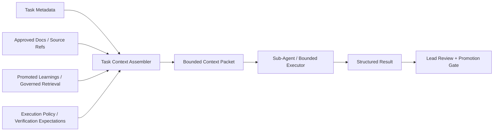

# BLUEPRINT: Task-Scoped Context Injection

## 1. Purpose

Define the first implementation-ready design for the GoVibe `Task-Scoped Context Injection` module.

This blueprint is downstream of:

- the platform PRD
- the `FEAT` module contract
- the `SRS` requirements contract
- ADR-013

It must not reopen product scope, taxonomy, or PRD-level decisions. It exists to lock the architecture, interfaces, precedence rules, and assembly order that an implementer will follow.

## 2. Design Goal

GoVibe needs a bounded context assembly module that lets a lead agent delegate narrow work to sub-agents or bounded support executors without:

- carrying the full working context forever
- injecting raw chat history by default
- losing source-of-truth discipline
- widening execution scope silently

The module should assemble one bounded packet per task or narrow slice, support escalation when context is insufficient, and return normalized results plus selectively promotable learnings.

## 3. System Mapping

| System | Relationship |
|---|---|
| `SYSTEM-05::Agent-Team-Management-System` | Primary owning system for routing delegated execution and packet lifecycle. |
| `SYSTEM-03::Docs-to-Code-System` | Provides approved doc-derived source material and task-linked refs. |
| `SYSTEM-08::Genesis-Knowledge-HCS-System` | Provides governed retrieval and promoted learning lookup. |
| `SYSTEM-09::Traceability-Audit-Verification-System` | Verifies packet lineage, evidence, and promotion decisions. |
| `SYSTEM-10::Execution-Governance-System` | Enforces bounded context, escalation, and review discipline. |

## 4. Boundary Model



## 5. Component Architecture

The module is composed of eight fixed components.

### 5.1 Baseline Policy Injector

Responsibilities:

- inject stable governance and role context
- inject execution policy and review ownership
- keep baseline policy separate from task-specific material

Inputs:

- task class
- actor or executor class
- execution policy

Outputs:

- normalized baseline policy block

### 5.2 Task Context Assembler

Responsibilities:

- create the bounded packet skeleton
- merge task metadata, workspace scope, module scope, source refs, and verification expectations
- enforce packet assembly order

Inputs:

- task metadata
- workspace scope
- module scope
- baseline policy block
- selected source refs
- critical known issues
- selected promoted learnings

Outputs:

- bounded packet draft

### 5.3 Source Ref Selector

Responsibilities:

- resolve approved docs and relevant file refs
- exclude non-authoritative or out-of-scope refs
- provide structured refs instead of raw transcript content by default

Inputs:

- task metadata
- module scope
- source-of-truth policy

Outputs:

- `source_refs`
- `file_refs`

### 5.4 Verification Expectation Injector

Responsibilities:

- attach verification requirements to the packet
- define what the executor must prove before handoff

Inputs:

- task metadata
- execution governance policy
- feature or module verification rules

Outputs:

- `verification_expectations`

### 5.5 Critical Issue Injector

Responsibilities:

- attach known hazards that must stay visible during execution
- prevent repeated mistakes on known contracts and constraints

Inputs:

- task metadata
- known critical constraints
- approved migration or runtime warnings

Outputs:

- `critical_known_issues`

### 5.6 Escalation Contract

Responsibilities:

- define when the bounded executor must stop and escalate
- prevent silent scope widening

Outputs:

- escalation status
- escalation reason

### 5.7 Result and Learning Classifier

Responsibilities:

- normalize executor output into one result contract
- separate result, evidence, critical knowledge, durable learnings, and non-promoted notes

Inputs:

- raw executor output
- verification result

Outputs:

- structured result payload

### 5.8 Promotion Gate

Responsibilities:

- decide what may be promoted after lead review
- block sub-agent notes from becoming truth by default

Inputs:

- structured result payload
- lead review outcome

Outputs:

- approved promoted learnings
- private non-promoted notes

## 6. Assembly Flow

Canonical assembly flow:

```text
task metadata
  -> classify workspace scope and module scope
  -> inject baseline policy context
  -> resolve approved source refs and file refs
  -> resolve verification expectations
  -> resolve critical known issues
  -> resolve selected promoted prior learnings
  -> build bounded packet
  -> dispatch to bounded executor
  -> collect structured result
  -> lead review
  -> promote only approved critical knowledge and durable learnings
```

Rules:

- structured refs and summaries are preferred over raw chat history
- debug history is optional and must not be default packet content
- assembly order is deterministic and must not vary by executor whim

## 7. Source-Of-Truth Precedence

Precedence order is fixed:

1. approved source docs and governed runtime metadata
2. explicit execution policy and verification requirements
3. approved critical known issues
4. approved promoted prior learnings
5. executor-generated notes and observations

Interpretation:

- promoted durable learnings are subordinate to approved docs
- sub-agent notes are never source of truth until explicitly promoted
- raw debug history is evidence only, not canonical task context

## 8. Packet Contract

Minimum packet fields:

```yaml
status:
taskId:
workspaceId:
moduleId:
objective:
constraints:
sourceRefs:
fileRefs:
verificationExpectations:
criticalKnownIssues:
```

Field rules:

- `status` is required and must be `ready` when the packet is dispatchable
- `taskId` is required and must map to one governed task or bounded slice
- `workspaceId` is required for execution scope
- `moduleId` may be replaced by `moduleScope` only when one module identifier is not sufficient
- `objective` must describe the bounded task intent in executor-ready language
- `constraints` must include scope boundaries and no-go rules
- `sourceRefs` must point to approved document sources
- `fileRefs` must point only to the files required for the slice
- `verificationExpectations` must define what evidence is required before return
- `criticalKnownIssues` must be explicit when known hazards exist

Optional packet fields:

```yaml
promotedPriorLearnings:
debugHistoryRefs:
```

Optional field rules:

- `promotedPriorLearnings` is allowed only for already approved durable knowledge
- `debugHistoryRefs` is audit/debug only and must not be included by default

## 9. Sub-Agent Result Contract

Structured result payload:

```yaml
status:
resultSummary:
filesTouched:
verificationStatus:
criticalIssues:
criticalKnowledge:
durableLearnings:
nonPromotedNotes:
escalationReason:
```

Field rules:

- `status` must be one of:
  - `completed`
  - `completed_with_findings`
  - `escalated`
  - `blocked`
- `resultSummary` is required for every terminal state
- `filesTouched` is required when any code or doc artifact was modified
- `verificationStatus` must report the checks actually performed, not inferred success
- `criticalIssues` must list issues that affect correctness, scope safety, or review readiness
- `criticalKnowledge` contains high-impact findings that should be reviewed for promotion
- `durableLearnings` contains reusable but subordinate learnings
- `nonPromotedNotes` contains local or ephemeral notes that are not eligible for automatic promotion
- `escalationReason` is required when `status` is `escalated` or `blocked`

## 10. Escalation Policy

Bounded executors must escalate instead of widening scope.

Default escalation classes:

- `needs_more_context`
- `scope_conflict`
- `missing_source_truth`
- `verification_blocked`

Escalation triggers:

- required source doc or file ref is missing
- discovered dependency would widen the packet beyond its declared boundary
- verification cannot be completed from the allowed packet scope
- source-of-truth conflict is detected between provided inputs

Escalation behavior:

- return `status: escalated`
- populate `escalation_reason`
- do not continue by guessing or broad repo traversal

## 11. Promotion Policy

Promotion rules are fixed:

- promote only approved `critical_knowledge`
- promote only approved `durable_learnings`
- keep `non_promoted_notes` private or ephemeral
- lead agent remains approval owner for promotion into shared durable context

Promotion sequence:

```text
structured result
  -> lead review
  -> accept/reject critical knowledge
  -> accept/reject durable learnings
  -> persist approved promoted set
  -> discard or retain private notes per policy
```

## 12. Non-Goals

- no runtime code changes in this round
- no tenant or vault schema expansion beyond what current docs already imply
- no emotional, physiological, or persona-heavy organism model as a product dependency
- no second PRD-level source for this capability

## 13. Acceptance Criteria

- The blueprint defines all eight fixed components and their responsibilities.
- The blueprint locks packet input shape, result shape, escalation classes, promotion buckets, precedence, and assembly order.
- The blueprint remains downstream of `FEAT + SRS` and does not reopen PRD-level scope.
- The blueprint is implementation-ready and leaves no major interface decision to the implementer.

## 14. Success Criteria

- An implementer can build the first version of the module without inventing packet structure or precedence rules.
- Lead-agent review and learning promotion remain explicit and governed.
- Bounded executors can fail safely through escalation rather than widening scope.
- Future API or runtime docs can derive from this blueprint without redefining the module contract.

## 15. Definition Of Done

- This blueprint is registered in `docs/DOC-VERSION-REGISTRY.md`.
- Related feature, SRS, ADR, and hierarchy docs link cleanly to this blueprint.
- `npm run docs:validate` passes.
- No runtime code or schema is changed in this round.

## Changelog

| Version | Date | Owner | Summary |
|---|---|---|---|
| 0.1.1 | 2026-06-20 | ARCHON / ATHER | Signed off; promoted draft -> approved. |
| 0.1.1+draft | 2026-06-20 | ARCHON / ATHER | Converted §8 packet and §9 result field listings to camelCase and added the required `status` field to the §8 packet contract to align with API-004's mandated casing. |
| 0.1.0+draft | 2026-06-19 | ARCHON / ATHER | Added the first implementation-ready blueprint for GoVibe task-scoped context injection. |
