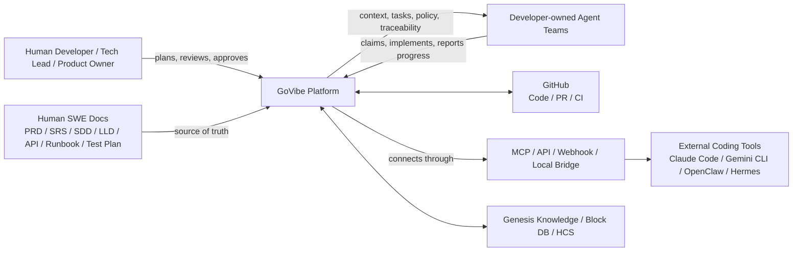
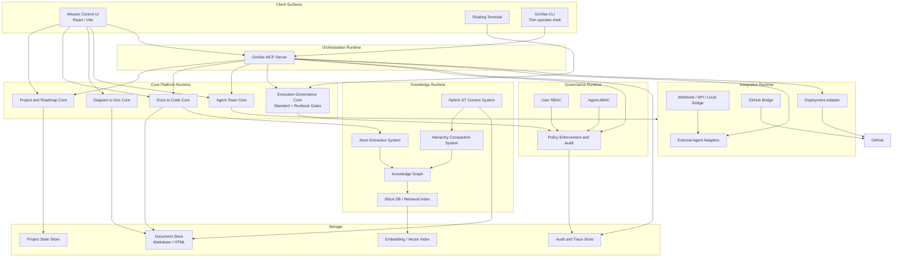

# C4: GoVibe Platform Architecture

**Status:** `DRAFT`
**Author:** ATHER
**Date:** 2026-06-12
**Source PRD:** `docs/PRD-GoVibe-Platform-Overview.md`
**Architecture Scope:** GoVibe platform, Mission Control, Docs to Code, Diagram to Doc, Agent Team Management, Genesis Knowledge/HCS, and Execution Governance

## 1. Purpose
This document describes GoVibe with the C4 model so product, SWE, architecture, and agent teams can share one architecture view before implementation.

The PRD remains the product source of truth. This C4 document is the architecture view of the product systems declared in the PRD.

## 2. C4 Level Summary
| C4 Level | Scope | GoVibe Meaning |
|---|---|---|
| **C1 - System Context** | GoVibe and external actors/systems | Humans, agent teams, third-party coding tools, GitHub, docs, MCP/API integrations |
| **C2 - Container** | Major runtime/deployment containers | Mission Control UI, core services, knowledge services, policy services, integration bridge, storage |
| **C3 - Component** | Components inside each container | Docs to Code, Diagram to Doc, HCS, Hybrid JIT Context, RBAC/ABAC, traceability, runbook governance |
| **C4 - Code / Low-Level** | Key module/class/function skeletons | Parser, resolver, classifier, adapter, evaluator, renderer, indexer modules |

## 3. C1 - System Context
GoVibe is an AI-native visual CoDev and project management platform. It coordinates human developers, their agent teams, documents, roadmap progress, artifacts, access policy, and external coding-agent tools.



### C1 Responsibilities
- Coordinate CoDev work without owning third-party billing or provider runtime.
- Use human SWE documents as canonical source material.
- Use HCS and Hybrid JIT Context to provide minimal useful context to agents.
- Keep traceability across roadmap, task, agent assignment, artifact, review, and verification.

## 4. C2 - Container View
The platform is composed of UI, operator, orchestration, core, knowledge, governance, integration, and storage containers.



### C2 Container Mapping To PRD Systems
| PRD System | Main Containers |
|---|---|
| Mission Control Experience | Mission Control UI, Floating Terminal |
| Project Roadmap Management | Project and Roadmap Core, State Store |
| Docs to Code | Docs to Code Core, Document Store, Atom Extraction |
| Diagram to Doc | Diagram to Doc Core, Document Store |
| Agent Team Management | Agent Team Core, GoVibe MCP Server, Integration Runtime |
| Integration Bridge | GoVibe MCP Server, Agent Adapters, Webhooks, GitHub Bridge, Deployment Adapter |
| Governance Access Control | RBAC, ABAC, Policy Enforcement |
| Genesis Knowledge HCS | HCS, JIT, Atom Extraction, Knowledge Graph, Block DB |
| Traceability Audit Verification | Audit Store, Trace Store, Verification Matrix components |
| Execution Governance | Execution Governance Standard, Doc-First Gate, Multi-Agent Operating Runbook |

## 5. C3 - Component View

### 5.1 Mission Control UI
```text
MissionControlUI
+-- DashboardShell
+-- DomainRouter
+-- TopNavigation
+-- SidebarNavigation
+-- ViewRenderer
+-- ThemeController
+-- FooterStatusBar
+-- FloatingTerminalPanel
```

Responsibilities:
- Render the ten product systems as coherent Mission Control surfaces.
- Reflect document-derived project, task, agent, traceability, and verification state.
- Keep UI behavior separate from raw template/runtime code.

### 5.2 Docs To Code Core
```text
DocsToCodeCore
+-- DocumentSourceLoader
|   +-- MarkdownLoader
|   +-- HTMLLoader
|   +-- FrontmatterParser
|   +-- DocumentVersionResolver
+-- RequirementExtractor
|   +-- SectionParser
|   +-- AcceptanceCriteriaExtractor
|   +-- TaskCandidateExtractor
|   +-- RiskHintExtractor
+-- TaskGenerator
|   +-- RequirementToTaskMapper
|   +-- TaskDependencyResolver
|   +-- AgentAssignmentSuggestion
|   +-- VerificationRequirementMapper
+-- CodeContextPackager
    +-- SourceDocCitation
    +-- ContextBundleBuilder
    +-- AgentPromptContextBuilder
```

Responsibilities:
- Convert approved human SWE docs into task and implementation context.
- Preserve traceability from source document section to generated task.
- Prevent hardcoded roadmap/task data from becoming the canonical planning source.

### 5.3 Diagram To Doc Core
```text
DiagramToDocCore
+-- DiagramIngestion
|   +-- MermaidParser
|   +-- C4DiagramParser
|   +-- ERDParser
|   +-- FlowDiagramParser
+-- DiagramSemanticExtractor
|   +-- NodeClassifier
|   +-- EdgeClassifier
|   +-- BoundaryDetector
|   +-- DependencyExtractor
+-- DocumentDraftGenerator
    +-- PRDSectionDraft
    +-- SRSSectionDraft
    +-- SDDSectionDraft
    +-- APIContractDraft
    +-- HumanReviewGate
```

Responsibilities:
- Convert diagrams into reviewed documentation, not directly into production implementation.
- Support the Diagram to Doc gate for C-3 architecture work.

### 5.4 Agent Team Core
```text
AgentTeamCore
+-- AgentRoster
|   +-- AgentProfile
|   +-- CapabilityMatrix
|   +-- AgentStatus
|   +-- AgentMediaProfile
+-- AgentTeamOrchestration
|   +-- TeamBoundary
|   +-- AssignmentQueue
|   +-- WorkloadState
|   +-- HandoffState
+-- AgentWorkspace
    +-- PromptConfig
    +-- ToolPermissionView
    +-- RuntimeStatusView
    +-- OutputArtifactView
```

Responsibilities:
- Track agent teams as project contributors, not provider billing identities.
- Assign tasks and show status, artifacts, tool access, and handoff state.

### 5.5 Integration Bridge / MCP Server
```text
GoVibeMCPServer
+-- ToolRegistry
|   +-- AgentTools
|   +-- DocsTools
|   +-- RoadmapTools
|   +-- ProgressTools
|   +-- AuditTools
|   +-- DeployTools
+-- ResourceRegistry
|   +-- ApprovedDocs
|   +-- RoadmapSnapshots
|   +-- ContextPackets
|   +-- CapabilityMetadata
+-- OrchestrationCore
|   +-- ContextResolver
|   +-- ExecutionRouter
|   +-- RoadmapMutationGateway
|   +-- DeploymentGateway
+-- InvocationAudit
    +-- InvocationLogger
    +-- TraceabilityLinker
    +-- DenyReasonFormatter
```

Responsibilities:
- Expose GoVibe orchestration capabilities through governed MCP tools and resources.
- Keep Mission Control UI and GoVibe CLI as callers rather than business-rule owners.
- Route execution, roadmap, document, audit, and deployment operations through one capability surface.

### 5.6 Governance Access Control
```text
GovernanceAccessControl
+-- UserRBAC
|   +-- UserRole
|   +-- PermissionSet
|   +-- ProjectMembership
|   +-- RolePolicyEvaluator
+-- AgentABAC
|   +-- SubjectAttributeBag
|   +-- ResourceAttributeBag
|   +-- ActionContext
|   +-- PolicyDecisionPoint
+-- PolicyEnforcement
    +-- PolicyEnforcementPoint
    +-- ObligationHandler
    +-- DenyReasonRenderer
    +-- PolicyAuditLogger
```

Responsibilities:
- Apply RBAC to human users.
- Apply ABAC to agents, subagents, MCP clients, services, and scheduled jobs.
- Audit every policy decision that affects project resources.

### 5.7 Genesis Knowledge System
```text
GenesisKnowledgeSystem
+-- HierarchyCompactionSystem
|   +-- HLevelClassifier
|   +-- ContextScopeResolver
|   +-- GraphHopResolver
|   +-- CompactionEngine
|   +-- ContextBudgetPlanner
+-- HybridJITContextSystem
|   +-- MarkdownSourceResolver
|   +-- InMemoryGraphBuilder
|   +-- HopBoundedContextQuery
|   +-- VirtualDocumentRenderer
|   +-- ContextOverwriteGuard
+-- AtomExtractionSystem
|   +-- ConceptExtractor
|   +-- FeatureExtractor
|   +-- ModuleExtractor
|   +-- FlowExtractor
|   +-- AlgorithmExtractor
|   +-- EntityExtractor
|   +-- GuardExtractor
|   +-- MCPExtractor
+-- KnowledgeGraph
|   +-- NodeRegistry
|   +-- EdgeRegistry
|   +-- SymbolLinker
|   +-- DocumentBacklinkIndex
|   +-- GraphQueryEngine
+-- GenesisBlockDB
    +-- BlockStore
    +-- VersionIndex
    +-- EmbeddingIndex
    +-- RetrievalRanker
```

Responsibilities:
- Classify task/document/context scope into H0-H6, with H6 reserved for rare full-network traversal.
- Extract atoms from human docs after authoring.
- Render just-in-time context for agent work without making atoms the human authoring format.

### 5.8 Execution Governance
```text
ExecutionGovernance
+-- ComplexityBasedExecution
|   +-- TaskComplexityClassifier
|   +-- C0C3WorkflowSelector
|   +-- HScaleMapper
|   +-- RequiredArtifactResolver
|   +-- VerificationRequirementResolver
+-- DocFirstGate
|   +-- DocsToCodeGate
|   +-- DiagramToDocGate
|   +-- HumanApprovalGate
|   +-- CanonicalSourceChecker
+-- MultiAgentOperatingRunbook
|   +-- CoordinationLayerPolicy
|   +-- RoleMatrix
|   +-- PlanApprovalFlow
|   +-- BranchPRReviewFlow
|   +-- SharedTaskListPolicy
|   +-- FileLockingProtocol
|   +-- ConflictResolutionPolicy
+-- AgentExecutionPolicy
    +-- AssumptionReporter
    +-- ScopeBoundaryChecker
    +-- RiskClassifier
    +-- DefinitionOfDoneChecker
```

Responsibilities:
- Decide the correct process for each task before implementation.
- Enforce doc-first and diagram-to-doc gates for medium/high-complexity work.
- Align multi-agent work with plan approval, file locks, PR review, and Definition of Done.

## 6. C4 - Low-Level Code / Module Skeleton
This level is a design skeleton, not final implementation. Each module may become an LLD, API contract, or test plan before code.

### 6.1 HCS Context Retrieval
```text
ContextRetrievalService
+-- getContext(request)
+-- validateSubjectAccess(subject, resource, action, context)
+-- classifyHLevel(task, sourceDoc)
+-- resolveGraphScope(targetNode, hLevel)
+-- compactContext(nodes, tokenBudget)
+-- renderVirtualDocument(compactedContext)
+-- recordTraceability(request, result)
```

Primary inputs:

```text
subject: user | agent | subagent | mcp-client | service
target: doc section | task | atom | module | artifact
action: read | claim | assign | update-progress | attach-artifact | request-review
context: projectId, branch, riskLevel, source, traceId
```

Primary output:

```text
contextBundle:
  sourceDocuments
  citedSections
  relatedAtoms
  graphNodes
  taskLinks
  policyDecision
  tokenBudget
```

### 6.2 Docs To Code Task Generation
```text
DocsToCodeTaskService
+-- loadDocument(documentId)
+-- parseSections(document)
+-- extractRequirements(sections)
+-- extractAcceptanceCriteria(sections)
+-- mapRequirementsToTasks(requirements)
+-- suggestAgentAssignments(tasks, capabilityMatrix)
+-- createTraceabilityLinks(tasks, documentSections)
```

### 6.3 Diagram To Doc Drafting
```text
DiagramToDocService
+-- parseDiagram(diagramSource)
+-- classifyNodes(nodes)
+-- classifyEdges(edges)
+-- detectBoundaries(graph)
+-- generateDraftDoc(graph, targetDocType)
+-- sendToHumanReview(draftDoc)
+-- promoteApprovedDoc(draftDoc)
```

### 6.4 Policy Decision
```text
PolicyDecisionService
+-- buildSubjectAttributes(subject)
+-- buildResourceAttributes(resource)
+-- buildActionContext(action, context)
+-- evaluateRBAC(user, action, resource)
+-- evaluateABAC(subject, action, resource, context)
+-- returnDecision(effect, obligations, advice, reason)
+-- auditDecision(decision)
```

### 6.5 Execution Governance
```text
ExecutionGovernanceService
+-- classifyComplexity(task)
+-- mapContextTier(task)
+-- resolveRequiredArtifacts(complexity, hTier)
+-- enforceDocFirstGate(task)
+-- enforceDiagramToDocGate(task)
+-- verifyDefinitionOfDone(task)
+-- blockOrApproveExecution(task)
```

### 6.6 MCP Orchestration
```text
McpOrchestrationService
+-- initializeServer()
+-- listTools()
+-- listResources()
+-- readResource(uri)
+-- callTool(name, arguments)
+-- resolveCallerIdentity(actor)
+-- evaluateGovernance(actor, action, resource, context)
+-- resolveContextPacket(scope, selectors, bounds)
+-- dispatchOperation(capability, payload)
+-- recordInvocation(auditRecord)
```

## 7. Architecture Rules
- PRD is the product SSOT.
- SRS is the requirement SSOT when added.
- SDD is the architecture/design SSOT.
- LLD is the module logic SSOT.
- Runbook is the operation SSOT.
- Test Plan is the verification SSOT.
- Atoms are derived knowledge artifacts, not the required human authoring format.
- Diagrams may start architecture work, but reviewed docs must exist before C-3 implementation.
- GoVibe coordinates third-party agent tools but does not manage provider billing or quota.

## 8. Traceability Matrix
| PRD System | C2 Container | C3 Component Group | Expected Supporting Docs |
|---|---|---|---|
| Mission Control Experience | Mission Control UI | Dashboard Shell, Domain Router, Terminal | SDD, UI Spec, Test Plan |
| Project Roadmap Management | Project and Roadmap Core | Roadmap Board, Task Assignment, Artifact Tracker | SRS, SDD, API Contract |
| Docs to Code | Docs Core | Loader, Extractor, Task Generator, Context Packager | SRS, SDD, LLD, Test Plan |
| Diagram to Doc | Diagram Core | Ingestion, Semantic Extractor, Draft Generator | SRS, SDD, LLD |
| Agent Team Management | Agent Core | Roster, Team Orchestration, Workspace | SRS, SDD, Runbook |
| Integration Bridge | GoVibe MCP Server, Integration Runtime | Tool Registry, Resource Registry, Orchestration Core, Agent Adapters, Webhooks, GitHub Bridge | PRD, SRS, LLD, ADR, API Contract, MCP Contract |
| Governance Access Control | Governance Runtime | RBAC, ABAC, Policy Enforcement | SRS, SDD, Access Model, Threat Model |
| Genesis Knowledge HCS | Knowledge Runtime | HCS, JIT, Atom Extraction, Graph, Block DB | SRS, SDD, LLD, API Contract |
| Traceability Audit Verification | Audit/Trace Store | Traceability Index, Audit Trail, Verification Matrix | SRS, SDD, Test Plan |
| Execution Governance | Execution Governance Core | Execution Governance Standard, Doc-First Gate, Multi-Agent Runbook | Standard, Runbook, Test Plan |

## 9. Open Questions
- Should HCS have its own standalone SRS and SDD under `docs/hcs/`?
- Should `RUNBOOK-GoVibe-Multi-Agent.md` be migrated from `.agents/` into `docs/runbooks/` as the canonical runbook?
- Should C4 diagrams become source input for Diagram to Doc, or remain a reviewed architecture artifact only?
- Which storage layer is canonical for graph state in phase 1: in-memory graph, local file index, SQLite, or embedded vector store?

## 10. Acceptance Criteria
- A human reader can understand GoVibe architecture from C1 to C4 without reading atom syntax.
- Every C2 container maps back to at least one PRD system.
- Every C3 component group maps to a product capability.
- Low-level skeletons are ready to become LLD/API/Test Plan documents.
- The document does not replace PRD/SRS/SDD/LLD; it links architecture views across them.
