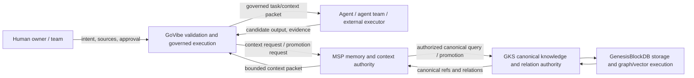

# C4 Overlay: Knowledge and Context Authority

This overlay projects ADR-023 into the current GoVibe C4 architecture. It does not replace `C4-GoVibe-Platform.md`; it constrains its knowledge and runtime interpretation until the parent C4 is revised.

## 1. C1 authority context



## 2. C2 container responsibility

| Container | Authority | Must not do |
|---|---|---|
| GoVibe Core / MCP Server | validate intent, normalize candidates, enforce execution contract, package work | assign canonical GKS identity; query DB directly; invent missing WHY |
| MSP Runtime | context identity, permission, scope, source versions, retrieval policy, compaction, continuity, promotion mediation | redefine canonical relation meaning; silently widen scope |
| GKS Runtime | canonical IDs, versions, containment, relations, backlinks, provenance, graph versions | dispatch raw graph neighborhoods as agent context; decide per-turn budget |
| GenesisBlockDB | execute graph/vector/storage operations behind GKS | expose governed runtime credentials to agents or GoVibe |
| External Provider Adapter | deliver bounded candidate output with provenance/provider identity | promote knowledge; create canonical `gks:` refs; select unrestricted context |

## 3. Required context path

```text
Agent task request
  -> GoVibe validates task and source references
  -> MSP resolves identity, authority, scope, versions, reason chains, exclusions, R/D/W/Budget
  -> GKS resolves canonical knowledge and relations
  -> MSP compacts and persists exact context/cache lineage
  -> GoVibe renders destination-convention task packet
  -> Agent executes
```

Direct paths are prohibited:

```text
Agent -X-> GKS
Agent -X-> GenesisBlockDB
GoVibe -X-> GenesisBlockDB
External skill -X-> canonical GKS materialization
```

## 4. Context packet minimum fields

- task, agent, workspace, run, session, turn
- context ID and cache ID
- source IDs, versions, hashes, and authority state
- required insight/issue/decision/ADR/reason-chain references
- scope inclusions and exclusions
- relation allowlist and traversal seed
- R retrieval radius, D depth/compaction, W width, Budget, Risk
- candidate/canonical visibility policy
- unresolved assumptions and escalation rule
- replay parent and exact-source lineage

## 5. CoVibe and CoDev projection

The runtime chain is shared.

- CoVibe applies one primary human authority to approval and context policy.
- CoDev resolves multiple human-owned authority lanes, shared/translated context, handoff evidence, and conflict/approval boundaries.

Company size does not alter the architecture mode.

## 6. Verification

Architecture verification must prove:

1. no direct GoVibe/agent credential path to GKS or GenesisBlockDB;
2. context packets include source versions, scope, exclusions, and required WHY relations;
3. external provider output remains candidate state;
4. replay preserves exact context lineage;
5. graph traversal is bounded by MSP-issued policy.
