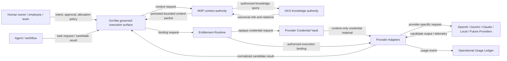
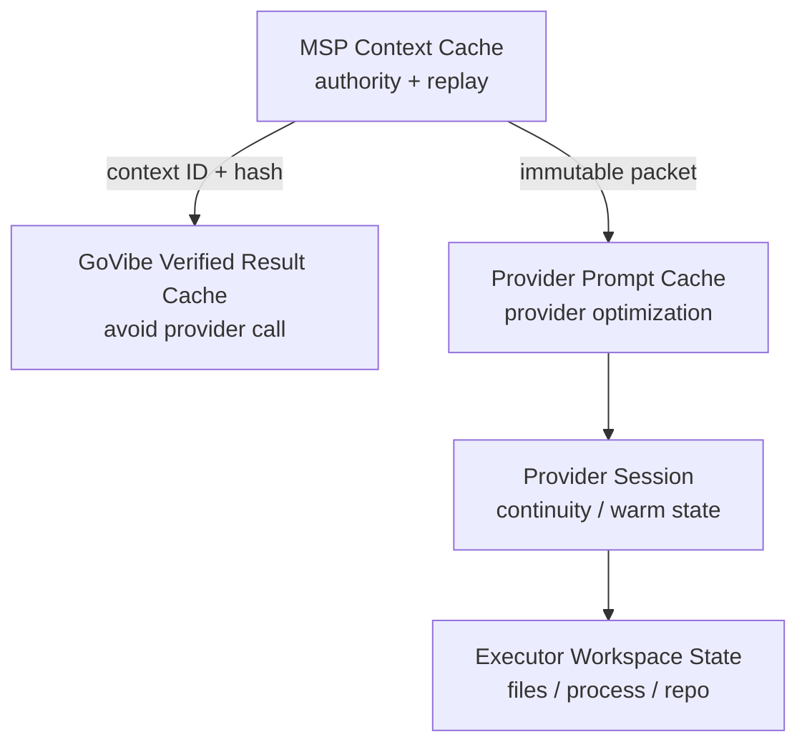
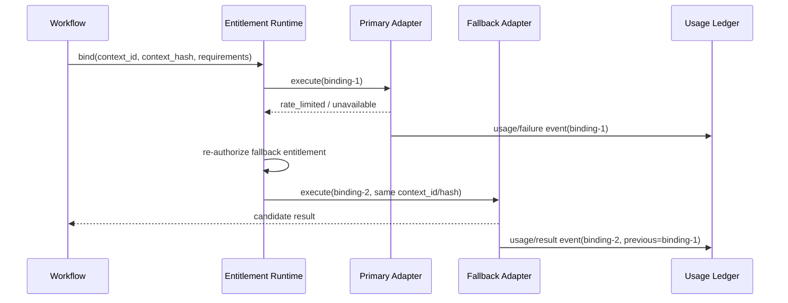

# C4 Overlay: Provider Entitlement and Execution Routing

This overlay projects ADR-024 and API-008 into the current GoVibe architecture. It constrains provider-resource routing without replacing the parent C4 model.

## 1. C1 system context



## 2. C2 containers

| Container | Owns | Must not do |
|---|---|---|
| GoVibe Core / Mission Gateway | request validation, workflow coordination, context-to-binding handoff, candidate validation | expose credentials; assign canonical IDs; silently mutate MSP context |
| MSP Runtime | context identity, permission, scope, exclusions, source versions, compaction and replay lineage | choose raw provider credentials; treat quota as knowledge authority |
| GKS Runtime | canonical knowledge identity, provenance, relations and graph versions | dispatch unrestricted graph context; choose execution entitlement |
| Entitlement Runtime | entitlement registry, authorization, capability planning, binding, quota-aware scheduling, retry and fallback | query GKS; widen/trim context; promote provider output |
| Provider Credential Vault | encrypted credential storage, token lifecycle, revocation and protected release | expose raw credentials to agents, logs, prompts or candidate artifacts |
| Provider Adapter | provider protocol, CLI/API/process invocation, session handling, cache refs, cancellation, telemetry normalization | reuse sessions beyond entitlement policy; alter context semantics; access GKS directly |
| Operational Usage Ledger | immutable run, binding, telemetry and fallback events | claim estimates as provider reports; become canonical product knowledge automatically |
| Verified Result Cache | immutable result reuse under exact input/policy/source compatibility | reuse stale results after context, policy, source or tool-contract change |
| External Provider / Local Executor | execute bounded task and produce candidate artifacts | promote knowledge; assign trusted `gks:` refs; choose unrestricted context |

## 3. Required execution path

```text
Task request
  -> GoVibe validates identity and task envelope
  -> Entitlement Runtime performs bounded capability planning
  -> MSP resolves and persists exact governed context
  -> GoVibe submits execution-binding request
  -> Entitlement Runtime authorizes entitlement and selects target
  -> Credential Vault releases runtime-only credential material to adapter
  -> Provider Adapter executes immutable context/tool contract
  -> Provider Adapter returns normalized candidate and usage event
  -> GoVibe verifies candidate
  -> MSP/GKS promotion path handles approved knowledge candidates
```

## 4. Prohibited paths

```text
Agent -X-> Provider Credential Vault
Agent -X-> raw provider account/session
Entitlement Runtime -X-> GKS / GenesisBlockDB
Entitlement Runtime -X-> context compaction or relation traversal
Provider Adapter -X-> MSP scope mutation
Provider Adapter -X-> canonical GKS promotion
Operational Usage Ledger -X-> automatic canonical knowledge
External Provider -X-> trusted canonical IDs
```

## 5. Execution binding boundary

An execution binding must reference, but not copy authority from, the MSP context packet:

```text
binding_id
context_id
context_hash
source_manifest_hash
workspace_id / task_id / agent_id / run_id / session_id / turn_id
provider_id / adapter_id / adapter_version
entitlement_id / credential_ref
executor_class / model_id / tool_contract_hash
provider_session_id / prompt_cache_ref / affinity_key
quota_snapshot_ref / fallback_policy_id / policy_decision_refs
```

The binding is invalid if context integrity, entitlement authorization, credential lifecycle, or tool compatibility cannot be proven.

## 6. Cache and state projection



No lower cache/state layer can prove that MSP context remains current or authorized. Reuse requires compatibility checks against context hash, source versions, policy, tool contracts and entitlement state.

## 7. Failover sequence



A context change is not failover; it requires a new MSP lineage.

## 8. CoVibe and CoDev projection

- CoVibe: one primary authority lane defines entitlement ownership, allocation and fallback policy.
- CoDev: multiple authority lanes require explicit entitlement ownership, delegation, conflict resolution, approval, handoff and revocation evidence.

Provider count and organization size do not select the mode.

## 9. Verification requirements

Architecture verification must prove:

1. credentials never enter agent context, logs or candidate artifacts;
2. every binding references a valid persisted context ID/hash;
3. the router cannot mutate context or query GKS directly;
4. every entitlement has owner and share policy;
5. cross-user session reuse is denied by default;
6. reported and estimated usage remain separate;
7. failover creates a new binding while preserving context lineage;
8. provider output remains candidate state;
9. revocation prevents new dispatch and affects queued work deterministically;
10. runtime conformance is backed by tests, not documentation status alone.
