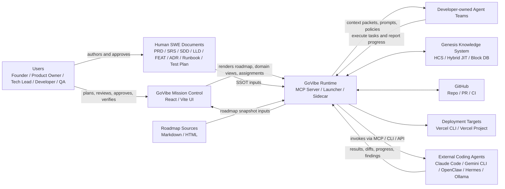

# CTX: GoVibe System Context

**Status:** `DRAFT`
**Author:** ATHER
**Date:** 2026-06-13
**Source PRD:** `docs/PRD-GoVibe-Platform-Overview.md`
**Related Architecture Docs:** `docs/architecture/C4-GoVibe-Platform.md`, `docs/SDD-System-Design.md`, `docs/adr/ADR-002-MCP-As-Primary-Orchestration-Interface.md`

## 1. Purpose
This document gives GoVibe a dedicated, human-readable system context view.

It exists so product, SWE, architecture, QA, and agent teams can answer four questions quickly:
- Who uses GoVibe?
- Which external systems does it depend on?
- What does GoVibe own directly?
- What stays outside the platform boundary?

The PRD remains the product SSOT. This document is the standalone context-diagram companion to the broader C4 architecture doc.

## 2. Scope
This context view covers:
- the current Mission Control app
- the MCP and launcher runtime
- document-driven planning and execution
- external agent tools invoked through adapters, APIs, MCP, or CLI bridges
- GitHub and deployment surfaces used by GoVibe operations

This context view does not define low-level component behavior, persistence schema, or UI layout rules.

## 2.1 Decision Alignment (accepted ADR-015..019, 2026-06-22)

Per the accepted ADRs, the context boundary is: **GoVibe (cognitive surface) wraps MSP (Memory OS) → GKS (knowledge) → GenesisBlockDB (swappable backend)**. GoVibe is a governance + interop **translator** that rides MCP/A2A and bridges into external orchestrators (e.g. LangGraph), not a replacement; GKS is an internal interlingua (`A1 ⇄ GKS ⇄ A25`). See `docs/architecture/SDD-GoVibe-MSP-GKS-Integration.md`.

## 3. Context Diagram

## 4. Boundary Model
### Inside GoVibe boundary
- Mission Control UI
- MCP server and sidecar runtime
- launcher, prompt builder, registry, and agent workflow contracts
- roadmap parsing and live mission snapshot generation
- document resolution, context packaging, and execution governance
- GoVibe-owned knowledge and traceability systems

### Outside GoVibe boundary
- external model billing and provider runtime behavior
- GitHub-hosted infrastructure outside GoVibe policy control
- Vercel platform internals
- third-party coding agent internal memory, token accounting, or usage policy

## 5. Actor Responsibilities
| Actor | Primary Role | What GoVibe Expects |
|---|---|---|
| Founder / Product Owner | Define direction and approve scope | PRD intent, roadmap approval, governance decisions |
| Tech Lead / Architect | Validate architecture and system fit | C4, SDD, ADR, risk review |
| Developer | Execute implementation work | task updates, code changes, handoff notes |
| QA / Auditor | Verify behavior and compliance | verification status, audit findings, readiness checks |
| Developer-owned Agent Team | Assist delivery | bounded execution, progress tracking, artifact reporting |
| External Coding Agents | Perform task-specific work | accept prompt/context, return outputs through adapters |

## 6. External Interface Summary
| External System | Relationship | Direction | Notes |
|---|---|---|---|
| GitHub | Source control and CI base | bidirectional | repo, PR, workflow, and deployment trigger surface |
| Vercel | deployment target | outbound | deploy through Vercel CLI or linked project flow |
| Claude Code / Gemini CLI / OpenClaw / Hermes | execution providers | outbound + return | GoVibe orchestrates work but does not own provider billing |
| Ollama | local bounded sidecar execution | outbound + return | atomic and micro-task helper path |
| Human-authored docs | approved intent and contracts | inbound | docs are SSOT before implementation |
| Roadmap `.md` / `.html` files | approved work state inputs | inbound | parsed into Mission Control roadmap snapshots |

## 7. Operating Rules
- GoVibe is an orchestration and project-management platform, not a replacement billing layer for third-party coding tools.
- Human SWE documents remain canonical before automation-heavy execution.
- Developer teams collaborate through their agent teams and shared project state.
- User access follows RBAC; agent access follows ABAC.
- Context passed to agents must be bounded by scope, task tier, and governance policy.

## 8. Traceability
| Need | Primary Doc |
|---|---|
| Product system intent | `docs/PRD-GoVibe-Platform-Overview.md` |
| Platform architecture | `docs/architecture/C4-GoVibe-Platform.md` |
| System design and doc pipeline | `docs/SDD-System-Design.md` |
| MCP-first orchestration choice | `docs/adr/ADR-002-MCP-As-Primary-Orchestration-Interface.md` |
| Multi-agent operations | `docs/operations/runbooks/RUNBOOK-GoVibe-Multi-Agent.md` |

## 9. Acceptance Criteria
- A new reader can identify GoVibe's platform boundary without reading the full C4 document.
- A new reader can distinguish human actors, agent actors, and third-party systems.
- The document clearly states that docs and roadmap files are upstream inputs into the runtime.
- The document clearly states that provider billing and internal provider runtime behavior stay outside GoVibe ownership.
