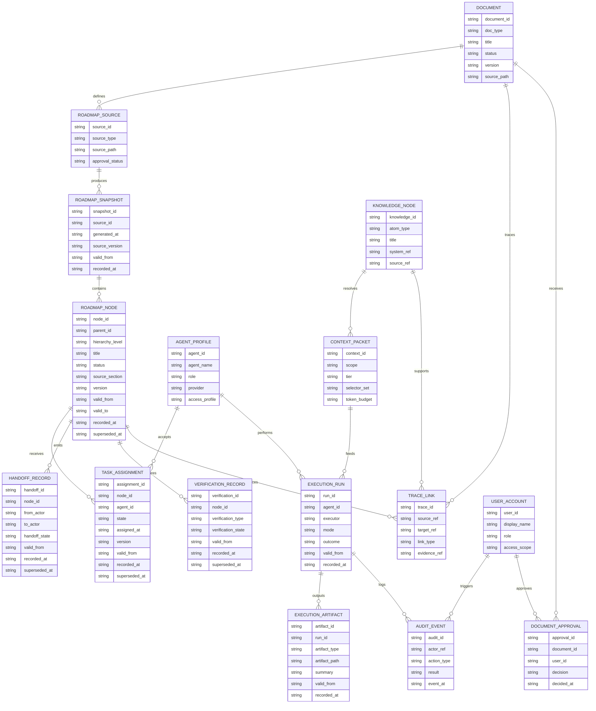

# ERD: GoVibe Platform Data Model

**Status:** `DRAFT`
**Author:** ATHER
**Date:** 2026-06-13
**Source PRD:** `docs/PRD-GoVibe-Platform-Overview.md`
**Related Docs:** `docs/architecture/C4-GoVibe-Platform.md`, `docs/SDD-System-Design.md`, `docs/design/DOMAIN_DETAILS.md`, `docs/features/agent-team/FEAT-Multi-Agent-Workflow-System.md`

## 1. Purpose
This document gives GoVibe a standalone data-model and ERD view.

It explains the core entities that connect documents, roadmap state, agent execution, governance, and verification so the team does not have to infer data relationships from UI screens or component code.

This is a conceptual platform ERD, not a finalized physical database schema.

## 2. Data Model Scope
This ERD covers the core records needed for:
- document-driven planning
- roadmap ingestion and progress tracking
- multi-agent assignment and execution
- governance and audit traceability
- knowledge-backed context resolution

This ERD does not lock the storage engine. The same conceptual model may be implemented across markdown files, JSON snapshots, graph storage, relational storage, or vector indexes.

## 3. Core ERD

## 4. Entity Notes
### DOCUMENT
Approved SWE artifact such as PRD, SRS, SDD, C4, FEAT, ADR, runbook, or test plan. Documents are upstream intent, not just attachments.

### ROADMAP_SOURCE
The approved `.md` or `.html` roadmap source file authored by PM or human operator.

### ROADMAP_SNAPSHOT
The parsed runtime snapshot produced from a roadmap source and consumed by Mission Control.

### ROADMAP_NODE
Any planning item in the hierarchy, such as phase, epic, sprint, task, sub-task, micro-task, or atomic-task.

### TASK_ASSIGNMENT
Assignment state connecting a roadmap node to an agent profile.

### EXECUTION_RUN
One execution attempt by an agent or runtime executor such as Codex, Claude Code, Gemini CLI, or Ollama.

### CONTEXT_PACKET
The bounded context bundle prepared for an execution run from docs, roadmap state, and knowledge nodes.

### TRACE_LINK
Cross-reference record that lets GoVibe answer "why does this task, artifact, or run exist?"

### BI-TEMPORAL VERSION FIELDS
GoVibe separates business time from system transaction time:

- `valid_from` / `valid_to` describe when a fact is true for the work.
- `recorded_at` / `superseded_at` describe when GoVibe learned or replaced that fact.
- Lower-level task records can inherit hub metadata from parent roadmap nodes while keeping their own temporal version history.

## 5. Data Flow Summary
1. Approved documents define product, requirements, architecture, and execution rules.
2. A roadmap source file is created from that approved intent.
3. The runtime parses the roadmap source into a roadmap snapshot.
4. Mission Control renders roadmap nodes and assignment state from the snapshot.
5. Context packets are built from documents, roadmap nodes, and knowledge nodes.
6. Agent execution runs consume context packets and produce artifacts plus audit events.
7. Verification, handoff, and trace records tie execution results back to roadmap and docs.

## 6. Storage Interpretation
| Conceptual Entity | Likely Storage Form |
|---|---|
| Document | markdown/html file plus metadata |
| Roadmap Source | markdown/html file |
| Roadmap Snapshot | in-memory runtime state, JSON cache, or persisted state record |
| Roadmap Node | parsed node record inside snapshot or backing state store |
| Agent Profile | registry entry, config file, or state store record |
| Context Packet | transient runtime object with optional audit trail |
| Knowledge Node | atom, graph node, or retrieval index record |
| Audit Event | append-only event log |
| Trace Link | graph edge, relational join row, or structured metadata link |

## 7. Modeling Rules
- Do not treat roadmap UI state as the source of truth when an approved roadmap file exists.
- Keep roadmap source records separate from parsed runtime snapshots.
- Keep assignment state, handoff state, and verification state independently addressable.
- Keep execution artifacts and audit events tied to explicit execution runs.
- Preserve trace links between docs, roadmap nodes, context packets, runs, and verification outcomes.
- Allow the same conceptual model to map to mixed storage backends.
- Preserve bi-temporal history for mutable roadmap, assignment, handoff, verification, run, and artifact facts.

## 8. Traceability
| Concern | Supporting Doc |
|---|---|
| Product and system intent | `docs/PRD-GoVibe-Platform-Overview.md` |
| Platform containers and components | `docs/architecture/C4-GoVibe-Platform.md` |
| System design and data flow | `docs/SDD-System-Design.md` |
| Mission runtime contract | `docs/design/DOMAIN_DETAILS.md` |
| Multi-agent execution workflow | `docs/features/agent-team/FEAT-Multi-Agent-Workflow-System.md` |

## 9. Acceptance Criteria
- A reader can identify the difference between a roadmap source and a roadmap snapshot.
- A reader can identify how documents, roadmap nodes, agents, context packets, and execution runs relate.
- A reader can identify where traceability and audit records attach.
- The document remains conceptual enough to support mixed storage strategies without pretending the physical schema is finalized.
