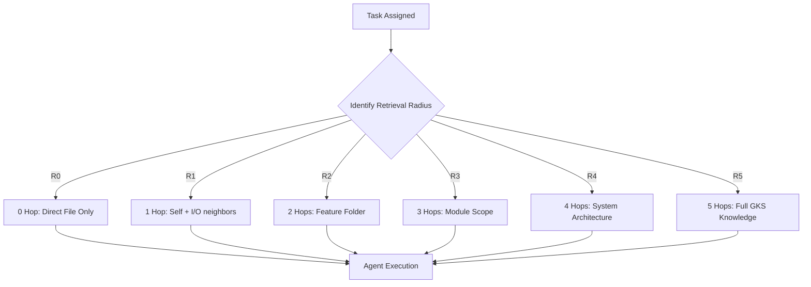

# SDD: Genesis Block Architecture

## 1. System Overview
Genesis Block Architecture คือระบบ Graph-based Manifest ที่ใช้โมเดล **Chain-Driven Atom Compaction** เพื่อแก้ปัญหา Disk I/O และ Git Fragmentation ในโปรเจกต์ขนาดใหญ่

## 2. Logical Components

### 2.1 Compound Document Model (Hub-and-Spoke)
- **Genesis Block (Hub):** ทำหน้าที่เป็นศูนย์กลางข้อมูล (Full-scale Metadata) เก็บแผนงานและโครงสร้างระดับสูง
- **Low-level Atom (Spoke):** ไฟล์ LLD หรือ Code ที่บรรจุ Metadata ขั้นต่ำ แต่เชื่อมโยงกลับมาที่ Hub ผ่าน `block_id` เพื่อดึงบริบทเต็ม
- **Atom Header:** ทำหน้าที่เป็น Anchor point สำหรับ Parser
- **Atom Metadata:** เก็บสถานะและสิทธิ์ (access_scope)
- **Atom Body:** เก็บเนื้อหา (Logic/Docs/Specs)

### 2.2 GKS Parser Engine
- **Scanner:** ทำงานแบบ Regex-based เพื่อหาพิกัด Byte-offset ของแต่ละ Atom
- **Relinker:** ทำการ Relinking ข้อมูล Metadata จาก Genesis Block เข้าสู่อะตอมย่อยใน Memory (Virtual Full Metadata)
- **State Partitioning:** แบ่งส่วนข้อมูลเพื่อให้ AI แก้ไขเฉพาะจุด (Surgical Edit) โดยไม่กระทบส่วนอื่นในไฟล์เดียวกัน

## 3. Data Flow: Retrieval Radius

**2026-08-19 correction (ADR-021/AUD-14, TASK-PRD-022):** this graph previously used `H0-H5` as the label for hop-count/retrieval-radius selection, conflating it with the abolished H-axis Access Scope. Renamed to `R0-R5` Retrieval Radius; Access Scope (`H0-H4`) is a separate, independently-declared executor capability ceiling and does not gate graph traversal depth.

## 4. Compaction Layer Mapping
สถาปัตยกรรมจะทำการ Map เลเยอร์ (L0-Ln) ตามระดับความลึกการบีบอัด (Compaction Depth) ที่กำหนด โดยมี D0 เป็นฐาน และ D6 เป็นเพดาน:

**2026-08-19 correction (ADR-021/AUD-14, TASK-PRD-022):** this graph previously labeled compaction depth as `H0-H6`, which is the abolished H-axis range. Compaction/resolution depth is the `D` axis per `CLAUDE.md`'s canonical governance-axes table; relabeled `H0-H6` -> `D0-D6` here. This `D` numbering has not yet been reconciled against the `CH1-CH5` Compaction Height scale in `.agents/FRAMEWORK--HIERARCHY-COMPACTION-STANDARDS.md` — flagged for a follow-up doc-alignment pass, not resolved in this sweep.

## 5. Security & Governance
- **Deterministic Backlink Injection:** ป้องกันการเกิด Loop ในระบบกราฟโดยการฉีดพ่นความสัมพันธ์แบบทิศทางเดียวย้อนกลับขึ้นไปหา Parent
- **Acyclic Invariant Enforcement:** ตรวจสอบความถูกต้องของกราฟทุกครั้งก่อนที่ Agent จะเริ่มทำงาน
