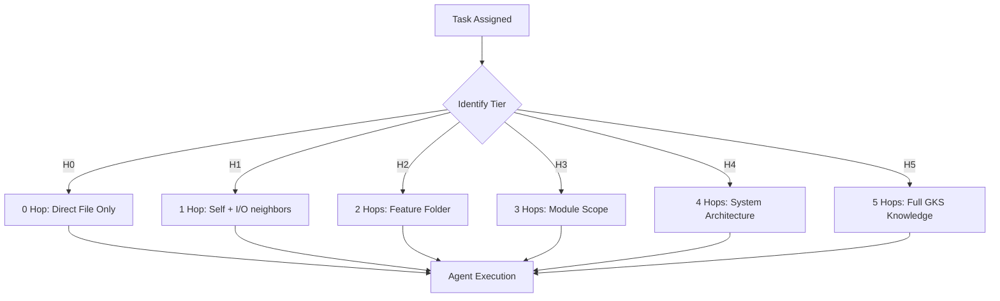
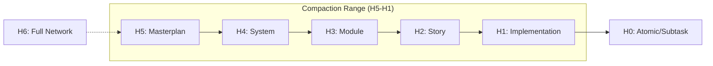

# SDD: Genesis Block Architecture

## 1. System Overview
Genesis Block Architecture คือระบบ Graph-based Manifest ที่ใช้โมเดล **Chain-Driven Atom Compaction** เพื่อแก้ปัญหา Disk I/O และ Git Fragmentation ในโปรเจกต์ขนาดใหญ่

## 2. Logical Components

### 2.1 Compound Document Model (Hub-and-Spoke)
- **Genesis Block (Hub):** ทำหน้าที่เป็นศูนย์กลางข้อมูล (Full-scale Metadata) เก็บแผนงานและโครงสร้างระดับสูง
- **Low-level Atom (Spoke):** ไฟล์ LLD หรือ Code ที่บรรจุ Metadata ขั้นต่ำ แต่เชื่อมโยงกลับมาที่ Hub ผ่าน `block_id` เพื่อดึงบริบทเต็ม
- **Atom Header:** ทำหน้าที่เป็น Anchor point สำหรับ Parser
- **Atom Metadata:** เก็บสถานะและสิทธิ์ (context_scaling_tier)
- **Atom Body:** เก็บเนื้อหา (Logic/Docs/Specs)

### 2.2 GKS Parser Engine
- **Scanner:** ทำงานแบบ Regex-based เพื่อหาพิกัด Byte-offset ของแต่ละ Atom
- **Relinker:** ทำการ Relinking ข้อมูล Metadata จาก Genesis Block เข้าสู่อะตอมย่อยใน Memory (Virtual Full Metadata)
- **State Partitioning:** แบ่งส่วนข้อมูลเพื่อให้ AI แก้ไขเฉพาะจุด (Surgical Edit) โดยไม่กระทบส่วนอื่นในไฟล์เดียวกัน

## 3. Data Flow: Context Scaling

## 4. Compaction Layer Mapping
สถาปัตยกรรมจะทำการ Map เลเยอร์ (L0-Ln) ตามระดับความสูง (Height) ที่กำหนด โดยมี H0 เป็นฐาน และ H6 เป็นเพดาน:

## 5. Security & Governance
- **Deterministic Backlink Injection:** ป้องกันการเกิด Loop ในระบบกราฟโดยการฉีดพ่นความสัมพันธ์แบบทิศทางเดียวย้อนกลับขึ้นไปหา Parent
- **Acyclic Invariant Enforcement:** ตรวจสอบความถูกต้องของกราฟทุกครั้งก่อนที่ Agent จะเริ่มทำงาน
