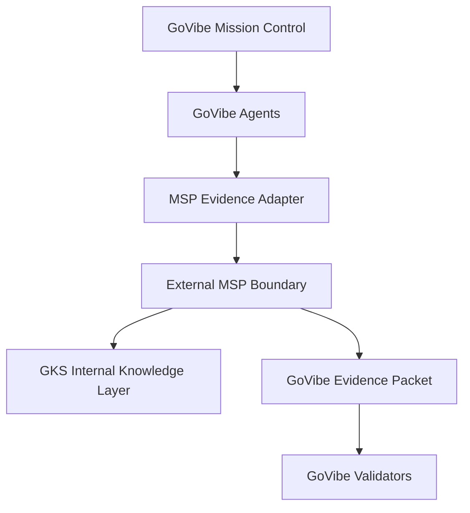

# SDD: MSP External Evidence Boundary

## 1. Purpose

Define how GoVibe consumes MSP/GKS capability in v1 without moving MSP authority, GKS internals, or cognitive-system source files into GoVibe canonical ownership.

This document is a derived GoVibe boundary note. It summarizes the reusable architecture pattern from `.brain/inbound/FRAMEWORK--MSP-ARCHITECTURE-V2.md`; it does not replace that source.

## 2. Source Evidence

Inbound source reviewed:

```yaml
source_path: ".brain/inbound/FRAMEWORK--MSP-ARCHITECTURE-V2.md"
source_doc_id: "FRAMEWORK--MSP-ARCHITECTURE-V2"
source_status: ["stable", "active"]
source_risk_flags:
  has_secret: false
  leak_risk: low
  supersedes: "FRAMEWORK--MSP-ARCHITECTURE"
govibe_decision: "derive_candidate"
```

Relevant source claims used for this derivation:

- MSP is agent-agnostic and sits under multiple cognitive-layer agents.
- MSP owns sessions, episodic memory, retrieval, compression, identity, candidates, validation, symbol tooling, MCP tools, and CLI surfaces.
- GKS is the knowledge base below MSP.
- Storage separates global MSP state from workspace/project state.
- GKS direct access is an internal MSP concern, not a public GoVibe agent surface in v1.

## 3. Boundary Model



## 4. V1 Interface Rule

GoVibe v1 treats MSP as an external evidence boundary.

Allowed:

- GoVibe can run an MSP-facing command through the evidence adapter.
- GoVibe can collect source repo status, command, exit code, warnings, and mapped concepts.
- GoVibe can display MSP/GKS evidence as provenance.
- GoVibe can create change requests when MSP source evidence conflicts with GoVibe governance.

Blocked:

- GoVibe agents must not call GKS directly.
- GoVibe must not treat MSP validation as GoVibe final approval.
- GoVibe must not import MSP/GKS source docs into canonical GoVibe docs without derivation.
- GoVibe must not expose GKS internals in UI as if they are GoVibe-owned runtime state.

## 5. Trust Boundary

| Layer | Owns | GoVibe Treatment |
|---|---|---|
| GoVibe | PRD, roadmap, task containers, agent governance, audit decisions | Canonical for GoVibe work state |
| MSP | external memory/passport/evidence commands | Trusted only as source evidence after adapter capture |
| GKS | atoms, backlinks, symbol graph, vector/graph knowledge substrate | Internal behind MSP in v1 |
| Source repo | actual code/docs being validated | Must be checked through git status and command output |

## 6. Evidence Packet Normalization

All MSP output must be normalized into the GoVibe packet from `FEAT-MSP-VALIDATE-EVIDENCE-ADAPTER` before it can affect GoVibe decisions.

Minimum derived boundary fields:

```yaml
source_repo:
source_commit:
source_git_status:
source_boundary: "external_msp"
internal_subsystem: "gks"
interface_used: "cli | mcp | package_api"
command:
exit_code:
validated_source_artifacts:
govibe_taxonomy_mapping:
unmapped_governance_concepts:
govibe_decision:
confidence:
```

## 7. V1 Runtime Decision

For MVP developer trial, GoVibe should implement MSP integration as adapter evidence first, not as a production microservice split.

Recommended order:

1. CLI evidence collection through `npm run msp:evidence`.
2. MCP tool discovery once stable local operator configuration exists.
3. Package API only if CLI/MCP are blocked.
4. Service boundary after the adapter contract proves stable.

Do not split MSP and GKS into separate GoVibe-managed services in v1.

## 8. Unmapped Concepts

The source describes broader MSP capabilities that are not GoVibe-owned in v1:

- identity passport runtime
- episodic memory lifecycle
- consolidator/compressor implementation
- Obsidian runtime details
- Smart Connections embedding path
- codegen runner internals
- full MCP tool surface

These remain reference-only until a separate GoVibe feature contract maps them to a product system, owner, and acceptance gate.

## 9. Acceptance Criteria

- GoVibe has a derived boundary doc for MSP architecture v2.
- The doc preserves MSP as source evidence, not GoVibe authority.
- The doc keeps GKS internal behind MSP for v1.
- The doc defines allowed and blocked GoVibe behavior.
- The doc states that service split is post-adapter, not MVP default.

## 10. Success Criteria

- ATHER can reject direct GKS usage from GoVibe agents.
- KIN can implement adapter behavior without choosing a service split prematurely.
- LYRA can keep custom GoVibe-only graph work out of MVP unless MSP fit is rejected.
- Mission Control can show MSP/GKS provenance without implying fake live execution.

## 11. Definition Of Done

- This SDD is registered in `docs/DOC-VERSION-REGISTRY.md`.
- Related MSP evidence adapter docs reference this boundary.
- `npm run docs:validate` passes.
- No inbound source file is modified.

## Changelog

| Version | Date | Owner | Summary |
|---|---|---|---|
| 0.1.0+draft | 2026-06-16 | ARCHON / KIN / ATHER | Added derived MSP external evidence boundary from MSP architecture v2. |
