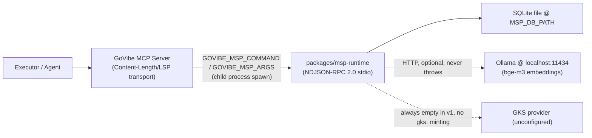
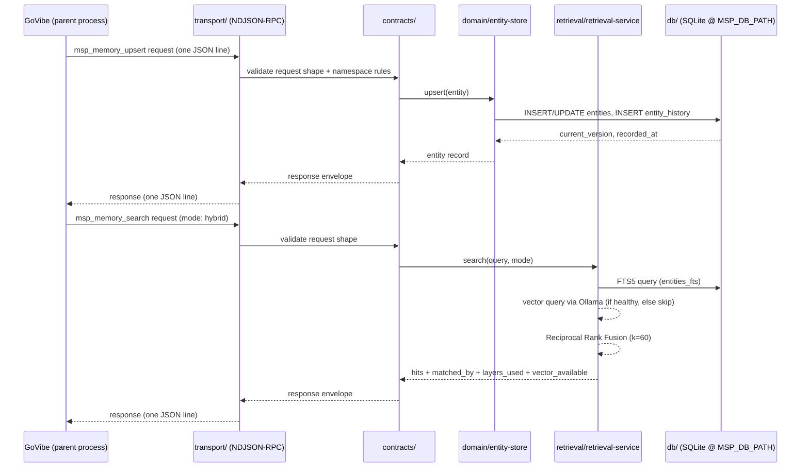

# SDD: Persistent-Memory MSP Runtime

## 1. System Overview

`packages/msp-runtime` is the concrete implementation of the in-repo,
separate-process MSP runtime decided in
`docs/adr/ADR-027-In-Repo-MSP-Runtime-Package-Boundary.md`. It is spawned as a
child OS process via `GOVIBE_MSP_COMMAND`/`GOVIBE_MSP_ARGS`
(`docs/adr/ADR-026-MSP-External-Runtime-Deployment.md`), never imported as a
library into GoVibe's own server process. It owns one SQLite file at
`MSP_DB_PATH` and exposes its capability exclusively through a
newline-delimited JSON-RPC 2.0 stdio transport. This document is the design
record for its internal layering, schema, and dependency boundaries; the
requirements it satisfies are recorded in
`docs/srs/SRS-Persistent-Memory-MSP-Runtime.md` and the wire contract it
exposes is recorded in `docs/api/API-009-Persistent-Memory-Contract.md`.

## 2. Architecture Context

The two transports in this diagram are deliberately distinct: GoVibe's own
inbound MCP server (`scripts/mcp/govibe-mcp-server.mjs`) speaks
Content-Length/LSP framing to its callers, while `packages/msp-runtime`
speaks newline-delimited JSON-RPC 2.0 to GoVibe as its parent. They share no
framing code path. The Ollama and GKS edges are both optional/absent by
design: Ollama's unavailability degrades search rather than failing it; GKS
is unconfigured in v1, so no `gks:`-namespaced reference is ever produced.

## 3. Components

| Component | Responsibility | Interfaces |
|---|---|---|
| `db/` | better-sqlite3 connection, WAL mode, `pragma foreign_keys=ON`, migration runner (`schema_migrations`, checksum-drift guard, downgrade guard) | consumed only by `domain/` |
| `domain/entity-store` | upsert/get/list/history/forget over `entities` + `entity_history` | consumed by `contracts/`, `transport/` |
| `domain/temporal-engine` | bi-temporal versioning, vendored port of `scripts/mcp/temporal-versioning.mjs` (`createTemporalVersion`, `isTemporalVisible`, `compareTemporalOrder`, `nextVersion`) | consumed by `domain/entity-store` |
| `domain/decay-engine` | Ebbinghaus decay scoring, `active -> decayed -> archived -> forgotten` lifecycle transitions | consumed by `msp_memory_decay_tick` handler |
| `domain/vault-registry` | Shared / Workspace-Private / Global-Private vault scoping per `docs/architecture/ARCH-Vault-and-Context-Model.md` | consumed by `domain/entity-store`, `contracts/` |
| `domain/links` | typed entity-graph edges, table + flat CRUD only in v1 (no traversal) | consumed by `msp_memory_links_*` handlers |
| `domain/journal` | append-only audit trail backing `msp_context_audit`, immutability enforced by DB triggers | consumed by every mutating handler |
| `domain/state` | KV + TTL store | consumed by `contracts/` |
| `domain/ids` | stable sha256-based id/ref minting matching `packages/govibe-core/src/vaults.mjs`'s scheme | consumed by all of `domain/` |
| `domain/errors` | typed domain error classes | consumed by all of `domain/`, `contracts/` |
| `retrieval/fts.mjs` | FTS5 keyword search over `entities_fts` | consumed by `retrieval/retrieval-service.mjs` |
| `retrieval/vector.mjs` | bge-m3 embeddings via Ollama HTTP, timeout + circuit breaker, never throws, returns `{available:false}` on failure | consumed by `retrieval/retrieval-service.mjs` |
| `retrieval/fusion.mjs` | Reciprocal Rank Fusion, `k=60` | consumed by `retrieval/retrieval-service.mjs` |
| `retrieval/retrieval-service.mjs` | façade: exact-match short-circuit -> FTS -> vector if healthy -> RRF fuse; explicit `fts_only` mode | consumed by `msp_memory_search` handler |
| `contracts/` | typed request/response validators, fail-closed, mirroring `scripts/mcp/context-authority-contract.mjs`; enforces `msp:*`/`gks:*` namespace rules from `scripts/mcp/msp-vault-context-contracts.mjs` | consumed by `transport/` |
| `transport/` | newline-delimited JSON-RPC 2.0 stdio server, readline-based, one JSON object per line, matching `packages/govibe-core/src/msp-stdio-transport.mjs`'s expected wire format | the runtime's only external interface |
| `server.mjs` | composition root; wires `db`, `domain`, `retrieval`, `contracts`, `transport` together; excluded from the internal layering test | process entrypoint |

## 4. Data Flow

## 5. Data Model

Single SQLite database at `MSP_DB_PATH`. Full DDL lives in the migration
files under `packages/msp-runtime/db/migrations/` (implementation artifact,
not reproduced verbatim here); the table list and key columns are the
canonical design record:

| Table | Key columns | Notes |
|---|---|---|
| `vaults` | `vault_id` (PK), `vault_type` (`shared`\|`workspace_private`\|`global_private`), `project_id`, `workspace_id`, `agent_id`, `role`, `status` | scoping root for every entity |
| `vault_mounts` | mount linkage between a caller context and a `vault_id` | consumed by `msp_vault_mount`/`msp_vault_status` |
| `entities` | `entity_id` (PK), `vault_id` (FK -> `vaults`), `category`, `key`, `body_json`, `epistemic_state` (`hypothesis`\|`confirmed`\|`contested`\|`deprecated`), `confidence`, `current_version`, `valid_from`, `valid_to`, `recorded_at`, `superseded_at`, `lifecycle_state` (`active`\|`decayed`\|`archived`\|`forgotten`), `decay_score`, `access_count`, `source_hash` (sha256); `UNIQUE(vault_id, category, key)` | current-state projection; `msp_memory_forget` sets `lifecycle_state=forgotten` here, never deletes the row |
| `entity_history` | `entity_id` (FK -> `entities`), `version`, full versioned snapshot columns mirroring `entities`; `UNIQUE(entity_id, version)` | append-only bi-temporal ledger; no `UPDATE`/`DELETE` path outside migrations |
| `embeddings` | `collection`, `model` (`bge-m3`), `dim` (`1024`), `vector` (BLOB), `content_hash` | per-collection dim metadata; `content_hash` detects staleness against the source entity |
| `entities_fts` | FTS5 virtual table over `entities` searchable columns | kept in sync by `AFTER INSERT`/`AFTER UPDATE`/`AFTER DELETE` triggers on `entities` |
| `journal` | append-only audit rows backing `msp_context_audit` | `BEFORE UPDATE`/`BEFORE DELETE` triggers `RAISE(ABORT)`, enforcing immutability at the database layer, not just in application code |
| `state` | KV + TTL | consumed by `domain/state` |
| `links` | typed graph edges (`from_entity_id`, `to_entity_id`, `link_type`) | table storage + flat CRUD only in v1; no traversal query surface |
| `schema_migrations` | `version`, `checksum`, `applied_at` | drives the checksum-drift and downgrade guards in `db/` |

## 6. Interfaces

- API: none (no HTTP surface). All access is through the MCP tool surface.
- MCP: the full `msp_*`/`msp_memory_*` contract in
  `docs/api/API-009-Persistent-Memory-Contract.md`, transported as
  newline-delimited JSON-RPC 2.0 over stdio.
- Events: none emitted by the runtime itself in v1; GoVibe's own bridge
  (`scripts/mcp/runtime/memory-service.mjs`) is responsible for translating
  runtime responses into `memory.snapshot`/`memory.entity.update` mission
  events for Mission Control, per
  `packages/mission-protocol/index.js`'s allow-list.
- Files: none beyond the single launch-time `MSP_DB_PATH` configuration
  value; no tool in the surface accepts a filesystem-path argument.

## 7. Security and Governance

- RBAC: not introduced beyond the existing fixed allow/deny/shadow policy
  function; documented as a v1 gap, not silently expanded to allow-everything.
- ABAC: `domain/vault-registry` enforces Shared / Workspace-Private /
  Global-Private scoping before any entity read/write; a request outside the
  caller's mounted vault is rejected by `contracts/` before reaching
  `domain/`.
- Audit: every mutating call is written to the append-only `journal` table;
  the immutability guarantee is enforced by database triggers, so even a
  future application-layer bug cannot silently rewrite audit history.
- Namespace integrity: `contracts/` rejects any request or internally
  constructed identifier that uses the `gks:` prefix; only `msp:`-prefixed
  identifiers are ever minted by this runtime, per ADR-023.

## 8. Failure Modes

| Failure | Impact | Mitigation |
|---|---|---|
| Ollama unreachable or times out | Vector search unavailable | `retrieval/vector.mjs` never throws; returns `{available:false}`; `retrieval-service.mjs` falls back to FTS-only and reports `searchMode: "fts_only"` and `vector_available: false` in the response, not just a log line |
| Malformed or namespace-violating request | Would corrupt domain invariants if accepted | `contracts/` validates fail-closed before the request reaches `domain/`; rejected requests never reach storage |
| Migration checksum drift (an already-applied migration file was edited) | Silent schema divergence between environments | `db/` migration runner computes and compares checksums against `schema_migrations`; a mismatch fails process startup closed |
| Attempted schema downgrade | Data loss or constraint violation on older schema | `db/` migration runner rejects applying a lower recorded version |
| Caller attempts a hard delete of memory | Loses bi-temporal audit history, violates ADR-020's "retained, not deleted" rule | `msp_memory_forget` is the only deletion-shaped tool and performs a soft `lifecycle_state=forgotten` update; no code path issues `DELETE FROM entities` or `DELETE FROM entity_history` outside a migration |
| Caller requests shared-scope knowledge promotion | No GKS provider exists to receive it | `msp_knowledge_promote` and `msp_memory_promote` (`target_scope=shared`) always deny with reason `gks_provider_unconfigured`, fail-closed rather than silently succeeding into nothing |
| Caller requests `execution_reproducible` evidence via replay | Runtime has no execution authority to prove this | `msp_context_replay` hard-codes `execution_reproducible`/`output_identical` to `false` with a diagnostic reason; no code path can flip this to `true` |
| Concurrent writers to `MSP_DB_PATH` | SQLite single-writer contention | WAL mode reduces reader/writer blocking; the v1 design accepts single-process-writer as a known constraint (see ADR-027 Consequences), not solved by this SDD |

## 9. Verification Plan

- Phase 0/1 (WP-12): real-process transport test via `createMspStdioCaller`;
  migration checksum-drift and downgrade-guard tests; `domain/temporal-engine`
  parity test against `scripts/mcp/temporal-versioning.mjs`; dependency-
  boundary test mirroring `scripts/mcp/runtime/dependency-boundaries.test.mjs`.
- Phase 2 (future WP): contract-conformance tests for the existing `msp_*`
  surface, run against the real running process.
- Phase 3 (future WP): FTS5/vector/RRF tests, including a graceful-
  degradation test that stops Ollama mid-test and asserts `searchMode` flips
  to `fts_only`.
- Phase 4 (future WP): deterministic decay/lifecycle transition test under an
  injected clock, covering the full `active -> decayed -> archived ->
  forgotten` path.
- Phase 5 (future WP): `memory-service.test.mjs`, mission-protocol allow-list
  test additions for `memory.snapshot`/`memory.entity.update`/`memory.*`, and
  snapshot-reducer test additions for Domain E.

## Changelog

| Version | Date | Owner | Summary |
|---|---|---|---|
| 0.1.0+draft | 2026-08-04 | Claude (final-gate session) | Initial design record for `packages/msp-runtime`: five-module layered architecture (`db`/`domain`/`retrieval`/`contracts`/`transport` + `server.mjs` composition root), condensed schema (10 tables), dependency-boundary rule, and the failure-mode table covering Ollama degradation, migration drift/downgrade, forbidden hard deletes, fail-closed shared promotion, and the no-false-execution-evidence invariant. |
