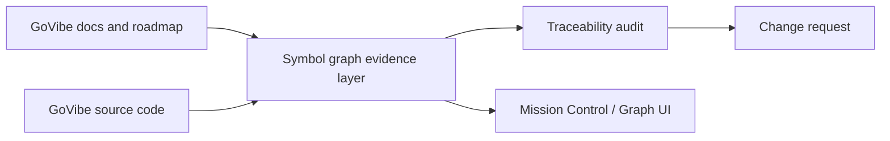

# SDD: Symbol Graph Traceability Boundary

## 1. Purpose

Define how GoVibe consumes symbol graph evidence to detect doc-code drift, surface backlinks and symbol links, and cluster implementation communities without importing the cognitive-system symbol graph implementation wholesale.

This document is a GoVibe-derived boundary contract. It summarizes reusable ideas from the inbound symbol graph sources, but it does not replace them.

## 2. Source Evidence

Reviewed inbound sources:

```yaml
source_bundle:
  - source_path: ".brain/inbound/FRAMEWORK--SYMBOL-GRAPH.md"
    source_doc_id: "FRAMEWORK--SYMBOL-GRAPH"
    source_status: "stable"
    source_risk_flags:
      has_secret: true
      leak_risk: high
    govibe_decision: "derive_candidate"
  - source_path: ".brain/inbound/BLUEPRINT--SYMBOL-GRAPH-CORE.md"
    source_doc_id: "BLUEPRINT--SYMBOL-GRAPH-CORE"
    source_status: "stable"
    source_risk_flags:
      has_secret: true
      leak_risk: high
    govibe_decision: "derive_candidate"
  - source_path: ".brain/inbound/FEAT--SYMBOLS-MULTI-LANG.md"
    source_doc_id: "FEAT--SYMBOLS-MULTI-LANG"
    source_status: "stable"
    source_risk_flags:
      has_secret: false
      leak_risk: low
    govibe_decision: "reference_only_until_governed"
  - source_path: ".brain/inbound/FLOW--SYSTEM-DATA-FLOW.md"
    source_doc_id: "FLOW--SYSTEM-DATA-FLOW"
    source_status: "active"
    source_risk_flags:
      has_secret: false
      leak_risk: low
    govibe_decision: "reference_only"
```

### 2a. Security Gate For High-Leak Sources

Two of the sources above (`FRAMEWORK--SYMBOL-GRAPH` and `BLUEPRINT--SYMBOL-GRAPH-CORE`) declare `has_secret: true` and `leak_risk: high`. Per `AUDIT-Cognitive-System-Inbound-Triage-2026-06-16` (§3 Non-Negotiable Import Rules and §4 Decision States), such sources MUST first pass the `blocked_security_review` gate — an explicit ATHER security/governance review — before any derivation. The `govibe_decision: "derive_candidate"` shown above is therefore conditional, not effective: it does not authorize derivation while the security review is outstanding.

Rule: no `derive_candidate` decision (in this section, in the evidence packet of section 6, or in any downstream build) may be acted on for a source flagged `leak_risk: high` or `has_secret: true` until that source has cleared `blocked_security_review` under the AUDIT. The symbol-graph boundary does not bypass that gate.

## 3. Boundary Model



## 4. What The Symbol Graph Is In GoVibe

GoVibe treats the symbol graph as a structural evidence layer that answers how the code is wired and what doc or task owns a code path.

Supported evidence use cases:

- doc-code drift detection
- symbol-to-doc traceability
- backlinks and reverse lookups
- community clustering for module boundaries
- implementation impact analysis
- visual exploration in Mission Control

The symbol graph is not the source of product authority. It is a reader and verifier of structure.

## 5. What The Symbol Graph Is Not

- not a replacement for PRD, roadmap, or task governance
- not the owner of business scope
- not the place to invent missing requirements
- not the place to import the whole cognitive-system knowledge block
- not a direct write surface for inbound source files

## 6. Required Evidence Packet

The canonical evidence/decision contract is `FEAT-MSP-VALIDATE-EVIDENCE-ADAPTER`. It owns the base field set, the `recommended_decision` key, and the base decision enum (`accept_reference | import_inbound | reject | create_change_request | blocked_by_missing_evidence`). This SDD references that contract and only ADDS symbol-graph-specific extension fields and one explicitly documented enum extension.

Any GoVibe symbol-graph build, refresh, or visual export must emit the canonical FEAT packet plus the following symbol-graph extension fields:

```yaml
source_refs:
  - ".brain/inbound/FRAMEWORK--SYMBOL-GRAPH.md"
  - ".brain/inbound/BLUEPRINT--SYMBOL-GRAPH-CORE.md"
input_roots:
symbol_count:
edge_count:
community_count:
doc_symbol_links:
broken_links:
unmapped_doc_sections:
drift_score:
```

The decision uses the canonical `recommended_decision` key. The base enum is extended with one boundary-specific value:

- `derive_candidate` — symbol-graph-specific extension of the canonical FEAT enum, meaning the structural evidence is a candidate for deriving a GoVibe doc section or feature. This is an explicit addition to, not a replacement of, the FEAT enum. A `derive_candidate` decision is only valid for sources that have cleared the security gate in section 2a; high-leak or secret-bearing sources must first pass `blocked_security_review`.

## 7. Runtime Contract

GoVibe may expose the symbol graph in three surfaces:

1. read-only explorer for code and docs
2. audit view for broken traceability and missing evidence
3. task/rule view for routing work to the right team or model

The runtime must preserve provenance for every node and edge.

## 8. Boundaries For v1

The v1 boundary is intentionally narrow:

- parse source evidence from current repo state only
- link code symbols to approved docs and tasks
- cluster symbols for navigational insight
- emit broken links and missing provenance as explicit gaps
- keep parser/store implementation details behind the derived boundary

Defer until later:

- cross-repo symbol federation
- multi-language expansion beyond the approved slice
- automatic rewrite of source docs
- turning symbol communities into direct approval authority

## 9. How This Relates To Other GoVibe Systems

| GoVibe System | Relationship |
|---|---|
| `SYSTEM-03::Docs-to-Code-System` | Symbol graph provides the structural side of docs-to-code traceability. |
| `SYSTEM-08::Genesis-Knowledge-HCS-System` | Symbol graph is the knowledge substrate for code structure and community analysis. |
| `SYSTEM-09::Traceability-Audit-Verification-System` | Symbol graph is evidence for drift detection, missing links, and audit surfaces. |

## 10. Acceptance Criteria

- GoVibe has a derived boundary doc for symbol graph traceability.
- The doc distinguishes evidence from authority.
- The doc preserves read-only treatment of source code and docs during graph building.
- The doc exposes broken links and drift as explicit evidence.
- The doc ties symbol graph output to Mission Control and audit surfaces.

## 11. Success Criteria

- ATHER can inspect symbol graph evidence and reject invented traceability.
- THESEUS can link doc sections and code symbols without importing MSP internals.
- ARCHON can use the boundary to reason about architecture without expanding scope.
- LYRA can route missing links into change requests instead of silent acceptance.

## 12. Definition Of Done

- This SDD is registered in `docs/DOC-VERSION-REGISTRY.md`.
- Related traceability docs point to it.
- `npm run docs:validate` passes.
- No inbound source file is modified.

## Changelog

| Version | Date | Owner | Summary |
|---|---|---|---|
| 0.1.1 | 2026-06-21 | ARCHON / THESEUS / ATHER | Signed off; promoted draft -> approved (MSP/GKS gate decision recorded in ADR-014). |
| 0.1.1+draft | 2026-06-20 | ARCHON / THESEUS / ATHER | Referenced FEAT-MSP-Validate-Evidence-Adapter as the canonical packet/decision contract; documented `derive_candidate` as an explicit enum extension (not a replacement of `import_inbound`); added section 2a requiring high-leak/secret-bearing sources to clear the AUDIT `blocked_security_review` gate before any `derive_candidate` decision. |
| 0.1.0+draft | 2026-06-16 | ARCHON / THESEUS / ATHER | Added derived symbol graph traceability boundary for doc-code drift and structural evidence. |
