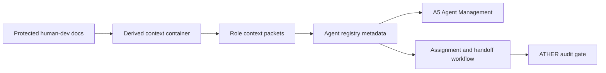
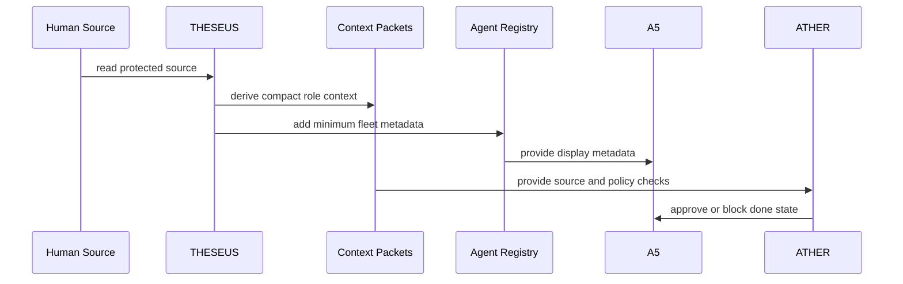

# SDD: Visual Agent Fleet

## 1. System Overview

Visual Agent Fleet is the governance and display layer that maps GoVibe agent identities to role contracts, job-title equivalents, authority boundaries, source references, and A5 visualization metadata.

It does not execute agents directly. It provides the context and metadata needed for planning, assignment, audit, QA, and future UI rendering.

The architectural decision for this boundary is recorded in `docs/adr/ADR-012-Visual-Agent-Fleet-Governance.md`.

## 2. Architecture Context



## 3. Components

| Component | Responsibility | Interfaces |
|---|---|---|
| Protected Source Boundary | Keeps `.agents/Visual-Agent-Fleet-Scope/` read-only for agent derivation. | File references, audit checks |
| Context Container | Defines source policy, shared taxonomy, and derivation rules. | `.agents/context/CONTEXT-Visual-Agent-Fleet-Scope.md` |
| Role Context Packets | Summarize reusable rules for each role without copying full human docs. | `.agents/*/context/*.md` |
| Agent Registry Metadata | Carries display/routing metadata while preserving executor config. | `.agents/agent-registry.yaml` |
| A5 Consumer | Displays identity, role, job title, domain, cluster, authority, and scope status. | Current A5 Agent Management surface |
| Audit Gate | Blocks source mutation, missing traceability, and scope expansion without assessment. | ATHER review contract |

## 4. Data Flow



## 5. Data Model

Canonical fleet metadata:

```yaml
agent_id:
agent_name:
fleet_role:
job_title_equivalent:
domain:
cluster:
responsibility:
authority:
  can:
  cannot:
source_refs:
approval_gate:
scope_boundary:
out_of_scope:
```

Scope status values for A5:

```text
in_scope
needs_change_request
blocked_by_missing_req
ready_for_assignment
```

Required change request fields:

```yaml
change_requested:
reason:
business_value:
affected_requirement:
affected_tasks:
timeline_impact:
resource_impact:
risk_impact:
what_moves_out:
approval_owner:
decision:
```

## 6. Interfaces

- API: none in v1.
- MCP: no new tool in v1; future tools may expose registry-derived role metadata.
- Events: no new MissionEvent in v1; future A5 runtime may normalize metadata into MissionSnapshot.
- Files: `.agents/agent-registry.yaml`, `.agents/context/CONTEXT-Visual-Agent-Fleet-Scope.md`, role context packets, FEAT, and SDD.

## 7. Security and Governance

- RBAC: human owners approve scope, priority, and protected source override decisions.
- ABAC: agents receive derived context based on role, scope, allowed actions, and source refs.
- Audit: ATHER blocks completion when protected sources are edited, authority fields are missing, or scope expansion lacks change-control evidence.
- Source authority: human-readable SWE docs and protected human-dev docs beat derived context when conflicts exist.

## 8. Failure Modes

| Failure | Impact | Mitigation |
|---|---|---|
| Protected source edited directly | Human-dev source loses integrity | ATHER blocks and requires human override |
| Registry metadata replaces executor policy | Agent routing may break | Only additive metadata fields are allowed |
| LYRA accepts new scope without assessment | Scope creep and timeline drift | Change request gate required |
| A5 shows metadata as live execution | Misleading operator view | A5 must label metadata and source refs as configuration/provenance |
| Derived context copies entire source docs | Token bloat and stale duplication | Summaries only, with source refs |

## 9. Verification Plan

- Run `npm run docs:validate`.
- Run `npm run baseline:check`.
- Confirm `git diff -- .agents/Visual-Agent-Fleet-Scope` is empty.
- Review registry metadata for additive-only changes.
- Review role packets for source refs and no full-source copying.

## Changelog

| Version | Date | Owner | Summary |
|---|---|---|---|
| 0.1.0 | 2026-06-20 | THESEUS / ARCHON | Signed off; promoted draft -> approved. |
| 0.1.0+draft | 2026-06-20 | THESEUS / ARCHON | Migrated to canonical draft convention: normalized version suffix to +draft, uppercased doc_id, and added this changelog footer. |
