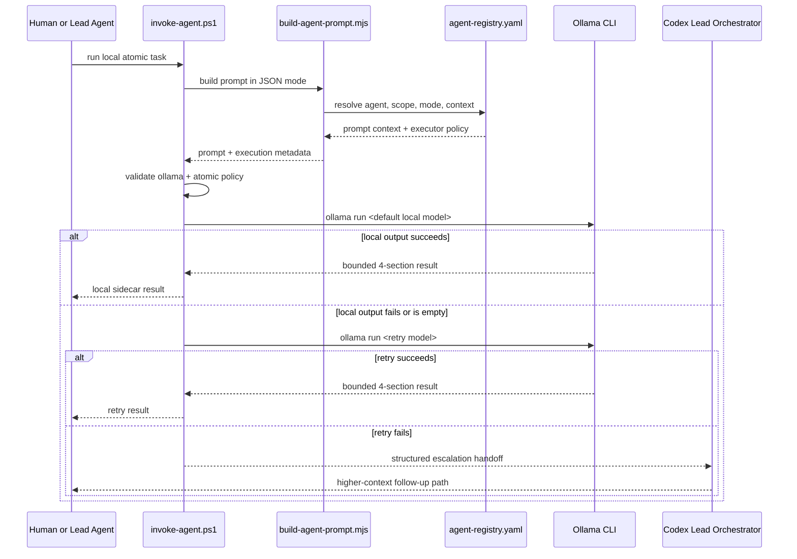

# SEQ: Ollama Sidecar Flow

## 1. Purpose

Show the runtime interaction flow for bounded Ollama sidecar execution inside the GoVibe multi-agent workflow.

## 2. Sequence Flow

## 3. Runtime Notes

- Codex remains the lead orchestrator.
- Ollama is a bounded sidecar executor for `atomic` mode only in v1.
- The prompt builder remains shared between Codex and Ollama paths.
- Registry policy decides executor defaults, local bounds, and model tiers.

## 4. Traceability Matrix

| PRD/SRS Requirement | Container | Component | Supporting Doc |
|---|---|---|---|
| bounded local sidecar execution | launcher scripts | execution router | `docs/lld/LLD-Agent-Launcher-Execution-Router.md` |
| shared prompt-building path | launcher scripts | prompt builder | `docs/srs/SRS-Ollama-Sidecar-Execution.md` |
| retry and escalation flow | multi-agent workflow | local sidecar executor | `docs/runbooks/RUNBOOK-GoVibe-Multi-Agent.md` |
