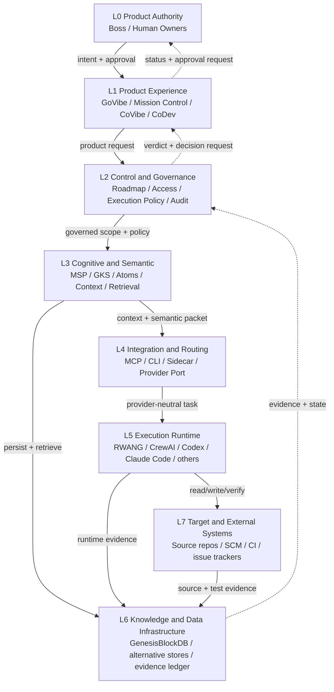
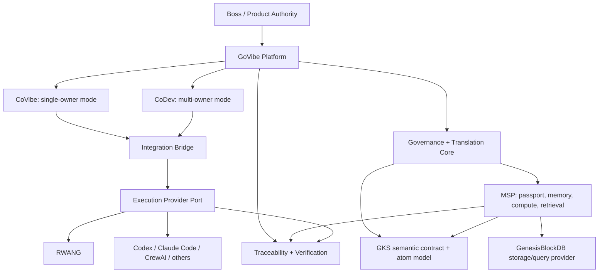
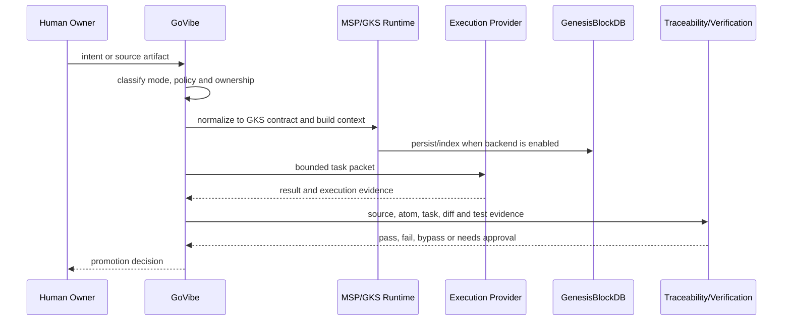

# TDD: GoVibe-Centric Owner Map and Feature Map

> **Superseded draft:** Do not use this file as an implementation source. The
> owner removed RWANG from the target product architecture and defined CoVibe
> and CoDev as equal-capability collaboration modes. The replacement proposal
> is `docs/change-requests/CR-2026-07-26-GoVibe-RWANG-Capability-Absorption.md`.
> The historical body remains temporarily for decision traceability.

## 1. สถานะและเจตนาของเอกสาร

เอกสารนี้เป็นข้อเสนอสำหรับจัด ownership และ feature boundary ของระบบโดยยึด
**GoVibe เป็นศูนย์กลางของผลิตภัณฑ์** ก่อนเริ่มปรับ architecture หรือ runtime จริง

เอกสารนี้ยังไม่ใช่ architecture source of truth และไม่ยกเลิก ADR ที่ accepted อยู่
การเปลี่ยน authority ของ MSP, GKS, GenesisBlockDB หรือ execution provider ต้องออก ADR
หรือ Change Request แยกและได้รับอนุมัติจาก Product Authority ก่อน

### 1.1 ข้อสรุปที่เสนอ

1. **GoVibe เป็น product center และ governance/interop authority**
2. **CoVibe และ CoDev เป็น product modes/modules ใต้ GoVibe**
3. **MSP เป็น memory/passport + compute/retriever subsystem ของ GoVibe core**
4. **GKS แยก ownership เป็นสองชั้น**
   - GoVibe เป็นเจ้าของ semantic contract/interlingua
   - MSP เป็นเจ้าของ runtime lifecycle, retrieval และ context assembly
5. **GenesisBlockDB เป็น storage/query engine provider** ไม่ใช่เจ้าของ product semantics
6. **RWANG, Codex, Claude Code, CrewAI และ executor อื่นเป็น execution providers**
7. GoVibe ต้องไม่ผูก CoVibe หรือ CoDev กับ execution provider ตัวเดียว

## 2. ปัญหาปัจจุบัน

เอกสารที่มีอยู่ให้ภาพถูกต้องเป็นส่วน ๆ แต่ยังชนกันเมื่อมองทั้ง platform:

- PRD ระบุว่า GoVibe เป็น governance + interoperability layer และไม่ใช่ orchestrator
- CoVibe ถูกนิยามเป็น intra-owner orchestration module
- ADR-016 ระบุว่า GoVibe + MSP เป็น mandatory core
- ADR-014 และ MSP boundary SDD ยังวาง MSP/GKS เป็น external evidence boundary ใน v1
- ADR-017 ระบุว่า GKS เป็น canonical interlingua ของ GoVibe
- MSP boundary ระบุว่า GKS เป็น internal subsystem ใต้ MSP
- GenesisBlockDB feature doc เรียก GenesisBlockDB ว่า knowledge engine ของ GoVibe
- GenesisBlockDB repository ปัจจุบันมี engine, NAPI, REST, MCP และ SDK จริง
  แต่ไม่ได้เป็นเจ้าของ GoVibe product workflow
- RWANG มี execution runtime และ provider routing จริง แต่ต้องคงเป็น external provider

หากไม่แยกชนิด ownership จะเกิดคำตอบหลายแบบต่อคำถามเดียว เช่น
"ใครเป็นเจ้าของ atom", "ใคร route agent", "ใคร validate", หรือ
"GoVibe เดินได้ไหมเมื่อไม่มี RWANG"

## 3. เป้าหมายและขอบเขต

### 3.1 In scope

- Product ownership ของ GoVibe
- Ownership ของ CoVibe และ CoDev
- Functional ownership ของ SYSTEM-01 ถึง SYSTEM-10
- Boundary ของ MSP, GKS, GenesisBlockDB และ RWANG
- Owner ของ document/knowledge atom lifecycle
- Feature-to-system, feature-to-provider และ system dependency mapping
- Current-to-target mapping และ decision gates

### 3.2 Out of scope

- การย้าย repository
- การแก้ code, schema, API หรือ runtime
- การเปลี่ยน accepted ADR โดยตรง
- การบังคับให้ GoVibe ใช้ RWANG เป็น executor เดียว
- การนำ GenesisBlockDB, RWANG หรือ target repositories เข้า GoVibe monorepo
- การกำหนด organization chart หรือบุคคลถาวรนอก role ที่มีอยู่

## 4. หลัก ownership ที่ใช้

Owner หนึ่งคำไม่เพียงพอ จึงแยกเป็นห้าชนิด:

| Ownership type | ความหมาย |
|---|---|
| Product Authority | ผู้อนุมัติ product boundary, positioning และการเปลี่ยน architecture |
| Contract Owner | เจ้าของ schema, semantics, policy และ compatibility |
| Runtime Owner | เจ้าของ logic ที่ทำงานจริงและ lifecycle ระหว่าง execution |
| Provider Owner | เจ้าของ implementation ภายนอกที่เสียบผ่าน port/adapter |
| Evidence Owner | เจ้าของ verdict, audit trail และ promotion decision |

กฎหลักคือ **ผู้ให้บริการไม่กลายเป็นเจ้าของ product contract โดยอัตโนมัติ** และ
**ผู้เก็บข้อมูลไม่กลายเป็นเจ้าของความหมายของข้อมูล**

## 5. Target Architecture แบบ GoVibe-Centric

### 5.1 รายการ Layer และความสัมพันธ์

| Layer | ชื่อ | หน้าที่หลัก | รับข้อมูลจาก | ส่งต่อไป |
|---|---|---|---|---|
| L0 | Product Authority | กำหนดวิสัยทัศน์, product boundary, approval และ risk appetite | owner intent, audit evidence | GoVibe Platform |
| L1 | Product Experience | รับ intent และแสดงสถานะผ่าน Mission Control, CoVibe และ CoDev | human owner, team owners | control/governance systems |
| L2 | Control and Governance | roadmap, routing, access policy, execution policy, traceability และ final gate | L1, source docs, provider evidence | cognition, integration และ execution layers |
| L3 | Cognitive and Semantic | MSP memory/passport/context, GKS semantics, atom lifecycle, retrieval และ JIT context | governed intent, docs, code, history | integration/execution และ persistence |
| L4 | Integration and Routing | แปลง governed task เป็น provider-neutral packet และเลือก transport/provider | L2, L3 | execution providers |
| L5 | Execution Runtime | วางแผนย่อย, dispatch, run, retry, verify และส่ง execution evidence | bounded task packet | target repositories และ evidence layer |
| L6 | Knowledge and Data Infrastructure | จัดเก็บ/query graph, vector, temporal state, atom index และ runtime evidence | MSP/GKS, GoVibe audit, provider output | retrieval, audit และ Mission Control |
| L7 | Target and External Systems | codebase, SCM, CI, issue tracker และ artifacts ที่เป็นเป้าหมายของงาน | execution providers | evidence/verification กลับสู่ GoVibe |

Dependency direction หลักไหลจาก L0 ลงไป L7 ส่วน evidence และสถานะไหลย้อนจาก
L7 กลับขึ้น L0 การส่งข้อมูลย้อนกลับไม่ทำให้ lower layer มี authority เหนือ product
decision

### 5.2 Layer Relationship Diagram



### 5.3 ลำดับขั้นของระบบทั้งหมด

```mermaid
flowchart TB
  GV["GoVibe Platform"]

  S01["SYSTEM-01 Mission Control Experience"]
  S02["SYSTEM-02 Project Roadmap Management"]
  S03["SYSTEM-03 Docs-to-Code"]
  S04["SYSTEM-04 Diagram-to-Doc"]
  S05["SYSTEM-05 Agent-Team Management"]
  S06["SYSTEM-06 Integration Bridge"]
  S07["SYSTEM-07 Governance Access Control"]
  S08["SYSTEM-08 Genesis Knowledge HCS"]
  S09["SYSTEM-09 Traceability Audit Verification"]
  S10["SYSTEM-10 Execution Governance"]

  GV --> S01
  GV --> S02
  GV --> S03
  GV --> S04
  GV --> S05
  GV --> S06
  GV --> S07
  GV --> S08
  GV --> S09
  GV --> S10

  S01 --> MC["Mission Control"]
  S01 --> BOARD["Roadmap Board"]
  S01 --> FLEET["Agent Fleet View"]
  S01 --> STATUS["Status / Telemetry / Evidence Views"]

  S02 --> PLAN["Master Plan / Roadmap / Backlog"]
  S02 --> TASK["Task and Sprint Containers"]
  S02 --> HISTORY["Bi-Temporal Roadmap History"]
  S02 --> PROMOTE["Roadmap Promotion Gate"]

  S03 --> INGEST["Document and Code Ingestion"]
  S03 --> EXTRACT["Spec-to-Task Extraction"]
  S03 --> SYMBOL["Symbol Link Extraction"]
  S03 --> PACKET["Context / Task Packet Assembly"]
  S03 --> DRIFT["Doc-Code Drift Detection"]

  S04 --> DIAGRAM["Diagram Intake"]
  S04 --> NORMALIZE["Diagram Normalization"]
  S04 --> CANDIDATE["Generated Document Candidate"]
  S04 --> HUMANREVIEW["Human Review Gate"]

  S05 --> COVIBE["CoVibe Module<br/>single-owner orchestration mode"]
  S05 --> CODEV["CoDev Module<br/>multi-owner coordination mode"]
  S05 --> ROLES["Role Registry"]
  S05 --> HANDOFF["Assignment and Handoff"]
  S05 --> SUPPORT["Bounded Support Executor Contract"]

  S06 --> MCP["MCP Surface"]
  S06 --> CLI["CLI / Local Sidecar"]
  S06 --> EVENT["Webhook / Mission Event Gateway"]
  S06 --> EXECPORT["Execution Provider Port"]
  S06 --> KNOWPORT["Knowledge Store Port"]

  S07 --> RBAC["Human RBAC"]
  S07 --> ABAC["Agent ABAC"]
  S07 --> PDP["Policy Decision Point"]
  S07 --> PEP["Policy Enforcement Point"]
  S07 --> APPROVAL["Approval Owner Rules"]

  S08 --> GKSCONTRACT["GKS Semantic Contract"]
  S08 --> ATOMS["Knowledge Atom Registry"]
  S08 --> MSP["MSP Cognitive Runtime"]
  S08 --> RETRIEVAL["Retrieval / HCS / JIT Context"]
  S08 --> SGRAPH["Symbol and Knowledge Graph"]

  MSP --> PASSPORT["Identity / Passport"]
  MSP --> MEMORY["Session / Episodic Memory"]
  MSP --> CONTEXT["Context Assembly / Compaction"]
  MSP --> GKSRT["GKS Runtime Lifecycle"]

  S09 --> DOCREG["Document Version Registry"]
  S09 --> CRRCA["CR / RCA Ledger"]
  S09 --> TRACE["Source-to-Code Trace"]
  S09 --> VERIFY["Verification Evidence"]
  S09 --> CERT["Promotion Certification"]

  S10 --> CLASSIFY["C / H / R / CH / W Classification"]
  S10 --> STATE["Task State Machine"]
  S10 --> REVIEW["Review and QA Gates"]
  S10 --> CLOSURE["Closure / Definition of Done"]
  S10 --> GUARD["Runtime Guardrail Policy"]

  EXECPORT --> RWANG["RWANG Provider"]
  EXECPORT --> CODEX["Codex Provider"]
  EXECPORT --> CLAUDE["Claude Code Provider"]
  EXECPORT --> CREW["CrewAI Provider"]
  EXECPORT --> OTHEREXEC["Other Compatible Providers"]

  RWANG --> RWCONTRACT["Contracts"]
  RWANG --> RWCORE["Core Routing"]
  RWANG --> RWORCH["Orchestrator"]
  RWANG --> RWADAPTER["Worker / SCM / Verification Adapters"]
  RWANG --> RWEVIDENCE["Runtime Evidence"]

  KNOWPORT --> GDB["GenesisBlockDB Provider"]
  KNOWPORT --> ALTDB["Alternative Storage Provider"]

  GDB --> GRAPH["Graph + Bitemporal Engine"]
  GDB --> VECTOR["Vector / HNSW Index"]
  GDB --> HQL["HQL Query"]
  GDB --> SURFACE["NAPI / REST / MCP / SDK"]

  RWANG --> TARGET["External Target Repositories"]
  CODEX --> TARGET
  CLAUDE --> TARGET
  CREW --> TARGET
  OTHEREXEC --> TARGET

  TARGET --> SCM["SCM / CI / Test Toolchain"]
  SCM -.-> VERIFY
  RWEVIDENCE -.-> VERIFY
  GDB -.-> RETRIEVAL
```



### 5.4 Hierarchy Tree แบบอ่านเร็ว

```text
GoVibe Platform
|-- SYSTEM-01 Mission Control Experience
|   |-- Mission Control
|   |-- Roadmap Board
|   |-- Agent Fleet View
|   `-- Status / Telemetry / Evidence Views
|-- SYSTEM-02 Project Roadmap Management
|   |-- Master Plan / Roadmap / Backlog
|   |-- Task and Sprint Containers
|   |-- Bi-Temporal History
|   `-- Promotion Gate
|-- SYSTEM-03 Docs-to-Code
|   |-- Document and Code Ingestion
|   |-- Spec-to-Task Extraction
|   |-- Symbol Linking
|   |-- Context / Task Packet Assembly
|   `-- Drift Detection
|-- SYSTEM-04 Diagram-to-Doc
|   |-- Diagram Intake and Normalization
|   |-- Generated Document Candidate
|   `-- Human Review Gate
|-- SYSTEM-05 Agent-Team Management
|   |-- CoVibe
|   |-- CoDev
|   |-- Role Registry
|   |-- Assignment / Handoff
|   `-- Bounded Support Executor Contract
|-- SYSTEM-06 Integration Bridge
|   |-- MCP / CLI / Local Sidecar
|   |-- Webhook / Mission Event Gateway
|   |-- Execution Provider Port
|   |   |-- RWANG
|   |   |-- Codex
|   |   |-- Claude Code
|   |   |-- CrewAI
|   |   `-- Other providers
|   `-- Knowledge Store Port
|       |-- GenesisBlockDB
|       `-- Alternative storage
|-- SYSTEM-07 Governance Access Control
|   |-- Human RBAC / Agent ABAC
|   |-- PDP / PEP
|   `-- Approval Owner Rules
|-- SYSTEM-08 Genesis Knowledge HCS
|   |-- GKS Semantic Contract
|   |-- Knowledge Atom Registry
|   |-- MSP Cognitive Runtime
|   |   |-- Identity / Passport
|   |   |-- Session / Episodic Memory
|   |   |-- Context Assembly / Compaction
|   |   `-- GKS Runtime Lifecycle
|   |-- Retrieval / HCS / JIT Context
|   `-- Symbol and Knowledge Graph
|-- SYSTEM-09 Traceability Audit Verification
|   |-- Document Registry
|   |-- CR / RCA Ledger
|   |-- Source-to-Code Trace
|   |-- Verification Evidence
|   `-- Promotion Certification
`-- SYSTEM-10 Execution Governance
    |-- C / H / R / CH / W Classification
    |-- Task State Machine
    |-- Review / QA Gates
    |-- Runtime Guardrails
    `-- Closure / Definition of Done

External repositories
|-- RWANG
|   |-- contracts
|   |-- core routing
|   |-- orchestrator
|   |-- adapters
|   `-- runtime evidence
|-- GenesisBlockDB
|   |-- graph + bitemporal engine
|   |-- vector/HNSW index
|   |-- HQL
|   `-- NAPI / REST / MCP / SDK
|-- target repositories
`-- external providers and SCM/CI systems
```

### 5.5 Ownership Boundary ของ Hierarchy

- Node ใต้ `GoVibe Platform` เป็น product systems และ canonical contracts ของ GoVibe
- MSP อยู่ใน GoVibe core architecture แต่ runtime integration ปัจจุบันยังเป็น external boundary
- RWANG และ GenesisBlockDB ยังเป็น separate repositories แม้ถูกแสดงใต้ provider port
- Codex, Claude Code และ CrewAI เป็น providers ไม่ใช่ GoVibe modules
- Target repositories เป็น governed resources ไม่ใช่ children ที่ GoVibe เป็นเจ้าของ
- เส้น hierarchy แสดงความสัมพันธ์เชิงระบบ ไม่ได้หมายถึง repository nesting

### 5.6 Target Component Relationship



### 5.7 Dependency direction

```text
User intent
  -> GoVibe product mode (CoVibe | CoDev)
  -> GoVibe governance and routing decision
  -> MSP/GKS context preparation
  -> Integration Bridge
  -> selected execution provider
  -> verification evidence
  -> GoVibe promotion/closure decision
  -> optional persistence/indexing in GenesisBlockDB
```

GoVibe เป็นเจ้าของการตัดสินใจว่าอะไรควรเกิดขึ้น ส่วน provider เป็นเจ้าของวิธีทำงาน
ภายใน boundary ของตน

## 6. Platform Owner Map

| Layer / capability | Product Authority | Contract Owner | Runtime Owner | Provider Owner | Evidence / final gate |
|---|---|---|---|---|---|
| GoVibe product positioning | Boss | GoVibe PRD/ADR | GoVibe application | n/a | Boss |
| CoVibe mode | Boss | SYSTEM-05 / CoVibe FEAT | GoVibe Agent-Team module | selected executors | SYSTEM-09 + SYSTEM-10 |
| CoDev mode | Boss | SYSTEM-05 / CoDev FEAT | GoVibe Agent-Team module | participating teams/executors | SYSTEM-09 + human owners |
| Product intent and roadmap | Boss | SYSTEM-02 / LYRA | GoVibe roadmap runtime | external planning sources via adapter | LYRA + promotion gate |
| Document-to-task contract | GoVibe | SYSTEM-03 / THESEUS | GoVibe translator/context pipeline | parser/model providers | ATHER |
| Diagram-to-doc contract | GoVibe | SYSTEM-04 / ARCHON + THESEUS | GoVibe diagram intake pipeline | visual/model providers | human review + ATHER |
| Agent identity and team handoff | GoVibe | SYSTEM-05 | GoVibe team management | external executor identities | SYSTEM-09 |
| External tool/executor access | GoVibe | SYSTEM-06 / KIN (proposed; current FEAT says EVA / Platform) | GoVibe bridge/router | RWANG, Codex, Claude Code, CrewAI, local models | SYSTEM-07 + SYSTEM-09 |
| Access policy | Boss / GoVibe | SYSTEM-07 / ATHER | GoVibe PDP/PEP | identity providers | ATHER |
| GKS semantic contract | GoVibe | SYSTEM-08 / GKS contract | translator + MSP runtime | language packs, importers | SYSTEM-09 |
| MSP passport/memory contract | GoVibe core | MSP boundary contract | MSP | MSP implementation | MSP evidence + GoVibe final gate |
| Knowledge atom lifecycle | GoVibe | SYSTEM-08 | MSP/GKS runtime | storage backend | SYSTEM-09 |
| Knowledge persistence/query | GoVibe selects backend | knowledge-store port | selected backend adapter | GenesisBlockDB by default | backend health + SYSTEM-09 |
| Execution policy | Boss / GoVibe | SYSTEM-10 / ATHER | GoVibe policy engine or delegated compatible runtime | RWANG or other executor | SYSTEM-09 + human approval |
| Task execution | GoVibe requests | execution-provider contract | selected provider | RWANG, Codex, Claude Code, CrewAI, others | provider evidence normalized by GoVibe |
| Requirement-to-code traceability | GoVibe | SYSTEM-09 / ATHER | GoVibe audit pipeline | MSP/GKS and SCM evidence adapters | ATHER / GHOST |
| Target repository source | target project owner | target repository contracts | target repository | its local toolchain | target owner + GoVibe evidence |

## 7. Feature Map: SYSTEM-01 ถึง SYSTEM-10

| System | Product feature group | Canonical owner | Primary features | Required dependencies | Optional providers | Current maturity |
|---|---|---|---|---|---|---|
| SYSTEM-01 Mission Control | Human control surface | GoVibe / VIBE | dashboard, roadmap board, agent fleet, commands, status, evidence views | S02, S05, S06, S09 | Genesis graph view, provider telemetry | partial |
| SYSTEM-02 Project Roadmap | Planning and promotion | GoVibe / LYRA | master plan, backlog, task containers, bi-temporal history, promotion gate | S03, S09, S10 | external issue trackers | active |
| SYSTEM-03 Docs-to-Code | Intent decomposition | GoVibe / THESEUS | doc ingestion, spec-to-task, symbol links, context packet, drift detection | S08, S09, S10 | LLM/parser providers | partial |
| SYSTEM-04 Diagram-to-Doc | Visual-to-contract | GoVibe / ARCHON + THESEUS | diagram intake, normalization, candidate doc, human review | S03, S08, S09 | Figma/image/model providers | early |
| SYSTEM-05 Agent Team | CoVibe and CoDev | GoVibe / LYRA + ARCHON | role registry, routing, handoff, CoVibe, CoDev, bounded executor contract | S06, S07, S10 | RWANG and other executors | active |
| SYSTEM-06 Integration Bridge | External connectivity | GoVibe / KIN (proposed; unresolved in current registry) | MCP, CLI, sidecar, webhook, executor connector, event gateway | S05, S07, S09 | RWANG, Codex, Claude Code, CrewAI, Ollama | active |
| SYSTEM-07 Governance Access | Authorization | GoVibe / ATHER | RBAC, ABAC, PDP, PEP, approval owner, permission evidence | S05, S08, S09 | external identity source | partial |
| SYSTEM-08 Genesis Knowledge HCS | Knowledge and context | GoVibe / ARCHON | GKS atoms, taxonomy, retrieval contract, HCS, JIT renderer, symbol graph | S03, S07, S09 | MSP runtime, GenesisBlockDB, alternative storage | partial |
| SYSTEM-09 Traceability Audit | Evidence and verdict | GoVibe / ATHER + GHOST | doc registry, CR/RCA ledger, diff, source-to-code trace, certification | all systems | MSP evidence, SCM, test providers | active |
| SYSTEM-10 Execution Governance | Execution policy | GoVibe / ATHER | C/H/R/CH/W classification, task state, review/QA gates, closure | S02, S05, S07, S09 | RWANG policy-compatible execution | active, enforcement incomplete |

`Current maturity` ใช้สถานะเอกสารจาก PRD ปัจจุบัน ไม่ใช่คำรับรองว่า runtime พร้อม production

### 7.1 Runtime Reality Map

ตารางนี้แยกสิ่งที่พบใน code ปัจจุบันออกจาก target architecture:

| System | Current runtime evidence | Gap to target |
|---|---|---|
| SYSTEM-01 | React Mission Control อ่าน mission/roadmap/agent state ผ่าน local MCP/HTTP/WebSocket sidecar | visual knowledge graph และ provider telemetry ยังไม่ครบ |
| SYSTEM-02 | มี document-driven roadmap, mutation และ approval metadata | ต้องยืนยัน authorization ก่อน mutation ทุกชนิด |
| SYSTEM-03 | translator สามารถ atomize docs/code เป็น GKS-shaped records | atoms/templates ยังอยู่ process-local `Map`; provenance เป็น local JSONL |
| SYSTEM-04 | มี feature/design documents | ยังไม่พบ end-to-end diagram intake runtime ที่ผ่าน human review gate |
| SYSTEM-05 | มี agent registry, launcher constraints และ CoVibe/CoDev definitions | ยังไม่มี CoVibe/CoDev runtime modules แยกชัด; UI ยังเป็น label/วิวระดับต้น |
| SYSTEM-06 | MCP registry/server, local sidecar และ launcher path มีจริง | owner ใน FEAT กับ agent registry ยังไม่ตรง; provider certification contract ยังไม่มี |
| SYSTEM-07 | tool schema ต้องมี `actor` และมี policy metadata | actor ยังไม่ถูกส่งถึง launcher และยังไม่พบ PDP/PEP enforcement ก่อน mutation |
| SYSTEM-08 | translator ใช้คำและ shape แบบ GKS | ยังไม่มี tracked GenesisBlockDB client หรือ configured GKS/MSP runtime ใน GoVibe |
| SYSTEM-09 | `docs:validate`, `diff:check`, registry และ evidence logging มีจริง | `msp:evidence` ไม่อยู่ใน baseline และจะเป็น `blocked_by_missing_evidence` เมื่อไม่กำหนด MSP source |
| SYSTEM-10 | มี execution constraints, task packet, review/QA roles บางส่วน | enforcement ยังไม่ครอบคลุม access, provider capability และ closure ทุกเส้นทาง |

ข้อสรุป: feature map นี้เป็น **target ownership map ที่มี current-state annotations**
ไม่ใช่คำรับรองว่า MSP/GKS/GenesisBlockDB และ CoVibe/CoDev ถูกเชื่อมครบแล้ว

## 8. CoVibe และ CoDev Feature Map

| Dimension | CoVibe | CoDev |
|---|---|---|
| Center of gravity | human owner หรือ lead agent หนึ่งราย | human-owned delivery parties หลายฝ่าย |
| Product owner | GoVibe | GoVibe |
| Module owner | SYSTEM-05 | SYSTEM-05 |
| Routing scope | bounded support execution ภายใน owner เดียว | coordination และ handoff ข้าม owner/team |
| Execution providers | เลือกได้หลาย provider ต่อ task | แต่ละ party อาจใช้ provider ต่างกัน |
| Shared semantics | GoVibe contracts + GKS translation | GoVibe contracts + GKS interlingua |
| Memory/context | MSP passport/context per owner/agent | MSP context แยก authority และแชร์ผ่าน policy |
| Final approval | primary owner | owner ของ artifact หรือ agreement ที่กำหนด |
| Required evidence | task packet, provider result, verification | เพิ่ม party identity, handoff และ cross-owner approval |
| RWANG role | optional bounded execution provider | optional provider ของหนึ่งหรือหลาย party |

CoVibe และ CoDev ไม่ควร import runtime ของ RWANG โดยตรง ทั้งคู่ต้องเรียกผ่าน
SYSTEM-06 contract เพื่อให้เปลี่ยน executor ได้

## 9. MSP, GKS และ GenesisBlockDB Owner Split

### 9.1 MSP

MSP เป็น mandatory subsystem ตาม ADR-016 แต่ integration ปัจจุบันยังอยู่ในรูป
external evidence boundary ตาม ADR-014

**MSP owns**

- identity/passport runtime
- session and episodic memory lifecycle
- compute and retrieval
- context assembly, compaction และ memory promotion
- MSP-facing validation result

**MSP does not own**

- GoVibe product mode
- GoVibe roadmap
- final GoVibe approval
- execution-provider selection policy
- target repository source truth

### 9.2 GKS

คำว่า GKS ต้องแยก contract จาก implementation:

**GoVibe owns**

- canonical interlingua semantics
- atom types required for translation
- language-pack mapping contract
- document/code-to-atom provenance requirements
- compatibility and fidelity rules

**MSP owns**

- runtime atom lifecycle
- retrieval and context assembly over GKS
- backlinks, candidate handling และ promotion mechanics
- internal use of GKS for memory/passport operations

**SYSTEM-09 owns**

- verdict ว่า atom chain และ provenance เพียงพอต่อ GoVibe gate หรือไม่

### 9.3 GenesisBlockDB

GenesisBlockDB เป็น separate repository และเป็น default storage/query provider ของ full eco

**GenesisBlockDB owns**

- graph/vector/bitemporal storage engine
- WAL, persistence, indexing และ query execution
- HQL
- NAPI, REST, MCP, Python/Go/mobile client surfaces
- engine-level data integrity and governance constraints

**GenesisBlockDB does not own**

- GoVibe atom semantics
- CoVibe/CoDev routing
- GoVibe document algorithm
- GoVibe final validation
- MSP passport policy

GoVibe ต้องเรียก GenesisBlockDB ผ่าน knowledge-store port หรือ MSP adapter ไม่ผูก
product features กับ Rust/NAPI/REST implementation รายใดรายหนึ่ง

## 10. RWANG และ Execution Provider Map

| Provider | GoVibe relationship | Allowed ownership | Forbidden ownership |
|---|---|---|---|
| RWANG | reusable governed execution kernel | task execution, worker routing, runtime evidence, provider/SCM/verification adapters | GoVibe product intent, CoVibe/CoDev semantics, GKS canonical schema |
| Codex | bounded coding/review worker | repository-aware implementation and verification | GoVibe governance authority |
| Claude Code | bounded coding/review worker | repository-aware implementation and review | GoVibe governance authority |
| CrewAI | external orchestration provider | crew execution inside assigned packet | GoVibe product routing or atom ownership |
| Local LLM/Ollama | model provider | bounded generation, classification, review | final approval or evidence certification |
| Manual worker | human-executed task provider | approved atomic task within allowed files | silent architecture changes |

GoVibe ต้องทำงานได้เมื่อไม่มี RWANG โดยเลือก provider อื่น แต่ capability อาจลดลง
ตาม evidence, governance และ verification ที่ provider นั้นรองรับ

## 11. Atom and Document Lifecycle



### 11.1 Canonical atom ownership rule

- GoVibe owns **what an atom means**
- MSP owns **how an atom lives and is retrieved at runtime**
- GenesisBlockDB owns **how an atom is stored and queried**
- execution provider owns **how assigned work is performed**
- SYSTEM-09 owns **whether evidence is sufficient**
- human/product authority owns **whether architecture or product intent is approved**

## 12. Current-to-Target Mapping

| Current statement | Target interpretation | Required follow-up |
|---|---|---|
| GoVibe is not an orchestrator | GoVibe is not a worker runtime; it may route product intent and select providers | clarify PRD wording |
| CoVibe is orchestration | CoVibe is a GoVibe collaboration/routing mode, not a provider runtime | retain module, clarify two-level routing |
| GoVibe + MSP is mandatory core | MSP remains mandatory for full provenance/memory capability | define boot/degraded behavior explicitly |
| MSP is external evidence boundary | current v1 integration form, not final product ownership model | ADR to reconcile external adapter vs core subsystem |
| GKS is internal below MSP | true for runtime access path | separate runtime access from semantic contract ownership |
| GKS is GoVibe interlingua | GoVibe owns semantic compatibility; MSP implements lifecycle | publish versioned GKS contract |
| GenesisBlockDB is GoVibe knowledge engine | it is the default engine provider, not product owner | introduce knowledge-store port contract |
| RWANG is execution core | RWANG is one external execution provider from GoVibe perspective | publish execution-provider contract |

## 13. Migration Dependencies

ลำดับ dependency ที่เสนอ:

1. อนุมัติ Owner Map และคำจำกัดความ ownership
2. ออก ADR เพื่อ reconcile ADR-014 กับ ADR-016
3. ระบุ versioned GKS semantic contract
4. ระบุ MSP port และ degraded-mode behavior
5. ระบุ knowledge-store port สำหรับ GenesisBlockDB และ backend อื่น
6. ระบุ execution-provider contract สำหรับ RWANG และ provider อื่น
7. ปรับ CoVibe/CoDev docs ให้เรียก provider ผ่าน SYSTEM-06
8. ปรับ PRD/C4/SDD ให้ตรง owner map
9. จึงค่อยสร้าง implementation plan และ migration waves

ห้ามเริ่มย้าย runtime ก่อนข้อ 1-6 ผ่าน architecture review เพราะจะทำให้ ownership
ถูกฝังใน import path หรือ data schema โดยไม่ได้ตั้งใจ

## 14. ความเสี่ยง

| Risk | Impact | Probability | Mitigation |
|---|---|---|---|
| Accepted ADR ขัดกัน | สูง | สูง | ออก reconciliation ADR ก่อน code |
| GKS contract ผูกกับ MSP implementation | สูง | กลาง | แยก semantic contract กับ runtime port |
| GenesisBlockDB กลายเป็น product dependency ตายตัว | สูง | กลาง | knowledge-store port + compatibility tests |
| GoVibe กลายเป็น orchestrator ขนาดใหญ่ | สูง | กลาง | จำกัดให้ route intent/policy; execution อยู่ provider |
| Provider evidence ไม่เท่ากัน | สูง | สูง | normalized evidence contract + capability declaration |
| CoDev authority รั่วข้าม owner | สูง | กลาง | party-scoped identity, policy และ approval chain |
| เอกสารกับ runtime drift | สูง | สูง | traceability gate และ contract tests |
| ระบบทำงานแบบ degraded แต่ UI แสดง pass | สูง | กลาง | แยก pass, bypass, unavailable และ degraded |

## 15. Acceptance Criteria ของเอกสาร

- มี product owner, contract owner, runtime owner, provider owner และ evidence owner
- ครบ SYSTEM-01 ถึง SYSTEM-10
- ครบ CoVibe, CoDev, MSP, GKS, GenesisBlockDB และ RWANG
- แยก GKS semantic ownership จาก runtime/storage ownership
- ระบุว่า RWANG เป็น optional execution provider
- ระบุ current contradiction โดยไม่แก้ accepted ADR เงียบ ๆ
- ระบุ migration dependencies และ decision gates
- ไม่มี code หรือ runtime change ในงานนี้
- ผ่าน document validation หรือมีรายการ pre-existing failure ที่แยกจากงานนี้

## 16. Open Decisions

| ID | Decision | Proposed owner | Blocking impact |
|---|---|---|---|
| OD-01 | MSP เป็น in-process package, local service หรือ external adapter ใน target architecture | Boss / ARCHON | blocks MSP port |
| OD-02 | GoVibe boot ได้หรือไม่เมื่อไม่มี MSP และเรียกสถานะนั้นว่าอะไร | Boss / ATHER | blocks degraded-mode contract |
| OD-03 | GKS semantic schema อยู่ repository ใดและ version อย่างไร | Boss / ARCHON | blocks contract publication |
| OD-04 | GoVibe เรียก GenesisBlockDB ผ่าน MSP เท่านั้นหรือเรียก knowledge-store port ตรงได้ | ARCHON / KIN | blocks data adapter |
| OD-05 | SYSTEM-05 หรือ SYSTEM-06 เป็นผู้เลือก execution provider ขั้นสุดท้าย | Boss / LYRA / KIN | blocks routing contract |
| OD-06 | Capability ขั้นต่ำของ provider ที่จะอ้างว่า governed execution คืออะไร | ATHER / GHOST | blocks provider certification |
| OD-07 | CoDev cross-owner approval ใช้ unanimous, artifact-owner หรือ policy quorum | Boss / ATHER | blocks CoDev authority model |

## 17. Approval Gate

เอกสารนี้เสนอให้ตรวจสามเกรดก่อน implementation:

| Grade | Reviewer | Acceptance |
|---|---|---|
| Architecture Grade | ARCHON | dependency direction, contract split และ repository boundary ถูกต้อง |
| Governance Grade | ATHER | authority, approval, evidence และ degraded states ไม่กำกวม |
| Final Product Grade | Boss | GoVibe-centric product boundary และ mandatory/optional stack ตรงเจตนา |

เมื่อ Final Product Grade ผ่าน จึงออก reconciliation ADR และ implementation plan
เป็นงานถัดไป งานนี้ไม่อนุญาตให้แก้ code ในรอบเดียวกัน

## CHANGELOG

| Version | Date | Status | Summary | Commit Hash | Agent |
|---|---|---|---|---|---|
| 0.3.0+draft | 2026-07-26 | superseded | Withdrawn after the owner removed RWANG from the target architecture and moved its capabilities under GoVibe commands and shared services. | pending | ATHER |
| 0.2.0+draft | 2026-07-26 | draft | Added the layer relationship model and complete system-to-module hierarchy, including external execution and knowledge providers. | pending | ATHER |
| 0.1.0+draft | 2026-07-26 | draft | Initial GoVibe-centric owner map and feature map covering CoVibe, CoDev, MSP, GKS, GenesisBlockDB, RWANG and SYSTEM-01 through SYSTEM-10. | pending | ATHER |
