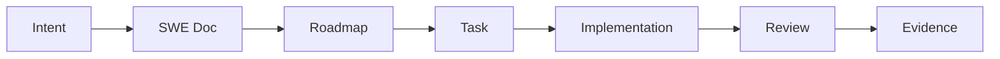

# SYSTEM: Multi-Agent Team Orchestration [L4-Container] AGENT_TEAM_SYSTEM
> 📦 **Visual Node: AGENT_SYSTEM_ROOT**
> metadata: { "color": "#7C4DFF", "icon": "account-group", "label": "Agent Orchestration" }
>
> **Description:** ระบบควบคุมและประสานงานระหว่างมนุษย์ (Human Owner) และ AI Agents (PM, Doc Writer, Auditor, QA) เพื่อให้เกิดการทำงานที่สอดประสานกันผ่านสัญญาการทำงาน (Operating Contracts) และระบบส่งต่องานที่ตรวจสอบย้อนกลับได้ (Traceable Handoff)

---

## 🎯 SECTION 1: SRD (Vision & Goals) [L3-Sector] AGENT_TEAM_SYSTEM::SRD
> 👁️ **Visual Node: AGENT_SRD**
> metadata: { "color": "#2196F3", "icon": "target", "link_to": "[[UGB::AGENT_TEAM_SYSTEM]]", "label": "Orchestration Vision" }

### MISSION Statement
เปลี่ยน "การสั่งงาน Agent แบบสุ่ม" ให้เป็น "กระบวนการทางวิศวกรรมที่ควบคุมได้" ผ่านระบบ Governance ที่เข้มงวดและการจำกัดขอบเขต Context

### CORE PRINCIPLES
- **Contract-Based Operation:** Agent ทุกตัวต้องทำงานภายใต้บทบาท (Role) และ SSOT ที่กำหนดไว้ใน AGENTS.md
- **Human-in-the-Loop:** มนุษย์เป็นผู้ตัดสินใจหลักในจุดวิกฤต (Approval Gates)
- **Zero-Trust Context Scaling:** Agent จะได้รับเฉพาะข้อมูลที่จำเป็นตามระดับ H-Tier ของงานเท่านั้น

---

## 📋 SECTION 2: SRS (Functional Requirements) [L3-Sector] AGENT_TEAM_SYSTEM::SRS
> 📝 **Visual Node: AGENT_SRS**
> metadata: { "color": "#4CAF50", "icon": "clipboard-list", "link_to": "[[AGENT_TEAM_SYSTEM::SRD]]", "label": "Orchestration Requirements" }

### Functional Requirements
- **FR-1 (Role-Based Delegation):** ระบบต้องสามารถจ่ายงานให้ Agent ตามความเชี่ยวชาญ (PM, QA, Auditor)
- **FR-2 (Traceable Handoff):** ทุกการส่งต่องานต้องมีการแนบ Artifact, Review Status และ Verification Evidence
- **FR-3 (Access Governance):** ใช้ RBAC สำหรับมนุษย์ และ ABAC สำหรับ Agent ในการเข้าถึงทรัพยากร
- **FR-4 (Context Injection):** ระบบต้องฉีดพ่น (Inject) บริบทตามลำดับ: 1. Operating Contract -> 2. SSOT Docs -> 3. Implementation Files

---

## 🏗️ SECTION 3: SDD (Architecture & Design) [L3-Sector] AGENT_TEAM_SYSTEM::SDD
> 🏗️ **Visual Node: AGENT_SDD**
> metadata: { "color": "#9C27B0", "icon": "tournament", "link_to": "[[AGENT_TEAM_SYSTEM::SRS]]", "label": "Workflow Architecture" }

### Canonical Artifact Chain Flow


### Agent Role Matrix (Hub-and-Spoke)
- **LYRA (PM):** Decomposition Hub (WBS Axis)
- **THESEUS (Doc):** Knowledge Hub (Documentation SSOT)
- **ATHER (Auditor):** Compliance Hub (Traceability Gate)
- **GHOST (QA):** Verification Hub (E2E/Visual Gate)

---

## 🔧 SECTION 4: SPEC (Technical Specification) [L3-Sector] AGENT_TEAM_SYSTEM::SPEC
> 🛠️ **Visual Node: AGENT_SPEC**
> metadata: { "color": "#FF9800", "icon": "code", "link_to": "[[AGENT_TEAM_SYSTEM::SDD]]", "label": "Event & ABAC Specs" }

### Agent Contract Schema (Minimal Spoke Metadata)
```yaml
id: "[[AGENT::{{AGENT_NAME}}]]"
block_id: "[[UGB::AGENT_TEAM_SYSTEM]]"
role: "orchestrator | planner | worker | validator"
context_scaling_tier: "H0-H4"
status: "active"
```

### Mission Event Schema (Handover)
- **Event:** `AGENT_HANDOVER`
- **Payload:** `{ from_id, to_id, task_id, artifact_links: [], evidence: {} }`

---

## 🛡️ SECTION 5: AUDIT (Governance & Traceability) [L3-Sector] AGENT_TEAM_SYSTEM::AUDIT
> 🛡️ **Visual Node: AGENT_AUDIT**
> metadata: { "color": "#F44336", "icon": "shield-check", "link_to": "[[UGB::AGENT_TEAM_SYSTEM]]", "label": "Audit Gates" }

### Compliance Gates
- [ ] **Source Document Gate:** งาน C-2/C-3 ต้องมีเอกสารอนุมัติก่อนเริ่ม
- [ ] **ABAC Check:** Agent ต้องไม่สามารถเข้าถึงไฟล์นอกเหนือจาก H-Tier ที่กำหนด
- [ ] **Verification Evidence:** งานจะไม่ถือว่าเสร็จ (Done) หากขาดหลักฐานการตรวจสอบจาก GHOST หรือ ATHER
