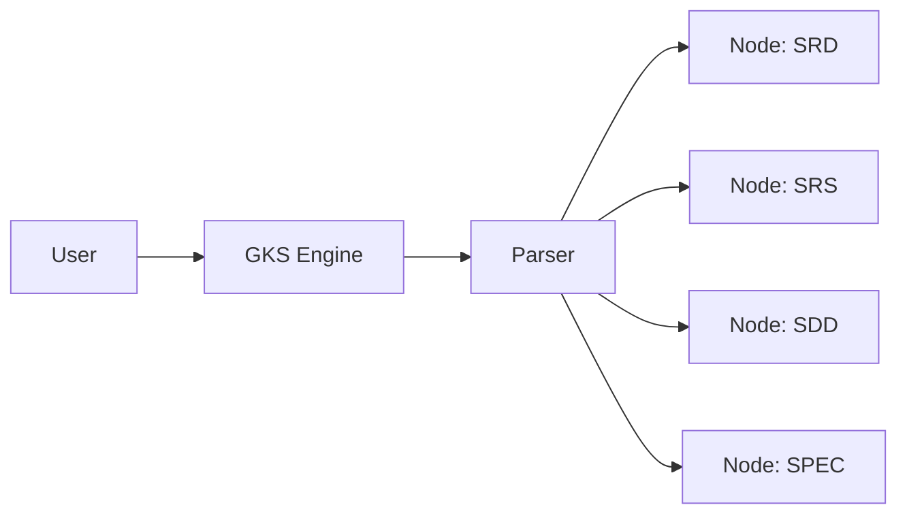

# SYSTEM: Genesis Knowledge System [L4-Container] GKS_CORE
> 📦 **Visual Node: GKS_ROOT**
> metadata: { "color": "#00E5FF", "icon": "brain-circuit", "label": "GKS Core Engine" }
>
> **Description:** ระบบแกนกลางที่เปลี่ยนเอกสาร Markdown ให้เป็นโครงสร้างกราฟความรู้ (Atomic Graph) เพื่อให้ Agent ทำงานได้อย่างแม่นยำและมีประสิทธิภาพ

---

## 🎯 SECTION 1: SRD (Vision & Goals) [L3-Sector] GKS_CORE::SRD
> 👁️ **Visual Node: GKS_SRD**
> metadata: { "color": "#2196F3", "icon": "target", "link_to": "[[UGB::GKS_CORE]]", "label": "Vision & Goals" }

### MISSION Statement
สร้าง SSOT ที่เชื่อมโยงระหว่าง "เนื้องานทางธุรกิจ" (WBS) และ "โค้ดจริง" (Physical Implementation) ผ่านระบบกราฟที่มีความหน่วงต่ำและความแม่นยำสูง

### CORE PRINCIPLES
- **Axiomatic SSOT:** ความจริงสูงสุดเพียงหนึ่งเดียว
- **Context Scaling (H0-H6):** การจำกัดวงความรู้ตามความเหมาะสมของงาน
- **Metadata Hub-and-Spoke:** การสืบทอด Metadata เพื่อลด Token Noise

---

## 📋 SECTION 2: SRS (System Requirements) [L3-Sector] GKS_CORE::SRS
> 📝 **Visual Node: GKS_SRS**
> metadata: { "color": "#4CAF50", "icon": "clipboard-list", "link_to": "[[GKS_CORE::SRD]]", "label": "Requirements" }

### Functional Requirements
- **FR-1 (Atom Parsing):** ต้องสามารถแยก Atoms ออกจากไฟล์กายภาพเดียวผ่าน Regex
- **FR-2 (Tier Enforcement):** ต้องจำกัดการเข้าถึงไฟล์ (File System Scoping) ตามค่า Tier H0-H6
- **FR-3 (Inheritance):** ต้องรองรับการดึงค่า Metadata จาก `block_id` มาฉีดลงในอะตอมย่อย

---

## 🏗️ SECTION 3: SDD (System Design) [L3-Sector] GKS_CORE::SDD
> 🏗️ **Visual Node: GKS_SDD**
> metadata: { "color": "#9C27B0", "icon": "tournament", "link_to": "[[GKS_CORE::SRS]]", "label": "Architecture" }

### Chain-Driven Atom Compaction Model
GKS จะมองเห็นเอกสารนี้เป็น 4 Nodes ย่อยที่ร้อยเรียงกัน (Chain):
`GKS_ROOT` ➔ `GKS_SRD` ➔ `GKS_SRS` ➔ `GKS_SDD` ➔ `GKS_SPEC`

### Context Flow Diagram

---

## 🔧 SECTION 4: SPEC (Technical Specification) [L3-Sector] GKS_CORE::SPEC
> 🛠️ **Visual Node: GKS_SPEC**
> metadata: { "color": "#FF9800", "icon": "code", "link_to": "[[GKS_CORE::SDD]]", "label": "Technical Specs" }

### Regex Pattern (Atom Extraction)
`^#\s(?P<type>[A-Z]+):\s(?P<name>.+)\s\[(?P<layer>L\d-.+)\]\s(?P<id>[A-Z0-9_--]+)`

### Context Tier Map (Access Rules)
| Tier | Restriction | Role |
|---|---|---|
| **H0** | Single File | Subtask/PR |
| **H1** | 1-Hop Import | Implementation |
| **H3** | Module-wide | Integration |

---

## 🛡️ SECTION 5: AUDIT (Traceability & Safety) [L3-Sector] GKS_CORE::AUDIT
> 🛡️ **Visual Node: GKS_AUDIT**
> metadata: { "color": "#F44336", "icon": "shield-check", "link_to": "[[UGB::GKS_CORE]]", "label": "Governance" }

- [ ] **Acyclic Check:** ตรวจสอบวงจรกราฟ
- [ ] **Compaction Check:** ตรวจสอบความลึกของเลเยอร์ (Max L7)
- [ ] **Metadata Hub Validation:** `block_id` ต้องชี้กลับมาที่ GKS_CORE
