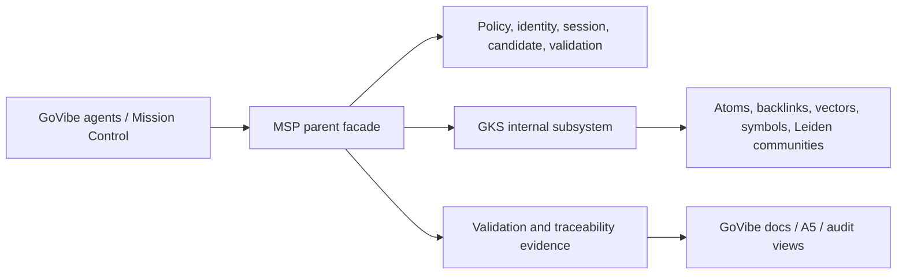

# CR: MSP/GKS Integration as GoVibe Traceability Gate

## 1. Change Request

```yaml
change_requested: "Evaluate and adopt MSP/GKS as the dependency-map, backlink, symbol graph, and memory gate for GoVibe governance."
reason: "GoVibe currently has documentation governance rules and visual surfaces, but no enforceable dependency graph gate that catches missing PRD/ADR/FEAT/SDD/code-symbol links before commit."
business_value: "Reduce missed governance artifacts, prevent scope drift, reuse existing MSP/GKS validation and MCP tooling, and avoid rebuilding a parallel traceability graph."
affected_requirement:
  - "SYSTEM-09::Traceability-Audit-Verification-System"
  - "SYSTEM-05::Agent-Team-Management-System"
  - "SYSTEM-08::Genesis-Knowledge-System"
affected_tasks:
  - "Define GoVibe-to-MSP/GKS taxonomy mapping."
  - "Decide whether MSP/GKS remains a package dependency or becomes a separate internal service."
  - "Route GoVibe validation through MSP-facing tools instead of direct GKS calls."
  - "Expose MSP/GKS evidence in Mission Control only as provenance, not as fake live execution."
timeline_impact: "New architecture/refinement slice before implementation; no immediate product UI expansion."
resource_impact: "Requires ARCHON, ATHER, LYRA, THESEUS, KIN, GHOST, and JANUS feedback before approval."
risk_impact: "Medium-to-high governance architecture impact; potential coupling, taxonomy drift, and deployment-boundary decisions."
what_moves_out: "Custom GoVibe-only dependency graph implementation should move out of v1 unless MSP/GKS fit is rejected."
approval_owner: "ARCHON with human owner approval"
decision: "approved_option_a_via_adr_014"
```

## 2. Current Understanding

MSP/GKS already provides much of the capability GoVibe is missing:

- MSP is the parent/orchestrator and agent-facing gatekeeper.
- GKS is the knowledge storage, backlink, graph, vector, and symbol subsystem.
- MSP exposes MCP tools such as `msp_validate`, `msp_candidate`, `msp_backlinks_rebuild`, `msp_symbol_trace`, and `msp_symbol_community`.
- MSP already has session memory, episodic memory, candidate write boundaries, retrieval orchestration, symbol graph tooling, and Leiden community detection.
- The observed boundary is: agents should call MSP; MSP may call GKS internally.

## 3. Proposed Direction

Adopt MSP as a GoVibe governance adapter first, not as a separate microservice in v1.



MSP should be the only agent-facing boundary. GKS should remain internal to MSP unless ARCHON approves a later service split.

External references in this CR are local evidence paths from the current workstation only. They must not become runtime configuration, CI configuration, or hardcoded GoVibe dependency paths.

## 4. Architecture Options

| Option | Description | Pros | Risks | Recommendation |
|---|---|---|---|---|
| A. Adapter reuse | GoVibe calls MSP MCP/CLI tools while MSP owns GKS calls. | Lowest cost, preserves parent gate, avoids duplicate graph. | Requires taxonomy mapping and config. | Recommended for v1. |
| B. Copy-and-develop slice | Copy selected MSP/GKS modules into GoVibe and adapt locally. | Independent evolution, no runtime external dependency. | Fork drift, duplicated maintenance, unclear upstream. | Only if adapter reuse is blocked. |
| C. MSP service + internal GKS package | Run MSP as a local/internal service, GKS remains library/subsystem. | Clear runtime boundary, still simple. | Dev-server/service lifecycle complexity. | Future option after v1. |
| D. MSP service + GKS service | Split both into separate services. | Strong scaling/deployment isolation. | Premature distributed-system cost, public GKS bypass risk. | Not recommended now. |

## 5. Agent Model And Role Routing

| Agent | Fleet Role | Model / Executor | Feedback Type | Decision Authority |
|---|---|---|---|---|
| ARCHON | CTO / Architecture Governor | Codex, plan mode | Architecture boundary, package vs service decision, C-3/H4 classification | Final technical recommendation; human owner still approves |
| ATHER | Auditor | Codex or local tiny audit model | Traceability gates, protected source policy, validation evidence | Can block done state |
| LYRA | PM / Planning Owner | Codex or local default plan model | Scope, roadmap sequencing, what moves out, approval routing | Owns change-control routing |
| THESEUS | Technical Documentation Engineer | Codex or local default doc model | Doc taxonomy mapping, CR/ADR/FEAT/SDD alignment | Drafts docs; cannot approve scope |
| KIN | Backend and Integration Engineer | Codex plan mode | MSP/GKS integration contract, CLI/MCP invocation, data shape | Reviews integration feasibility |
| GHOST | QA Automation and Release Verification Engineer | Codex or local default audit model | Acceptance tests, validation smoke, A5 evidence display | Can fail verification |
| JANUS | DevOps and Environment Reliability Engineer | Codex or local retry/atomic model | Service lifecycle, scripts, CI/pre-commit feasibility | Reviews operational risk |

## 6. Feedback Questions

Each agent should answer only these points:

```yaml
agent_id:
role:
recommendation: approve | approve_with_changes | reject | blocked
reason:
top_risks:
required_changes_before_approval:
what_should_move_out:
verification_required:
```

Role-specific prompts:

- ARCHON: Should MSP/GKS stay as modular monolith/package dependency for v1, or become internal service now?
- ATHER: Which MSP/GKS gates are mandatory before GoVibe can claim traceability done?
- LYRA: What scope should move out if MSP/GKS integration enters the roadmap?
- THESEUS: What GoVibe docs need mapping to MSP atom taxonomy before implementation?
- KIN: Which interface should GoVibe call first: MSP MCP tools, MSP CLI scripts, or package API?
- GHOST: What acceptance evidence proves MSP/GKS caught missing PRD/ADR/backlink issues?
- JANUS: What build/CI/pre-commit work is required before using MSP/GKS as a gate?

## 6.1 Feedback Status

Feedback was collected from ARCHON, ATHER, LYRA, THESEUS, KIN, GHOST, and JANUS through role-simulated Gemini CLI review. All reviewers returned `approve_with_changes`.

Feedback summary is recorded in `docs/change-requests/feedback/CR-2026-06-14-MSP-GKS-GoVibe-Integration-feedback.md`.

Common required refinements:

- Define GoVibe-to-MSP/GKS taxonomy mapping.
- Choose the v1 interface, with MSP MCP tools preferred by KIN.
- Define mandatory gates and hard-fail/soft-fail behavior.
- Prevent direct agent-facing GKS access.
- Remove hardcoded local paths from any future runtime or CI configuration.
- Defer custom GoVibe-only graph implementation unless MSP/GKS is rejected.

## 7. Acceptance Criteria

- Feedback is collected from ARCHON, ATHER, LYRA, THESEUS, KIN, GHOST, and JANUS or explicitly marked unavailable.
- Decision records distinguish MSP parent boundary from GKS subsystem boundary.
- No GoVibe implementation begins until ARCHON and human owner approve the chosen option.
- If approved, follow-up docs include ADR, FEAT/SDD updates, and validation plan.
- GKS is not exposed as a direct public agent-facing surface unless explicitly approved.

## 8. Success Criteria

- GoVibe avoids rebuilding a duplicate traceability graph if MSP/GKS is suitable.
- Missing parent artifacts such as PRD/ADR become detectable through a graph/validation gate.
- Agents can cite validation evidence instead of relying on checklist memory.
- Mission Control can display MSP/GKS provenance without implying fake live execution.

## 9. Definition Of Done

- CR is reviewed by required agents.
- Feedback summary is attached or linked.
- ARCHON records the recommended architecture option.
- ATHER confirms traceability and validation requirements are explicit.
- LYRA records scope movement and approval owner.
- Human owner approves, rejects, or requests refinement.

## 10. Out Of Scope

- Migrating GoVibe docs into MSP/GKS atoms in this CR.
- Running MSP/GKS as production microservices.
- Replacing GoVibe's current docs validator.
- Editing protected human-dev source under `.agents/Visual-Agent-Fleet-Scope/`.
- Exposing GKS directly to agents without MSP.

## 11. Resolution

All "Required Changes Before Approval" from the feedback (§3) are resolved via
`docs/adr/ADR-014-MSP-GKS-Traceability-Gate.md`:

- **Taxonomy mapping** — exists at `docs/architecture/MSP-GKS-Taxonomy-Mapping.md` and is
  cited by ADR-014 for per-artifact mapping confidence and adapter treatment.
- **v1 interface** — fixed as MSP MCP tools first (KIN's preference), with CLI scripts and
  package API as fallbacks (ADR-014 Decision §2).
- **Mandatory gates** — defined as a per-artifact-type gate matrix (PRD, ADR, FEAT, SDD,
  agent context, registry metadata, code symbols) with enforced link/validation and stage
  (ADR-014 Decision §3).
- **Fail policy** — hard-fail (missing parent link blocks), soft-fail with logged bypass
  (MSP/GKS unavailable), and bypass logging are all defined (ADR-014 Decision §4).
- **CI-safe discovery** — mandated via environment variable or package resolution only;
  no absolute local paths; the CR `external_refs` are workstation evidence, not config
  (ADR-014 Decision §5).
- **Deferrals** — custom GoVibe-only graph deferred unless MSP/GKS is rejected; rich Mission
  Control provenance UI deferred until the gate is stable; Mission Control shows MSP/GKS as
  provenance only, never fake live execution (ADR-014 Decision §6).

GKS remains internal behind MSP and is not exposed directly to agents (ADR-014 Decision §1).
The GoVibe human owner approved Option A on 2026-06-21. Implementation is tracked as a
follow-up FEAT and is gated by the ADR-014 validation plan (POC plus negative/positive link
tests, failure-mode test, CI discovery check, and UI provenance check); traceability is not
"done" until that plan passes.

## Changelog

| Version | Date | Owner | Summary |
|---|---|---|---|
| 0.2.0 | 2026-06-21 | LYRA | Approved Option A via ADR-014; recorded resolution of all reviewer required-changes and human-owner approval. |
