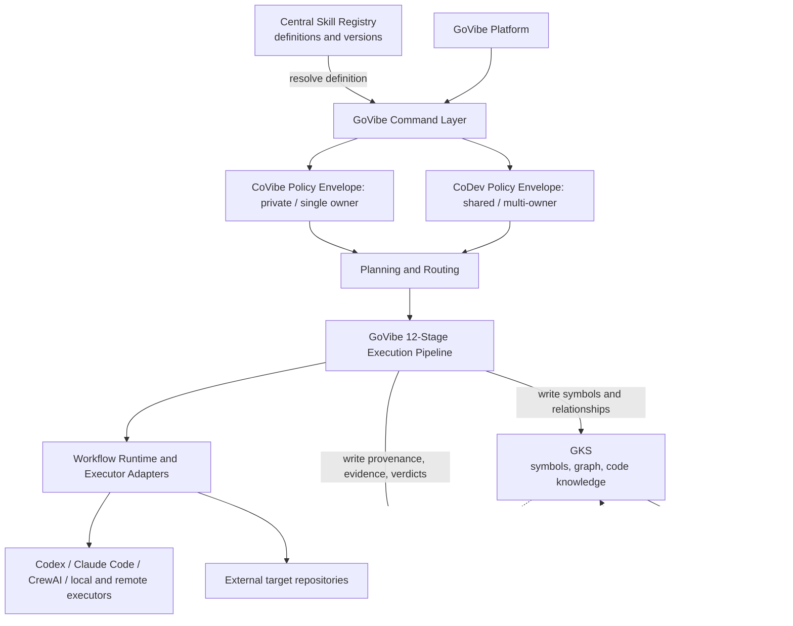

# CR: Absorb RWANG Capabilities into GoVibe

## 1. Owner Direction

GoVibe is the product, command namespace, and routing authority. RWANG must not
remain a product, personal agent, execution provider, or renamed runtime layer
inside the target architecture.

RWANG is a migration source only. Its reusable capabilities will be absorbed
into GoVibe-owned modules, then the RWANG identity and repository will be
retired after parity and provenance gates pass.

CoVibe and CoDev expose the same GoVibe capability set:

- **CoVibe** is the private, single-owner collaboration envelope.
- **CoDev** is the shared, multi-owner/team collaboration envelope with shared
  vaults, scoped authority, handoffs, review, and audit.

They differ by authority and collaboration policy, not by available skills.

The owner assigns the absorbed capability boundaries as follows:

1. The **Central Skill Registry** owns versioned skill definitions.
2. **GoVibe** executes the canonical 12-stage Block Decomposition pipeline.
3. **GKS** owns symbols, graph relationships, and code knowledge.
4. **MSP** owns provenance, evidence, and verification records.

Definitions, execution, knowledge, and proof must not collapse into one module.

## 2. Complexity and Risk

- **Complexity:** C-3, architecture-driven migration.
- **Risk:** HIGH.
- **Reason:** Cross-repository capability movement, public command rename,
  runtime ownership changes, governance reconciliation, storage boundaries,
  and eventual repository retirement.
- **Current gate:** Approved by the human product authority on 2026-07-29.
  Implementation is authorized through the vertical slice ending at
  `GoVibe:init`, `GoVibe:continue`, and `GoVibe:scan`. `GoVibe:plan`, P0-P6,
  UI cutover, and RWANG retirement remain separately gated.

## 3. Current Capability Inventory

### 3.1 Public RWANG skills

| Current skill | Current responsibility | Target ownership |
|---|---|---|
| `rwang` | init, scan, plan, continue, status, impact, version | Central Skill Registry definitions; GoVibe execution |
| `rwang-review` | read-only architecture and implementation review | Central Skill Registry definition; GoVibe execution |
| `rwang-optimize` | measured optimization with architecture gates | Central Skill Registry definition; GoVibe execution |

Current GoVibe repository truth: `scripts/mcp/registry.mjs` is an MCP tool and
resource catalog. It is not yet a Central Skill Registry because it has no
immutable skill versions, stage hooks, permission contract, or definition
resolution API. This CR must not relabel that file without implementing and
testing the missing contract.

### 3.2 Runtime capabilities

| Current area | Representative source | Target GoVibe owner |
|---|---|---|
| Skill definitions | external `RWANG-PROMAX` bundle | Central Skill Registry |
| 12-stage Block Decomposition | skill references and scan pipeline | GoVibe execution runtime |
| Task state and waves | `engine.mjs`, `auto-wave.mjs` | Shared workflow runtime |
| Planning and tiering | `planner.mjs` | Shared planning/routing service |
| Provider dispatch | `providers.mjs`, account modules | Shared executor adapter service |
| Symbol, graph, and code knowledge | `gks/` and decomposition outputs | GKS |
| Provenance, evidence, and verification | governance checks, runs, readers | MSP |
| Knowledge persistence | `store/` | GKS/MSP ports plus GenesisBlockDB adapter |
| Control UI | `studio/`, `src-tauri/`, `monitor/` | GoVibe surfaces after product review |
| Contracts and routing core | `packages/contracts`, `packages/core` | GoVibe shared packages |

This map assigns capabilities, not files. File movement is prohibited until
the target contracts are approved.

## 4. Target Architecture

The arrows above express **logical write ownership**, not a required deployment
or transport topology. An accepted MSP facade may mediate a GKS write, but the
resulting symbol/graph/code-knowledge record is still canonically owned by GKS.
Likewise, MSP remains the canonical owner of provenance/evidence/verification
even if its persistence is delegated through a storage adapter.

Dependency rules:

1. The Skill Registry defines skills but never executes them.
2. GoVibe resolves an immutable definition version before executing a skill.
3. GoVibe commands do not import CoVibe- or CoDev-specific implementations.
4. CoVibe and CoDev select a policy envelope around the same commands.
5. GoVibe owns stage order, state transitions, retries, and stage completion.
6. GKS owns symbols, graph edges, code knowledge, and knowledge query contracts.
7. MSP owns provenance lineage, execution evidence, verification results, and
   audit records.
8. GKS stores only an MSP `provenance_ref`; MSP stores only a GKS
   `knowledge_ref`. Neither duplicates the other's canonical record.
9. Shared runtime code does not depend on the RWANG name or repository path.
10. GenesisBlockDB stores/queries data but does not own product semantics.
11. Target repositories remain external.
12. Executor adapters remain swappable; GoVibe must run without any one vendor.

## 5. Command Mapping

Human-facing aliases and machine-facing MCP tools are separate API surfaces.

| Current alias | Target human alias | Proposed MCP tool | Notes |
|---|---|---|---|
| `RWANG:init` | `GoVibe:init` | `govibe.workspace.initialize` | Existing MCP tool; reconcile behavior |
| `RWANG:scan` | `GoVibe:scan` | `govibe.workspace.scan` | New contract required |
| `RWANG:plan` | `GoVibe:plan` | `govibe.plan.create` | New contract required |
| `RWANG:continue` | `GoVibe:continue` | `govibe.workflow.continue` | New contract required |
| `RWANG:status` | `GoVibe:status` | `govibe.workflow.status` | New contract required |
| `RWANG:impact` | `GoVibe:impact` | `govibe.workspace.impact` | New contract required |
| `RWANG:version` | `GoVibe:version` | `govibe.docs.version` | Reconcile with docs tools |
| review skill | `GoVibe:review` | `govibe.review.run` | Must preserve read-only mode |
| optimize skill | `GoVibe:optimize` | `govibe.optimize.run` | Must preserve measurement gates |

`GoVibe:build`, `GoVibe:test`, and `GoVibe:deploy` may be composed from the
shared runtime after their contracts are reviewed. They are not created by
this CR automatically.

## 6. Routing Policy

Routing precedence:

1. Apply governance and authority constraints.
2. Honor explicit user choice when the selected executor is allowed.
3. Select the CoVibe or CoDev collaboration envelope.
4. Resolve the requested skill and immutable version from the Central Skill
   Registry.
5. Classify task complexity and risk.
6. Run the applicable canonical stages in GoVibe.
7. Write symbols, relationships, and code knowledge to GKS.
8. Write provenance, evidence, and verification to MSP.
9. Select bounded executor adapters for stage work where required.

GoVibe routes work. CoVibe and CoDev constrain who may participate and approve.
Executors perform bounded actions; they do not become product identity.

## 7. Migration Dependencies

| Dependency | Why it blocks movement | Required decision/evidence |
|---|---|---|
| Central Skill Registry schema | Separates definitions from runtime behavior | IDs, versions, schemas, permissions, stage hooks, verification requirements |
| Central Skill Registry topology | No implementation currently exists in GoVibe | Approve package/service location without treating MCP `toolCatalog` as the registry |
| 12-stage execution contract | Prevents stage rename/reorder and false completion | Canonical order, state, N/A, incomplete, retry, and completion rules |
| GKS write contract | Prevents knowledge from leaking into evidence storage | Symbol/node/edge/code-knowledge schemas plus `provenance_ref` |
| MSP proof contract | Prevents proof from being split across runtime and GKS | Provenance/evidence/verification schemas plus `knowledge_ref` |
| GKS transport topology | Existing ADRs may route GKS through MSP | Preserve logical GKS ownership whether the write is direct or MSP-mediated |
| Command contract versioning | Prevents aliases and MCP tools from drifting | Versioned input/output/error schemas |
| CoVibe/CoDev authority model | Same skill can have different write/approval rights | Private vs shared policy matrix |
| GenesisBlockDB port | Removes workstation-specific path coupling | Portable adapter and degraded mode |
| Provider adapter contract | Prevents Codex/Claude/CrewAI lock-in | Capability, health, dispatch, evidence contract |
| Host-skill distribution | Current commands ship from another repository | New source, compatibility period, uninstall path |
| UI disposition | RWANG Studio may overlap Mission Control | Product review before moving UI code |
| Repository provenance | History must remain auditable | Migration map and source commit ledger |

## 8. Atomic Implementation Tasks

### T01 - Reconcile GoVibe architecture documents

- **Objective:** Replace the stale “RWANG as external provider” model with the
  approved four-owner model and align CoVibe/CoDev definitions.
- **Allowed files:** `docs/architecture/`, `docs/features/agent-team/`,
  `docs/PRD-GoVibe-Platform-Overview.md`, affected ADR proposals, and
  `docs/DOC-VERSION-REGISTRY.md`.
- **Forbidden files:** Runtime source, tests, package manifests, `G:/Rwang`.
- **Dependencies:** Approval of this CR.
- **Acceptance criteria:** No canonical GoVibe document identifies RWANG as a
  target product/runtime/provider; all canonical docs assign definition to the
  Skill Registry, execution to GoVibe, knowledge to GKS, and proof to MSP;
  CoVibe and CoDev expose equal capabilities.
- **Verification commands:** `npm run docs:validate`;
  `rg -n "RWANG|Skill Registry|12-stage|GKS|MSP" docs`.
- **Risk level:** HIGH.
- **Recommended worker:** Repository-aware Codex with architecture reviewer.

### T02 - Define the Central Skill Registry contract

- **Objective:** Define immutable, versioned skill definitions independently
  from GoVibe execution.
- **Allowed files:** Approved registry package/docs, `docs/api/`, `docs/specs/`,
  registry schema tests.
- **Forbidden files:** Stage runners, executor adapters, GKS/MSP
  implementations, UI, `G:/Rwang`.
- **Dependencies:** T01.
- **Acceptance criteria:** Definition includes ID, version, input/output/error
  schemas, permissions, stage hooks, and verification requirements; registry
  cannot dispatch or execute; resolution is deterministic and version-pinned.
- **Verification commands:** `npm run docs:validate`; `npm run test -- registry`;
  `git diff --check`.
- **Risk level:** HIGH.
- **Recommended worker:** Repository-aware Codex.

### T03 - Publish GoVibe command contracts

- **Objective:** Map init, scan, plan, continue, status, impact, version,
  review, and optimize to registry definitions and versioned MCP contracts.
- **Allowed files:** `docs/api/`, `docs/specs/`, `scripts/mcp/registry.mjs`,
  MCP contract tests.
- **Forbidden files:** Stage implementations, provider adapters, UI, storage
  engines, `G:/Rwang`.
- **Dependencies:** T02.
- **Acceptance criteria:** Every human alias resolves one registered skill and
  one MCP entry; contracts define typed errors, permissions, run references,
  and degraded states without embedding execution logic.
- **Verification commands:** `npm run mcp:smoke`; `npm run test -- mcp`;
  `npm run docs:validate`.
- **Risk level:** HIGH.
- **Recommended worker:** Repository-aware Codex.

### T04 - Implement the GoVibe 12-stage execution pipeline

- **Objective:** Make GoVibe own orchestration of canonical Stage 1-12:
  Scan, Structure, Markdown Parse, COBOL Parse, Symbolic Parse, Routes, Tools,
  ORM, Cross-File Resolution, MRO, Communities, and Processes.
- **Allowed files:** Approved GoVibe execution package, stage contracts,
  fixtures, stage/state tests.
- **Forbidden files:** Central Registry implementation, GKS/MSP storage
  internals, UI, target repositories.
- **Dependencies:** T02, T03.
- **Acceptance criteria:** Stage order cannot silently change; every stage
  records input, method, output refs, exclusions, confidence, and status;
  unsupported stages use evidenced `not_applicable`; unavailable stages remain
  `incomplete`; resume is idempotent; GoVibe cannot claim completion unless all
  stages are complete/N/A and graph validation passes.
- **Verification commands:** `npm run test -- stage`; `npm run test -- workflow`;
  `npm run lint`.
- **Risk level:** HIGH.
- **Recommended worker:** Repository-aware Codex.

### T05 - Implement the GKS knowledge writer

- **Objective:** Write symbols, graph edges, and code knowledge produced by
  GoVibe stages into GKS.
- **Allowed files:** GKS contracts/adapters, knowledge fixtures, GKS-focused
  tests and related docs.
- **Forbidden files:** MSP evidence records, executor adapters, UI,
  GenesisBlockDB core internals.
- **Dependencies:** T04 and approved GKS write contract.
- **Acceptance criteria:** GKS receives versioned symbol/node/edge/knowledge
  records; each record may carry an MSP `provenance_ref` but not duplicated
  provenance/evidence payloads; unresolved graph edges remain explicit.
- **Verification commands:** `npm run test -- gks`; `npm run lint`;
  temporary-workspace graph integration test.
- **Risk level:** HIGH.
- **Recommended worker:** Repository-aware Codex with graph/data reviewer.

### T06 - Implement the MSP proof writer

- **Objective:** Write canonical provenance, execution evidence, verification
  results, and audit records into MSP.
- **Allowed files:** MSP adapter/contract modules, proof fixtures, redaction and
  verification tests, related docs.
- **Forbidden files:** GKS symbol/graph payloads, executor secrets, UI,
  target repositories.
- **Dependencies:** T04, approved MSP proof contract, stable GKS reference
  format.
- **Acceptance criteria:** Every stage/run has immutable provenance and evidence
  records; verification states are actual, blocked, failed, or passed, never
  inferred; records may carry `knowledge_ref` but do not duplicate GKS data;
  sensitive data is redacted.
- **Verification commands:** `npm run msp:evidence`; `npm run test -- msp`;
  redaction and tamper tests.
- **Risk level:** HIGH.
- **Recommended worker:** Repository-aware Codex with governance/security
  reviewer.

### T07 - Integrate GenesisBlockDB through storage ports

- **Objective:** Provide portable persistence for GKS and MSP without giving
  GenesisBlockDB semantic or proof ownership.
- **Allowed files:** Approved ports/adapters, semantic contracts, migrations,
  focused integration tests, related docs.
- **Forbidden files:** Hardcoded workstation paths, GenesisBlockDB core
  internals unless separately approved, target repositories.
- **Dependencies:** T05, T06, storage contract.
- **Acceptance criteria:** No absolute local dependency path; storage failure
  produces an explicit degraded state; GKS and MSP retain logical ownership;
  migrations are reversible or have a documented rollback.
- **Verification commands:** Contract tests; temporary-directory integration
  test; storage-unavailable test; migration dry-run.
- **Risk level:** HIGH.
- **Recommended worker:** Repository-aware Codex with data/governance review.

### T08 - Port planning and workflow state

- **Objective:** Absorb plan, continue, status, task dependency, wave,
  checkpoint, and retry behavior into GoVibe.
- **Allowed files:** Approved planning/workflow packages and focused tests.
- **Forbidden files:** Registry definitions, GKS/MSP internals, UI, target
  repositories.
- **Dependencies:** T04-T06.
- **Acceptance criteria:** State transitions are deterministic; resume is
  idempotent; invalid dependency graphs fail closed; knowledge and proof writes
  use their respective ports; no RWANG imports or public names remain.
- **Verification commands:** `npm run test -- workflow`; pause/resume smoke;
  `npm run lint`.
- **Risk level:** HIGH.
- **Recommended worker:** Repository-aware Codex.

### T09 - Port executor/provider adapters

- **Objective:** Make Codex, Claude Code, CrewAI, local models, and future
  executors interchangeable behind one GoVibe adapter contract.
- **Allowed files:** Shared executor contracts, provider adapters, account
  policy modules, focused tests.
- **Forbidden files:** Registry definitions, GKS/MSP internals, UI, provider
  secrets, target repositories.
- **Dependencies:** T03, T08.
- **Acceptance criteria:** GoVibe boots without RWANG; provider absence has a
  typed degraded state; stage results flow to GKS/MSP ports; secrets are not
  committed.
- **Verification commands:** `npm run test -- adapter`; provider-unavailable
  smoke; redaction tests; `npm run lint`.
- **Risk level:** HIGH.
- **Recommended worker:** Repository-aware Codex with security review.

### T10 - Apply CoVibe and CoDev policy envelopes

- **Objective:** Run the same registry-defined skills under private
  single-owner and shared multi-owner authority policies.
- **Allowed files:** CoVibe/CoDev policy modules, identity/authorization
  contracts, approval tests, feature docs.
- **Forbidden files:** Duplicated skill definitions or runners, GKS/MSP
  internals, target repositories.
- **Dependencies:** T03, T08, T09, MSP identity contract.
- **Acceptance criteria:** Capability parity is proven; CoVibe rejects external
  collaborators; CoDev enforces scoped access, handoff, approval, and audit;
  policy override precedence is deterministic.
- **Verification commands:** `npm run test -- policy`; unauthorized access
  tests; cross-owner approval tests.
- **Risk level:** HIGH.
- **Recommended worker:** Repository-aware Codex with governance/security
  reviewer.

### T11 - Port review and optimize skills

- **Objective:** Register and run read-only review and measured optimization as
  GoVibe skills after core contracts stabilize.
- **Allowed files:** Central Registry entries, GoVibe review/optimization
  runners, fixtures, tests.
- **Forbidden files:** Product code unrelated to these skills, target
  repository content, archived RWANG names in public APIs.
- **Dependencies:** T02-T10.
- **Acceptance criteria:** Review cannot write; optimize requires baseline and
  post-change measurement; both write knowledge to GKS only when applicable
  and all proof to MSP.
- **Verification commands:** Read-only guard tests; baseline comparison tests;
  registry validation; `npm run test`.
- **Risk level:** MEDIUM.
- **Recommended worker:** Repository-aware Codex; prompt copy may be drafted by
  ChatGPT/manual worker and must be repository-reviewed.

### T12 - UI disposition and Mission Control integration

- **Objective:** Decide which RWANG Studio/monitor concepts belong in GoVibe
  Mission Control and integrate only approved surfaces.
- **Allowed files:** Approved GoVibe UI routes/components, UI tests, product
  docs.
- **Forbidden files:** Blind copy of `G:/Rwang/studio` or `src-tauri`, runtime
  contracts, unrelated UI refactors.
- **Dependencies:** T04-T11 and a product UX decision.
- **Acceptance criteria:** No duplicate control plane; all displayed state is
  backed by MSP evidence and references GKS knowledge where required;
  desktop-specific code has an explicit boundary.
- **Verification commands:** `npm run test`; `npm run build`; `npm run e2e`;
  fake-state audit.
- **Risk level:** HIGH.
- **Recommended worker:** Repository-aware Codex plus product/UI reviewer.

### T13 - Parity, cutover, and RWANG retirement

- **Objective:** Cut public commands to GoVibe and retire RWANG only after
  capability, history, and rollback gates pass.
- **Allowed files:** Compatibility shims, migration docs, release notes,
  distribution registry, archival notice.
- **Forbidden files:** Deleting RWANG history, removing rollback before the
  observation window, importing target repositories.
- **Dependencies:** T01-T12.
- **Acceptance criteria:** Command parity matrix passes; clean install works;
  legacy alias emits a bounded deprecation path; no active GoVibe dependency
  references `G:/Rwang`; registry definitions resolve; GoVibe runs all 12
  stages; GKS/MSP ownership tests pass; source commits remain traceable; owner
  approves archive.
- **Verification commands:** Clean-clone install; full test/build suites;
  command parity smoke; `rg -n "RWANG|G:/Rwang|D:/rwang"` in runtime/config;
  rollback rehearsal.
- **Risk level:** HIGH.
- **Recommended worker:** Repository-aware Codex; final grade by owner.

## 9. Worker Allocation

Safe for ChatGPT/manual workers:

- Draft English prompt copy and user-facing command descriptions.
- Build review checklists and capability comparison tables.
- Review terminology after repository evidence has been supplied.
- Prepare release-note prose without changing technical claims.

Requires repository-aware Codex:

- Any source, schema, manifest, test, command registry, or import change.
- Capability extraction and file movement.
- Skill Registry schemas, GoVibe stage execution, GKS/MSP writes,
  authorization, provider, storage, migration, and evidence behavior.
- Git history preservation, compatibility shims, clean-clone verification,
  cutover, and archival.

Manual workers must not infer package paths, test commands, runtime status, or
acceptance evidence.

## 10. Proposed PR Sequence

1. **PR-1: Architecture reconciliation** - T01 only.
2. **PR-2: Central Skill Registry contract** - T02.
3. **PR-3: GoVibe command contracts** - T03.
4. **PR-4: GoVibe 12-stage execution pipeline** - T04.
5. **PR-5: GKS knowledge writer** - T05.
6. **PR-6: MSP proof writer** - T06.
7. **PR-7: GenesisBlockDB storage ports** - T07.
8. **PR-8: Planning and workflow state** - T08.
9. **PR-9: Executor adapter boundary** - T09.
10. **PR-10: CoVibe/CoDev policy envelopes** - T10.
11. **PR-11: Review and optimize skills** - T11.
12. **PR-12: Mission Control integration** - T12.
13. **PR-13: Parity, compatibility, and retirement** - T13.

Each PR must merge only after its focused tests and the unaffected repository
baseline pass. No PR may combine runtime movement with repository retirement.

## 11. Test Strategy

### Contract tests

- Skill definition schema, immutable version resolution, and no-execution
  registry boundary.
- Human alias to registry definition and MCP mapping.
- Canonical 12-stage order and completion contract.
- GKS knowledge-write and MSP proof-write conformance.
- Versioned schemas and typed degraded states.
- Executor and storage adapter conformance.
- Cross-reference stability between `provenance_ref` and `knowledge_ref`.

### Unit and property tests

- Stage order, DAG validity, idempotent resume, deterministic routing.
- Complete/N/A/incomplete stage invariants and false-completion rejection.
- Permission precedence and cross-owner denial.
- Redaction and secret exclusion.
- Symbol/graph/code-knowledge schema and migration invariants.
- Provenance/evidence/verification immutability and tamper detection.

### Integration tests

- CoVibe private workflow through a non-RWANG executor.
- CoDev shared workflow with handoff, review, and approval.
- Registry available/unavailable and pinned-version modes.
- GoVibe 12-stage run writing knowledge to GKS and proof to MSP.
- MSP/GKS/GenesisBlockDB available and unavailable modes.
- Provider loss and recovery.

### Parity and migration tests

- Legacy RWANG command fixture versus target GoVibe command output.
- Legacy Stage 1-12 fixture versus GoVibe stage-state output.
- Clean-clone host-skill installation.
- No absolute source-repository path dependency.
- Compatibility alias warning and rollback rehearsal.
- Negative ownership tests: Registry dispatch is rejected; GKS evidence payload
  is rejected; MSP symbol-graph payload is rejected.

### Product verification

- Mission Control shows only evidence-backed state.
- User-selected routing works when policy allows it.
- GoVibe remains operational when Codex, Claude Code, CrewAI, or any one
  provider is absent.

## 12. Approval Grades

| Grade | Reviewer | Acceptance criteria |
|---|---|---|
| Architecture grade | ARCHON / repository-aware Codex | Skill definition, GoVibe execution, GKS knowledge, and MSP proof boundaries are singular, acyclic, and contain no hidden RWANG layer |
| Governance grade | ATHER | MSP proof ownership, CoVibe/CoDev authority, review gates, degraded states, and retirement controls fail closed |
| Final product grade | Boss | GoVibe is the only product/command identity; the capability set and collaboration modes match owner intent |

## 13. Exit and Rollback Criteria

Final Product Grade was approved by Boss through the explicit implementation
instruction on 2026-07-29. Implementation may start within the vertical-slice
boundary recorded above.

Retirement may start only when:

- All parity tests pass.
- No active GoVibe runtime/config path depends on RWANG.
- Central Skill Registry definitions resolve without executing work.
- GoVibe owns and completes the canonical 12-stage pipeline.
- GKS owns symbol/graph/code knowledge and MSP owns all proof records.
- Clean install and rollback rehearsal pass.
- Migration provenance is published.
- The owner explicitly approves repository archival.

If any parity, authorization, storage, or rollback gate fails, retain RWANG as
a frozen migration source and stop cutover. Do not create a second renamed
runtime layer.

## CHANGELOG

| Version | Date | Status | Summary | Commit Hash | Agent |
|---|---|---|---|---|---|
| 0.2.0 | 2026-07-29 | approved | Owner approved the capability boundaries and authorized the init/continue/scan vertical slice; plan, P0-P6, UI cutover, and retirement remain gated. | pending | ATHER |
| 0.2.0+draft | 2026-07-27 | candidate | Assigned skill definitions to the Central Skill Registry, 12-stage execution to GoVibe, symbol/graph/code knowledge to GKS, and provenance/evidence/verification to MSP; split migration into 13 atomic PR tasks. | pending | ATHER |
| 0.1.0+draft | 2026-07-26 | candidate | Proposed GoVibe-owned capability absorption, command map, atomic tasks, PR sequence, test strategy, and RWANG retirement gates. | pending | ATHER |
