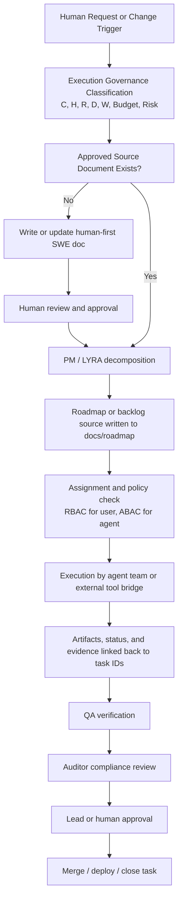

# RUNBOOK: GoVibe Multi-Agent Workflow

## 1. Purpose

Define operational guidance for GoVibe multi-agent execution. This runbook is not a source of truth: `docs/STD-Execution-Governance.md` is the canonical authority for execution-governance semantics.

This runbook explains how a human owner, lead agent, planning agent, execution agents, QA, auditor, and external tool bridges coordinate work from approved document to verified delivery without hardcoding project state or bypassing governance.

## 2. When To Use

Use this runbook when work includes one or more of the following:

- more than one agent or agent team participates
- roadmap, backlog, sprint, task, or assignment state is created or changed
- a human hands work to PM, executor, QA, or auditor agents
- external coding agents such as Claude Code, Gemini CLI, OpenClaw, Hermes, or MCP/API workers are involved
- the team needs a traceable path from source document to verification evidence

## 3. Preconditions

- Product and system intent already exists in approved human-readable SWE docs.
- MemoryOS V3 state management active.
- Work has a declared process complexity level `C-0` to `C-3`.
- Work has a declared Access Scope `H0` to `H4`; H is an executor tool/permission ceiling, not context depth.
- Work declares retrieval radius (`R`), compaction/resolution depth (`D`), fan-out/branching width (`W`), Budget, and Risk as separate axes when applicable.
- Agent-ID governance enforced (ADR-006/007/008).
- Human access is governed by RBAC.
- Agent, subagent, MCP, and service access is governed by ABAC.
- Roadmap state comes from approved `.md` or `.html` documents, parsed payloads, or explicit mission events, not from hardcoded UI arrays.

## 4. Roles

| Role | Primary responsibility |
|---|---|
| Human owner | Defines intent, approves major documents, resolves scope or policy conflicts |
| Lead agent / tech lead | Chooses workflow, validates scope, delegates work, reviews merge readiness |
| PM / LYRA | Creates or updates roadmap, backlog, sprint, task, micro-task, and atomic-task planning artifacts |
| Execution agents / agent teams | Implement approved work, report artifact links, and update task progress |
| QA / GHOST | Verifies design, UX, flows, deployment readiness, and user-visible behavior |
| Auditor / ATHER | Audits SSOT alignment, traceability, governance, and verification completeness |
| Integration bridge | Connects third-party agents and services through API, MCP, webhook, local bridge, or file-based exchange |
| Ollama sidecar | Executes bounded local atomic-task work through registry-driven context injection |

## 5. Operational Artifact Chain

The multi-agent system must preserve this chain:

```text
intent
  -> approved product/system/feature doc
  -> roadmap or backlog artifact
  -> assigned task
  -> implementation artifact
  -> review artifact
  -> verification evidence
```

If any link is missing, the work is not considered complete.

## 6. Workflow Overview



## 7. Standard Procedure

### Step 1 - Intake and classification

The lead agent or human owner classifies the work using the execution governance standard:

- `C-0` or `C-1` for direct work with narrow scope
- `C-2` when documentation must be reviewed before implementation
- `C-3` when architecture, diagram, or cross-system design work is involved

The same intake must also declare:

- Access Scope `H0` to `H4`
- retrieval radius (`R`) and compaction/resolution depth (`D`) when applicable
- `W2`, `W3`, `W4`, or `N/A` fan-out breadth
- explicit Budget
- risk level `LOW`, `MEDIUM`, or `HIGH`
- primary PRD system

### Step 2 - Source document gate

Before agents execute, confirm the canonical source document exists at the correct level:

- PRD for product intent
- SRS for formal requirements when needed
- SDD or C4 for architecture and system behavior
- FEAT for feature-level scope
- API/MCP contract for integration behavior
- Runbook for operations
- Test plan for verification strategy

For `C-2` and `C-3` work, implementation must stop if the source document is missing or unapproved.

### Step 3 - PM decomposition

PM/LYRA translates approved intent into executable planning units:

```text
Master Plan
  -> Roadmap
    -> Phase
      -> Epic
        -> Sprint
          -> Task
            -> Sub-Task
              -> Micro-Task
                -> Atomic-Task
```

Decomposition depth depends on model constraints, team size, and context budget.

Use `Micro-Task` and `Atomic-Task` when work must fit local-model limits such as 8k or 16k context windows.

GoVibe may route these bounded tasks to local executors such as Ollama while Codex remains the lead orchestrator for broader reasoning and cross-file coordination.

### Step 4 - Roadmap source generation

Planning output is written as approved source documents under:

```text
docs/roadmap/ROADMAP-<slug>.md
docs/roadmap/BACKLOG-<slug>.md
docs/roadmap/SPRINT-<slug>.md
docs/roadmap/ROADMAP-<slug>.html
docs/roadmap/imports/<source-name>.html
```

Mission Control and related UI surfaces must consume document-derived roadmap state or explicit mission events, not hardcoded rows.

### Step 5 - Assignment and access control

Before execution starts:

- human assignment is checked with RBAC
- agent assignment is checked with ABAC
- scope, project, resource, and action context must match policy
- the assigned agent or team receives only the context authorized by its packet; Access Scope (`H`) does not define retrieval or context breadth

GoVibe coordinates the work. It does not take ownership of third-party billing, subscription, quota, or provider runtime controls.

Roadmap-board promotion is gated separately: planning docs must satisfy the roadmap promotion contract before A2 treats them as active board input.

### Step 6 - Execution and handoff

Execution agents implement from approved docs and linked tasks.

The runtime boundary remains:

```text
Executor / Claude Code -> GoVibe MCP -> MSP -> GKS -> GenesisBlockDB
```

GoVibe does not call GKS or GenesisBlockDB directly, and agents do not use direct runtime credentials for MSP, GKS, or GenesisBlockDB. A returned `gks:` value is an opaque reference, not connection authority.

Expected handoff behavior:

1. claim scoped work
2. read source docs and assigned planning artifact
3. produce implementation artifact or review artifact
4. link results back to task or roadmap IDs
5. hand off to the next responsible agent

Typical patterns:

- PM -> frontend/backend/integration agent
- execution agent -> QA
- QA -> auditor
- auditor -> lead agent or human owner
- Codex lead -> Ollama sidecar for bounded atomic-task execution -> Codex lead resume

### Step 7 - QA verification

QA/GHOST verifies:

- build and lint readiness when code changed
- UI behavior against design docs and template references
- roadmap rendering from approved source docs
- deployment path through GitHub CI/CD or Vercel CLI
- absence of blocking console errors

### Step 8 - Auditor gate

ATHER verifies:

- SSOT alignment
- correct feature/system mapping
- C/H/W declaration
- traceability from source doc to evidence
- RBAC/ABAC compliance where relevant
- deployment readiness reporting when workflow files or `vercel.json` are missing

### Step 9 - Approval and closure

Work is closed only when:

- acceptance criteria are satisfied
- verification evidence exists
- roadmap/task state reflects the outcome
- artifacts and review links are attached
- required approval gates are complete

## 8. Context Injection Rules

Multi-agent execution must not broadcast the full repository to every worker by default.

Use selective context injection based on:

- current PRD system
- assigned scope or folder
- declared Access Scope (`H`)
- declared retrieval radius (`R`), compaction/resolution depth (`D`), Budget, and `contextProfile` where the packet requires them
- declared `W-Scale`
- role contract such as PM, QA, auditor, or implementation agent

Preferred order:

1. root operating contract
2. governing SSOT docs
3. role contract
4. scope-specific docs
5. only then local implementation files

For Ollama sidecars in v1:

- allow only `atomic` mode
- use only registry `atomic_context` plus root contracts
- keep file count and per-file chars capped by local sidecar policy
- retry once with the larger local retry model before escalating back to Codex

## 9. Operational Constraints

- No hardcoded roadmap rows as canonical project state.
- No silent spec overrides by code, atoms, or generated artifacts.
- No direct merge-to-done without QA and audit evidence for non-trivial work.
- No unrestricted context dump to small local models when decomposition can reduce scope safely.
- No use of `H` as an alias for retrieval radius, context profile, compaction depth, fan-out, Budget, or Risk.
- No assumption that external agent providers share one billing or quota model.
- No local sidecar execution outside bounded atomic-task scope in v1.

## 10. Evidence To Capture

- source document path and section
- planning document path and task ID
- assigned human or agent identity
- artifact path, PR, commit, or output reference
- QA report
- auditor report
- deployment evidence when relevant

## 11. Completion Criteria

A multi-agent workflow run is complete when:

- the correct source document exists and is approved
- planning artifacts exist at the required depth
- assignment obeys RBAC and ABAC rules
- implementation artifacts are linked to roadmap or task IDs
- QA and auditor gates are resolved
- delivery status is reflected back into GoVibe-visible project state

## 12. Related Follow-Up

- Audit remaining legacy references from `.agents/RUNBOOK-GoVibe-Multi-Agent.md` before any migration; this runbook does not authorize that change.
- Add machine-readable workflow event schema if Mission Control needs real-time orchestration playback.

## Changelog

| Version | Date | Owner | Summary |
|---|---|---|---|
| 0.2.0+draft | 2026-08-03 | ATHER | Reclassified as non-SOT operational guidance, aligned C/H/R/D/W/Budget/Risk semantics with the canonical execution-governance standard, and recorded the MSP runtime boundary. |
