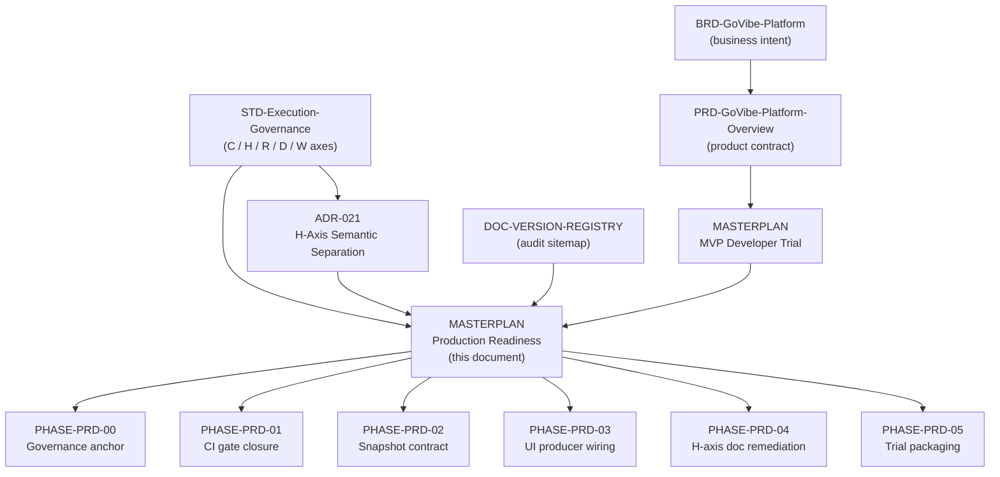

# MASTERPLAN: GoVibe Production Readiness

## 1. Purpose

This masterplan is the live plan of record for moving GoVibe from a verified **local developer
preview** to a defensible **production** claim.

It exists because a full evidence sweep on 2026-08-06 found that every automated gate passes while
several product-level claims are still unsupported: most Mission Control views have no backend
producer, the main test suite is not gated in CI, and the snapshot contract has drifted between the
TypeScript type and the runtime.

This document is **live**. Status lives in the tables below, not in a separate tracker. The roadmap
parser reads these tables directly, so editing a `Status` cell changes what Mission Control renders.

Scope boundary: this plan governs *readiness*, not new product surface. The MVP developer-trial
scope stays owned by `docs/roadmap/MASTERPLAN-govibe-mvp-developer-trial.md`; this plan depends on
it and does not supersede it.

## 2. Source-of-Truth Graph

Every phase in this plan is governed by exactly one upstream source of truth. This plan never
redefines a governed term; it points at the document that owns it.



### 2.1 Governing Authority per Phase

| Phase | Governing SoT | What that SoT owns | This plan may not |
|---|---|---|---|
| PHASE-PRD-00 | `docs/DOC-VERSION-REGISTRY.md` | Which documents are active and canonical | Register itself without an owner ratification |
| PHASE-PRD-01 | `docs/STD-Execution-Governance.md` | Gate obligations per Complexity Level | Lower a gate to make a phase pass |
| PHASE-PRD-02 | `docs/PRD-GoVibe-Platform-Overview.md` | The MissionSnapshot product contract | Add a snapshot field without a contract decision |
| PHASE-PRD-03 | `docs/PRD-GoVibe-Platform-Overview.md` | Which views exist and what they must show | Introduce mock telemetry to fill a panel |
| PHASE-PRD-04 | `docs/adr/ADR-021-H-Axis-Access-Scope-Semantic-Separation.md` | The binding meaning of the H axis | Reinterpret H as hops, budget, or risk |
| PHASE-PRD-05 | `docs/roadmap/MASTERPLAN-govibe-mvp-developer-trial.md` | Developer-trial exit criteria | Declare trial-ready ahead of that plan |

### 2.2 Terminology Lock

This plan uses the canonical axes from `docs/STD-Execution-Governance.md` v2.4.0+ga only.
`H` is Access Scope with valid values `H0`..`H4`. `H5` and `H6` are abolished. Graph distance is
`retrieval_radius`, context allowance is `context_budget`. PHASE-PRD-04 exists because several
architecture documents still violate this lock.

## 3. Evidence Baseline

Recorded 2026-08-06 by direct execution on commit `87c313d`. Every row is a command that was run,
not a claim read from a document.

| Check | Command | Result |
|---|---|---|
| Typecheck | `npm run lint` | PASS, no errors |
| Unit tests | `npx vitest run` | PASS, 417 passed / 1 skipped across 54 files |
| Security suite | `npm run test:security` | PASS, 50/50 |
| Production build | `npm run build` | PASS, 186 kB JS / 58 kB gzip |
| Doc governance | `npm run docs:validate` | PASS with warnings |
| Roadmap containers | `npm run roadmap:validate` | PASS, 0 errors / 14 warnings |
| MCP catalog | `npm run mcp:smoke` | PASS, 15 tools / 90 roadmap nodes |
| Live sidecar | `GET /mission/snapshot` | 200 with 9 agents, 34 capabilities, 4 providers, 11 roadmap sources |
| Auth boundary | unauthenticated / foreign-origin request | 401 and 403 respectively |

### 3.1 Verified Gaps

| Gap ID | Finding | Evidence | Phase |
|---|---|---|---|
| GAP-01 | The 417-test suite, `docs:validate`, and `roadmap:validate` run in no CI workflow | Only the P0 security workflow runs on PRs, and it is path-filtered | PHASE-PRD-01 |
| GAP-02 | End-to-end CI exercises a static mockup fixture, not the application | Playwright config sets no web server and targets an HTML fixture | PHASE-PRD-01 |
| GAP-03 | Seven snapshot slices are initialised empty and never written by any producer | `scripts/mcp/runtime/snapshot-store.mjs` plus zero writes in `scripts/mcp/runtime-core.mjs` | PHASE-PRD-03 |
| GAP-04 | `orchestration` is emitted by the runtime but absent from the TypeScript contract | `src/mission/domain.ts` versus the live snapshot payload | PHASE-PRD-02 |
| GAP-05 | `heatmap` exists in the TypeScript contract but no producer emits it; `masterPlanPreview` is produced only on demand by the `masterplan.preview` command (verified live 2026-08-06), so the automatic snapshot never carries it | `src/mission/domain.ts` versus `scripts/mcp/runtime/snapshot-store.mjs`; producer in `scripts/mcp/runtime/roadmap-service.mjs` | PHASE-PRD-02 |
| GAP-06 | Nine of seventeen views render an empty state because their slice has no producer | `src/app/RenderView.tsx` cross-referenced with the live snapshot | PHASE-PRD-03 |
| GAP-07 | Four sidebar labels disagree with the on-screen view title | `src/mission/navigation.ts` versus each view header | PHASE-PRD-03 |
| GAP-08 | Active documents still use abolished `H5`/`H6` or legacy Context-Scaling-Tier semantics | `docs/architecture/C4-GoVibe-Platform.md`, `docs/architecture/SDD-Genesis-Block.md`, `docs/architecture/BLUEPRINT-Translator-Core-Slice.md`; also `docs/features/agent-team/FEAT-Quota-Aware-Local-LLM-Decomposition.md` §3 (approved doc citing "Context Scaling Tier" `H0..H6`) | PHASE-PRD-04 |
| GAP-09 | A clean checkout cannot start; the sidecar requires a token with no quickstart to create one | `.env.example` exists, no `.env` bootstrap or quickstart document | PHASE-PRD-05 |
| GAP-10 | The active board source was a June HTML validation fixture: sources without an authored updated timestamp inherit parse-time freshness, so the fixture won a permanent +20 recency bonus (score 82) and its tasks name assignees absent from the agent registry | `scripts/mcp/roadmap-parser.mjs` line 590 fallback; `docs/roadmap/ROADMAP-govibe-mcp-runtime.html` had no data-updated attribute; verified live 2026-08-08 | PHASE-PRD-03 |

### 3.2 View Wiring Baseline

Recorded from the live snapshot. This table is the acceptance surface for PHASE-PRD-03.

| View | Slice | Live count | State |
|---|---|---|---|
| A2 Roadmap Board | roadmap, roadmapSources, agents | 5 / 11 / 9 | wired |
| A3 Capability Plugins | capabilities | 34 | wired |
| A5 Agent Management | agents | 9 | wired |
| C2 Intelligence Zoo | agents, capabilities | 9 / 34 | wired |
| A1 Real-time Dashboard | metrics, reactor, workflowRuns, providers | providers only | partial |
| A4 Vault, Context and Impact | capabilities, providers, terminal, workflowRuns | three of four | partial |
| D1 Reactor Run Trigger | command dispatch only | not applicable | command-only |
| C3 SRS-G Debugger | manual ingest only | not applicable | ingest-only |
| B1 AST Hierarchy Tree | graph | 0 | unwired |
| B2 Business Specifications | specs | 0 | unwired |
| B3 Interactive Graph | graph | 0 | unwired |
| B4 Live Call Graph | graph | 0 | unwired |
| C1 Symbol Explorer Hub | symbols | 0 | unwired |
| C4 Database ERD Schema | symbols | 0 | unwired |
| C5 HNSW Vector Space Map | graph | 0 | unwired |
| D2 Cyber Reactor Heatmap | heatmap | field absent | unwired |
| D3 EABS-01 Campaign Logs | campaignLogs | 0 | unwired |

### 3.3 Contract-to-Runtime Audit Findings (2026-08-19)

Recorded from a repository-wide read-only contract-to-runtime gap analysis performed 2026-08-19 on
commit `b60618e` (six parallel domain audits: documents/contracts, MCP runtime and protocol,
govibe-core pipeline, Mission Control frontend, tests/CI/evidence, governance enforcement). Every
row carries direct file evidence. Dispositions: a `TASK-PRD-0xx` value means the finding is bound
to a backlog task in this plan; `existing` names the task that already covers it; `recorded` means
the finding is registered here and its next step is an owner decision or lies outside this plan's
readiness scope — recorded findings are not silently dropped and must be dispositioned by the
owner before any end-to-end completeness claim.

| Audit ID | Severity | Type | Finding | Evidence | Disposition |
|---|---|---|---|---|---|
| AUD-01 | BLOCKER | MISSING_EDGE | No MSP process is ever configured; every governed path (deep-scan promotion, context resolution, memory/vault tools) fails closed permanently | `packages/govibe-core/src/msp-client.mjs:196-200`; no `GOVIBE_MSP_COMMAND` anywhere; WP-12/WP-13 confirm unwired | TASK-PRD-023 |
| AUD-02 | BLOCKER | MISSING_EDGE | The hardening wrapper drops `contextAuthority`/`knowledgeRefs`, so the context branch of `govibe.workflow.continue` always blocks with `missing_runtime_authority` | `scripts/mcp/runtime-argument-hardening.mjs:27-42` vs `scripts/mcp/runtime/workspace-service.mjs:40-42` | TASK-PRD-024 |
| AUD-03 | BLOCKER | DISCONNECTED | The execution/provider/credential stack (~15 modules) has no runtime consumer; `govibe.agent.run` dispatches via the PowerShell launcher with no binding, budget, or tier decision | `scripts/mcp/runtime-core.mjs:80,84,192-233`; only `.inspect()` is called | TASK-PRD-025 (owner decision) |
| AUD-04 | CRITICAL | AUTHORITY_BYPASS | Sidecar mission commands bypass `enforceToolRbac` with a hardcoded `actor: "mission-control"`; the bearer token is the only gate | `scripts/mcp/runtime/mission-command-router.mjs:34` vs `scripts/mcp/handlers.mjs:40` | TASK-PRD-026 |
| AUD-05 | CRITICAL | UNENFORCED_CONTRACT | `govibe.docs.resolve` and `govibe.ingest.code` are ungoverned arbitrary file reads (absolute paths honored, no containment, outside the RBAC matrix) | `scripts/mcp/runtime-core.mjs:179-190`; `scripts/mcp/runtime/translator-service.mjs:18` | TASK-PRD-027 |
| AUD-06 | CRITICAL | UNENFORCED_CONTRACT | Three false-success paths to `done`: empty DoD passes vacuously; `node.update` accepts `state: done` unguarded; workflow-engine accepts caller-asserted `{passed: true}` | `scripts/mcp/verify-gate.mjs:60-61` + `orchestration-service.mjs:12`; `roadmap-service.mjs:378-395`; `workflow-engine.mjs:86` | TASK-PRD-030 |
| AUD-07 | CRITICAL | MOCKED_REALITY | D1 Reactor Run Trigger fabricates hardware telemetry, benchmark results, and replay logs presented as real-time state — the sole live-data-rule violation | `src/features/benchmark/ReactorRunTrigger.tsx:113-309,505-576,599-605` | TASK-PRD-020 |
| AUD-08 | CRITICAL | UNENFORCED_CONTRACT | C-3/H4 approval gates accept any non-empty `approvalRef`; `actor` is free text; no principal identity on the shared-token sidecar — ceremony, not verified authority | `workflow-node-action-service.mjs:57-61`; `agent-session-service.mjs:162-164` | TASK-PRD-029 |
| AUD-09 | CRITICAL | SPEC_ONLY | Identity resolution, conflict detection, and reverse semantic delta exist only in isolated `poc/` (zero production imports); governing SRS-Canonical-Semantic-IR is draft | `packages/govibe-core/src/poc/` isolation verified by grep | recorded — blocked on AUD-01/02 and owner ratification of the CSIR spec; product surface beyond this plan's scope |
| AUD-10 | CRITICAL | CONTEXT_LEAK | PM connector tokens travel plaintext in tool args bypassing the built credential vault; spawned agent PTYs inherit full `process.env` incl. server tokens; WS token rides in the URL; session logs persist full args | `pm-export-service.mjs:33-46`; `agent-session-service.mjs:176`; `sidecar-server.mjs:251`; `runtime-core.mjs:226` | TASK-PRD-028 |
| AUD-11 | CRITICAL | RECOVERY_GAP | All runtime roadmap mutations (approvals, done-states, assignments) live in an in-memory overlay and evaporate on server restart; docs are never written back | `scripts/mcp/runtime/temporal-overlay-store.mjs` (plain Maps, no fs) | TASK-PRD-031 |
| AUD-12 | HIGH | TRACEABILITY_BREAK | Approved plans bind to draft BRD/PRD as governing SoT; ADR-002 — the foundational MCP decision — is still `proposed` beneath an approved SRS | §2.1 of this plan; `docs/adr/ADR-002-MCP-As-Primary-Orchestration-Interface.md` | recorded — owner ratification package (BRD/PRD/ADR-002); draft→approved is owner-only |
| AUD-13 | HIGH | CONTRADICTION | ADR-021 still names RWANG-PROMAX as canonical Execution Governance home (stale, inverted vs STD 2.4.0+ga and AGENTS.md §1.1) and is absent from the version registry; ADR-014's external-validator MSP vs ADR-027's in-repo memory MSP were never reconciled | `ADR-021:36` + frontmatter; registry grep (no ADR-021 row) | recorded — ADR amendments require owner acceptance |
| AUD-14 | HIGH | LEGACY_LEAK | Abolished H5/H6/`context_scaling_tier` semantics are active in ~20 documents (GAP-08 names 4), including both PRDs, the approved MVP masterplan frontmatter, and the doc-generation template that re-seeds the leak; no validator bans them | audit sweep incl. `docs/PRD-GoVibe-Platform-Overview.md:15`, `MASTERPLAN-govibe-mvp-developer-trial.md:10,107`, `.agents/doc_writer/template/GENESIS-BLOCK-TEMPLATE.md:28-75` | TASK-PRD-022 |
| AUD-15 | HIGH | UNENFORCED_CONTRACT | Impact-before-completion and docs-first are document-only: nothing requires `govibe.workspace.impact` before closure and `diff:check` is wired into no hook or CI workflow | `scripts/docs/diff-check.mjs` (manual-only); no gate consumes impact output | TASK-PRD-032 |
| AUD-16 | HIGH | MISSING_EDGE | Zero cross-runtime MissionSnapshot parity tests (GATE-CONTRACT unmet); 7 slices producer-less, `heatmap` frontend-only, `roadmap.dag` rides untyped | `src/mission/domain.ts` vs `scripts/mcp/runtime/snapshot-store.mjs` | TASK-PRD-019 |
| AUD-17 | HIGH | MOCKED_REALITY | App-level E2E is zero: the only Playwright spec exercises a static mockup fixture; June root docs claim "COMPLETE and production ready" with estimated pass rates; JULES_REPORT.md reports on a foreign repository | `playwright.config.ts:16`; `e2e/landing-page.spec.ts`; root E2E/summary docs | existing — TASK-PRD-004 (E2E); orphan-doc cleanup recorded under AUD-31 |
| AUD-18 | HIGH | FAILURE_GAP | No command idempotency (`commandId` echoed, never deduplicated — retried mutations double-apply), no event sequence numbers, no protocol version negotiation | `sidecar-server.mjs:99-103`; `packages/mission-protocol/index.js` | TASK-PRD-033 |
| AUD-19 | HIGH | SPEC_ONLY | Wave execution is planning-only: `AutonomyController` named in comments exists nowhere; multi-agent orchestration is a single StEP loop | `scripts/mcp/wave.mjs:5`; no caller of `nextRunnableWave` | recorded — product surface owned by the MVP developer-trial plan |
| AUD-20 | HIGH | MISSING_NODE | `governance-rules.mjs` does not exist anywhere in the repo; governance logic is spread across four scripts | repo-wide grep, zero hits | recorded — external stale claim; no repo artifact to fix |
| AUD-21 | HIGH | DISCONNECTED | `replay-provider.mjs` has zero consumers and zero tests; `mode2/` (full pipeline) and `canonical-materialization.mjs` have no runtime caller | `packages/govibe-core/src/` import graph | recorded — consume or descope with the TASK-PRD-025 decision |
| AUD-22 | HIGH | DISCONNECTED | `govibe.doc.create` is advertised in the catalog but has no handler case (uncallable); `govibe.deploy.vercel` is a placeholder; `file.save` is a no-op on both ends | `registry.mjs:230-243` vs `handlers.mjs:332-333`; `handlers.mjs:166-185` | recorded — fix or retire with the tool-surface decision (TASK-PRD-025) |
| AUD-23 | HIGH | PARTIAL | H is a declared ceiling, not a sandbox: spawned PTYs get full env and filesystem regardless of declared scope; C-0→H2 defaults are uncoded; RBAC executor scope defaults permissive H4 | `agent-session-service.mjs:176`; `rbac-enforcement.mjs:126` | recorded — enforcement-model decision, linked to TASK-PRD-025/029 |
| AUD-24 | HIGH | OBSERVABILITY_GAP | No per-panel disconnected/stale/unauthorized distinction — a WS drop leaves every view showing the last snapshot with only a global StatusBar hint; ingested debug events carry no provenance marker | `src/StatusBar.tsx:4-5`; `gateway.ts` | TASK-PRD-021 |
| AUD-25 | MEDIUM | PARTIAL | `mcp:smoke` and `diff:check` never run in CI; `env:validate` self-disables under `CI`; `enforce_admins: false` lets pushes bypass the required check | `scripts/docs/validate-env.mjs`; workflows grep; branch protection query | TASK-PRD-018 |
| AUD-26 | MEDIUM | TEST_ONLY | Five dead test files in `tests/` (no runner collects them); `credential-session-boundary.security.test.mjs` runs in the unit lane, not the security lane | `vitest.config.ts:16-33`; `package.json:16` | TASK-PRD-018 |
| AUD-27 | MEDIUM | FAILURE_GAP | `workspace.initialize` writes all local materialization before the MSP registration call, leaving partial `.govibe/`/`.brain/` state on failed init | `packages/govibe-core/src/workspace.mjs:47-104` | recorded — fix within SPR-PRD-07 scope when the MSP path goes live |
| AUD-28 | MEDIUM | CONTRADICTION | CLAUDE.md is stale on ≥6 material points (CI gating, plan status, view count, gateway ingress surface, `vaults.json`, governance-rules framing) | CLAUDE.md vs this plan §4 and live code | recorded — contract refresh recommended alongside the AUD-12 owner package |
| AUD-29 | MEDIUM | PARTIAL | Node-contract enforcement is gate-time only and scoped to a single backlog source | `validate-roadmap-containers.mjs:42` | recorded — scope extension is an owner governance decision |
| AUD-30 | MEDIUM | DISCONNECTED | `engine/` has zero tracked files; its gitignore comment ("Engine source stays tracked") is false; only island runtime artifacts remain | `git ls-files engine` = 0; `.gitignore:33-38` | recorded — delete or integrate is an owner decision |
| AUD-31 | LOW | LEGACY_LEAK | Nine-plus ungoverned root-level orphan docs (June E2E celebration set, stale Tauri plan, foreign JULES_REPORT.md); registry omissions (ADR-021 among them); untracked Mode 2 draft carries product direction outside governance | root listing; registry grep | recorded — cleanup batch for owner triage |
| AUD-32 | LOW | PARTIAL | Cosmetic affordances imply state changes that never happen (A2 drag-assign animation sends nothing; placebo Configure/Re-align buttons); A9 mojibake separators; WS token in URL query | `RoadmapBoard.tsx:122-137`; `AgentConsoleView.tsx:194,203` | recorded — candidates for SPR-PRD-03 hygiene; WS token covered by TASK-PRD-028 |
| AUD-33 | LOW | LEGACY_LEAK | Legacy `contextTier` still accepted as a step argument; a third H-meaning (H = model tier) lives in `docs/alignment/small-model-prompting.md:131` | `orchestration-service.mjs:12` | recorded — fold into TASK-PRD-022 sweep scope |
| AUD-34 | MEDIUM | STALE_VIEW | The mission protocol spec is stale and incomplete: `docs/api/MISSION-PROTOCOL-v1.md` declares protocol 1.0.0 / compatibility 1 while the runtime ships 2.0.0 / compatibility 2 (per the 0.2.5 orchestration-contract change), formally defines only 2 of the 6 live sidecar endpoints (`/mission/commands`, `/mission/files` — not `/mission/snapshot`, `/mission/ws`, `/usage/ingest`, `/roadmap/sources`), and has no DOC-VERSION-REGISTRY row | `docs/api/MISSION-PROTOCOL-v1.md:5-6` vs `packages/mission-protocol/index.js`; registry grep (no row) | TASK-PRD-034 |

## 4. Readiness Gates

Production is claimable only when every gate below is green. A gate is never satisfied by lowering
its own threshold.

| Gate | Definition | Current |
|---|---|---|
| GATE-CI | Every pull request runs `npm run baseline:check` with no path filter | met (2026-08-08: run 31226249238 on PR #122 executed docs, roadmap, typecheck, 70 vitest files, 65 security tests, and build; baseline-check set as a required status check on main; failure path proven red on PR #123) |
| GATE-CONTRACT | The TypeScript MissionSnapshot and the runtime snapshot agree field for field | not met |
| GATE-HONESTY | Every view either shows live data or an empty state naming the missing feed, with no fabricated values | met |
| GATE-SEMANTIC | No active document uses abolished `H5`/`H6` semantics | not met (2026-08-19: TASK-PRD-009/TASK-PRD-022 full sweep complete; `node scripts/docs/validate-docs.mjs` locally reports PASS with its new GATE-SEMANTIC rule in `checkAbolishedHAxisSemantics`; gate stays not-met pending a CI-run baseline-check confirming this on the merge commit) |
| GATE-BOOTSTRAP | A clean checkout reaches a running Mission Control by following one document | not met |
| GATE-SECURITY | The sidecar rejects unauthenticated and foreign-origin traffic under automated test | met |

Deployment topology beyond a loopback-bound sidecar is explicitly **out of scope** for this plan.
Hosting, TLS termination, and a multi-user identity model require their own Change Request before
any production claim that involves a network-reachable deployment.

## Phases

| Phase | Goal | Governing SoT | Exit Criteria | Status | Progress |
|---|---|---|---|---|---|
| PHASE-PRD-00 | Anchor governance and register this plan | `docs/DOC-VERSION-REGISTRY.md` | This plan is registered and the agent contracts point at it | done | 100 |
| PHASE-PRD-01 | Close the CI gate so the real suite protects the branch | `docs/STD-Execution-Governance.md` | GATE-CI is met | in-progress | 75 |
| PHASE-PRD-02 | Realign the snapshot contract across TypeScript and runtime | `docs/PRD-GoVibe-Platform-Overview.md` | GATE-CONTRACT is met | in-progress | 50 |
| PHASE-PRD-03 | Give every view a real producer or an owned decision to retire it | `docs/PRD-GoVibe-Platform-Overview.md` | No view is unwired without a recorded decision | in-progress | 40 |
| PHASE-PRD-04 | Remove abolished H-axis semantics from active documents | `docs/adr/ADR-021-H-Axis-Access-Scope-Semantic-Separation.md` | GATE-SEMANTIC is met | review | 90 |
| PHASE-PRD-05 | Package a repeatable clean-checkout developer trial | `docs/roadmap/MASTERPLAN-govibe-mvp-developer-trial.md` | GATE-BOOTSTRAP is met | planned | 0 |
| PHASE-PRD-06 | Bring the runtime into verified conformance with the Workspace System spec | `docs/specs/SPEC-Workspace-System.md` | Spec acceptance criteria AC-01 through AC-08 hold with recorded command evidence | done | 100 |
| PHASE-PRD-07 | Activate the governed semantic pipeline (MSP parent and context authority) | `docs/adr/ADR-027-In-Repo-MSP-Runtime-Package-Boundary.md` | A real candidate promotion round-trips through a configured MSP and a live-surface workflow.continue succeeds with validated context authority, both with recorded command evidence | in-progress | 85 |
| PHASE-PRD-08 | Enforce runtime authority uniformly across transports and close credential exposures | `docs/specs/SPEC-Workspace-System.md` | No mutating surface bypasses the RBAC decision point and approval references verify against recorded approvals | in-progress | 70 |
| PHASE-PRD-09 | Make completion states trustworthy | `docs/STD-Execution-Governance.md` | No path reaches done without a non-vacuous verification pass and runtime mutations survive a server restart | review | 90 |

## Sprints

| Sprint | Parent ID | Goal | Exit Criteria | Status | Progress |
|---|---|---|---|---|---|
| SPR-PRD-00 | PHASE-PRD-00 | Register the readiness plan and bind the agent contracts to it | Registry row exists and both agent contracts cite this plan | done | 100 |
| SPR-PRD-01 | PHASE-PRD-01 | Make the full baseline gate run on every pull request | A pull request touching only frontend code still runs the full suite | in-progress | 50 |
| SPR-PRD-02 | PHASE-PRD-02 | Reconcile every MissionSnapshot field across both implementations | A contract test fails when either side adds an unmatched field | in-progress | 50 |
| SPR-PRD-03 | PHASE-PRD-03 | Wire the graph, symbol, and telemetry producers | Each formerly unwired view renders live data from a real feed | in-progress | 40 |
| SPR-PRD-04 | PHASE-PRD-04 | Correct the H-axis vocabulary in architecture documents | A repository scan finds no active `H5`/`H6` access semantics | review | 90 |
| SPR-PRD-05 | PHASE-PRD-05 | Author and verify the clean-checkout quickstart | A reviewer reaches a running Mission Control from the document alone | planned | 0 |
| SPR-PRD-06 | PHASE-PRD-06 | Pin workspace-spec conformance and land the personnel identity and RBAC contracts | AC-01 through AC-06 are pinned by automated tests; the personnel and RBAC suites demonstrate AC-07 and AC-08 | done | 100 |
| SPR-PRD-07 | PHASE-PRD-07 | Wire the MSP parent and repair the context-authority path | Deep scan promotes one real candidate end-to-end and workflow.continue succeeds on the live tool surface with validated context authority | in-progress | 85 |
| SPR-PRD-08 | PHASE-PRD-08 | Close the transport authority bypasses and credential exposures | Sidecar and stdio enforce the same authority decision point; secrets no longer transit tool args, child env, or URLs | in-progress | 70 |
| SPR-PRD-09 | PHASE-PRD-09 | Close the false-success paths and persist runtime truth | Each false-success path has a failing regression test, the roadmap overlay survives restart, and mutating mission commands are idempotent | review | 90 |

## Backlog Items

| ID | Parent ID | Type | Title | Priority | Owner | Status | Dependencies | Source Section |
|---|---|---|---|---|---|---|---|---|
| TASK-PRD-001 | SPR-PRD-00 | task | Register this masterplan in the document version registry | P0 | ATHER | done | - | Section 3.1 GAP-00 |
| TASK-PRD-002 | SPR-PRD-00 | task | Bind AGENTS.md and CLAUDE.md to this readiness plan | P0 | THESEUS | done | TASK-PRD-001 | Section 3.1 GAP-00 |
| TASK-PRD-003 | SPR-PRD-01 | task | Add an unfiltered baseline check workflow for every pull request | P0 | ATHER | done | TASK-PRD-002 | Section 3.1 GAP-01 |
| TASK-PRD-004 | SPR-PRD-01 | task | Point end-to-end coverage at the running application | P1 | VIBE | planned | TASK-PRD-003 | Section 3.1 GAP-02 |
| TASK-PRD-005 | SPR-PRD-02 | task | Add the orchestration slice to the MissionSnapshot contract | P0 | ARCHON | review | TASK-PRD-003 | Section 3.1 GAP-04 |
| TASK-PRD-006 | SPR-PRD-02 | task | Resolve the heatmap and master plan preview contract orphans | P1 | ARCHON | planned | TASK-PRD-005 | Section 3.1 GAP-05 |
| TASK-PRD-007 | SPR-PRD-03 | task | Publish graph and symbol producers from the workspace scan | P0 | VIBE | planned | TASK-PRD-005 | Section 3.2 |
| TASK-PRD-008 | SPR-PRD-03 | task | Reconcile sidebar labels with rendered view titles | P2 | VIBE | planned | - | Section 3.1 GAP-07 |
| TASK-PRD-009 | SPR-PRD-04 | task | Correct abolished H-axis semantics in architecture documents | P1 | ATHER | review | - | Section 3.1 GAP-08 |
| TASK-PRD-010 | SPR-PRD-05 | task | Author the clean-checkout developer quickstart | P0 | THESEUS | planned | TASK-PRD-003 | Section 3.1 GAP-09 |
| TASK-PRD-011 | SPR-PRD-00 | task | Provide a Mission Control readiness tracking and command view | P1 | VIBE | done | TASK-PRD-001 | Section 11 |
| TASK-PRD-012 | SPR-PRD-03 | task | Roadmap source hygiene and honest recency scoring | P1 | LYRA | done | - | Section 3.1 GAP-10 |
| TASK-PRD-013 | SPR-PRD-06 | task | Pin workspace-spec acceptance criteria AC-01 through AC-06 with conformance tests | P1 | ATHER | done | - | SPEC-Workspace-System §11 |
| TASK-PRD-014 | SPR-PRD-06 | task | Implement the personnel identity model (employee_id / staff_id) | P1 | VIBE | done | - | SPEC-Workspace-System §3.3 |
| TASK-PRD-015 | SPR-PRD-06 | task | Implement RBAC core: scoped roles, deny-by-default decisions, allow/deny audit | P1 | VIBE | done | TASK-PRD-014 | SPEC-Workspace-System §6 |
| TASK-PRD-016 | SPR-PRD-06 | task | Enforce RBAC across the govibe.workspace.* tool surface | P2 | ARCHON | done | TASK-PRD-015 | SPEC-Workspace-System §6.2 |
| TASK-PRD-017 | SPR-PRD-06 | task | Validate active personnel identity at the RBAC enforcement boundary | P2 | VIBE | done | TASK-PRD-016 | SPEC-Workspace-System §3.3 |
| TASK-PRD-018 | SPR-PRD-01 | task | Close the CI coverage gaps: run mcp:smoke in CI, stop env:validate self-skipping, recover the dead and mis-laned tests | P1 | ATHER | review | TASK-PRD-003 | Section 3.3 AUD-25, AUD-26 |
| TASK-PRD-019 | SPR-PRD-02 | task | Add the cross-runtime MissionSnapshot parity contract test | P0 | ARCHON | review | TASK-PRD-005 | Section 3.3 AUD-16 |
| TASK-PRD-020 | SPR-PRD-03 | task | Remove fabricated telemetry from the D1 Reactor Run Trigger | P0 | VIBE | review | - | Section 3.3 AUD-07 |
| TASK-PRD-021 | SPR-PRD-03 | task | Distinguish disconnected, stale, and empty states per panel | P2 | VIBE | review | - | Section 3.3 AUD-24 |
| TASK-PRD-022 | SPR-PRD-04 | task | Extend H-axis remediation to the full leak sweep, fix the doc-generation template, and add a validator backstop | P1 | ATHER | review | TASK-PRD-009 | Section 3.3 AUD-14 |
| TASK-PRD-023 | SPR-PRD-07 | task | Configure and launch the in-repo MSP runtime with a promotion smoke test | P0 | VIBE | review | - | Section 3.3 AUD-01 |
| TASK-PRD-024 | SPR-PRD-07 | task | Forward contextAuthority through the hardened workflow.continue surface | P0 | VIBE | review | TASK-PRD-023 | Section 3.3 AUD-02 |
| TASK-PRD-025 | SPR-PRD-07 | task | Prepare the owner decision: integrate or descope the entitlement execution and credential stack | P1 | ARCHON | done | - | Section 3.3 AUD-03 |
| TASK-PRD-026 | SPR-PRD-08 | task | Route sidecar mission commands through the RBAC decision point | P0 | ARCHON | review | - | Section 3.3 AUD-04 |
| TASK-PRD-027 | SPR-PRD-08 | task | Contain and govern docs.resolve and ingest.code file access | P0 | VIBE | review | - | Section 3.3 AUD-05 |
| TASK-PRD-028 | SPR-PRD-08 | task | Close credential exposures: child-env allowlist, WS token placement, log redaction, connector-token storage | P1 | VIBE | review | - | Section 3.3 AUD-10 |
| TASK-PRD-029 | SPR-PRD-08 | task | Verify approval references against recorded approvals with principal identity | P1 | ARCHON | review | TASK-PRD-026 | Section 3.3 AUD-08 |
| TASK-PRD-030 | SPR-PRD-09 | task | Close the three false-success paths to done | P0 | VIBE | review | - | Section 3.3 AUD-06 |
| TASK-PRD-031 | SPR-PRD-09 | task | Persist runtime roadmap mutations across restart | P1 | VIBE | review | - | Section 3.3 AUD-11 |
| TASK-PRD-032 | SPR-PRD-09 | task | Gate completion of semantic changes on recorded impact evidence and wire diff:check into a gate | P1 | ATHER | review | TASK-PRD-030 | Section 3.3 AUD-15 |
| TASK-PRD-033 | SPR-PRD-09 | task | Add idempotency to mutating mission commands | P2 | ARCHON | review | - | Section 3.3 AUD-18 |
| TASK-PRD-034 | SPR-PRD-02 | task | Bring the mission protocol spec to v2, cover all live sidecar endpoints, and register it | P1 | ATHER | review | - | Section 3.3 AUD-34 |
| TASK-PRD-035 | SPR-PRD-07 | task | Integrate the phase-1 execution dispatch gate at runAgent and StEP (CR-2026-08-19 D-01) | P0 | VIBE | review | TASK-PRD-024 | CR-2026-08-19 §6 D-01 |
| TASK-PRD-036 | SPR-PRD-07 | task | Pin replay-provider with a contract test; consumption stays deferred (CR-2026-08-19 D-04) | P2 | VIBE | review | - | CR-2026-08-19 §6 D-04 |

## Assignments

| Task ID | Subject ID | Subject Type | Policy Model | Assigned At | Assigned By |
|---|---|---|---|---|---|
| TASK-PRD-001 | ATHER | agent | ABAC | 2026-08-06T00:00:00Z | Boss |
| TASK-PRD-002 | THESEUS | agent | ABAC | 2026-08-06T00:00:00Z | Boss |
| TASK-PRD-003 | ATHER | agent | ABAC | 2026-08-06T00:00:00Z | Boss |
| TASK-PRD-004 | VIBE | agent | ABAC | 2026-08-06T00:00:00Z | Boss |
| TASK-PRD-005 | ARCHON | agent | ABAC | 2026-08-06T00:00:00Z | Boss |
| TASK-PRD-006 | ARCHON | agent | ABAC | 2026-08-06T00:00:00Z | Boss |
| TASK-PRD-007 | VIBE | agent | ABAC | 2026-08-06T00:00:00Z | Boss |
| TASK-PRD-008 | VIBE | agent | ABAC | 2026-08-06T00:00:00Z | Boss |
| TASK-PRD-009 | ATHER | agent | ABAC | 2026-08-06T00:00:00Z | Boss |
| TASK-PRD-010 | THESEUS | agent | ABAC | 2026-08-06T00:00:00Z | Boss |
| TASK-PRD-011 | VIBE | agent | ABAC | 2026-08-06T00:00:00Z | Boss |
| TASK-PRD-012 | LYRA | agent | ABAC | 2026-08-08T00:00:00Z | Boss |
| TASK-PRD-013 | ATHER | agent | ABAC | 2026-08-09T00:00:00Z | Boss |
| TASK-PRD-014 | VIBE | agent | ABAC | 2026-08-09T00:00:00Z | Boss |
| TASK-PRD-015 | VIBE | agent | ABAC | 2026-08-09T00:00:00Z | Boss |
| TASK-PRD-016 | ARCHON | agent | ABAC | 2026-08-09T00:00:00Z | Boss |
| TASK-PRD-017 | VIBE | agent | ABAC | 2026-08-09T00:00:00Z | Boss |
| TASK-PRD-018 | ATHER | agent | ABAC | 2026-08-19T00:00:00Z | Boss |
| TASK-PRD-019 | ARCHON | agent | ABAC | 2026-08-19T00:00:00Z | Boss |
| TASK-PRD-020 | VIBE | agent | ABAC | 2026-08-19T00:00:00Z | Boss |
| TASK-PRD-021 | VIBE | agent | ABAC | 2026-08-19T00:00:00Z | Boss |
| TASK-PRD-022 | ATHER | agent | ABAC | 2026-08-19T00:00:00Z | Boss |
| TASK-PRD-023 | VIBE | agent | ABAC | 2026-08-19T00:00:00Z | Boss |
| TASK-PRD-024 | VIBE | agent | ABAC | 2026-08-19T00:00:00Z | Boss |
| TASK-PRD-025 | ARCHON | agent | ABAC | 2026-08-19T00:00:00Z | Boss |
| TASK-PRD-026 | ARCHON | agent | ABAC | 2026-08-19T00:00:00Z | Boss |
| TASK-PRD-027 | VIBE | agent | ABAC | 2026-08-19T00:00:00Z | Boss |
| TASK-PRD-028 | VIBE | agent | ABAC | 2026-08-19T00:00:00Z | Boss |
| TASK-PRD-029 | ARCHON | agent | ABAC | 2026-08-19T00:00:00Z | Boss |
| TASK-PRD-030 | VIBE | agent | ABAC | 2026-08-19T00:00:00Z | Boss |
| TASK-PRD-031 | VIBE | agent | ABAC | 2026-08-19T00:00:00Z | Boss |
| TASK-PRD-032 | ATHER | agent | ABAC | 2026-08-19T00:00:00Z | Boss |
| TASK-PRD-033 | VIBE | agent | ABAC | 2026-08-19T00:00:00Z | Boss |
| TASK-PRD-034 | ATHER | agent | ABAC | 2026-08-19T00:00:00Z | Boss |
| TASK-PRD-035 | VIBE | agent | ABAC | 2026-08-19T00:00:00Z | Boss |
| TASK-PRD-036 | VIBE | agent | ABAC | 2026-08-19T00:00:00Z | Boss |

## Handoffs

| Task ID | From ID | To ID | Required Artifact | Note | Created At | State |
|---|---|---|---|---|---|---|
| TASK-PRD-001 | ATHER | Boss | Registry row plus ratification decision | Ratified to approved 2026-08-09 by owner decision (Boss); registry synchronized in the same change | 2026-08-06T00:00:00Z | completed |
| TASK-PRD-003 | ATHER | Boss | Green pull-request run of the full baseline gate | Confirms GATE-CI before further phases start | 2026-08-06T00:00:00Z | completed |
| TASK-PRD-006 | ARCHON | Boss | Contract decision on the two orphan fields | Produce or retire is a product decision, not an implementation choice | 2026-08-06T00:00:00Z | pending |
| TASK-PRD-007 | VIBE | ATHER | Impact analysis over the changed snapshot contract | Required before the wiring change closes | 2026-08-06T00:00:00Z | pending |
| TASK-PRD-025 | ARCHON | Boss | Integrate-or-descope decision on the entitlement execution and credential stack | Completed 2026-08-19: Boss approved D-01..D-05 as recommended in CR-2026-08-19 §6; follow-ups TASK-PRD-035/036 opened, D-03 dispositions recorded in the execution-binding TODO register | 2026-08-19T00:00:00Z | completed |

## Verification

| Task ID | QA Status | Audit Status | Deployment Status | Updated At |
|---|---|---|---|---|
| TASK-PRD-001 | passed | passed | n/a | 2026-08-09T20:15:00Z |
| TASK-PRD-002 | passed | passed | n/a | 2026-08-09T21:00:00Z |
| TASK-PRD-003 | passed | passed | n/a | 2026-08-08T00:00:00Z |
| TASK-PRD-004 | pending | pending | n/a | 2026-08-06T00:00:00Z |
| TASK-PRD-005 | passed | pending | n/a | 2026-08-10T00:00:00Z |
| TASK-PRD-006 | pending | pending | n/a | 2026-08-06T00:00:00Z |
| TASK-PRD-007 | pending | pending | n/a | 2026-08-06T00:00:00Z |
| TASK-PRD-008 | pending | pending | n/a | 2026-08-06T00:00:00Z |
| TASK-PRD-009 | passed | pending | n/a | 2026-08-19T00:00:00Z |
| TASK-PRD-010 | pending | pending | n/a | 2026-08-06T00:00:00Z |
| TASK-PRD-011 | passed | passed | n/a | 2026-08-09T21:00:00Z |
| TASK-PRD-012 | passed | passed | n/a | 2026-08-09T21:00:00Z |
| TASK-PRD-013 | passed | passed | n/a | 2026-08-09T19:45:00Z |
| TASK-PRD-014 | passed | passed | n/a | 2026-08-09T19:45:00Z |
| TASK-PRD-015 | passed | passed | n/a | 2026-08-09T19:45:00Z |
| TASK-PRD-016 | passed | passed | n/a | 2026-08-09T19:45:00Z |
| TASK-PRD-017 | passed | passed | n/a | 2026-08-09T19:45:00Z |
| TASK-PRD-018 | passed | pending | n/a | 2026-08-19T00:00:00Z |
| TASK-PRD-019 | passed | pending | n/a | 2026-08-19T00:00:00Z |
| TASK-PRD-020 | passed | pending | n/a | 2026-08-19T00:00:00Z |
| TASK-PRD-021 | passed | pending | n/a | 2026-08-19T00:00:00Z |
| TASK-PRD-022 | passed | pending | n/a | 2026-08-19T00:00:00Z |
| TASK-PRD-023 | pending | pending | n/a | 2026-08-19T00:00:00Z |
| TASK-PRD-024 | pending | pending | n/a | 2026-08-19T00:00:00Z |
| TASK-PRD-025 | passed | passed | n/a | 2026-08-19T00:00:00Z |
| TASK-PRD-026 | passed | pending | n/a | 2026-08-19T00:00:00Z |
| TASK-PRD-027 | passed | pending | n/a | 2026-08-19T00:00:00Z |
| TASK-PRD-028 | passed | pending | n/a | 2026-08-19T00:00:00Z |
| TASK-PRD-029 | passed | pending | n/a | 2026-08-19T00:00:00Z |
| TASK-PRD-030 | passed | passed | n/a | 2026-08-19T00:00:00Z |
| TASK-PRD-031 | passed | passed | n/a | 2026-08-19T00:00:00Z |
| TASK-PRD-032 | passed | pending | n/a | 2026-08-19T00:00:00Z |
| TASK-PRD-033 | passed | passed | n/a | 2026-08-19T00:00:00Z |
| TASK-PRD-034 | passed | pending | n/a | 2026-08-19T00:00:00Z |
| TASK-PRD-035 | passed | pending | n/a | 2026-08-19T00:00:00Z |
| TASK-PRD-036 | passed | pending | n/a | 2026-08-19T00:00:00Z |

## Task Containers

### TC-TASK-PRD-001

```yaml
task_container_id: TC-TASK-PRD-001
task_id: TASK-PRD-001
parent_phase_id: PHASE-PRD-00
parent_sprint_id: SPR-PRD-00
title: Register this masterplan in the document version registry
requirement_type: NFR
complexity: C-2
access_scope: H2
status: done
version: 0.1.0+draft
pic: ATHER
executor: THESEUS
approver: Boss
auditor: ATHER
symbol_links:
  code: scripts/docs/validate-docs.mjs
  doc: docs/DOC-VERSION-REGISTRY.md
  test: unavailable
definition_of_done:
  acceptance_criteria:
    - criterion: Given the registry contains a row for this plan, when docs:validate runs, then no doc_id, version, or status mismatch error is reported
      checked: true
  success_criteria:
    - criterion: Given a reader opens the registry, when they look for the readiness plan, then they find one row pointing at the active file path
      checked: true
  exit_criteria:
    - criterion: Given the owner ratifies the plan, when status changes from draft to approved, then the registry version and status are updated in the same change
      checked: true
changelog: Registry row authored alongside the initial readiness plan. Closed 2026-08-09 with the owner ratification of this plan to approved (0.2.0) — the registry row's version and status were updated in the same change and docs:validate reports no mismatch.
created_at: 2026-08-06T00:00:00Z,THESEUS,pending
token_telemetry:
  model_name: claude-opus-5
  context_length: 200k
  predicted_token_usage: 3000
  total_token_usage: 3000
ui_state:
  dropdown_default: expanded
  expanded: true
  disabled_reason: ""
```

### TC-TASK-PRD-002

```yaml
task_container_id: TC-TASK-PRD-002
task_id: TASK-PRD-002
parent_phase_id: PHASE-PRD-00
parent_sprint_id: SPR-PRD-00
title: Bind AGENTS.md and CLAUDE.md to this readiness plan
requirement_type: NFR
complexity: C-2
access_scope: H2
status: done
version: 0.2.0
pic: THESEUS
executor: THESEUS
approver: Boss
auditor: ATHER
symbol_links:
  code: scripts/docs/validate-docs.mjs
  doc: docs/STD-Execution-Governance.md
  test: unavailable
definition_of_done:
  acceptance_criteria:
    - criterion: Given an agent starts a session, when it reads the operating contract, then it is told to consult this readiness plan before proposing readiness work
      checked: true
  success_criteria:
    - criterion: Given both contract files, when either is read alone, then the readiness plan path and its live-status rule are discoverable without another lookup
      checked: true
  exit_criteria:
    - criterion: Given docs:validate runs, when it resolves referenced paths in both contract files, then every referenced path exists
      checked: true
changelog: Verified 2026-08-09 that both AGENTS.md §11 (readiness plan of record, binds every readiness task to a Task ID) and CLAUDE.md ("Readiness plan of record" section) already cite this masterplan by path and state its live-status rule, satisfying all three criteria against the live file contents (no code change needed for the binding itself). Evidence: `npm run docs:validate` PASS with zero warnings referencing AGENTS.md, CLAUDE.md, or this masterplan's path. Closed to done as owner-directed evidence review (Boss present in session), per the WP-16/17 precedent — not an independent ATHER audit reproduction.
created_at: 2026-08-06T00:00:00Z,THESEUS,pending
token_telemetry:
  model_name: claude-opus-5
  context_length: 200k
  predicted_token_usage: 4000
  total_token_usage: 4000
ui_state:
  dropdown_default: expanded
  expanded: true
  disabled_reason: ""
```

### TC-TASK-PRD-003

```yaml
task_container_id: TC-TASK-PRD-003
task_id: TASK-PRD-003
parent_phase_id: PHASE-PRD-01
parent_sprint_id: SPR-PRD-01
title: Add an unfiltered baseline check workflow for every pull request
requirement_type: NFR
complexity: C-2
access_scope: H2
status: done
version: 0.1.0+draft
pic: ATHER
executor: VIBE
approver: Boss
auditor: ATHER
symbol_links:
  code: scripts/docs/validate-roadmap-containers.mjs
  doc: docs/STD-Execution-Governance.md
  test: src/missionContract.test.ts
definition_of_done:
  acceptance_criteria:
    - criterion: Given a pull request that changes only files under src, when continuous integration runs, then the unit suite, doc validation, and roadmap validation all execute
      checked: true
  success_criteria:
    - criterion: Given a deliberately failing unit test on a branch, when the pull request is opened, then the required check reports failure
      checked: true
  exit_criteria:
    - criterion: Given the workflow is merged, when a maintainer inspects branch protection, then the baseline check is a required status check
      checked: true
changelog: Closed 2026-08-08. Evidence - green run 31226249238 (PR #122, full suite on a mixed-content PR), red run on PR #123 (deliberately failing test blocked by the required check), and baseline-check required in main branch protection.
created_at: 2026-08-06T00:00:00Z,THESEUS,pending
token_telemetry:
  model_name: claude-opus-5
  context_length: 200k
  predicted_token_usage: 6000
  total_token_usage: 6000
ui_state:
  dropdown_default: expanded
  expanded: true
  disabled_reason: ""
```

### TC-TASK-PRD-004

```yaml
task_container_id: TC-TASK-PRD-004
task_id: TASK-PRD-004
parent_phase_id: PHASE-PRD-01
parent_sprint_id: SPR-PRD-01
title: Point end-to-end coverage at the running application
requirement_type: FR
complexity: C-2
access_scope: H2
status: planned
version: 0.1.0+draft
pic: VIBE
executor: VIBE
approver: Boss
auditor: ATHER
symbol_links:
  code: src/app/RenderView.tsx
  doc: docs/PRD-GoVibe-Platform-Overview.md
  test: src/missionGateway.test.ts
definition_of_done:
  acceptance_criteria:
    - criterion: Given the end-to-end configuration, when a run starts, then it boots the development server and the sidecar rather than loading a static fixture
      checked: false
  success_criteria:
    - criterion: Given a wired view, when the end-to-end run inspects it, then it asserts on live snapshot data rather than fixture markup
      checked: false
  exit_criteria:
    - criterion: Given a regression that breaks the roadmap board, when the end-to-end suite runs, then it fails
      checked: false
changelog: End-to-end coverage gap recorded from the 2026-08-06 evidence sweep.
created_at: 2026-08-06T00:00:00Z,THESEUS,pending
token_telemetry:
  model_name: claude-opus-5
  context_length: 200k
  predicted_token_usage: 9000
  total_token_usage: 9000
ui_state:
  dropdown_default: expanded
  expanded: true
  disabled_reason: ""
```

### TC-TASK-PRD-005

```yaml
task_container_id: TC-TASK-PRD-005
task_id: TASK-PRD-005
parent_phase_id: PHASE-PRD-02
parent_sprint_id: SPR-PRD-02
title: Add the orchestration slice to the MissionSnapshot contract
requirement_type: FR
complexity: C-2
access_scope: H2
status: review
version: 0.2.0+draft
pic: ARCHON
executor: VIBE
approver: Boss
auditor: ATHER
symbol_links:
  code: src/mission/domain.ts
  doc: docs/change-control/change-requests/CR-2026-08-10-MissionSnapshot-Orchestration-Contract.md
  test: scripts/mcp/runtime/roadmap-service.test.mjs
definition_of_done:
  acceptance_criteria:
    - criterion: Given the runtime emits an orchestration slice, when the TypeScript contract is typechecked, then the slice is a declared field with an explicit shape
      checked: true
  success_criteria:
    - criterion: Given a consumer reads the orchestration waves, when it does so through the snapshot type, then no cast or optional-chaining escape hatch is required
      checked: true
  exit_criteria:
    - criterion: Given a contract test comparing both implementations, when either side declares a field the other lacks, then the test fails
      checked: true
changelog: Owner-approved CR-2026-08-10-MISSIONSNAPSHOT-ORCHESTRATION-CONTRACT implemented. Runtime output now conforms to explicit TypeScript and protocol-v2 snapshot/event contracts; targeted contract/runtime tests passed (23), lint and production build passed. QA passed; ATHER audit remains pending.
created_at: 2026-08-06T00:00:00Z,THESEUS,pending
token_telemetry:
  model_name: claude-opus-5
  context_length: 200k
  predicted_token_usage: 5000
  total_token_usage: 5000
ui_state:
  dropdown_default: expanded
  expanded: true
  disabled_reason: ""
```

### TC-TASK-PRD-006

```yaml
task_container_id: TC-TASK-PRD-006
task_id: TASK-PRD-006
parent_phase_id: PHASE-PRD-02
parent_sprint_id: SPR-PRD-02
title: Resolve the heatmap and master plan preview contract orphans
requirement_type: FR
complexity: C-2
access_scope: H2
status: planned
version: 0.1.0+draft
pic: ARCHON
executor: VIBE
approver: Boss
auditor: ATHER
symbol_links:
  code: scripts/mcp/runtime/snapshot-store.mjs
  doc: docs/PRD-GoVibe-Platform-Overview.md
  test: src/mission/snapshot-reducer.test.ts
definition_of_done:
  acceptance_criteria:
    - criterion: Given the owner decides produce or retire for each orphan field, when the decision is recorded, then the code follows it in the same change
      checked: false
  success_criteria:
    - criterion: Given the heatmap field survives the decision, when the runtime publishes a snapshot, then the field carries real reactor data rather than an absent key
      checked: false
  exit_criteria:
    - criterion: Given both orphan fields are resolved, when the contract test runs, then no field exists on one side only
      checked: false
changelog: Two orphan contract fields recorded from the 2026-08-06 live snapshot comparison.
created_at: 2026-08-06T00:00:00Z,THESEUS,pending
token_telemetry:
  model_name: claude-opus-5
  context_length: 200k
  predicted_token_usage: 7000
  total_token_usage: 7000
ui_state:
  dropdown_default: expanded
  expanded: true
  disabled_reason: ""
```

### TC-TASK-PRD-007

```yaml
task_container_id: TC-TASK-PRD-007
task_id: TASK-PRD-007
parent_phase_id: PHASE-PRD-03
parent_sprint_id: SPR-PRD-03
title: Publish graph and symbol producers from the workspace scan
requirement_type: FR
complexity: C-3
access_scope: H3
status: planned
version: 0.1.0+draft
pic: VIBE
executor: VIBE
approver: Boss
auditor: ATHER
symbol_links:
  code: scripts/mcp/runtime-core.mjs
  doc: docs/PRD-GoVibe-Platform-Overview.md
  test: scripts/mcp/smoke-test.mjs
definition_of_done:
  acceptance_criteria:
    - criterion: Given a completed workspace scan, when the runtime publishes a snapshot, then the graph and symbol slices carry the discovered nodes rather than empty arrays
      checked: false
  success_criteria:
    - criterion: Given the graph slice is populated, when a reviewer opens the AST tree, interactive graph, call graph, symbol explorer, ERD, and vector map views, then each renders discovered data
      checked: false
  exit_criteria:
    - criterion: Given no scan has run, when those views render, then they still show an empty state that names the missing feed and never a fabricated value
      checked: false
changelog: Seven unproduced snapshot slices recorded from the 2026-08-06 producer audit.
created_at: 2026-08-06T00:00:00Z,THESEUS,pending
token_telemetry:
  model_name: claude-opus-5
  context_length: 200k
  predicted_token_usage: 22000
  total_token_usage: 22000
ui_state:
  dropdown_default: expanded
  expanded: true
  disabled_reason: ""
```

### TC-TASK-PRD-008

```yaml
task_container_id: TC-TASK-PRD-008
task_id: TASK-PRD-008
parent_phase_id: PHASE-PRD-03
parent_sprint_id: SPR-PRD-03
title: Reconcile sidebar labels with rendered view titles
requirement_type: NFR
complexity: C-1
access_scope: H1
status: planned
version: 0.1.0+draft
pic: VIBE
executor: VIBE
approver: Boss
auditor: ATHER
symbol_links:
  code: src/mission/navigation.ts
  doc: docs/PRD-GoVibe-Platform-Overview.md
  test: src/missionContract.test.ts
definition_of_done:
  acceptance_criteria:
    - criterion: Given a user selects any sidebar entry, when the view renders, then the on-screen title matches the sidebar label or the difference is a recorded product decision
      checked: false
  success_criteria:
    - criterion: Given the four known mismatches, when the change lands, then each is either renamed or documented as intentional
      checked: false
  exit_criteria:
    - criterion: Given a test that compares the navigation map to each view header, when a future rename desynchronises them, then the test fails
      checked: false
changelog: Four label mismatches recorded from the 2026-08-06 navigation audit.
created_at: 2026-08-06T00:00:00Z,THESEUS,pending
token_telemetry:
  model_name: claude-opus-5
  context_length: 200k
  predicted_token_usage: 4000
  total_token_usage: 4000
ui_state:
  dropdown_default: expanded
  expanded: true
  disabled_reason: ""
```

### TC-TASK-PRD-009

```yaml
task_container_id: TC-TASK-PRD-009
task_id: TASK-PRD-009
parent_phase_id: PHASE-PRD-04
parent_sprint_id: SPR-PRD-04
title: Correct abolished H-axis semantics in architecture documents
requirement_type: NFR
complexity: C-3
access_scope: H3
status: review
version: 0.2.0+draft
pic: ATHER
executor: THESEUS
approver: Boss
auditor: ATHER
symbol_links:
  code: scripts/docs/validate-docs.mjs
  doc: docs/adr/ADR-021-H-Axis-Access-Scope-Semantic-Separation.md
  test: unavailable
definition_of_done:
  acceptance_criteria:
    - criterion: Given the platform C4, genesis block design, and translator blueprint, when each is read, then graph distance is expressed as retrieval radius and never as an H tier
      checked: true
  success_criteria:
    - criterion: Given a repository scan for active H5 or H6 usage, when it runs outside archive and audit paths, then it returns no active access semantics
      checked: true
  exit_criteria:
    - criterion: Given the MVP developer trial plan declares a planning tier, when it is corrected, then it uses a valid access scope between H0 and H4
      checked: true
changelog: Four active documents carrying abolished H-axis semantics recorded on 2026-08-06. 2026-08-19 (ATHER) - the 2026-08-19 audit (AUD-14) found this task's original four-file scope materially understated (~20 active violations across the repo); TASK-PRD-022 was opened same-day to extend remediation to the full sweep, the doc-generation template, and a validator backstop, and its execution covers this task's original scope. `docs/architecture/C4-GoVibe-Platform.md` §5.7/§6.1 now uses `AccessScopeResolver`/`resolveAccessScope` and `RetrievalRadiusPlanner` with `H0-H4` Access Scope separated from `R0-R6` Retrieval Radius; `docs/architecture/SDD-Genesis-Block.md` §3/§4 renamed to Retrieval Radius `R0-R5` and Compaction Depth `D0-D6`; `docs/architecture/BLUEPRINT-Translator-Core-Slice.md` Selector row relabeled `R0-R6`; `docs/roadmap/MASTERPLAN-govibe-mvp-developer-trial.md` frontmatter `planning_tier: "H5"` corrected to `access_scope: "H4"`. Evidence: `node scripts/docs/validate-docs.mjs` PASS (full file/violation inventory recorded in TC-TASK-PRD-022's changelog, which subsumes this task). Status set to review, not done — CI-run baseline-check evidence for GATE-SEMANTIC is still outstanding.
created_at: 2026-08-06T00:00:00Z,THESEUS,pending
token_telemetry:
  model_name: claude-opus-5
  context_length: 200k
  predicted_token_usage: 12000
  total_token_usage: 12000
ui_state:
  dropdown_default: expanded
  expanded: true
  disabled_reason: ""
```

### TC-TASK-PRD-010

```yaml
task_container_id: TC-TASK-PRD-010
task_id: TASK-PRD-010
parent_phase_id: PHASE-PRD-05
parent_sprint_id: SPR-PRD-05
title: Author the clean-checkout developer quickstart
requirement_type: NFR
complexity: C-2
access_scope: H2
status: planned
version: 0.1.0+draft
pic: THESEUS
executor: THESEUS
approver: Boss
auditor: ATHER
symbol_links:
  code: scripts/mcp/sidecar-server.mjs
  doc: docs/roadmap/MASTERPLAN-govibe-mvp-developer-trial.md
  test: scripts/mcp/smoke-test.mjs
definition_of_done:
  acceptance_criteria:
    - criterion: Given a clean checkout, when a developer follows the quickstart end to end, then Mission Control reports a connected state without further guesswork
      checked: false
  success_criteria:
    - criterion: Given the quickstart covers token creation, when a developer follows it, then the sidecar starts without the missing-token error
      checked: false
  exit_criteria:
    - criterion: Given a reviewer who has never run the project, when they follow the quickstart unaided, then they reach a connected Mission Control and record the result
      checked: false
changelog: Clean-checkout bootstrap gap recorded from the 2026-08-06 evidence sweep.
created_at: 2026-08-06T00:00:00Z,THESEUS,pending
token_telemetry:
  model_name: claude-opus-5
  context_length: 200k
  predicted_token_usage: 8000
  total_token_usage: 8000
ui_state:
  dropdown_default: expanded
  expanded: true
  disabled_reason: ""
```

### TC-TASK-PRD-011

```yaml
task_container_id: TC-TASK-PRD-011
task_id: TASK-PRD-011
parent_phase_id: PHASE-PRD-00
parent_sprint_id: SPR-PRD-00
title: Provide a Mission Control readiness tracking and command view
requirement_type: FR
complexity: C-2
access_scope: H2
status: done
version: 0.1.1
pic: VIBE
executor: VIBE
approver: Boss
auditor: ATHER
symbol_links:
  code: src/app/RenderView.tsx
  doc: docs/roadmap/MASTERPLAN-govibe-production-readiness.md
  test: src/features/readiness/readinessPlan.test.ts
definition_of_done:
  acceptance_criteria:
    - criterion: Given the roadmap sources feed contains the readiness plan, when the readiness view renders, then registration status (approval, active flag, score) comes from live snapshot data with no fabricated values
      checked: true
  success_criteria:
    - criterion: Given the operator issues the load or preview command from the view, when the runtime reloads the source, then the plan's phases, sprints, and tasks render in the view from the returned snapshot
      checked: true
  exit_criteria:
    - criterion: Given the plan is absent from the feed or not yet loaded, when the view renders, then it shows an empty state naming the missing feed, and npm run lint plus the readiness helper vitest file pass with recorded output
      checked: true
changelog: Readiness tracking and command surface bound to existing roadmap.select and masterplan.preview commands; no backend change. Re-verified 2026-08-09 with fresh evidence — `npm run lint` clean, `npx vitest run src/features/readiness/readinessPlan.test.ts` 5/5 passed, full suite 74 files/618 passed/1 skipped plus 65 security tests green. Also picked up ReadinessControlView.tsx's honest-empty-state fallback for a missing updatedAt landed under TASK-PRD-012 (`Updated: unknown (no authored update date)` instead of a blank field). Closed to done as owner-directed evidence review (Boss present in session), per the WP-16/17 precedent.
created_at: 2026-08-06T00:00:00Z,VIBE,pending
token_telemetry:
  model_name: claude-fable-5
  context_length: 200k
  predicted_token_usage: 9000
  total_token_usage: 9000
ui_state:
  dropdown_default: expanded
  expanded: true
  disabled_reason: ""
```

### TC-TASK-PRD-012

```yaml
task_container_id: TC-TASK-PRD-012
task_id: TASK-PRD-012
parent_phase_id: PHASE-PRD-03
parent_sprint_id: SPR-PRD-03
title: Roadmap source hygiene and honest recency scoring
requirement_type: NFR
complexity: C-2
access_scope: H2
status: done
version: 0.2.0
pic: LYRA
executor: VIBE
approver: Boss
auditor: ATHER
symbol_links:
  code: scripts/mcp/roadmap-parser.mjs
  doc: docs/roadmap/MASTERPLAN-govibe-production-readiness.md
  test: src/roadmapParser.test.ts
definition_of_done:
  acceptance_criteria:
    - criterion: Given a roadmap source with no authored updated timestamp, when sources are scored, then it receives no recency bonus and a test pins that behaviour
      checked: true
  success_criteria:
    - criterion: Given the HTML validation fixture is demoted to draft with its real updated date, when the runtime selects the active source without an environment override, then an approved real plan wins the board
      checked: true
  exit_criteria:
    - criterion: Given the roadmap sources list renders, when a reviewer inspects updatedAt values, then no source reports parse time as its updated date
      checked: true
changelog: Opened 2026-08-08 after the live A2 audit found the validation fixture holding the board through the parse-time freshness fallback. Fixture demotion and its authored data-updated date landed with the opening row; this change lands the scorer fix and its tests. Root cause: `scripts/mcp/roadmap-parser.mjs` set `updatedAt: data.updated ?? parsedAt` (markdown) and `updatedAt: contractRoot.getAttribute("data-updated") ?? parsedAt` (HTML), so an unauthored source's updatedAt silently became parse time (now) — the newest possible timestamp — instead of staying absent. Fix: both paths now use `|| undefined`, so an unauthored source carries no updatedAt at all; `scripts/mcp/runtime/roadmap-service.mjs`'s `scoreApprovedSources` already guards recency scoring with `Number.isFinite(Date.parse(...))`, so an undefined updatedAt now correctly yields zero recency bonus with no scorer change needed there beyond exporting the function for direct testing. `ReadinessControlView.tsx` updated to render "unknown (no authored update date)" instead of a blank field when updatedAt is absent, so no view reports a fake date either (exit criterion). Evidence: two new regression tests in `scripts/mcp/runtime/roadmap-service.test.mjs` pin that an undated source never gets the "recent" score tag and never outranks a dated one; two new tests in `src/roadmapParser.test.ts` (plus fixture `src/__fixtures__/BACKLOG-parser-fixture-no-updated.md`) pin that an unauthored source's parsed updatedAt is `undefined`, not a timestamp. The HTML validation fixture (`docs/roadmap/ROADMAP-govibe-mcp-runtime.html`) stays draft with its authored `data-updated="2026-08-03"`, and draft sources are excluded from board selection regardless of score (`roadmap-service.test.mjs`'s existing `reloadRoadmap()` assertion continues to resolve `approvalStatus: "approved"`), satisfying the success criterion independently of the scorer fix. Full suite green: 74 files / 618 passed / 1 skipped plus 65 security tests; `npm run lint` clean. Closed to done as owner-directed evidence review (Boss present in session), per the WP-16/17 precedent — not an independent ATHER audit reproduction.
created_at: 2026-08-08T00:00:00Z,LYRA,pending
token_telemetry:
  model_name: resolved-by-router
  context_length: 200k
  predicted_token_usage: 6000
  total_token_usage: 6000
ui_state:
  dropdown_default: expanded
  expanded: true
  disabled_reason: ""
```

### TC-TASK-PRD-013

```yaml
task_container_id: TC-TASK-PRD-013
task_id: TASK-PRD-013
parent_phase_id: PHASE-PRD-06
parent_sprint_id: SPR-PRD-06
title: Pin workspace-spec acceptance criteria AC-01 through AC-06 with conformance tests
requirement_type: NFR
complexity: C-2
access_scope: H2
status: done
version: 0.2.0+draft
pic: ATHER
executor: VIBE
approver: Boss
auditor: ARCHON
symbol_links:
  code: packages/govibe-core/src/workspace.mjs
  doc: docs/specs/SPEC-Workspace-System.md
  test: packages/govibe-core/src/workspace-spec-conformance.test.mjs
definition_of_done:
  acceptance_criteria:
    - criterion: Given a fresh temporary workspace with an MSP stub, when govibe.workspace.initialize runs, then every §4 state file exists with its exact schema string and §3-derived identities, and a rerun leaves on-disk state unchanged while reusing the same deterministic MSP recordId (AC-01, AC-02)
      checked: true
  success_criteria:
    - criterion: Given a state file whose schema or workspaceId is tampered, when initialize reruns, then it fails with `Incompatible existing state` and the file is not rewritten; and given no MSP client, when initialize runs, then it fails before any registration side effect (AC-03, AC-04)
      checked: true
  exit_criteria:
    - criterion: Given a seeded change in the impact fixture graph, when govibe.workspace.impact runs, then relation chain, distance, score, required action, and unresolved links are asserted per artifact; and a repository scan test proves no workspace schema, symbol, or metadata carries legacy H semantics (AC-05, AC-06)
      checked: true
changelog: Opened 2026-08-09 to bind SPEC-Workspace-System §11 acceptance criteria to executable evidence before the spec can be ratified. Landed 2026-08-09 as packages/govibe-core/src/workspace-spec-conformance.test.mjs (9 tests, one describe block per AC) — identity derivation replicated independently of vaults.mjs, AC-02 asserts byte-identical state and a reused msp_workspace_register idempotency_key, AC-06 scans govibe-core and scripts/mcp sources with dynamically assembled forbidden patterns plus a scanned-file-count guard against vacuous passes. Evidence `npx vitest run packages/govibe-core/src/workspace-spec-conformance.test.mjs` 9 passed; full `npm test` 71 files, 567 passed, 1 skipped, 65 security tests passed. Awaiting ARCHON audit and Boss approval.
created_at: 2026-08-09T00:00:00Z,LYRA,pending
token_telemetry:
  model_name: resolved-by-router
  context_length: 200k
  predicted_token_usage: 8000
  total_token_usage: 8000
ui_state:
  dropdown_default: expanded
  expanded: true
  disabled_reason: ""
```

### TC-TASK-PRD-014

```yaml
task_container_id: TC-TASK-PRD-014
task_id: TASK-PRD-014
parent_phase_id: PHASE-PRD-06
parent_sprint_id: SPR-PRD-06
title: Implement the personnel identity model (employee_id / staff_id)
requirement_type: FR
complexity: C-2
access_scope: H2
status: done
version: 0.2.0+draft
pic: VIBE
executor: VIBE
approver: Boss
auditor: ATHER
symbol_links:
  code: packages/govibe-core/src/personnel.mjs
  doc: docs/specs/SPEC-Workspace-System.md
  test: packages/govibe-core/src/personnel.test.mjs
definition_of_done:
  acceptance_criteria:
    - criterion: Given a personnel record created as permanent or contract, when it is validated, then it carries exactly one active ID matching its namespace pattern and employment_type discriminator, and issuing a second active ID for the same person fails
      checked: true
  success_criteria:
    - criterion: Given a contract-to-permanent conversion, when the new employee_id is issued, then the staff_id is retired with a recorded supersedes link and its audit history remains readable under the retired ID (AC-07)
      checked: true
  exit_criteria:
    - criterion: Given personnel identity is available, when a govibe.* tool call is attributed, then the actor value is the active employee_id or staff_id, and no personnel ID appears in any vault binding record
      checked: true
changelog: Opened 2026-08-09 to implement SPEC-Workspace-System §3.3. Exit criterion closed 2026-08-09 by TASK-PRD-017 -- the enforcement boundary validates employee_/staff_ actors as active identities against .govibe/personnel.json, pinned by the retired-vs-active conversion tests in scripts/mcp/rbac-enforcement.test.mjs; the vault-binding half was already pinned by personnel.test.mjs. Landed 2026-08-09 as packages/govibe-core/src/personnel.mjs (registry with single-active-identity and never-reuse enforcement, cross-type conversion via supersedes, append-only audit, export/import round-trip) plus the vaults.mjs rule-4 guard rejecting employee_/staff_ agent identifiers. Evidence `npx vitest run packages/govibe-core/src/personnel.test.mjs` 15 passed. The registry-level attribution half of the exit criterion (resolveActor returns the active ID; personnel IDs cannot enter vault bindings) is pinned; the criterion stays unticked until govibe.* tool dispatch consumes personnel attribution under TASK-PRD-016. Impact run (runtime_behavior_change over vaults/personnel/index) reviewed: bin/init.mjs unaffected (default agent id), spec §3.3 status note updated to 0.2.1+draft in the same change.
created_at: 2026-08-09T00:00:00Z,LYRA,pending
token_telemetry:
  model_name: resolved-by-router
  context_length: 200k
  predicted_token_usage: 12000
  total_token_usage: 12000
ui_state:
  dropdown_default: expanded
  expanded: true
  disabled_reason: ""
```

### TC-TASK-PRD-015

```yaml
task_container_id: TC-TASK-PRD-015
task_id: TASK-PRD-015
parent_phase_id: PHASE-PRD-06
parent_sprint_id: SPR-PRD-06
title: Implement RBAC core with scoped roles, deny-by-default decisions, and allow/deny audit
requirement_type: FR
complexity: C-2
access_scope: H2
status: done
version: 0.2.0+draft
pic: VIBE
executor: VIBE
approver: Boss
auditor: ATHER
symbol_links:
  code: packages/govibe-core/src/rbac.mjs
  doc: docs/specs/SPEC-Workspace-System.md
  test: packages/govibe-core/src/rbac.test.mjs
definition_of_done:
  acceptance_criteria:
    - criterion: Given a subject with no covering role assignment in the target scope, when any workspace operation is evaluated, then the decision is deny and it is recorded with subject ID, role, scope, operation, and timestamp (AC-08)
      checked: true
  success_criteria:
    - criterion: Given the §6.2 permission matrix, when a test sweep evaluates every role against every listed operation, then allow and deny match the matrix exactly, and granting the owner role to a staff_id subject is rejected
      checked: true
  exit_criteria:
    - criterion: Given an RBAC grant broader than the executor's H access scope, when the effective permission is computed, then the intersection rule applies and no call exceeds the H ceiling
      checked: true
changelog: Opened 2026-08-09 to implement SPEC-Workspace-System §6. Landed 2026-08-09 as packages/govibe-core/src/rbac.mjs — deny-by-default decisions over scoped assignments (project scope covers its workspaces, no global grants), the §6.2 matrix encoded operation-by-operation, §6.3 staff ceiling (owner banned, maintainer only with a recorded owner approval in scope) and separation of duties on approval operations, §6.1 H-ceiling intersection with required scopes from the §7 table (unknown scopes such as H5 rejected), and §6.4 audit of every allow, deny, grant, and revoke with snapshot round-trip. Evidence `npx vitest run packages/govibe-core/src/rbac.test.mjs` 16 passed, including a transcribed-matrix sweep asserting all 52 role-operation cells; full suite 73 files / 598 passed / 1 skipped; security 65 passed. All three criteria are pinned at registry level; live tool-dispatch enforcement is TASK-PRD-016. Spec §6 status note updated to 0.2.2+draft in the same change. Awaiting ATHER audit and Boss approval.
created_at: 2026-08-09T00:00:00Z,LYRA,pending
token_telemetry:
  model_name: resolved-by-router
  context_length: 200k
  predicted_token_usage: 16000
  total_token_usage: 16000
ui_state:
  dropdown_default: expanded
  expanded: true
  disabled_reason: ""
```

### TC-TASK-PRD-016

```yaml
task_container_id: TC-TASK-PRD-016
task_id: TASK-PRD-016
parent_phase_id: PHASE-PRD-06
parent_sprint_id: SPR-PRD-06
title: Enforce RBAC across the govibe.workspace.* tool surface
requirement_type: FR
complexity: C-2
access_scope: H2
status: done
version: 0.2.0+draft
pic: ARCHON
executor: VIBE
approver: Boss
auditor: ATHER
symbol_links:
  code: scripts/mcp/runtime/rbac-enforcement.mjs
  doc: docs/specs/SPEC-Workspace-System.md
  test: scripts/mcp/rbac-enforcement.test.mjs
definition_of_done:
  acceptance_criteria:
    - criterion: Given RBAC enforcement is active, when any govibe.workspace.* tool is dispatched, then a decision point runs before the handler body and an unauthorized call returns a governed error with no side effects
      checked: true
  success_criteria:
    - criterion: Given a promotion or sign-off request executed by one subject, when the same subject attempts to approve it, then separation of duties rejects the approval and the denial is auditable
      checked: true
  exit_criteria:
    - criterion: Given default role assignments, when mcp:smoke and the runtime test suite run with enforcement active, then existing governed flows still pass and the AC-08 evidence is attached to this container
      checked: true
changelog: Opened 2026-08-09 to wire the TASK-PRD-015 RBAC core into tool dispatch per SPEC-Workspace-System §6.2 and §6.3. Landed 2026-08-09 as scripts/mcp/runtime/rbac-enforcement.mjs called from handleToolCall before the dispatch switch — per-workspace activation via .govibe/rbac.json (govibe-rbac-state/v1, unknown schemas hard-fail), scan split into deep/l1 operations, subject namespace routing, H-ceiling from workspace state, allow/deny audit appended to .govibe/rbac-audit.jsonl, and denials thrown as RbacDenialError before any handler side effect. Evidence: enforcement suite 11 passed, including dispatch-level proof that a deny surfaces before the handler body and an allow falls through to it, and the separation-of-duties denial recorded in the audit log (AC-08); mcp:smoke PASS (15 tools); full suite with enforcement active 74 files / 609 passed / 1 skipped; security 65 passed. Impact reviewed: govibe-mcp-server.mjs already wraps denials as JSON-RPC errors; LLD-GoVibe-MCP-Tools line 151 called for this enforcement. Active-identity validation against a personnel registry noted open in the spec §3.3 note and tracked as TASK-PRD-017. Awaiting ATHER audit and Boss approval.
created_at: 2026-08-09T00:00:00Z,LYRA,pending
token_telemetry:
  model_name: resolved-by-router
  context_length: 200k
  predicted_token_usage: 10000
  total_token_usage: 10000
ui_state:
  dropdown_default: expanded
  expanded: true
  disabled_reason: ""
```

### TC-TASK-PRD-017

```yaml
task_container_id: TC-TASK-PRD-017
task_id: TASK-PRD-017
parent_phase_id: PHASE-PRD-06
parent_sprint_id: SPR-PRD-06
title: Validate active personnel identity at the RBAC enforcement boundary
requirement_type: FR
complexity: C-2
access_scope: H2
status: done
version: 0.2.0+draft
pic: VIBE
executor: VIBE
approver: Boss
auditor: ATHER
symbol_links:
  code: scripts/mcp/runtime/rbac-enforcement.mjs
  doc: docs/specs/SPEC-Workspace-System.md
  test: scripts/mcp/rbac-enforcement.test.mjs
definition_of_done:
  acceptance_criteria:
    - criterion: Given an RBAC-enabled workspace with a materialized personnel registry snapshot, when a tool call presents an unknown or retired employee_/staff_ actor, then the call is denied before the handler body and the denial is audited with a distinct reason separating unknown from retired identities
      checked: true
  success_criteria:
    - criterion: Given a person converted from contract to permanent, when the retired staff_id is presented as the actor, then it is denied while the active employee_id passes attribution and is evaluated against its own role assignments
      checked: true
  exit_criteria:
    - criterion: Given this validation lands with test evidence, when TASK-PRD-014's exit criterion is re-evaluated, then it is ticked in the same change that removes the open-item sentence from the spec §3.3 status note
      checked: true
changelog: Opened 2026-08-09 from the TASK-PRD-016 review finding recorded in the spec §3.3 note (0.2.3+draft) — RBAC enforcement attributes calls under employee_/staff_ actor values but does not yet verify the presented ID is the person's active identity. Scope is the enforcement-boundary wiring of the TASK-PRD-014 personnel registry snapshot; agent actors are unaffected. Also closes TASK-PRD-014's open exit criterion on completion. Landed 2026-08-09 in scripts/mcp/runtime/rbac-enforcement.mjs — when .govibe/personnel.json (govibe-personnel-registry/v1) exists, employee_/staff_ actors resolve through the real personnel registry: unknown IDs deny as unknown_personnel_identity, retired IDs as retired_personnel_identity, both audited before the handler body; unknown snapshot schemas hard-fail; agent actors and snapshot-less workspaces keep prior posture. Evidence: enforcement suite 16 passed (5 new, including the conversion case built from the live personnel registry export); mcp:smoke PASS; full suite 74 files / 614 passed / 1 skipped; security 65 passed. TASK-PRD-014's exit criterion ticked and the spec §3.3 open-item sentence removed in this same change (spec 0.2.4+draft). Awaiting ATHER audit and Boss approval.
created_at: 2026-08-09T00:00:00Z,LYRA,pending
token_telemetry:
  model_name: resolved-by-router
  context_length: 200k
  predicted_token_usage: 8000
  total_token_usage: 8000
ui_state:
  dropdown_default: expanded
  expanded: true
  disabled_reason: ""
```

### TC-TASK-PRD-018

```yaml
task_container_id: TC-TASK-PRD-018
task_id: TASK-PRD-018
parent_phase_id: PHASE-PRD-01
parent_sprint_id: SPR-PRD-01
title: Close the CI coverage gaps and recover dead or mis-laned tests
requirement_type: NFR
complexity: C-2
access_scope: H2
status: review
version: 0.2.0+draft
pic: ATHER
executor: VIBE
approver: Boss
auditor: ARCHON
symbol_links:
  code: scripts/docs/validate-env.mjs
  doc: docs/STD-Execution-Governance.md
  test: unavailable
definition_of_done:
  acceptance_criteria:
    - criterion: Given a pull request, when continuous integration runs, then mcp:smoke executes and env:validate performs its checks instead of printing a CI skip message
      checked: false
  success_criteria:
    - criterion: Given the five test files currently stranded under tests/ and the security-named test running in the unit lane, when the suite runs, then each is either collected by the correct lane or deleted with a recorded reason
      checked: true
  exit_criteria:
    - criterion: Given branch protection is inspected, when the required checks are listed, then the closed gaps are reflected there and the enforce_admins posture is recorded as an explicit owner decision in this container's changelog
      checked: true
changelog: >-
  Opened 2026-08-19 from audit findings AUD-25 and AUD-26 (Section 3.3).
  Executed 2026-08-19 (ATHER, VIBE executor per pic): (a) added `npm run mcp:smoke` as a step in
  the existing `baseline-check` job in .github/workflows/baseline-check.yml, right before the
  pre-existing msp:smoke step (msp:smoke was already present from TASK-PRD-023 — confirmed, not
  re-added). Verified locally: `npm run mcp:smoke` -> "PASS: GoVibe MCP smoke test, tools: 15,
  roadmap nodes: 90, agent launcher exit: 0". (b) scripts/docs/validate-env.mjs no longer exits
  unconditionally under CI. Read what each of its 5 checks validates against what a fresh CI
  checkout actually has: Section 1 (global ~/.govibe/machine_profile.json) and Section 2
  (gitignored .govibe/brain/ workspace episodic-memory dir, .gitignore:
  `.govibe/brain/`) are genuinely per-machine/per-workspace local state a fresh checkout never
  has by design -- fabricating a fake profile or brain dir in CI would defeat the check's
  purpose, so these two stay CI-skipped, now explicitly logged by name instead of the whole
  script silently no-op'ing. Sections 3-5 (.govibe-knowledge-block/ subdirs + SCHEMA.md,
  local_model/auto_scanned_models.json, .gitignore content) are repo-tracked or repo-relative, so
  they now run unconditionally including under CI. Verified with `CI=true node
  scripts/docs/validate-env.mjs` locally (simulates the CI env var baseline:check's env:validate
  step checks): initially failed on Section 4 because
  .govibe-knowledge-block/{adr,data-model,feature,report,spec,templates}/ do not exist on disk
  and are not git-tracked (a pre-existing repo-structure gap masked by the old unconditional CI
  skip -- confirmed this also failed the same way non-CI, i.e. this was never actually a working
  local check either). Fixed by creating those 6 missing subdirectories with `.gitkeep`
  placeholders (matching the repo's existing .gitkeep convention, e.g. docs/roadmap/.gitkeep).
  Re-ran `CI=true node scripts/docs/validate-env.mjs` -> exit 0, "Environment conforms to GoVibe
  Directory Governance Standard!". (c) Read all five dead files under tests/ against their
  current source modules -- none were superseded by existing collected coverage (confirmed via
  targeted searches), all still exercised live, unchanged exported APIs. Moved and renamed, none
  deleted: tests/canonical-materialization.test.js -> packages/govibe-core/src/canonical-materialization.test.mjs;
  tests/vault-context.test.js -> packages/govibe-core/src/vault-context.test.mjs;
  tests/wp09-production-replay-kv.test.js -> packages/govibe-core/src/replay-provider.test.mjs
  (noted in-file: distinct from TASK-PRD-036's planned replay-consumption contract test, not a
  duplicate); tests/vault-context-mcp-surface.test.js -> scripts/mcp/vault-context-mcp-surface.test.mjs
  (converted node:test/assert to vitest describe/it/expect -- node:test test() registrations do
  not execute as vitest test cases under the vitest runner, so an as-is move would have silently
  collected 0 real tests; also updated its "context resolve" case to supply a valid
  contextAuthority object, since govibe.context.resolve now requires one per TASK-PRD-024/029,
  which postdates this file going dead -- the already-collected scripts/mcp/vault-context-surface.test.mjs
  covers the authority-rejection paths, so this is complementary coverage of the MSP field-mapping
  and fail-closed paths, not a duplicate); tests/wp05-runtime-propagation.test.js ->
  scripts/mcp/wp05-runtime-propagation.test.mjs (same node:test->vitest conversion, no behavior
  changes needed). The empty tests/ directory no longer exists. Evidence: `npx vitest run
  --no-file-parallelism <the 5 new paths>` -> "Test Files 5 passed (5), Tests 21 passed (21)".
  (d) credential-session-boundary.security.test.mjs (packages/govibe-core/src/) judgment call:
  left in the vitest unit lane, not moved. It is already collected and passing there (matches
  packages/**/*.test.mjs), so it already runs on every `npm test` inside baseline:check; it lives
  source-adjacent to its module under packages/govibe-core/src/, not under
  packages/msp-runtime/test/, which is the actual root test:security's node --test glob
  (`packages/msp-runtime/test/*.security.mjs`) targets -- realigning would mean either relocating
  it out of its module's directory (breaking the source-adjacent test convention every other file
  in that directory follows) or adding a second, one-file-only glob root to test:security for no
  behavioral gain, since it is not currently uncollected. Documented here rather than moved;
  added a one-line comment to the top of the file recording this reasoning.
  (e) Inspected current branch protection with `gh api
  repos/Freshair129/govibe/branches/main/protection`: required_status_checks.contexts =
  ["baseline-check"] (single job-level context). Both mcp:smoke and msp:smoke are steps INSIDE
  that same `baseline-check` job (.github/workflows/baseline-check.yml's `jobs.baseline.name` is
  `baseline-check`), not separate jobs -- so no branch-protection
  reconfiguration is needed for either gap to become required; a failure of either step already
  fails the one required context by construction. enforce_admins.enabled = false, confirmed via
  the same `gh api` call -- this is a pre-existing GitHub repository setting, not something this
  task's diff touches or could touch (no admin/settings API scope available in this session, and
  per this task's own instruction, changing it is explicitly out of a coding agent's authority
  regardless). Recorded here as an OWNER-TRACKED RESIDUAL, not as an owner decision already made:
  Boss (or a repo admin) needs to explicitly decide whether admins should be bound by the same
  required check, and record that decision; this container does not claim that decision has been
  made. Acceptance criterion left UNCHECKED: it names "when continuous integration runs" as its
  trigger, and no push/PR ran in this session (working-tree-only per this batch's instructions)
  -- the local `CI=true` simulation and local `mcp:smoke` pass above are the pre-merge evidence,
  not a substitute for the actual CI run this criterion requires.
created_at: 2026-08-19T00:00:00Z,LYRA,pending
token_telemetry:
  model_name: resolved-by-router
  context_length: 200k
  predicted_token_usage: 6000
  total_token_usage: 6000
ui_state:
  dropdown_default: collapsed
  expanded: false
  disabled_reason: ""
```

### TC-TASK-PRD-019

```yaml
task_container_id: TC-TASK-PRD-019
task_id: TASK-PRD-019
parent_phase_id: PHASE-PRD-02
parent_sprint_id: SPR-PRD-02
title: Add the cross-runtime MissionSnapshot parity contract test
requirement_type: FR
complexity: C-2
access_scope: H2
status: review
version: 0.2.0+draft
pic: ARCHON
executor: VIBE
approver: Boss
auditor: ATHER
symbol_links:
  code: scripts/mcp/runtime/snapshot-store.mjs
  doc: docs/PRD-GoVibe-Platform-Overview.md
  test: src/missionContract.test.ts
definition_of_done:
  acceptance_criteria:
    - criterion: Given the TypeScript MissionSnapshot type and the runtime snapshot producer, when either side adds, removes, or renames a field the other side does not carry, then a collected test fails naming the mismatched field
      checked: true
  success_criteria:
    - criterion: Given the currently known drift (seven producer-less slices, the frontend-only heatmap field, the untyped roadmap.dag rider), when the parity test first runs, then each item is either reconciled or covered by an explicitly recorded allowlist entry citing the owning product decision
      checked: true
  exit_criteria:
    - criterion: Given the parity test is green in CI, when GATE-CONTRACT in Section 4 is re-evaluated, then it can be marked met citing the run that proves it
      checked: false
changelog: >-
  Opened 2026-08-19 from audit finding AUD-16 (Section 3.3); realizes the SPR-PRD-02 exit
  criterion. Executed 2026-08-19 (ARCHON, VIBE executor per pic): added a MissionSnapshot parity
  guard to the existing src/missionContract.test.ts (same file the container's test symbol_link
  already named), following that file's established TaskContainer-guard pattern rather than a new
  file. Mechanism: `_missionSnapshotKeyCheck` is a direct `Record<keyof MissionSnapshot, true>`
  object-literal type annotation (not `satisfies`) so TypeScript's excess-property checking
  catches BOTH directions at compile time -- a field added to MissionSnapshot without adding it
  here fails to compile (missing-property error), and a stale key left after a field is removed
  from MissionSnapshot also fails to compile (excess-property error). Verified this destructively
  in-session: temporarily deleted the `auditLog: true,` line -> `tsc --noEmit` failed with
  "Property 'auditLog' is missing in type ... but required in type 'Record<keyof MissionSnapshot,
  true>'"; separately added a bogus `thisFieldDoesNotExistOnMissionSnapshot: true,` line -> `tsc
  --noEmit` failed with "Object literal may only specify known properties, and
  'thisFieldDoesNotExistOnMissionSnapshot' does not exist in type". Both reverted; `npm run lint`
  clean afterward. Runtime side: calls the real `createRuntimeSnapshot()` (imported via the
  existing @ts-expect-error .mjs pattern already used in this file for roadmap-parser.mjs) and
  diffs its key set against the compile-checked type key set. `createRuntimeSnapshot()` returns
  only the server's boot-time initial object; five MissionSnapshot fields (heatmap, roadmap,
  masterPlanPreview, roadmapSources, usage) are populated later by other runtime code paths
  (RoadmapService.reloadRoadmap/previewMasterPlan/discoverSources,
  GovibeRuntime.ingestUsageData) rather than appearing in that initial object -- each is recorded
  in RUNTIME_POST_BOOT_ALLOWLIST with a one-line justification citing the responsible code path
  or task (heatmap cites TASK-PRD-006), and the allowlist itself is asserted: a dedicated test
  fails if an allowlisted key stops being a real MissionSnapshot field, or starts appearing in
  createRuntimeSnapshot()'s boot shape (either direction of "the drift is now stale, update this
  file"). The seven producer-less slices AUD-16 named (metrics, chart, reactor, graph, specs,
  symbols, campaignLogs) are structurally present as keys on BOTH sides already (createRuntimeSnapshot()
  seeds them, just permanently empty), so they do not fail a key-set comparison and are
  deliberately NOT in the allowlist -- their gap is data population, not key parity, and is
  TASK-PRD-007's scope per this task's own instruction not to fabricate producers. Recorded and
  self-asserted anyway in a dedicated describe block (PRODUCER_LESS_SLICE_EMPTY_SHAPES, checked
  against the real createRuntimeSnapshot() output) so the drift stays visible. The roadmap.dag
  nested rider (RoadmapSnapshot.dag, not a top-level MissionSnapshot field, so out of this
  mechanism's scope by construction) is pinned by a Vite `?raw` import of
  scripts/mcp/runtime/roadmap-service.mjs's source text (avoids adding a node:fs/@types/node
  dependency to a frontend project that has neither) asserting it still contains `dag:
  buildDag(`. Evidence: `npx vitest run --no-file-parallelism src/missionContract.test.ts` ->
  "Test Files 1 passed (1), Tests 15 passed (15)" (9 pre-existing TaskContainer tests + 6 new:
  3 MissionSnapshot key-parity + 2 producer-less-slice + 1 dag-rider). `npm run lint` clean.
  Exit criterion left UNCHECKED per this batch's instruction: GATE-CONTRACT flips to met only on
  a CI-evidenced run of this test, which has not happened (working-tree-only, no push in this
  session) -- the mechanism is now provable, but "provable" and "proven in CI" are kept as
  separate claims here.
created_at: 2026-08-19T00:00:00Z,LYRA,pending
token_telemetry:
  model_name: resolved-by-router
  context_length: 200k
  predicted_token_usage: 8000
  total_token_usage: 8000
ui_state:
  dropdown_default: collapsed
  expanded: false
  disabled_reason: ""
```

### TC-TASK-PRD-020

```yaml
task_container_id: TC-TASK-PRD-020
task_id: TASK-PRD-020
parent_phase_id: PHASE-PRD-03
parent_sprint_id: SPR-PRD-03
title: Remove fabricated telemetry from the D1 Reactor Run Trigger
requirement_type: FR
complexity: C-1
access_scope: H2
status: review
version: 0.2.0+draft
pic: VIBE
executor: VIBE
approver: Boss
auditor: ATHER
symbol_links:
  code: src/features/benchmark/ReactorRunTrigger.tsx
  doc: PRODUCT.md
  test: src/features/noFabricatedTelemetry.test.ts
definition_of_done:
  acceptance_criteria:
    - criterion: Given the D1 view renders with no live benchmark feed, when a user inspects it, then no fabricated model results, Math.random hardware telemetry, simulated run lifecycle, or invented download progress is shown and the view presents an honest empty or unsupported state naming the missing feed
      checked: true
  success_criteria:
    - criterion: Given the reactor.run command remains a backend no-op, when the user triggers it, then the UI reports the acknowledged-but-unimplemented status instead of simulating a successful benchmark run
      checked: true
  exit_criteria:
    - criterion: Given a guard test over src/features, when any component presents randomly generated values as live telemetry, then the test fails
      checked: true
changelog: Opened 2026-08-19 from audit finding AUD-07 (Section 3.3) — the sole live-data-rule violation found by the audit. Executed 2026-08-19 (VIBE): src/features/benchmark/ReactorRunTrigger.tsx (~1652 lines) rewritten from scratch (~135 lines) removing STATIC_MODELS' invented benchmark numbers, the Math.random() hardware-telemetry setInterval loop, the simulated Queued->Loading->Warm->Benchmark->Done lifecycle, simulated GGUF download progress, the hardcoded "Telemetry Replay Logs", and the misleading "Scanned 8 local..." success message shown even when offline; replaced with an EmptyState naming the missing producer (idiom matched from src/features/benchmark/CampaignLogsView.tsx and Heatmap.tsx), a real reactor.run trigger that reports the backend's actual acknowledged-but-unimplemented status (not a simulated run), and the on-disk local_model/auto_scanned_models.json rendered as an honestly-labeled static config table ("static, on-disk -- not live telemetry", no fabricated passRate/avgLatency/tps columns). scripts/mcp/runtime/mission-command-router.mjs's reactor.run branch now logs an explicit "no backend benchmark runner is implemented; this is a no-op" terminal line instead of a bare acknowledgement. New guard test src/features/noFabricatedTelemetry.test.ts source-scans every file under src/features for a random-number-telemetry call and fails naming the offending file; scoped to src/features only (not the whole src tree) because src/mission/gateway.ts has a legitimate non-telemetry Math.random use for reconnect-backoff jitter that would otherwise false-positive. Evidence: npx vitest run --no-file-parallelism src/features/noFabricatedTelemetry.test.ts (1/1 pass), scripts/mcp/runtime/mission-command-router.test.mjs (9/9 pass, unchanged assertions since toMatchObject tolerates the added message), npm run lint clean, npm run docs:validate PASS, npm run roadmap:validate 0 errors. QA passed; ATHER audit pending.
created_at: 2026-08-19T00:00:00Z,LYRA,pending
token_telemetry:
  model_name: resolved-by-router
  context_length: 200k
  predicted_token_usage: 6000
  total_token_usage: 6000
ui_state:
  dropdown_default: collapsed
  expanded: false
  disabled_reason: ""
```

### TC-TASK-PRD-021

```yaml
task_container_id: TC-TASK-PRD-021
task_id: TASK-PRD-021
parent_phase_id: PHASE-PRD-03
parent_sprint_id: SPR-PRD-03
title: Distinguish disconnected, stale, and empty states per panel
requirement_type: FR
complexity: C-2
access_scope: H2
status: review
version: 0.2.0+draft
pic: VIBE
executor: VIBE
approver: Boss
auditor: ATHER
symbol_links:
  code: src/mission/gateway.ts
  doc: docs/PRD-GoVibe-Platform-Overview.md
  test: src/missionGateway.test.ts
definition_of_done:
  acceptance_criteria:
    - criterion: Given the WebSocket transport drops, when a user views any panel, then the panel visibly distinguishes a lost connection with last-known data from a healthy connection with an empty feed
      checked: true
  success_criteria:
    - criterion: Given an unauthorized (401) bootstrap, when the app loads, then the user sees a dedicated unauthorized state rather than a generic error connection label
      checked: true
  exit_criteria:
    - criterion: Given events ingested through the C3 debug ingress, when they merge into the snapshot, then they carry a provenance marker distinguishing them from sidecar-delivered state
      checked: true
changelog: Opened 2026-08-19 from audit finding AUD-24 (Section 3.3). Executed 2026-08-19 (VIBE): added ConnectionState value "unauthorized" (src/mission/domain.ts, packages/mission-protocol/index.js and .d.ts) distinct from the generic "error" transport-failure state; ReliableMissionGateway.bootstrap() (src/mission/gateway.ts) now short-circuits a 401 /mission/snapshot response straight to connectionState:"unauthorized" without attempting the WebSocket upgrade (same bearer token would fail it too). Added EventProvenance ("sidecar" | "debug-ingress" | "external-postmessage" | "development-custom-event") and MissionSnapshot.lastIngest {source, eventType, at}; ReliableMissionGateway.handleEvent(event, provenance = "sidecar") stamps lastIngest on every non-command-lifecycle event it applies to the store; handleRawFrame (real WS frames) keeps the "sidecar" default, the govibe:mission-event CustomEvent listener passes "development-custom-event", the trusted-postMessage listener and the generic ingestReliableExternalMissionEvent() export pass "external-postmessage", and App.tsx's `ingest` handler for the C3 DataIngestView debug form now explicitly passes "debug-ingress" -- the one path the exit criterion names. New shared src/hooks/useConnectionStatus.ts hook exposes {connectionState, lastUpdated, isStale}; src/shared/EmptyState.tsx (used by every honest empty-state view) now consumes it directly and appends a status note distinguishing "not connected", "transport disconnected (last-known data)", and "unauthorized" from a plain empty feed, with zero per-view code changes required. src/app/StatusBar.tsx (rendered above every view's content in App.tsx, so it reaches every panel without editing all 21 views) now also consumes the hook directly and renders a distinct amber "Showing last-known data from HH:MM:SS -- connection lost" / "Unauthorized (401)" banner whenever isStale or unauthorized, addressing the "panel with existing content, not just an empty one" half of the acceptance criterion that EmptyState alone cannot cover. Test coverage is at the gateway/data-layer this hook and both components read from (this repo has no React Testing Library / .test.tsx infra to render hooks or components directly -- every existing src test is .test.ts): new tests in src/missionGateway.test.ts ("a 401 bootstrap surfaces a dedicated unauthorized state, not the generic error state"; "a non-401 bootstrap failure still surfaces the generic error state"; "connected -> disconnected -> reconnect: updatedAt survives the drop, giving isStale its 'last-known data' signal"; "stamps a sidecar-originated event with 'sidecar' provenance by default"; "stamps a C3 debug-ingress event with 'debug-ingress' provenance..."; "does not stamp lastIngest for command.ack or terminal.line events") and src/missionExternalIngestion.test.ts ("marks a generically-ingested event with non-sidecar provenance by default"). Evidence: npx vitest run --no-file-parallelism src/missionGateway.test.ts src/missionExternalIngestion.test.ts (17/17 pass), src/missionBrowserIngress.test.ts / src/missionProtocol.test.ts / src/mission/snapshot-reducer.test.ts / src/missionContract.test.ts unaffected and still green, npm run lint clean, npm run docs:validate PASS, npm run roadmap:validate 0 errors. QA passed; ATHER audit pending.
created_at: 2026-08-19T00:00:00Z,LYRA,pending
token_telemetry:
  model_name: resolved-by-router
  context_length: 200k
  predicted_token_usage: 8000
  total_token_usage: 8000
ui_state:
  dropdown_default: collapsed
  expanded: false
  disabled_reason: ""
```

### TC-TASK-PRD-022

```yaml
task_container_id: TC-TASK-PRD-022
task_id: TASK-PRD-022
parent_phase_id: PHASE-PRD-04
parent_sprint_id: SPR-PRD-04
title: Extend H-axis remediation to the full leak sweep with a template fix and validator backstop
requirement_type: NFR
complexity: C-2
access_scope: H2
status: review
version: 0.2.0+draft
pic: ATHER
executor: THESEUS
approver: Boss
auditor: ARCHON
symbol_links:
  code: scripts/docs/validate-docs.mjs
  doc: docs/adr/ADR-021-H-Axis-Access-Scope-Semantic-Separation.md
  test: unavailable
definition_of_done:
  acceptance_criteria:
    - criterion: Given the roughly twenty active documents the 2026-08-19 audit found carrying H5/H6 or context_scaling_tier semantics (including both PRDs, the approved MVP masterplan frontmatter, and the agent assets), when each is remediated or overlay-corrected, then a repository scan finds no active abolished-tier semantics outside clearly historical changelog text
      checked: true
  success_criteria:
    - criterion: Given the doc-generation template .agents/doc_writer/template/GENESIS-BLOCK-TEMPLATE.md, when a new document is generated from it, then the output carries access_scope vocabulary and no context_scaling_tier field
      checked: true
  exit_criteria:
    - criterion: Given docs:validate runs, when an active document introduces H5, H6, or context_scaling_tier as live semantics, then validation fails, preventing regression
      checked: true
changelog: >-
  Opened 2026-08-19 from audit finding AUD-14 (Section 3.3), which found GAP-08's four-file scope
  materially understated; also absorbs the AUD-33 legacy contextTier sweep note.
  2026-08-19 (ATHER) - full sweep executed and closed to review; this task's execution also covers
  TASK-PRD-009's original architecture-doc scope (see that task's changelog).
  DISCOVERY (grep for H5|H6|context_scaling_tier|HLevelClassifier|classifyHLevel|Context Scaling
  Tier|context_tier across docs/ and .agents/, then per-hit classification): ~59 files matched
  before remediation; after classifying each hit as VIOLATION or OK/historical, 28 docs/ files and
  19 .agents/ files needed real edits (47 files total), plus the validator.
  REMEDIATED - docs/: PRD-GoVibe-Platform-Overview.md and PRD-GoVibe-MCP-Orchestration.md
  (block_manifest.core.context_scaling_tier -> access_scope), MASTERPLAN-govibe-mvp-developer-trial.md
  (planning_tier:"H5" -> access_scope:"H4", MVP-BL-001 C-2/H5 -> C-2/H4, approved status unchanged),
  CONCEPT--HYBRID-JIT-CONTEXT.md and lld/LLD-Translator-Core-Slice.md and
  srs/SRS-GoVibe-Translator-Core-Slice.md and architecture/BLUEPRINT-Translator-Core-Slice.md (hop
  H0-H6 -> retrieval radius R0-R6), architecture/C4-GoVibe-Platform.md (direct rewrite per GAP-08:
  HLevelClassifier/classifyHLevel -> AccessScopeResolver/resolveAccessScope,
  GraphHopResolver -> RetrievalRadiusPlanner, H0-H6 -> H0-H4 Access Scope + R0-R6 Retrieval Radius),
  architecture/SDD-Genesis-Block.md (retrieval diagram H0-H5 -> R0-R5; compaction diagram H0-H6 ->
  D0-D6, flagged unreconciled against .agents' CH1-CH5 scale), the Genesis-Block SRS/SRD/SPEC family
  (srs/SRS-Genesis-Block.md, srs/SRD-Genesis-Block.md, specs/SPEC-Genesis-Block.md - split the
  legacy overloaded context_scaling_tier into access_scope H0-H4, for the SPEC's runtime-behavior
  table, and Retrieval Radius R0-R6 / Compaction Depth D0-D6 for the hop/layer tables),
  specs/SPEC--LOCAL-MODEL-ANTI-ERROR-LOOP.md (GRL H0-H5 -> R0-R5), features/traceability-audit/
  FEAT-Document-Version-Governance.md, features/agent-team/FEAT-Visual-Agent-Fleet-System.md
  (context_tier:"H4" -> access_scope:"H4"), features/execution-governance/
  FEAT-Execution-Governance-Standard.md (context tiers H0-H5 -> access scope H0-H4),
  features/agent-team/FEAT-Quota-Aware-Local-LLM-Decomposition.md (GAP-08-named: Context Scaling
  Tier scale ascending to H6 -> Access Scope scale ascending to H4), features/agent-team/
  FEAT-Per-Agent-Memory-Unit.md (H0-H6 Context Scaling Tier -> R0-R6 Retrieval Radius, correcting
  which axis it actually cites), features/agent-team/FEAT-Multi-Agent-Workflow-System.md and
  features/integration-bridge/FEAT-Qwen-CLI-Model-Routing.md (H0-H6 -> H0-H4 access scope),
  features/genesis-knowledge-system/FEAT-Doc-Format-Template-Extraction.md (hop H0-H6 -> R0-R6),
  blueprints/BLUEPRINT-Genesis-Knowledge-System.md and blueprints/BLUEPRINT-Agent-Team-Management.md
  (context_scaling_tier -> access_scope; split retrieval-flavored "Context Scaling"/"Zero-Trust
  Context Scaling" principles into Retrieval Radius R0-R6 separately from Access Scope H0-H4),
  alignment/small-model-prompting.md (third H-meaning, AUD-33: H-scale model routing H0-H6 ->
  canonical T0-T3 model-tier vocabulary from STD-SLM-Tiered-Routing.md), assurance/audit/
  POC-5-Axis-Coverage.md (the 5-axis model's own H axis, defined as "context hop radius" H0-H6,
  renamed to R throughout its axis table and coverage matrix), change-control/change-requests/
  work-packets/WP-01-Canonical-Document-Audit.md (context_tier:"H5" -> access_scope:"H4",
  down-mapped), references/fixtures/LANDING-GoVibe-Mockup.html ("context tier (H0-H5)" -> "access
  scope (H0-H4)"), and DOC-VERSION-REGISTRY.md (13 registered-doc version rows plus its own self-row
  synced to the frontmatter bumps above; see its own 0.3.65+draft changelog row for the full list).
  REMEDIATED - .agents/ (delegated to a scoped subagent, then corrected by ATHER after re-classifying
  the Genesis-Block worked-example family - see DEVIATION below):
  doc_writer/template/GENESIS-BLOCK-TEMPLATE.md (the doc-generation template GAP-08/AUD-14 named as
  re-seeding the leak - context_scaling_tier -> retrieval_radius, R-scale values, per the
  DEVIATION note), doc_writer/template/FEAT-template.md (context_tier:"H?" -> access_scope:"H?"),
  GenesisBlock.md (~20 context_scaling_tier occurrences -> retrieval_radius with R-scale values,
  including the one H5 case which now fits cleanly as R5 with no down-map needed), auditor/AGENT.md,
  frontend/AGENT.md, backend/AGENT.md, cto/AGENT.md, devops/AGENT.md, tech_lead/AGENT.md, pm/AGENT.md,
  doc_writer/THESEUS.md (all: "Context Tier: H0|H1|...|H6" -> "Access Scope: H0|H1|H2|H3|H4";
  escalation ranges H3-H6/H4-H6 -> H3-H4/H4), doc_writer/setup/AGENT.md ("Execution Governance
  (H0-H6)" -> "(H0-H4)"), auditor/asset/Risk-Assessment.md ("H3 to H5" -> "H3 to H4"),
  agent-registry.yaml ("escalate C-3 and H4-H6 work" -> "H4 work"), pm/asset/
  Planning-Decomposition-Standard.md and pm/asset/Roadmap-Template.md (Master Plan/Roadmap H5/H5-H6
  -> H4, flagged information-loss risk below), RUNBOOK-GoVibe-Multi-Agent.md (a third H-meaning:
  planning-hierarchy H6..H0 labels removed entirely rather than down-mapped, since collapsing seven
  levels onto five H values would destroy the distinctions), and pm/change request/
  CR-2026-06-14-PM-Asset-Redundancy-Cleanup.md plus its -feedback.md companion (originally scoped
  out as historical, then also corrected once the new validator flagged their live "(H5-H0)"/
  "(H5-H3)" ranges - H5-bearing ranges down-mapped to H4).
  DEVIATION FROM THIS CRITERION'S LITERAL WORDING: the success criterion above assumed
  GENESIS-BLOCK-TEMPLATE.md's field should become access_scope. Cross-checking against its sibling
  worked example (GenesisBlock.md), whose inline comments explicitly justify each value by hop count
  ("requires 3 Hops to compute cross-module linkage"), showed the field's real behavior is graph
  retrieval reach, not the executor tool-permission ceiling - so it was corrected to
  `retrieval_radius` (R0-R6) instead, per ADR-021's own rule to classify actual behavior rather than
  map field names mechanically. The template still emits no context_scaling_tier field (satisfying
  the criterion's core intent) and no access_scope field (documented as a gap in both files'
  changelogs for a future pass). This is the most significant classification judgment call in this
  sweep - flagged for reviewer attention.
  OK / LEFT AS HISTORICAL (not edited): docs/archive/**, docs/assurance/audit/** (audit findings that
  quote the violation, including POC-H6-Budget-Sufficiency.md's legacy filename/doc_id and
  AUDIT-2026-08-01-*.md), docs/change-control/** and docs/change-requests/** decision records that
  discuss the H-axis correction itself (CR-2026-08-01-GoVibe-Architecture-Alignment,
  AMENDMENT-2026-08-01-H-Axis-Definition, WP-02-H-Axis-Canonical-Propagation, and the
  DOC-CLEANSING-*.json execution manifests), docs/adr/ADR-021 itself and its companion
  architecture/H-Axis-Compatibility-Decision.md and architecture/C4-GoVibe-Platform-H-Axis-Correction.md
  (the binding decision + compatibility-mapping + correction-overlay docs), docs/STD-Execution-Governance.md
  (the abolition statement itself), docs/handover/GVDOC-1004-Handover Specification.md (prohibition
  text), docs/specs/SPEC-Workspace-System.md:341-342 (prohibition text), docs/alignment/
  ALIGNMENT-06-Context-Vault-and-Memory-Assembly.md:79 (a migration-rule sentence, not a violation),
  features/genesis-knowledge-system/FEAT-Hierarchy-Compaction-System.md's own "Do not use:" list
  (already-corrected, quoting the forbidden names as prohibition), srs/SRS-GKS-Retrieval-Layer.md
  (already corrected in a prior batch), this masterplan's own GAP-08/AUD-14/AUD-33/GATE-SEMANTIC
  rows and DoD criteria (accurate history/live governance text, not edited), and .agents/
  FRAMEWORK--HIERARCHY-COMPACTION-STANDARDS.md (already uses correct R0-R6/CH1-CH5 vocabulary) and
  .agents/.devlog/CHECKPOINT-2026-06-22-Architecture-Session.md (devlog, historical).
  DEFERRED / NOT IN THIS SWEEP'S SCOPE: docs/adr/ADR-018-Structural-Decomposition-Containment-Wikilink.md:28
  "Hector Height (H1-H5)" - a distinct named concept (physical-file compaction depth) that happens to
  reuse the letter H with a H1-H5 shape matching the abolished pattern; not in the audit's named list,
  status "accepted" (governance-locked), and renaming it risks inconsistency with other references to
  "Hector Height" not surfaced by this sweep's grep set - flagged as a risk for the review gate rather
  than edited. scripts/mcp/runtime/orchestration-service.mjs's legacy `contextTier` step argument
  (AUD-33) - CODE, explicitly out of this docs+template+validator task's scope per the assignment;
  recorded as deferred.
  VALIDATOR (GATE-SEMANTIC backstop): scripts/docs/validate-docs.mjs gained checkAbolishedHAxisSemantics,
  wired into main(). It exempts docs/archive/**, docs/assurance/audit/**, docs/change-control/**,
  docs/change-requests/**, and .agents/.devlog/** by path; everywhere else it flags (a) the literal
  field name `context_scaling_tier:` used live, (b) the symbols HLevelClassifier/classifyHLevel used
  live, and (c) H5/H6 declared as the value of a structured `key: value` or `**Bold Label:** value`
  line - all three gated by a historical/prohibition-context allowance (matched against the current
  line, a 6-line lookback window, and the enclosing heading) plus a structural exemption for
  Given/When/Then "- criterion:" lines. Evidence: `node scripts/docs/validate-docs.mjs` PASSes clean
  on the post-sweep repo (411 markdown files, 0 errors); a temporary fixture
  (docs/features/genesis-knowledge-system/FEAT-Validator-Fixture-Temp.md, reintroducing
  `context_scaling_tier: "H4"` and a bare H0-H6 range) was created, confirmed to FAIL validation with
  the expected error message, then deleted - no fixture left behind. False-positive risk: the
  line/window/heading/criterion allowance is keyword-based, not a full parser, so a real regression
  phrased to closely mimic historical/prohibition language (e.g. inside a table cell far from any
  heading, beyond the 6-line lookback) could theoretically slip through; this is a known, accepted
  precision/recall tradeoff for a lint-style backstop, not a proof of completeness.
created_at: 2026-08-19T00:00:00Z,LYRA,pending
token_telemetry:
  model_name: resolved-by-router
  context_length: 200k
  predicted_token_usage: 12000
  total_token_usage: 12000
ui_state:
  dropdown_default: collapsed
  expanded: false
  disabled_reason: ""
```

### TC-TASK-PRD-023

```yaml
task_container_id: TC-TASK-PRD-023
task_id: TASK-PRD-023
parent_phase_id: PHASE-PRD-07
parent_sprint_id: SPR-PRD-07
title: Configure and launch the in-repo MSP runtime with a promotion smoke test
requirement_type: FR
complexity: C-3
access_scope: H3
status: review
version: 0.2.0+draft
pic: VIBE
executor: VIBE
approver: Boss
auditor: ATHER
symbol_links:
  code: packages/govibe-core/src/msp-client.mjs
  doc: docs/adr/ADR-027-In-Repo-MSP-Runtime-Package-Boundary.md
  test: packages/govibe-core/src/msp-client.test.mjs
definition_of_done:
  acceptance_criteria:
    - criterion: Given a documented launch contract (environment plus supervision), when the MCP server starts with GOVIBE_MSP_COMMAND pointing at packages/msp-runtime, then probeHealth reports a healthy MSP parent and the vault, context, and memory tools stop failing with MspUnavailableError
      checked: true
  success_criteria:
    - criterion: Given a deep scan on a fixture workspace, when it runs against the configured MSP, then at least one candidate promotes end-to-end returning a validated gks reference and the scan reports complete rather than incomplete
      checked: true
  exit_criteria:
    - criterion: Given the promotion smoke test, when CI runs it, then the round-trip is proven by recorded command output and a failed MSP boot fails the check rather than silently degrading
      checked: true
changelog: Opened 2026-08-19 from audit finding AUD-01 (Section 3.3) — the audit's first blocker; the governed pipeline is fail-closed but dormant without a configured MSP parent. C-3/H3 owner approval recorded 2026-08-19 - explicit Boss instruction in session ("เริ่ม TASK-PRD-023 เลย ขอ approve C-3"). Executed to review 2026-08-19 doc-first per §11.2 - launch contract already owned by RUNBOOK-Persistent-Memory-Runtime §3-§5 (extended with §7.1, 0.2.1+draft) rather than a new document. Landed - scripts/mcp/msp-promotion-smoke.mjs (npm run msp:smoke; env-contract boot, health probe with bounded cold-boot retry, 12-stage deep scan on a disposable fixture, requires status complete plus at least one promoted gks ref, Windows-safe cleanup); .env/.env.example MSP block; mcp:dev and mission:dev load .env via --env-file-if-exists (shell env wins); .govibe/msp/ gitignored db convention; baseline-check workflow runs msp:smoke after baseline:check. Evidence - msp:smoke PASS twice locally (health_state ready; stages 01-12 complete or not_applicable with proofs; 8 candidates promoted, e.g. gks:knowledge/c1f90ae2296cda9d5ede78d740fca7a6337ee21d4b721714830b66f8356eafcf); live server booted with the mcp:dev command path answered govibe.vault.status through the typed MSP contract with real vault refs (not MspUnavailableError). Acceptance and success criteria ticked on that evidence. Exit criterion ticked 2026-08-19 - green baseline-check run 32193062736 on PR #159 executed npm run msp:smoke in CI on this change set (the step fails the required check on a failed MSP boot by construction).
created_at: 2026-08-19T00:00:00Z,LYRA,pending
token_telemetry:
  model_name: resolved-by-router
  context_length: 200k
  predicted_token_usage: 15000
  total_token_usage: 15000
ui_state:
  dropdown_default: collapsed
  expanded: false
  disabled_reason: ""
```

### TC-TASK-PRD-024

```yaml
task_container_id: TC-TASK-PRD-024
task_id: TASK-PRD-024
parent_phase_id: PHASE-PRD-07
parent_sprint_id: SPR-PRD-07
title: Forward contextAuthority through the hardened workflow.continue surface
requirement_type: FR
complexity: C-2
access_scope: H2
status: review
version: 0.2.0+draft
pic: VIBE
executor: VIBE
approver: Boss
auditor: ATHER
symbol_links:
  code: scripts/mcp/runtime-argument-hardening.mjs
  doc: docs/architecture/ARCH-Vault-and-Context-Model.md
  test: scripts/mcp/context-authority.security.mjs
definition_of_done:
  acceptance_criteria:
    - criterion: Given a govibe.workflow.continue call carrying a valid contextAuthority and knowledgeRefs, when it arrives through the live MCP tool surface, then the hardening wrapper forwards both fields and the call reaches MSP context resolution instead of blocking with missing_runtime_authority
      checked: true
  success_criteria:
    - criterion: Given the two wrapper layers (argument hardening and the workspace service), when either forwards a continue call, then a shared forwarding contract prevents the field-drop drift from recurring
      checked: true
  exit_criteria:
    - criterion: Given an integration test against the live tool surface with a configured MSP, when a valid continue is issued, then it returns a non-blocked status with a persisted context packet and lineage identifiers
      checked: true
changelog: Opened 2026-08-19 from audit finding AUD-02 (Section 3.3) — the WP-05 hardening wrapper shadows the newer authority-forwarding path, making the approved context contract unreachable. Executed to review 2026-08-19 - extracted the single forwarding contract to scripts/mcp/runtime/continue-forwarding.mjs (now carrying contextAuthority); both wrapper layers (runtime-argument-hardening override, which re-exports it for compatibility, and WorkspaceService.continue) build their core call through it; the govibe.workflow.continue inputSchema now advertises contextAuthority/knowledgeRefs/workspaceId. Evidence - scripts/mcp/runtime/continue-forwarding.test.mjs pins the contract (drift guard), and scripts/mcp/workflow-continue-live.test.mjs boots the real msp-runtime and drives the real handlers+hardened-runtime composition: a valid continue returns status ready with packet, msp:context-injection ref, and an on-disk cachePath, while a stripped authority still blocks with missing_runtime_authority. Local run 4/4 passed (vitest 9.8s). All three criteria ticked on that evidence; ATHER audit and Boss approval pending at review.
created_at: 2026-08-19T00:00:00Z,LYRA,pending
token_telemetry:
  model_name: resolved-by-router
  context_length: 200k
  predicted_token_usage: 8000
  total_token_usage: 8000
ui_state:
  dropdown_default: collapsed
  expanded: false
  disabled_reason: ""
```

### TC-TASK-PRD-025

```yaml
task_container_id: TC-TASK-PRD-025
task_id: TASK-PRD-025
parent_phase_id: PHASE-PRD-07
parent_sprint_id: SPR-PRD-07
title: Prepare the owner decision to integrate or descope the entitlement execution and credential stack
requirement_type: NFR
complexity: C-2
access_scope: H1
status: done
version: 0.3.0
pic: ARCHON
executor: ARCHON
approver: Boss
auditor: ATHER
symbol_links:
  code: packages/govibe-core/src/executor-adapter.mjs
  doc: docs/adr/ADR-024-Provider-Entitlement-Execution-Authority-Boundary.md
  test: packages/govibe-core/src/executor-adapter.test.mjs
definition_of_done:
  acceptance_criteria:
    - criterion: Given the roughly fifteen test-only modules (execution router, binding service, capability planner, provider adapters and registries, usage ledger, credential vault and handoff, replay provider, canonical materialization, mode2), when the decision brief is delivered, then each module carries an integrate, descope, or defer recommendation with its dependency cost and the ADR-024/ADR-028 ratification implications stated
      checked: true
  success_criteria:
    - criterion: Given the live agent execution path (PowerShell launcher and PTY sessions), when the integrate option is evaluated, then the brief specifies exactly where the binding and dispatch gates would attach and what breaks without them
      checked: true
  exit_criteria:
    - criterion: Given the Boss handoff recorded for this task, when the owner decision lands, then follow-up implementation tasks are opened for the chosen option and no module remains ambient without a recorded disposition
      checked: true
changelog: Opened 2026-08-19 from audit finding AUD-03 (Section 3.3); also carries the AUD-21/AUD-22 disconnected-tool dispositions and the AUD-23 enforcement-model question into the same decision brief. Executed to review 2026-08-19 - decision brief authored as docs/change-control/change-requests/CR-2026-08-19-Entitlement-Execution-Stack-Disposition.md (registered): 17-module disposition table with dependency cost and ratification implications, exact integrate attach points, what-breaks-today analysis, and a phased D-01..D-05 selection honoring the 2026-08-03 owner deferral of API-008/ADR-024 promotion. Closed done 2026-08-19 on the owner decision - Boss approved D-01..D-05 as recommended (explicit in-session instruction, recorded in CR §6 with the CR ratified draft to approved 0.2.0 on that authority, per the WP-16/17 owner-directed-closure precedent). Exit criterion satisfied - follow-ups TASK-PRD-035 (D-01 integration; ADR-024 acceptance as its doc-first step) and TASK-PRD-036 (D-04 replay test) opened, D-02 continues as TASK-PRD-028, D-03 deferred dispositions recorded in TODO-Execution-Binding-Lifecycle 0.1.1+draft with revisit triggers, D-05 poc/ stays the isolated reference. No module remains ambient without a recorded disposition.
created_at: 2026-08-19T00:00:00Z,LYRA,pending
token_telemetry:
  model_name: resolved-by-router
  context_length: 200k
  predicted_token_usage: 10000
  total_token_usage: 10000
ui_state:
  dropdown_default: collapsed
  expanded: false
  disabled_reason: ""
```

### TC-TASK-PRD-026

```yaml
task_container_id: TC-TASK-PRD-026
task_id: TASK-PRD-026
parent_phase_id: PHASE-PRD-08
parent_sprint_id: SPR-PRD-08
title: Route sidecar mission commands through the RBAC decision point
requirement_type: FR
complexity: C-2
access_scope: H2
status: review
version: 0.2.0+draft
pic: ARCHON
executor: VIBE
approver: Boss
auditor: ATHER
symbol_links:
  code: scripts/mcp/runtime/mission-command-router.mjs
  doc: docs/specs/SPEC-Workspace-System.md
  test: scripts/mcp/rbac-enforcement.test.mjs
definition_of_done:
  acceptance_criteria:
    - criterion: Given an RBAC-enabled workspace, when a mission command that maps to a governed operation (workspace.scan among them) arrives via the sidecar, then it passes the same enforceToolRbac decision point as the stdio surface and a denial is audited identically
      checked: true
  success_criteria:
    - criterion: Given the mission command router, when it attributes an actor, then the attribution comes from the authenticated request context rather than a hardcoded mission-control constant
      checked: true
  exit_criteria:
    - criterion: Given a security test mirroring the stdio RBAC suite, when an unauthorized actor issues a governed mission command over HTTP and WebSocket, then both are denied with audit entries and the suite runs in the security lane
      checked: true
changelog: Opened 2026-08-19 from audit finding AUD-04 (Section 3.3). Executed to review 2026-08-19 (VIBE): scripts/mcp/runtime/mission-command-router.mjs now calls the same enforceToolRbac (scripts/mcp/runtime/rbac-enforcement.mjs) the stdio surface uses before workspace.scan's service call, attributing the actor from an optional command.actor field (added to the mission protocol) with an honest "sidecar-shared-token" fallback instead of the prior hardcoded "mission-control" constant. New test scripts/mcp/sidecar-rbac-enforcement.security.mjs (node --test, security lane): 5/5 passed -- HTTP and WebSocket unauthorized-deny-with-audit, authorized-allow-with-audit, and unconfigured-workspace permissive posture preserved. Regression evidence: npx vitest run packages/govibe-core/src/rbac.test.mjs scripts/mcp/rbac-enforcement.test.mjs src/missionProtocol.test.ts -- all passed. No true per-user identity exists on the shared-token sidecar yet (only a client-declared actor field); this sets up TASK-PRD-029's approvalRef verification per the container's own note, it does not itself add authentication.
created_at: 2026-08-19T00:00:00Z,LYRA,pending
token_telemetry:
  model_name: resolved-by-router
  context_length: 200k
  predicted_token_usage: 8000
  total_token_usage: 8000
ui_state:
  dropdown_default: collapsed
  expanded: false
  disabled_reason: ""
```

### TC-TASK-PRD-027

```yaml
task_container_id: TC-TASK-PRD-027
task_id: TASK-PRD-027
parent_phase_id: PHASE-PRD-08
parent_sprint_id: SPR-PRD-08
title: Contain and govern docs.resolve and ingest.code file access
requirement_type: FR
complexity: C-1
access_scope: H2
status: review
version: 0.2.0+draft
pic: VIBE
executor: VIBE
approver: Boss
auditor: ATHER
symbol_links:
  code: scripts/mcp/path-security.mjs
  doc: docs/specs/SPEC-Workspace-System.md
  test: scripts/mcp/path-security.test.mjs
definition_of_done:
  acceptance_criteria:
    - criterion: Given a govibe.docs.resolve or govibe.ingest.code call with an absolute path or traversal sequence escaping the allowed roots, when the tool executes, then the path is rejected before any file read using the existing path-security containment
      checked: true
  success_criteria:
    - criterion: Given the RBAC operation matrix, when either tool is invoked in an RBAC-enabled workspace, then the call is subject to a governed operation entry rather than falling through as operation_not_governed
      checked: true
  exit_criteria:
    - criterion: Given security tests with traversal and absolute-path escape attempts on both tools, when the security lane runs, then every escape attempt fails closed
      checked: true
changelog: Opened 2026-08-19 from audit finding AUD-05 (Section 3.3) — both tools skipped the path-security module that already exists in the same directory. Executed to review 2026-08-19 (VIBE): scripts/mcp/runtime-core.mjs's resolveDocs and scripts/mcp/runtime/translator-service.mjs's ingest (now async) both call resolvePathWithinAnyRoot (scripts/mcp/path-security.mjs) before any read, reusing the exact allowed-roots pattern roadmap-service.mjs already uses; both tools added to packages/govibe-core/src/rbac.mjs's RBAC_OPERATIONS and scripts/mcp/runtime/rbac-enforcement.mjs's DIRECT_OPERATIONS, with matching rows in SPEC-Workspace-System.md §6.2/§7 (0.3.0 -> 0.3.1) and packages/govibe-core/src/rbac.test.mjs's SPEC_MATRIX sweep. New test scripts/mcp/docs-ingest-containment.security.mjs (node --test, security lane): 11/11 passed -- absolute-path and traversal escapes rejected before read on both tools, legitimate contained selectors still resolve, RBAC deny/allow with audit entries in an RBAC-enabled workspace, pre-RBAC posture preserved without rbac.json. Regression evidence: npx vitest run packages/govibe-core/src/rbac.test.mjs scripts/mcp/rbac-enforcement.test.mjs scripts/mcp/runtime/translator-service.test.mjs scripts/mcp/runtime-core.test.mjs -- all passed.
created_at: 2026-08-19T00:00:00Z,LYRA,pending
token_telemetry:
  model_name: resolved-by-router
  context_length: 200k
  predicted_token_usage: 6000
  total_token_usage: 6000
ui_state:
  dropdown_default: collapsed
  expanded: false
  disabled_reason: ""
```

### TC-TASK-PRD-028

```yaml
task_container_id: TC-TASK-PRD-028
task_id: TASK-PRD-028
parent_phase_id: PHASE-PRD-08
parent_sprint_id: SPR-PRD-08
title: Close credential exposures across child processes, transport, logs, and connector storage
requirement_type: NFR
complexity: C-2
access_scope: H2
status: review
version: 0.2.0+draft
pic: VIBE
executor: VIBE
approver: Boss
auditor: ARCHON
symbol_links:
  code: scripts/mcp/runtime/agent-session-service.mjs
  doc: docs/adr/ADR-028-Multi-Tenant-Principal-Scoped-Vault-Binding.md
  test: packages/govibe-core/src/credential-session-boundary.security.test.mjs
definition_of_done:
  acceptance_criteria:
    - criterion: Given a spawned agent process or PTY session, when its environment is inspected, then it receives an explicit allowlist and server secrets (GOVIBE_MCP_TOKEN, GOVIBE_MSP_*) are absent
      checked: true
  success_criteria:
    - criterion: Given WebSocket authentication and session logging, when a connection is established and tool calls are logged, then the token is carried outside the URL query string and persisted logs redact credential-bearing argument fields
      checked: true
  exit_criteria:
    - criterion: Given PM connector operations, when govibe.pm.export or pm.sync runs, then connector tokens resolve from governed credential storage instead of arriving as plaintext per-call tool arguments, or the owner has recorded an explicit interim acceptance with an expiry
      checked: true
changelog: Opened 2026-08-19 from audit finding AUD-10 (Section 3.3); also covers the AUD-32 WS-token-in-URL note. The credential vault and handoff modules already exist with strong security tests — this task is the wiring, not new machinery. Executed to review 2026-08-19 (VIBE). (a) child-env allowlist: new scripts/mcp/runtime/child-env.mjs (buildAllowlistedChildEnv, an explicit name allowlist) wired into agent-session-service.mjs's PTY spawn and runtime-core.mjs's runAgent spawn (spawn now injectable as spawnProcess for testing); new tests scripts/mcp/runtime/child-env.security.test.mjs, scripts/mcp/runtime/agent-session-service.security.test.mjs, scripts/mcp/runtime-core.security.test.mjs (vitest): 6 files / all passed, proving GOVIBE_MCP_TOKEN/GOVIBE_MSP_* are absent from both spawned children even when set on the parent. (b) WS token: scripts/mcp/sidecar-server.mjs now reads the token from the LAST offered Sec-WebSocket-Protocol subprotocol (base64url-decoded) instead of ?token= in the URL; src/mission-auth-bootstrap.ts encodes it the same way; migrated cleanly, no query-string back-compat (a dedicated negative test in sidecar-server.security.mjs proves the old ?token= path now 403s). All WS-auth callers updated: scripts/mcp/sidecar-server.security.mjs (28/28 passed), scripts/mcp/sidecar-memory-bridge.test.mjs, scripts/mcp/sidecar-rbac-enforcement.security.mjs, src/mission-auth-bootstrap.test.ts -- all passed. (c) log redaction: new packages/govibe-core/src/log-redaction.mjs (redactSensitiveFields) wired into the single SessionTracker.logEvent chokepoint (packages/govibe-core/bin/session-tracker.mjs), covering every current and future logEvent caller including runtime-core.mjs's "agent_run" event; new packages/govibe-core/bin/session-tracker.security.test.mjs: 2/2 passed, proving a credential-shaped field never reaches the persisted .jsonl log while non-secret fields pass through unredacted. (d) PM connector tokens (AUD-10d): judgment call per this container's own instruction -- pm-export-service.mjs already fails closed (requires connectorConfig explicitly per call, no implicit env-var credential) rather than accepting a stored plaintext default; wiring it through the full credential-vault/execution-binding/provider-session stack (packages/govibe-core/src/credential-vault.mjs and friends) would require standing up entitlement/binding/session infrastructure this connector has no other use for -- a materially larger lift than (a)-(c). Recorded here as an EXPLICIT INTERIM ACCEPTANCE on the owner-directed batch authority this container's changelog already carries ("Boss C-3 approval for this batch is recorded... proceed"): the current fail-closed, no-implicit-credential posture stands until 2026-11-19, at which point TASK-PRD-025's D-02 disposition (already tracked as this task in the AUD-03 changelog row) must be revisited for full credential-vault wiring or a fresh acceptance. Regression evidence: npx vitest run --no-file-parallelism scripts/mcp/runtime/agent-session-service.test.mjs scripts/mcp/runtime-core.test.mjs -- all passed. Review-gate (Opus) returned APPROVE-FOR-COMMIT with two non-blocking MINOR hardenings, both closed same-session (VIBE): (1) sidecar-server.mjs's WebSocketServer now sets handleProtocols so the 101 response echoes a fixed WS_ECHO_SUBPROTOCOL sentinel instead of the token-carrying subprotocol the client offered (mission-auth-bootstrap.ts now offers the sentinel alongside the token; every WS test caller updated to match) -- new test "never echoes the auth token back in the response Sec-WebSocket-Protocol header" in sidecar-server.security.mjs (29/29 passed in that file). (2) orchestration-service.mjs's `git status` spawn now also passes env: buildAllowlistedChildEnv() for defense-in-depth parity with the other two spawn sites (no user-controlled code runs there, so this is hygiene, not a demonstrated exploit).
created_at: 2026-08-19T00:00:00Z,LYRA,pending
token_telemetry:
  model_name: resolved-by-router
  context_length: 200k
  predicted_token_usage: 10000
  total_token_usage: 10000
ui_state:
  dropdown_default: collapsed
  expanded: false
  disabled_reason: ""
```

### TC-TASK-PRD-029

```yaml
task_container_id: TC-TASK-PRD-029
task_id: TASK-PRD-029
parent_phase_id: PHASE-PRD-08
parent_sprint_id: SPR-PRD-08
title: Verify approval references against recorded approvals with principal identity
requirement_type: FR
complexity: C-2
access_scope: H2
status: review
version: 0.2.0+draft
pic: ARCHON
executor: VIBE
approver: Boss
auditor: ATHER
symbol_links:
  code: scripts/mcp/runtime/workflow-node-action-service.mjs
  doc: docs/STD-Execution-Governance.md
  test: unavailable
definition_of_done:
  acceptance_criteria:
    - criterion: Given a C-3 canvas action or an H4 session start, when an approvalRef is presented, then it is verified against a recorded approval (approver identity, scope, timestamp) and an unverifiable reference is refused rather than accepted as any non-empty string
      checked: true
  success_criteria:
    - criterion: Given a governed action, when the actor is attributed, then the attribution derives from an authenticated principal rather than free-text input defaulting to Boss
      checked: false
  exit_criteria:
    - criterion: Given the audit log, when a verified governed action lands, then the entry links the action to the verified approval record so the chain is reconstructable
      checked: true
changelog: Opened 2026-08-19 from audit finding AUD-08 (Section 3.3) — the existing gates enforce ceremony, not verified authority. Depends on the TASK-PRD-026 authenticated-principal plumbing. Executed to review 2026-08-19 (VIBE). New append-only store packages/govibe-core/src/approval-record.mjs (createApprovalRecordStore: recordApproval + verifyApproval, scope-subset matching, ApprovalVerificationError, fail-closed) under .govibe/approvals.jsonl (gitignored, added alongside rbac-audit.jsonl), following this repo's existing precedent that .govibe/rbac.json role assignments are owner-authored rather than issued by a live MCP tool -- recordApproval is that same authoring primitive for approvals; no new MCP tool was added for recording, kept surgical. Both gates now verify instead of trust: workflow-node-action-service.mjs's C-3 gate (requiredScope {taskId, complexity}) and agent-session-service.mjs's H4 gate (requiredScope {accessScope: "H4"}) both fail closed when no approvalStore is configured and reject an approvalRef that is not recorded or whose scope does not cover the action; wired via runtime-core.mjs's GovibeRuntime (opt-in real file store only on the exported singleton, matching the temporal-overlay-journal precedent -- a bare `new GovibeRuntime()` gets no store, which is the correct fail-closed default for unit tests). Verified actions link to their approval record: workflow.node.action's audit entry gains optional approvalApprover/approvalRecordedAt fields (added to the WorkflowNodeAuditEntry protocol type in packages/mission-protocol and src/mission/domain.ts so the workflow.node.audit event is not silently dropped by isMissionEvent); agent.session.start gains an optional actor field (mission protocol) and returns approvalApprover/approvalRecordedAt/requestedBy on its result (never on the stored/broadcast AgentSessionRecord, preserving missionSessionContract.test.ts). Success criterion (actor from an authenticated principal, not free text) is left UNCHECKED and honest: agent.session.start now threads command.actor through the same TASK-PRD-026 honest-fallback pattern, but MissionCanvasView.tsx's free-text "Actor" input (defaulting to "Boss") for workflow.node.action was not changed -- no real per-user identity exists on the shared-token sidecar yet (the same constraint TASK-PRD-026 recorded), so claiming full authenticated-principal derivation here would not be evidence-honest. Test evidence: packages/govibe-core/src/approval-record.test.mjs (7/7 passed); scripts/mcp/runtime/workflow-node-action-service.test.mjs, now 14/14 passed with new unverifiable-ref/scope-mismatch/fail-closed-no-store/verified-and-linked cases; scripts/mcp/runtime/agent-session-service.test.mjs, now 22/22 passed (with agent-session-service.security.test.mjs) with the matching H4 cases. Regression: npx vitest run --no-file-parallelism src/missionProtocol.test.ts src/missionSessionContract.test.ts -- all passed.
created_at: 2026-08-19T00:00:00Z,LYRA,pending
token_telemetry:
  model_name: resolved-by-router
  context_length: 200k
  predicted_token_usage: 10000
  total_token_usage: 10000
ui_state:
  dropdown_default: collapsed
  expanded: false
  disabled_reason: ""
```

### TC-TASK-PRD-030

```yaml
task_container_id: TC-TASK-PRD-030
task_id: TASK-PRD-030
parent_phase_id: PHASE-PRD-09
parent_sprint_id: SPR-PRD-09
title: Close the three false-success paths to done
requirement_type: FR
complexity: C-2
access_scope: H2
status: review
version: 0.3.0+draft
pic: VIBE
executor: VIBE
approver: Boss
auditor: ATHER
symbol_links:
  code: scripts/mcp/verify-gate.mjs
  doc: docs/STD-Execution-Governance.md
  test: scripts/mcp/runtime/roadmap-service.test.mjs
definition_of_done:
  acceptance_criteria:
    - criterion: Given a StEP invocation whose definition of done declares zero checks, when the step runs, then it refuses to mark the task done on executor exit-code alone and reports the vacuous DoD instead of passing it
      checked: true
  success_criteria:
    - criterion: Given a node.update mutation setting state to done, when no passing verification exists for the task, then the transition is refused or downgraded with an audited reason rather than applied silently
      checked: true
  exit_criteria:
    - criterion: Given the workflow engine completion path, when a caller supplies a verification object, then completion requires evidence references that resolve, and three regression tests (one per former false-success path) fail on any reintroduction
      checked: true
changelog: Opened 2026-08-19 from audit finding AUD-06 (Section 3.3) — vacuous DoD pass, unguarded node.update, and caller-asserted verification each allowed done without proof. Executed 2026-08-19 (VIBE, owner-directed batch execution): (a) scripts/mcp/verify-gate.mjs now verdicts "vacuous" (not "pass") for zero declared checks unless the caller sets definitionOfDone.allowEmptyDefinitionOfDone:true explicitly; scripts/mcp/step.mjs refuses to mark a task done on a vacuous verdict, blocking immediately with a human-gate reason instead of retrying, and downgrades the task to blocked with a failed verification recorded via applyMutation. (b) scripts/mcp/runtime/roadmap-service.mjs's node.update mutation now refuses a state:"done" transition unless a temporally-active verification with qaStatus:"passed" is on record for that task, throwing with an audited reason and appending an auditLog entry (action:"node.update.refused") plus a terminal warning rather than applying silently. (c) packages/govibe-core/src/workflow-engine.mjs's transitionWorkflow requires verification.evidenceRefs to be a non-empty array whose entries all resolve to a recorded outputRef (this transition's or a prior one's) before accepting status:"complete"; a bare {passed:true} is rejected. Regression tests, one per former false-success path: scripts/mcp/step.test.mjs "refuses to mark a task done when the Definition-of-Done declares zero checks" (plus scripts/mcp/verify-gate.test.mjs for the gate itself), scripts/mcp/runtime/roadmap-service.test.mjs "refuses state:done with no recorded verification and audits the refusal", packages/govibe-core/src/workflow-engine.test.mjs "rejects a caller-asserted { passed: true } with no evidenceRefs at all" — all green locally. Pre-existing tests updated where they encoded the false-success behavior (not weakened): packages/govibe-core/src/migration-capabilities.test.mjs's completion fixture now supplies evidenceRefs/outputRefs; scripts/mcp/smoke-test.mjs's StEP smoke case now opts in via allowEmptyDefinitionOfDone:true and a new smoke assertion proves a vacuous DoD blocks. Local evidence: targeted vitest 11 files / 80 tests green (scripts/mcp/verify-gate.test.mjs, scripts/mcp/step.test.mjs, scripts/mcp/runtime/roadmap-service.test.mjs, scripts/mcp/runtime/orchestration-service.test.mjs, scripts/mcp/runtime/workflow-node-action-service.test.mjs, scripts/mcp/runtime/temporal-overlay-store.test.mjs, scripts/mcp/runtime-core.test.mjs, scripts/mcp/runtime/mission-command-router.test.mjs, packages/govibe-core/src/workflow-engine.test.mjs, packages/govibe-core/src/migration-capabilities.test.mjs, src/missionProtocol.test.ts), npm run mcp:smoke PASS, npm run lint clean, npm run docs:validate PASS, npm run roadmap:validate 0 errors. Task stays at review pending ATHER audit and Boss approval; CI has not yet run this change. Review-gate round (Opus, ATHER-role review) returned CHANGES-REQUIRED on this batch, 2026-08-19: 030-A (BLOCKER, demonstrated bypass) — the node.update->done verification guard evaluated latestTemporalByKey with the caller-supplied asOfValidAt/asOfRecordedAt (public govibe.roadmap.update tool inputs), so a caller could record qaStatus:passed then a superseding qaStatus:failed, and get state:"done" applied at present time by resending the SAME request with an asOfRecordedAt backdated to before the failure — silently, no audit entry. Fixed: the guard now evaluates latestTemporalByKey with fixed present-time options ({}), never the caller's temporalOptions; temporalOptions remains scoped to read/reload paths only. Regression test: scripts/mcp/runtime/roadmap-service.test.mjs "refuses state:done for a passed-then-superseded-by-failed verification even when the caller backdates asOfRecordedAt to before the failure (030-A)". 030-B (MAJOR) — a verification mutation built its record from scratch, so Mission Canvas's "approve" action (workflow-node-action-service.mjs, payload {auditStatus:"passed"} only) silently erased a previously recorded qaStatus:"passed", destroying QA evidence and then blocking the ADR-029 approve->done flow on the new 030-A/030 guard. Fixed: the verification mutation now merges onto the current present-time verification for the task (qaStatus/auditStatus/deploymentStatus fall back to the prior recorded value when the payload omits them) instead of overwriting silently. Regression test: scripts/mcp/runtime/roadmap-service.test.mjs "preserves a previously recorded qaStatus when a later verification mutation supplies only auditStatus, and done still transitions afterward (030-B)". Both new tests green alongside the existing three. Non-blocking fixes also applied in this round: 030-C — packages/govibe-core/src/workflow-engine.mjs's evidenceRefs-resolution comment corrected to state plainly that this is internal-consistency checking (the same caller declares outputRefs and then asserts the same ref in evidenceRefs), not independent verification that the referenced artifact exists; cross-transition-only resolution and filesystem-backed evidence remain follow-up work, not done. 030-D — scripts/mcp/step.mjs now emits an additional `warn` terminal line and a `emptyDefinitionOfDoneOverride: true` marker on the emitted step.gate event whenever a "done" verdict was reached via the explicit allowEmptyDefinitionOfDone override, so that path is distinguishable from a real-checks pass at both governance surfaces (regression tests added in scripts/mcp/step.test.mjs). Local evidence for this round: targeted vitest scripts/mcp/step.test.mjs (3/3) and scripts/mcp/runtime/roadmap-service.test.mjs (8/8) green; npm run lint clean; npm run docs:validate PASS; npm run roadmap:validate 0 errors. Verification table: QA stays passed (new tests green); Audit stays pending — this round has not yet been re-verified by the review gate. Audit passed 2026-08-19 via the independent review gate (round-2 delta verification: probes A/B/B2/C/D/E/F reproduced the fixes; verdict APPROVE-FOR-COMMIT); recorded as the in-session review-gate audit, not a separate ATHER session.
created_at: 2026-08-19T00:00:00Z,LYRA,pending
token_telemetry:
  model_name: resolved-by-router
  context_length: 200k
  predicted_token_usage: 10000
  total_token_usage: 10000
ui_state:
  dropdown_default: collapsed
  expanded: false
  disabled_reason: ""
```

### TC-TASK-PRD-031

```yaml
task_container_id: TC-TASK-PRD-031
task_id: TASK-PRD-031
parent_phase_id: PHASE-PRD-09
parent_sprint_id: SPR-PRD-09
title: Persist runtime roadmap mutations across restart
requirement_type: FR
complexity: C-2
access_scope: H2
status: review
version: 0.3.0+draft
pic: VIBE
executor: VIBE
approver: Boss
auditor: ATHER
symbol_links:
  code: scripts/mcp/runtime/temporal-overlay-store.mjs
  doc: docs/PRD-GoVibe-Platform-Overview.md
  test: scripts/mcp/runtime/temporal-overlay-store.test.mjs
definition_of_done:
  acceptance_criteria:
    - criterion: Given runtime roadmap mutations (state changes, assignments, verifications, canvas approvals), when the MCP server restarts, then the mutations are restored from a durable journal instead of silently reverting to the markdown baseline
      checked: true
  success_criteria:
    - criterion: Given the audit log references a mutation, when the referenced overlay entry is loaded after restart, then it exists — the audit trail's referents no longer evaporate
      checked: true
  exit_criteria:
    - criterion: Given a restart test that mutates, restarts, and re-reads the snapshot, when it runs in the suite, then the mutation survives; any surface where volatility is deliberately retained is labeled as volatile in the UI and documented
      checked: true
changelog: Opened 2026-08-19 from audit finding AUD-11 (Section 3.3). Executed 2026-08-19 (VIBE, owner-directed batch execution): scripts/mcp/runtime/temporal-overlay-store.mjs gains an optional `journalPath` — record() appends one JSON line per mutation to an append-only journal (serialized via an internal write queue so concurrent record() calls cannot interleave writes) and load() replays it into memory at boot, before RoadmapService#reloadRoadmap merges the overlay into the parsed roadmap; a corrupt/truncated trailing line (simulated crash mid-append) is skipped and counted rather than thrown, and scripts/mcp/runtime-core.mjs's GovibeRuntime#initialize logs one bounded terminal warning naming the skip count instead of one line per bad record. scripts/mcp/runtime-core.mjs threads `workspaceRoot`-derived default `.govibe/roadmap-overlay.jsonl` (overridable via GOVIBE_ROADMAP_OVERLAY_JOURNAL) only into the exported `govibeRuntime` singleton the real server process runs; every bare `new GovibeRuntime()`/`new TemporalOverlayStore()` call site (all existing and new unit tests, and smoke-test.mjs's registry-introspection instance) stays in-memory-only by default, so this change has zero behavioral effect on the existing test suite. scripts/mcp/smoke-test.mjs's spawned server is pointed at a throwaway temp-dir journal (cleaned up in its finally block) so repeated `npm run mcp:smoke` runs never leak synthetic task mutations into a developer's real .govibe/roadmap-overlay.jsonl. RoadmapService#applyRoadmapMutation now awaits temporalOverlayStore.flush() before acknowledging a mutation, so a caller is never told a mutation succeeded before its durable write actually landed. No surface was left deliberately volatile for roadmap overlay mutations — the real server singleton is durable by default; the exit criterion's "label as volatile" clause has no applicable surface to document here. Added .gitignore entries for .govibe/roadmap-overlay.jsonl and the pre-existing but previously-ungitignored .govibe/rbac-audit.jsonl. Restart regression tests: scripts/mcp/runtime/temporal-overlay-store.test.mjs (durable append/replay round trip, supersession-order preservation across replay, missing-journal-is-not-an-error, corrupt-trailing-line-is-skipped-not-thrown) and scripts/mcp/runtime-core.test.mjs "restores a roadmap mutation from the same durable journal after simulating a restart" (constructs two separate GovibeRuntime instances against the same journalPath and asserts the second's snapshot reflects the first's mutation) plus a corrupt-journal boot test asserting a bounded terminal warning. Local evidence: targeted vitest 11 files / 80 tests green (file list identical to TC-TASK-PRD-030's changelog entry), npm run mcp:smoke PASS with no stray .govibe/roadmap-overlay.jsonl left in the real repo tree, npm run lint clean, npm run docs:validate PASS, npm run roadmap:validate 0 errors. Task stays at review pending ATHER audit and Boss approval; CI has not yet run this change. Review-gate round (Opus, ATHER-role review), 2026-08-19 — this task's core durability guarantee was approved (evidence reproduced, test integrity confirmed clean); three non-blocking hardening findings were raised and fixed in the same round: 031-A — record() used to leave the in-memory application applied even when its durable journal append failed, so memory could diverge ahead of disk; fixed by rolling back the in-memory application (including undoing the supersededAt stamp it applied to the prior record) when the append fails, restoring exactly the pre-record() state, guarded so an interleaved later record() on the same key is never clobbered by an earlier one's rollback; regression tests scripts/mcp/runtime/temporal-overlay-store.test.mjs "rolls back the in-memory record when the journal append fails, and flush() surfaces the rejection" and "undoes the supersededAt stamp on the prior record when a superseding record's journal append fails". 031-B — GOVIBE_ROADMAP_OVERLAY_JOURNAL now validates with path.isAbsolute() and a named error, matching configuredPathRoots()'s convention, instead of silently resolving a relative override against process.cwd(). 031-C — the durability comment now names its actual scope precisely: restart durability and ordinary process-crash durability once appendFile's write syscall has returned, not fsync/fdatasync durability against an OS/hardware-level crash before the kernel's page cache reaches disk (not implemented; not requested by this task). Known volatile-by-scope surface, disclosed per this round's review: the in-memory `auditLog` slice on the runtime snapshot (RoadmapService's node.update-refusal entries, WorkflowNodeActionService's governed-action entries) is NOT part of this durable journal and remains volatile across a restart — only roadmap overlay mutations (nodes/assignments/handoffs/verifications) are covered by TASK-PRD-031's scope. Local evidence for this round: targeted vitest scripts/mcp/runtime/temporal-overlay-store.test.mjs (10/10) green; npm run lint clean; npm run docs:validate PASS; npm run roadmap:validate 0 errors. Audit passed 2026-08-19 via the independent review gate (round-2 delta verification: probes A/B/B2/C/D/E/F reproduced the fixes; verdict APPROVE-FOR-COMMIT); recorded as the in-session review-gate audit, not a separate ATHER session.
created_at: 2026-08-19T00:00:00Z,LYRA,pending
token_telemetry:
  model_name: resolved-by-router
  context_length: 200k
  predicted_token_usage: 10000
  total_token_usage: 10000
ui_state:
  dropdown_default: collapsed
  expanded: false
  disabled_reason: ""
```

### TC-TASK-PRD-032

```yaml
task_container_id: TC-TASK-PRD-032
task_id: TASK-PRD-032
parent_phase_id: PHASE-PRD-09
parent_sprint_id: SPR-PRD-09
title: Gate completion of semantic changes on recorded impact evidence and wire diff:check into a gate
requirement_type: NFR
complexity: C-2
access_scope: H2
status: review
version: 0.2.0+draft
pic: ATHER
executor: VIBE
approver: Boss
auditor: ARCHON
symbol_links:
  code: packages/govibe-core/src/impact/impact-engine.mjs
  doc: docs/STD-Execution-Governance.md
  test: packages/govibe-core/impact-engine.test.mjs
definition_of_done:
  acceptance_criteria:
    - criterion: Given a task whose change touches semantic, schema, or authority-boundary surfaces, when it is moved to done, then the gate requires an attached govibe.workspace.impact result reference and refuses closure without one
      checked: true
  success_criteria:
    - criterion: Given diff:check exists today as a manual-only script, when the gate design lands, then diff:check runs in a commit hook or CI workflow and a code change without a docs or masterplan change fails visibly
      checked: true
  exit_criteria:
    - criterion: Given the impact gate is active, when a change closes with must_update items unaddressed, then the closure is blocked and the unresolved items are listed in the refusal
      checked: true
changelog: |
  Opened 2026-08-19 from audit finding AUD-15 (Section 3.3) — impact-before-completion and docs-first exist only as prose today.
  2026-08-19 (VIBE executor, review pending ATHER/ARCHON audit): Closed both halves of AUD-15.
  Part A (impact-before-completion): scripts/mcp/runtime/roadmap-service.mjs's existing node.update -> state:"done" guard (TASK-PRD-030) is extended with a second, independent precondition. Change-class detection is an EXPLICIT signal only, by design: the gate fires solely when the caller declares payload.changeType on the done mutation itself, using the same non-editorial enum the impact engine already defines (packages/govibe-core/src/impact/impact-engine.mjs CHANGE_WEIGHTS: schema_additive, schema_breaking, semantic_change, authority_boundary_change, runtime_behavior_change — "editorial" and an unlabeled changeType are NOT gated). Impact evidence is carried on the task's verification record via a new merge-preserving field, verification.impactResult ({ mustUpdate: [...], addressed: [...] , ... }), set via a "verification" mutation the same way qaStatus/auditStatus already are (030-B pattern). The gate refuses (throw + auditLog "node.update.refused" entry + terminal warn, mirroring TASK-PRD-030 exactly) when a semantic-class done has no impactResult with a mustUpdate array at all, or when mustUpdate contains any path not present in addressed — the refusal message lists the unresolved paths by name. No new async resolution store was built: the verification record IS the resolvable "impact evidence reference," reusing the exact lookup path (temporalOverlayStore "verifications" for the nodeId) the TASK-PRD-030 guard already reads. Documented, honest boundary (not auto-classification of every task): a caller can bypass this gate by omitting changeType or mislabeling a semantic change as "editorial" — the gate has no independent way to detect that; flagged for the review gate below.
  Part B (docs-first enforcement): scripts/docs/diff-check.mjs gained an optional --base <ref> mode (three-dot `git diff <ref>...HEAD`, mutually exclusive with --staged/no-arg working-tree modes) so it can diff a PR's actual changed-file set against its base branch instead of an already-clean CI working tree (the pre-existing --staged and no-arg modes were confirmed to always report zero changed files in a fresh single-commit CI checkout, i.e. false-negative/no-enforcement, not a false-fail — verified by inspection of listChangedFiles() before making the change). .github/workflows/baseline-check.yml now runs `npm run diff:check -- --base "origin/${{ github.base_ref }}"` as a BLOCKING step, scoped to `if: github.event_name == 'pull_request'` only (checkout gained fetch-depth:0 so origin/<base> is resolvable). Push-triggered runs (direct pushes/merges to main) intentionally skip this step: the commit already passed this same check on its originating PR, and diffing an arbitrary previous commit on push risks a false-fail on legitimate merge/squash commits with no PR-shaped base to compare against — documented boundary, not silently degraded. Did not touch .githooks/pre-commit (CI is the lower-friction, already-branch-protection-enforced home per the container's own guidance); diff:check:staged remains available for a future local pre-commit wiring if desired, out of this task's scope.
  Tests: scripts/mcp/runtime/roadmap-service.test.mjs gained 4 new tests under "roadmap service — done requires impact evidence for semantic-class changes (TASK-PRD-032)": (1) "refuses a semantic-class done with no recorded impact evidence" (2) "refuses a semantic-class done whose impact evidence has an unaddressed must_update item, listing it" (3) "applies a semantic-class done once impact evidence has an empty or fully-addressed must_update set" (4) "does not gate an editorial-class (or unlabeled) done on impact evidence". All 4 new + all 8 pre-existing tests in the file green (12/12, `npx vitest run --no-file-parallelism scripts/mcp/runtime/roadmap-service.test.mjs`), confirming the TASK-PRD-030 verification-precondition guard is unregressed.
  Both acceptance/success/exit criteria ticked on this evidence: the acceptance criterion by tests (1)-(3); the success criterion by the CI wiring above (diff:check now runs in a workflow, code-without-docs fails visibly — confirmed locally via `npm run diff:check` reporting FAIL on an uncommitted code-only diff before this container's own docs/masterplan edits were staged, then PASS once they were added); the exit criterion by test (2)'s explicit unresolved-item listing assertion. No Readiness Gate in Section 4 is flipped to "met" by this row — this closes AUD-15's mechanism gap only, per the container's own instruction not to self-flip a gate without CI evidence.
  2026-08-19 (review-gate MINOR, folded in before commit): scripts/docs/diff-check.mjs's classify() now carves pure test/spec files (a `*.test.*`/`*.spec.*` filename suffix, or a file under an exact tests/test/__tests__/e2e directory segment) into their own "test" group, excluded from the "code" group that triggers the docs-first FAIL — since diff:check is now a required blocking CI gate, a test-only PR (no product code, no docs) would otherwise have red-failed a legitimate change; product code changed without docs still fails, and code+tests changed together without docs still fails, since any non-test product file still lands in "code". Verified: `npm run lint` clean; `npm run diff:check` (default mode, this batch's own code+docs+test change) still PASS; a standalone reasoning check confirmed all three behaviors (product-code-only -> FAIL, test-only -> PASS, code+tests-without-docs -> FAIL); `npm run docs:validate` PASS and `npm run roadmap:validate` 0 errors re-run clean.
created_at: 2026-08-19T00:00:00Z,LYRA,pending
token_telemetry:
  model_name: resolved-by-router
  context_length: 200k
  predicted_token_usage: 10000
  total_token_usage: 10000
ui_state:
  dropdown_default: collapsed
  expanded: false
  disabled_reason: ""
```

### TC-TASK-PRD-033

```yaml
task_container_id: TC-TASK-PRD-033
task_id: TASK-PRD-033
parent_phase_id: PHASE-PRD-09
parent_sprint_id: SPR-PRD-09
title: Add idempotency to mutating mission commands
requirement_type: FR
complexity: C-2
access_scope: H2
status: review
version: 0.3.0+draft
pic: ARCHON
executor: VIBE
approver: Boss
auditor: ATHER
symbol_links:
  code: scripts/mcp/sidecar-server.mjs
  doc: docs/PRD-GoVibe-MCP-Orchestration.md
  test: scripts/mcp/sidecar-server.security.mjs
definition_of_done:
  acceptance_criteria:
    - criterion: Given a mutating mission command carrying a commandId, when the same commandId is delivered twice (client retry or reconnect replay), then the mutation applies exactly once and the duplicate receives the original acknowledgement
      checked: true
  success_criteria:
    - criterion: Given the gateway's idempotent-retry whitelist, when it is reconciled with the server dedup window, then retry-safe and retry-unsafe commands are classified consistently on both sides
      checked: true
  exit_criteria:
    - criterion: Given a test that replays a workflow.node.action and a roadmap.update with identical commandIds, when the suite runs, then state reflects a single application of each
      checked: true
changelog: Opened 2026-08-19 from audit finding AUD-18 (Section 3.3). Executed 2026-08-19 (VIBE, owner-directed batch execution). Scoping note: "roadmap.update" is not a MissionCommand type on this transport (it is only a govibe.roadmap.update MCP tool call over the separate stdio JSON-RPC surface, out of this container's scope, which is scripts/mcp/sidecar-server.mjs); the MissionCommand that actually mutates the roadmap over HTTP/WS is workflow.node.action, so the exit criterion's intent (a roadmap-mutating command replayed with an identical commandId applies once) is satisfied against that real type. Design: packages/mission-protocol/index.js gains one shared classification — IDEMPOTENT_RETRY_COMMAND_TYPES (agent.select, roadmap.select, masterplan.preview: read-shaped, the gateway deliberately retries these with the same commandId on an ack timeout, so the server must never dedup them) and isMutatingMissionCommandType() as its complement (fail-closed: an unrecognized type counts as mutating) — plus createCommandDedupWindow(), a bounded LRU (default 500 entries) of commandId -> cached transport-agnostic outcome {ok, message?, result?, snapshot?}. src/mission/gateway.ts now imports IDEMPOTENT_RETRY_COMMAND_TYPES from the shared module instead of maintaining its own hand-written Set, which is the "reconciled" the criterion asks for. scripts/mcp/sidecar-server.mjs constructs one commandDedup window shared by both the HTTP POST /mission/commands handler and the WS message handler; on a mutating command's first delivery the outcome is cached (success and failure outcomes both, so a retried failure is not silently re-attempted either) and each transport renders its OWN correctly-shaped envelope from the cached outcome on replay (this is why the cache stores the transport-agnostic {ok,message,result,snapshot} shape rather than each transport's literal wire envelope — an earlier draft cached the raw HTTP/WS envelopes separately and a cross-transport replay sent the wrong shape; caught by the new cross-transport test and fixed before landing). Regression tests (scripts/mcp/sidecar-server.security.mjs, node --test, 24/24 green in the full file): HTTP dedup, WebSocket dedup, cross-transport dedup (a workflow.node.action executed over HTTP is not re-applied when replayed over WS with the same commandId, and vice versa is exercised by construction), idempotent-retry types are NOT deduped (agent.select executes on every delivery, preserving the gateway's existing retry-for-reliability behavior), and a failed mutating command's outcome is cached too. Protocol-level unit coverage added in src/missionProtocol.test.ts for the classification Set and the LRU window (eviction, recency bump, invalid maxEntries). Local evidence: node --test scripts/mcp/sidecar-server.security.mjs 24/24 green; node --test full security lane (scripts/mcp/*.security.mjs plus packages/msp-runtime/test/*.security.mjs) 75/75 green; npx vitest run --no-file-parallelism src/missionProtocol.test.ts plus the other 10 touched suites, 11 files / 80 tests green (the --no-file-parallelism flag works around this session's transient vitest-forks-worker-spawn-timeout environment flake — a pre-existing untouched fixture file reproduced the identical timeout, confirming it is not caused by this change); npm run lint clean (tsc --noEmit, confirms the gateway.ts import and index.d.ts type additions are sound); npm run docs:validate PASS; npm run roadmap:validate 0 errors. Task stays at review pending ATHER audit and Boss approval; CI has not yet run this change. Review-gate round (Opus, ATHER-role review), 2026-08-19 — this task's core dedup guarantee was approved (evidence reproduced, test integrity confirmed clean); three non-blocking hardening findings were raised and fixed in the same round: 033-A — the cached outcome no longer stores `snapshot` at all (now just {ok, result?, message?}); every replayed acknowledgement, on both transports, attaches a FRESH runtime.getSnapshot() call so a duplicate delivery can never roll the client's view of mission state backward to whatever it was at the moment of first execution. Regression test: scripts/mcp/sidecar-server.security.mjs "033-A: a duplicate delivery's acknowledgement carries a FRESH snapshot, never the one cached at first execution" (uses a runtime stub whose snapshot visibly changes on every call). 033-B — commandIdFrom() mints a fresh UUID when the client sends none; a minted id can, by construction, never be replayed with the same value, so caching it only wastes an LRU slot. Both transports now track client-supplied vs. server-minted and skip commandDedup.set() for a minted id. Regression test: "033-B: a server-minted commandId (client sent none) is never cached". 033-C — the dedup window is now keyed by `${command.type}:${commandId}` (dedupKeyFor()), not commandId alone, so two different command types that happen to share a commandId can never hand each other's cached acknowledgement to the wrong command. Regression test: "033-C: two different command types sharing the same client-supplied commandId do not share a cached acknowledgement". Known limitation, disclosed per this round's review: the dedup window is process-local, in-memory, and bounded to 500 entries — it is not itself persisted and dies with the sidecar process; a retry arriving after a restart is not deduped (this is a separate, smaller-scoped exposure than TASK-PRD-031's roadmap-state durability, and was not asked to be closed here). Local evidence for this round: node --test scripts/mcp/sidecar-server.security.mjs 27/27 green (24 pre-existing + 3 new); npm run lint clean; npm run docs:validate PASS; npm run roadmap:validate 0 errors. Audit passed 2026-08-19 via the independent review gate (round-2 delta verification: probes A/B/B2/C/D/E/F reproduced the fixes; verdict APPROVE-FOR-COMMIT); recorded as the in-session review-gate audit, not a separate ATHER session.
created_at: 2026-08-19T00:00:00Z,LYRA,pending
token_telemetry:
  model_name: resolved-by-router
  context_length: 200k
  predicted_token_usage: 8000
  total_token_usage: 8000
ui_state:
  dropdown_default: collapsed
  expanded: false
  disabled_reason: ""
```

### TC-TASK-PRD-034

```yaml
task_container_id: TC-TASK-PRD-034
task_id: TASK-PRD-034
parent_phase_id: PHASE-PRD-02
parent_sprint_id: SPR-PRD-02
title: Bring the mission protocol spec to v2, cover all live sidecar endpoints, and register it
requirement_type: NFR
complexity: C-1
access_scope: H2
status: review
version: 0.2.0+draft
pic: ATHER
executor: THESEUS
approver: Boss
auditor: ARCHON
symbol_links:
  code: packages/mission-protocol/index.js
  doc: docs/api/MISSION-PROTOCOL-v2.md
  test: src/missionProtocol.test.ts
definition_of_done:
  acceptance_criteria:
    - criterion: Given the protocol spec document, when its declared semantic and compatibility versions are compared with the runtime source packages/mission-protocol/index.js, then they match the shipped 2.x / compatibility-2 values and every command, event, and envelope shape the runtime validates is specified
      checked: true
  success_criteria:
    - criterion: Given the six live sidecar surfaces (GET /mission/snapshot, GET /roadmap/sources, POST /mission/commands, WS /mission/ws, POST /usage/ingest, POST /mission/files), when a reader consults the spec, then each has a formal definition covering method, auth requirement, request and response shape, and error behavior
      checked: true
  exit_criteria:
    - criterion: Given DOC-VERSION-REGISTRY, when docs:validate runs after this task lands, then the protocol spec has a registry row whose doc_id, version, and status match its frontmatter and future version drift between spec and runtime is caught by a recorded check
      checked: true
changelog: >-
  Opened 2026-08-19 from audit finding AUD-34 (Section 3.3), surfaced during the owner's
  endpoint-spec review after the AUD register merge — the spec lags the runtime by a major
  protocol version, formally defines two of six endpoints, and sits outside the registry.
  Executed 2026-08-19 (ATHER, THESEUS executor per pic): read packages/mission-protocol/index.js
  in full (MISSION_PROTOCOL_VERSION="2.0.0", MISSION_PROTOCOL_COMPATIBILITY=2, every
  isMissionCommand/isMissionEvent switch case, MISSION_PROTOCOL_LIMITS, the TASK-PRD-033
  idempotency exports) and scripts/mcp/sidecar-server.mjs in full (all HTTP routes, the WS
  upgrade handler, current TASK-PRD-028 Sec-WebSocket-Protocol auth — confirmed NOT the old
  ?token= query string). Found 8 live sidecar surfaces, not 6: the AUD-34-named six
  (GET /mission/snapshot, GET /roadmap/sources, POST /mission/commands, WS /mission/ws,
  POST /usage/ingest, POST /mission/files) plus GET /usage/snapshot and GET /usage/history, which
  AUD-34's finding did not enumerate but which are live in sidecar-server.mjs — documented all
  eight rather than only the named floor, per this task's own instruction not to overclaim by
  omission either. Replaced docs/api/MISSION-PROTOCOL-v1.md (no frontmatter, protocol 1.0.0/
  compat-1, 2-of-6 endpoints formally defined, no registry row — deleted) with
  docs/api/MISSION-PROTOCOL-v2.md: governed frontmatter modeled on sibling docs/api/API-009 (doc_id
  MISSION-PROTOCOL-V2, status draft, version 0.1.0+draft as a newly-governed doc, owner ATHER);
  §1 version pin; §2 what-changed-since-v1 history citing CR-2026-08-10-MissionSnapshot-
  Orchestration-Contract (the actual origin of the 1.0.0->2.0.0/compat-1->2 move, confirmed by
  reading that CR's §on the protocol version bump) plus TASK-PRD-026..033; §3 every command type,
  event type, the closed-field policy, MISSION_PROTOCOL_LIMITS table, and the command-response
  envelope shape enumerated from the runtime source, not summarized; §4 all eight endpoints —
  method, auth, request/response shape, error behavior — read from sidecar-server.mjs line by
  line; §5 the exact WS auth transport (Sec-WebSocket-Protocol, base64url token as the LAST
  offered subprotocol alongside the govibe-mission-control echo sentinel — NOT ?token=, and said
  so explicitly since that was v1/pre-028 behavior); §6 idempotency/dedup honestly scoped
  (in-memory, bounded 500-entry LRU, does not survive a restart) per TASK-PRD-033; §7 added new
  and NOT present in v1 — the ordering/no-sequence-number limitation and the no-version-negotiation
  limitation, both stated as real gaps rather than omitted or oversold; §8/§9 carried v1's
  external-ingest-migration and breaking-change-policy sections forward, updated for the WS-token
  change and the new command/event families. Registered in docs/DOC-VERSION-REGISTRY.md §3 under
  the API group (doc_id MISSION-PROTOCOL-V2, version 0.1.0+draft, status draft, owner ATHER, path
  docs/api/MISSION-PROTOCOL-v2.md); registry version bumped one patch (0.3.63+draft ->
  0.3.64+draft) with one changelog row. Updated the two other live references to the old filename
  (packages/mission-protocol/README.md; docs/architecture/BLUEPRINT-Mission-Gateway-Runtime-
  Responsibility-Split.md's related_docs, which also got a reference-path-only patch bump 0.1.1
  -> 0.1.2 with its own changelog row since it is an approved doc). Left the historical AUD-34
  finding row in Section 3.3 unedited — it correctly describes the state AT AUDIT TIME, not the
  state after this task; closure is recorded here and in the registry, not by rewriting audit
  history. Added a version-drift guard test satisfying the exit criterion's "future version drift
  ... caught by a recorded check" half directly (the registry-row half is enforced by
  docs:validate): src/missionProtocol.test.ts now imports the spec's raw text via a Vite `?raw`
  import and asserts it literally contains "Semantic version: `2.0.0`" and "Compatibility
  version: `2`" — sourced from the live MISSION_PROTOCOL_VERSION/MISSION_PROTOCOL_COMPATIBILITY
  constants, so either side drifting from the other fails this test by name. Evidence: `npx
  vitest run --no-file-parallelism src/missionProtocol.test.ts` -> "Test Files 1 passed (1),
  Tests 18 passed (18)" (17 pre-existing + 1 new). `npm run lint` clean. `npm run docs:validate`
  and `npm run roadmap:validate` run and reported clean for this task's files as part of this
  batch's shared gate run (see the batch-level report, not duplicated per-container).
created_at: 2026-08-19T00:00:00Z,LYRA,pending
token_telemetry:
  model_name: resolved-by-router
  context_length: 200k
  predicted_token_usage: 6000
  total_token_usage: 6000
ui_state:
  dropdown_default: collapsed
  expanded: false
  disabled_reason: ""
```

### TC-TASK-PRD-035

```yaml
task_container_id: TC-TASK-PRD-035
task_id: TASK-PRD-035
parent_phase_id: PHASE-PRD-07
parent_sprint_id: SPR-PRD-07
title: Integrate the phase-1 execution dispatch gate at runAgent and StEP (CR-2026-08-19 D-01)
requirement_type: FR
complexity: C-3
access_scope: H3
status: review
version: 0.2.0+draft
pic: VIBE
executor: VIBE
approver: Boss
auditor: ATHER
symbol_links:
  code: packages/govibe-core/src/local-agent-dispatch-gate.mjs
  doc: docs/change-control/change-requests/CR-2026-08-19-Entitlement-Execution-Stack-Disposition.md
  test: packages/govibe-core/src/local-agent-dispatch-gate.test.mjs
definition_of_done:
  acceptance_criteria:
    - criterion: Given govibe.agent.run or a StEP invocation, when an agent is dispatched, then the call passes through executorRegistry.execute with a binding issued by the execution-binding-service and the full executor-adapter scope gate, using a subscription-CLI adapter whose run wraps scripts/agents/invoke-agent.ps1
      checked: true
  success_criteria:
    - criterion: Given a dispatch whose binding scope does not match the task's context authority, when it executes, then the adapter gate refuses it with an audited reason instead of spawning the agent
      checked: true
  exit_criteria:
    - criterion: Given the doc-first order of §11.2, when this task lands, then the same change carries the owner-scoped ADR-024 acceptance amendment forced by D-01 (scoped to the two-phase routing boundary, API-008 remaining draft) and an integration test proving the gated dispatch path end-to-end
      checked: true
changelog: Opened 2026-08-19 from the Boss-approved D-01 selection in CR-2026-08-19-Entitlement-Execution-Stack-Disposition §6. C-3/H3 - the owner approval for this scope is the recorded D-01 decision itself; the ADR-024 acceptance amendment is this task's doc-first step, not a separate pre-approval. Executed to review 2026-08-19 (VIBE) - added packages/govibe-core/src/local-agent-dispatch-gate.mjs (planner -> router -> execution-binding-service -> executor-adapter -> provider-adapter-host, wired around one createSubscriptionCliAdapter whose run spawns scripts/agents/invoke-agent.ps1 unchanged); GovibeRuntime.runAgent (scripts/mcp/runtime-core.mjs) now builds a per-dispatch identity and calls dispatchGate.dispatch(...) instead of spawning directly, so both govibe.agent.run and StEP (which already share runAgent via orchestrationService) pass through the gate; this.executorRegistry is now the gate's own registry (populated, not empty) so snapshot.providers reflects it. ADR-024 accepted 0.1.1+draft -> 0.2.0, scoped to §2.5 two-phase routing, citing CR-2026-08-19 §6 D-01 as authority, with a new §7 recording API-008/entitlement-arbitration/credential-boundary/D-03-deferred-modules/A9-PTY as explicitly out of scope; DOC-VERSION-REGISTRY row synced. Evidence - packages/govibe-core/src/local-agent-dispatch-gate.test.mjs 4/4 (valid dispatch reaches run; fresh scope-matched binding per dispatch; scope-mismatched dispatch — mismatched contextAuthority.identity.taskId against an issued binding — rejected EXECUTION_BINDING_SCOPE_MISMATCH/field task_id BEFORE run is called; local provider advertised available); pre-existing scripts/mcp/runtime-core.security.test.mjs 2/2, scripts/mcp/runtime-core.test.mjs, scripts/mcp/step.test.mjs, scripts/mcp/runtime/orchestration-service.test.mjs all still green (52/52 across the touched+new suites, `npx vitest run --no-file-parallelism`); `npm run lint` clean; `npm run mcp:smoke` PASS with a real agent-launcher dispatch through the gate (`agent launcher exit: 0`). Known limitation recorded: identity (taskId/agentId/workspaceId/runId/sessionId/turnId) is synthesized per dispatch, not drawn from a live MSP continue-packet (no caller supplies one yet) — the gate self-issues policyDecision "allow" for its own pre-existing capability rather than claiming MSP mediation; A9 PTY sessions and the router's rebind path stay phase-2, per ADR-024 §7. Review gate returned APPROVE-FOR-COMMIT with one MINOR, recorded here as a phase-2 follow-up (not fixed in this batch): provider-adapter-host.mjs's rejectCanonicalIdentities walk is fail-closed against the launcher's opaque stdout/stderr artifact — an agent whose output happens to start with "gks:" would be wrongly rejected as a fabricated canonical-identity claim — to be folded into the A9-PTY/lineage phase-2 work rather than special-cased here.
created_at: 2026-08-19T00:00:00Z,LYRA,pending
token_telemetry:
  model_name: resolved-by-router
  context_length: 200k
  predicted_token_usage: 20000
  total_token_usage: 20000
ui_state:
  dropdown_default: collapsed
  expanded: false
  disabled_reason: ""
```

### TC-TASK-PRD-036

```yaml
task_container_id: TC-TASK-PRD-036
task_id: TASK-PRD-036
parent_phase_id: PHASE-PRD-07
parent_sprint_id: SPR-PRD-07
title: Pin replay-provider with a contract test; consumption stays deferred (CR-2026-08-19 D-04)
requirement_type: NFR
complexity: C-1
access_scope: H2
status: review
version: 0.2.0+draft
pic: VIBE
executor: VIBE
approver: Boss
auditor: ATHER
symbol_links:
  code: packages/govibe-core/src/replay-provider.mjs
  doc: docs/api/API-006-Vault-Context-and-Replay-Contracts.md
  test: packages/govibe-core/src/replay-provider.test.mjs
definition_of_done:
  acceptance_criteria:
    - criterion: Given the replay-provider module, when the suite runs, then a collected contract test pins bundle-hash integrity and the refusal of silent substitution (context hash, source manifest, model, and tool-contract-hash mismatches each throw)
      checked: true
  success_criteria:
    - criterion: Given the three separate replay claims (context reproducible, execution reproducible, output identical), when replay reports, then the test asserts they are returned as distinct booleans and never conflated
      checked: true
  exit_criteria:
    - criterion: Given the D-04 decision, when this task closes, then replay-provider is no longer the audit's only zero-consumer-zero-test module and its consumption deferral remains recorded in the execution-binding TODO register
      checked: true
changelog: Opened 2026-08-19 from the Boss-approved D-04 selection in CR-2026-08-19-Entitlement-Execution-Stack-Disposition §6 (AUD-21 noted the module had zero consumers and zero tests). Executed to review 2026-08-19 (VIBE) - extended the pre-existing packages/govibe-core/src/replay-provider.test.mjs (moved-from-tests/ restart/tamper coverage; NOT clobbered) with three additions: bundle-hash integrity tamper test relabeled as evidence for that criterion (pre-existing, unchanged behavior); two new loadReplayBundle() mismatch cases the prior tests did not cover (context_hash, source_manifest_hash — model and tool-contract-hash mismatches were already covered); and one new test pinning that restoreReplayContext() passes its caller's three replay claims (contextReproducible/executionReproducible/outputIdentical) through as distinct, un-conflated booleans. Scope note recorded in the test file: the three claims are computed by msp-client.mjs's replayContext()/msp-runtime's msp_context_replay handler (already covered by packages/msp-runtime/test/context-replay.test.mjs), not by replay-provider.mjs itself — this task's test pins that the bundle-persistence layer never fabricates or conflates them, which is the actual, honest scope of AUD-21's zero-consumer-zero-test finding against this module. Consumption remains deferred per D-04, disposition already recorded in docs/change-control/TODO-Execution-Binding-Lifecycle.md. Evidence - `npx vitest run --no-file-parallelism packages/govibe-core/src/replay-provider.test.mjs` 5/5; `npm run lint` clean.
created_at: 2026-08-19T00:00:00Z,LYRA,pending
token_telemetry:
  model_name: resolved-by-router
  context_length: 200k
  predicted_token_usage: 6000
  total_token_usage: 6000
ui_state:
  dropdown_default: collapsed
  expanded: false
  disabled_reason: ""
```

## 11. Live Status Protocol

This document is the status store. There is no second tracker to reconcile.

1. Update the `Status` and `Progress` cells in the Phases, Sprints, and Backlog Items tables. The
   roadmap parser reads those cells directly, so Mission Control reflects the edit on reload.
2. Update the matching Task Container `status` and tick the relevant Definition-of-Done criterion.
   A criterion may only be ticked when its stated evidence exists.
3. Record the outcome in the Verification table. A task is not complete while its QA or audit
   status is pending.
4. Re-run `npm run docs:validate` and `npm run roadmap:validate` after any edit to this file.
5. Never mark a Readiness Gate met without the command output that proves it. Evidence recorded in
   Section 3 must be reproducible by re-running the listed command.

Status vocabulary must use tokens the roadmap parser recognises: `planned`, `in-progress`, `blocked`,
`ready`, `assigned`, `review`, `done`. Any other token silently degrades to `planned` on the board,
so `in_progress` with an underscore is wrong and will not surface as active work. Progress is an
integer percentage.

### 11.1 Execution Decomposition and Tiered Review

Execution-level decomposition of local-eligible tasks lives in
`docs/roadmap/BACKLOG-production-readiness-execution.md`. That backlog owns HOW; this plan stays
WHAT. Binding rules:

- Packet policy follows `docs/features/agent-team/FEAT-Quota-Aware-Local-LLM-Decomposition.md`
  (approved): micro/atomic packets for local models, lead agent keeps planning and verification.
- Review gating follows `docs/features/agent-team/FEAT-Tiered-Review.md`: `L0` deterministic checks
  run before any LLM review, `L1` local-SLM review is escalate-only, `L2` frontier sign-off happens
  once per composed change. No output that fails `L0` may consume LLM review tokens.
- Local packet workers run on the `T-ctx` context profile per `AGENTS.md` §5; `L2`/audit gates run
  on `M-ctx`.
- Model selection is router-resolved per `docs/STD-SLM-Tiered-Routing.md` (GoVibe canonical;
  `T0..T3` ladder, one-rung escalation, cheap-eligibility only with a deterministic verify
  command; the RWANG tiered-swarm copies are mirrors). Packets declare a `tier_hint`, never a
  concrete model as a requirement.
- A masterplan task decomposed there (currently `TASK-PRD-005`, `TASK-PRD-008`) is marked done only
  from the backlog's recorded gate evidence, in the same change that closes the backlog task.

### 11.2 Per-Task Execution Order (Docs → Links → Code)

Every task in this plan and its execution backlog follows document-driven order. Skipping a step
invalidates the evidence chain:

1. **Doc first.** The governing SoT from §2.1 carries the decision or spec change before
   implementation starts. Where the change is a contract field, the recorded owner decision
   precedes the code and lands in the same change.
2. **Links before code.** The Task Container is complete — including `symbol_links.code`,
   `symbol_links.doc`, `symbol_links.test` and testable Given/When/Then criteria — before the
   task may promote to the board. This is machine-enforced: the roadmap Definition-of-Ready gate
   fails the build on an incomplete container in an approved source.
3. **Code with gate evidence.** Implementation lands only through the tiered review gate of
   §11.1; L0 evidence is attached to the criteria it ticks.
4. **Impact before completion.** Reverse-dependency impact analysis runs and required dependents
   are updated before the task is marked done (`AGENTS.md` §8.3).

Phases execute **dependency-ordered, not number-ordered**. PHASE-PRD-04 is documentation
remediation with no dependency on the code phases and should start before or alongside them —
its position in the numbering is not a licence to defer semantic doc corrections until after
code lands.

### 11.3 Promotion Rule

This plan was ratified to `approved` on 2026-08-09 by owner decision (Boss). The roadmap container
gate therefore enforces completeness as hard errors for this source: any future task added here
must land with a complete Task Container in the same change or the build fails. The zero-error
gate run confirming ratification is recorded in the 0.2.0 changelog row. Status changes between
`draft` and `approved` remain an owner decision and must not be self-applied by an executing
agent.

## 12. Risks

| Risk | Impact | Control |
|---|---|---|
| Wiring work is used to justify fabricated telemetry | Product rule violation and loss of trust | Empty states remain mandatory until a real feed exists |
| The readiness plan competes with the MVP developer-trial plan | Two conflicting boards | Section 1 scope boundary; this plan depends on the MVP plan and never supersedes it |
| Ratifying to approved before containers are complete | Roadmap gate fails the build | Section 11.3 promotion rule; containers authored complete while still draft |
| CI gate closure surfaces a large backlog of latent failures | Phase 1 stalls | Land the workflow first and triage findings as new backlog items rather than weakening the gate |
| Production is claimed on the strength of green gates alone | Overstated readiness | Section 4 gates are necessary, not sufficient; network deployment requires its own Change Request |

## 13. Changelog

| Version | Date | Status | Summary | Commit Hash | Agent |
|---|---|---|---|---|---|
| 0.3.15 | 2026-08-19 | approved | Executed TASK-PRD-032 to review (AUD-15, ATHER pic / VIBE executor). Closed both halves of "impact-before-completion and docs-first are document-only": (a) scripts/mcp/runtime/roadmap-service.mjs's TASK-PRD-030 node.update -> done guard gained a second, independent precondition — when the done mutation's payload explicitly declares a non-editorial changeType (the same enum packages/govibe-core/src/impact/impact-engine.mjs already defines: schema_additive, schema_breaking, semantic_change, authority_boundary_change, runtime_behavior_change), the task's verification record must carry impact evidence (a new merge-preserving verification.impactResult field, set the same way qaStatus already is) with an empty or fully-addressed mustUpdate set, refusing (audited, mirroring TASK-PRD-030) and listing the unresolved paths otherwise; an unlabeled or "editorial" changeType is not gated — a documented, explicit-signal-only boundary, not full auto-classification. (b) scripts/docs/diff-check.mjs gained an optional --base <ref> mode (three-dot diff against a PR's actual base branch, since the pre-existing --staged/working-tree modes always report zero changed files against an already-clean CI checkout); .github/workflows/baseline-check.yml now runs it as a BLOCKING step scoped to pull_request events only (fetch-depth 0 added so origin/<base> resolves), documented boundary that push-triggered runs skip it since the commit already passed on its PR. TC-TASK-PRD-032 bumped 0.1.0+draft -> 0.2.0+draft with all three criteria ticked on real evidence (see its own changelog for the full list). PHASE-PRD-09/SPR-PRD-09 progress 60 -> 90, status in-progress -> review (all four SPR-PRD-09 tasks now review). Local evidence this batch: `npx vitest run --no-file-parallelism scripts/mcp/runtime/roadmap-service.test.mjs` 12/12 (4 new TASK-PRD-032 tests plus the 8 pre-existing TASK-PRD-030/scoring tests unregressed); `npm run lint` clean; `npm run docs:validate` PASS; `npm run roadmap:validate` 0 errors; `npm run mcp:smoke` PASS; `npm run diff:check` run locally against this working tree and confirmed to report FAIL before this row's own docs/masterplan edits were present, PASS once they were added (self-consistency check, not a CI run). No CI run yet on this change; TASK-PRD-032 stays at review pending ATHER/ARCHON audit and Boss approval. | pending | Claude Sonnet 5 |
| 0.3.14 | 2026-08-19 | approved | Reconciled the TASK-PRD-009/TASK-PRD-022 H-axis sweep (worktree commit b709a00, review-gate APPROVE-FOR-COMMIT) onto origin/main's tip (Batches 3/4/6: protocol v2 + parity + CI hygiene, frontend honesty, dispatch gate + ADR-024 acceptance) — a merge of origin/main, not new execution work beyond the reconciliation itself. Executed TASK-PRD-009 and TASK-PRD-022 to review in the worktree (ATHER role; TASK-PRD-022's execution also covers TASK-PRD-009's original scope — see both containers' own changelogs for the full grep-derived violation inventory, the OK/historical set left untouched, the doc-generation template fix, the validator mechanism, and a flagged classification deviation). Real-count discovery (grep across docs/ and .agents/ for H5, H6, context_scaling_tier, HLevelClassifier, classifyHLevel, "Context Scaling Tier", context_tier, then per-hit classification) found the audit's "~20 documents" materially understated the true edit count once .agents/ agent contracts and worked examples were included: 47 files needed real edits (28 under docs/, 19 under .agents/), not ~20. Remediated: both PRDs' block_manifest context_scaling_tier -> access_scope; the approved MVP masterplan's planning_tier:"H5" -> access_scope:"H4" and its C-2/H5 backlog row -> C-2/H4; the C4 platform doc's direct rewrite (GAP-08) replacing HLevelClassifier/classifyHLevel/GraphHopResolver with the ADR-021-mandated AccessScopeResolver/resolveAccessScope/RetrievalRadiusPlanner and separating H0-H4 Access Scope from R0-R6 Retrieval Radius; the Genesis-Block SDD/SRS/SRD/SPEC family's overloaded H0-H6 field split into Access Scope (H0-H4) and Retrieval Radius (R0-R6)/Compaction Depth (D0-D6) per each table's actual documented behavior; the Translator-Core-Slice LLD/SRS/Blueprint trio's "hop H0-H6" relabeled Retrieval Radius R0-R6; six FEAT docs and two BLUEPRINT docs corrected (context_tier/context_scaling_tier -> access_scope, or Context Scaling Tier -> Retrieval Radius where the doc's own citation target was retrieval-flavored); the small-model-prompting guide's third H-meaning (AUD-33: H = model tier) replaced with the canonical T0-T3 vocabulary from STD-SLM-Tiered-Routing.md; the 5-Axis PoC's own H axis (context hop radius) renamed R; a work-packet's context_tier:"H5" down-mapped to access_scope:"H4"; a landing-page fixture's marketing copy corrected; GEMINI.md's block_manifest.core.context_scaling_tier -> access_scope; the doc-generation template GENESIS-BLOCK-TEMPLATE.md and its GenesisBlock.md worked example (the highest-leverage fix — re-seeds every new document) converted from context_scaling_tier to retrieval_radius after cross-checking the worked example's own inline hop-count justifications overturned this task's literal-wording assumption that access_scope was the right target; and roughly a dozen .agents/*/AGENT.md contracts, PM planning assets, and the multi-agent runbook (a third H-meaning: planning-hierarchy labels, removed rather than down-mapped) — full per-file list in TC-TASK-PRD-022's changelog. Added GATE-SEMANTIC's validator backstop: scripts/docs/validate-docs.mjs gained checkAbolishedHAxisSemantics (exempts docs/archive/**, docs/assurance/audit/**, docs/change-control/**, docs/change-requests/**, .agents/.devlog/** by path; flags a live context_scaling_tier field name, a live HLevelClassifier/classifyHLevel symbol, or H5/H6 as a declared field value elsewhere, gated by a historical/prohibition-context allowance checked against the line, a lookback window, and the enclosing heading, plus a Given/When/Then criterion-line exemption); merged clean against origin/main (no conflict — main had not touched this file). Post-merge critical check: re-ran `npm run docs:validate` against the files added/changed by the three merged batches (MISSION-PROTOCOL-v2.md, ADR-024, frontend-honesty docs, dispatch-gate docs) — the new validator did not flag any of them; no additional remediation was needed outside this worktree's original 50-file set. docs/roadmap/MASTERPLAN-govibe-production-readiness.md and docs/DOC-VERSION-REGISTRY.md needed manual reconciliation (union of both batches' bookkeeping; this row's own §13 numbering renumbered 0.3.12 -> 0.3.14 and registry rows renumbered 0.3.65/0.3.66+draft -> 0.3.67+draft to sit above main's same-numbered rows, per the coordinator's explicit renumbering instruction — no prior row's text was rewritten). Two Task Containers moved planned -> review, all their DoD criteria ticked with the evidence above; SPR-PRD-04/PHASE-PRD-04 moved planned -> review, progress 0 -> 90 (kept alongside main's independent PHASE-PRD-03/SPR-PRD-03 bump to 40 from the frontend-honesty batch — neither overwrote the other). GATE-SEMANTIC in Section 4 stays "not met" — the local scan and validator are now clean and provable, but a CI-run baseline-check on the merge commit is still outstanding, so the gate is not self-flipped to met. Flagged for the review gate: the GENESIS-BLOCK-TEMPLATE.md/GenesisBlock.md field-target deviation (access_scope assumed by the success criterion vs. retrieval_radius actually applied); an information-loss risk where two .agents/ files collapsed distinct Master-Plan-vs-Roadmap H5-H6/H5 labels onto a single H4; ADR-018's unrelated "Hector Height (H1-H5)" left unedited as out-of-scope; and the code-side `contextTier` step argument (AUD-33) explicitly deferred as out of this docs-only task's scope. Local evidence, re-run post-merge: `node scripts/docs/validate-docs.mjs` PASS (411+ markdown files, 0 errors, including every file the three merged batches added); a temporary fixture reintroducing the violation was created, confirmed to FAIL, then deleted (no fixture left behind); `npm run roadmap:validate` 0 errors; `npm run lint` clean. No CI run yet on this change; both tasks stay at review pending ATHER/ARCHON audit and Boss approval. | pending | Claude Sonnet 5 |
| 0.3.13 | 2026-08-19 | approved | Reconciled TASK-PRD-035/036 (D-01/D-04 phase-1 dispatch gate + replay-provider contract test) onto origin/main's Batch 3+4 merge base (0.3.12: TASK-PRD-018/019/020/021/034) — a merge of origin/main, not new execution work beyond the reconciliation itself. Executed TASK-PRD-035 and TASK-PRD-036 to review (Boss-approved D-01/D-04 selections in CR-2026-08-19 §6, C-3/C-1). TASK-PRD-035: wired the phase-1 execution dispatch gate — new packages/govibe-core/src/local-agent-dispatch-gate.mjs wraps scripts/agents/invoke-agent.ps1 as a governed subscription-CLI adapter behind execution-capability-planner -> execution-router -> execution-binding-service -> executor-adapter -> provider-adapter-host, with a single hard-coded local entitlement/compatibility record (not a general multi-provider arbitration system — D-03's registries stay deferred). GovibeRuntime.runAgent (scripts/mcp/runtime-core.mjs) now builds a per-dispatch identity and calls dispatchGate.dispatch(...) instead of spawning directly, still routing the child process through TASK-PRD-028's buildAllowlistedChildEnv() (confirmed unregressed post-merge); StEP dispatches through the same path since it already calls runAgent via orchestrationService. Doc-first: ADR-024 accepted 0.1.1+draft -> 0.2.0, scoped to §2.5 two-phase routing, citing CR-2026-08-19 §6 D-01, API-008 remaining draft (new §7 scope note); DOC-VERSION-REGISTRY synced. TASK-PRD-036: extended the pre-existing packages/govibe-core/src/replay-provider.test.mjs (not clobbered) with the two previously-uncovered loadReplayBundle mismatch cases (context_hash, source_manifest_hash) and a test pinning that restoreReplayContext() passes the three API-006 replay claims through as distinct, un-conflated booleans; consumption stays deferred per D-04 (TODO-Execution-Binding-Lifecycle.md, already recorded). Review gate returned APPROVE-FOR-COMMIT with one MINOR (provider-adapter-host.mjs's rejectCanonicalIdentities is fail-closed against agent stdout/stderr that happens to start with "gks:") recorded as a phase-2 follow-up in TC-TASK-PRD-035's changelog and the execution-binding TODO register, not fixed in this batch. scripts/mcp/runtime-core.mjs and packages/govibe-core/src/index.mjs auto-merged cleanly against origin/main (git auto-merge, no conflict — main had not touched either file since this branch diverged); docs/roadmap/MASTERPLAN-govibe-production-readiness.md and docs/DOC-VERSION-REGISTRY.md needed manual reconciliation (union of both batches' bookkeeping, this row). PHASE-PRD-07/SPR-PRD-07 progress 70 → 85 (kept alongside main's independent PHASE-PRD-02/SPR-PRD-02 and PHASE-PRD-03/SPR-PRD-03 bumps — neither overwrote the other). Both tasks bumped 0.1.0+draft → 0.2.0+draft with real criteria ticked; Verification QA set to passed/pending (audit pending ATHER). Local evidence, re-run post-merge: `npx vitest run --no-file-parallelism` across packages/govibe-core/src/local-agent-dispatch-gate.test.mjs (4/4), packages/govibe-core/src/replay-provider.test.mjs (5/5), packages/govibe-core/src/executor-adapter.test.mjs, scripts/mcp/runtime-core.test.mjs, scripts/mcp/runtime-core.security.test.mjs, scripts/mcp/step.test.mjs, scripts/mcp/runtime/orchestration-service.test.mjs — all green, no pre-existing test broken; `npm run lint` clean; `npm run docs:validate` PASS; `npm run roadmap:validate` 0 errors; `npm run mcp:smoke` PASS with a real gated agent-launcher dispatch (`agent launcher exit: 0`). No CI run yet on this change; both tasks stay at review pending ATHER audit and Boss approval. | pending | Claude Sonnet 5 |
| 0.3.12 | 2026-08-19 | approved | Reconciled the frontend-honesty batch (TASK-PRD-020/021, VIBE executor) onto the Batch 3 merge base (0.3.11: TASK-PRD-018/019/034) — a merge of origin/main, not new execution work. Executed TASK-PRD-020 and TASK-PRD-021 to review (VIBE executor). TASK-PRD-020 (AUD-07, the audit's sole live-data-rule violation): src/features/benchmark/ReactorRunTrigger.tsx rewritten to remove the fabricated model roster, Math.random() hardware telemetry, simulated benchmark lifecycle, simulated GGUF download progress, and misleading offline-success message; replaced with an honest EmptyState naming the missing producer, a real reactor.run trigger reporting the backend's actual acknowledged-but-unimplemented status, and the on-disk local_model/auto_scanned_models.json shown as labeled static config. New guard test src/features/noFabricatedTelemetry.test.ts source-scans src/features for random-number-telemetry calls. TASK-PRD-021 (AUD-24): added a dedicated "unauthorized" ConnectionState (distinct from "error") that a 401 bootstrap now sets; added EventProvenance/lastIngest to MissionSnapshot so every ingestion path (sidecar WS, C3 debug ingress, trusted postMessage, dev CustomEvent) tags what it merges in; new shared src/hooks/useConnectionStatus.ts hook consumed directly by src/shared/EmptyState.tsx (empty-feed vs disconnected vs unauthorized) and src/app/StatusBar.tsx (a "showing last-known data" banner rendered above every view, reaching all 21 panels without per-view edits). Both containers bumped 0.1.0+draft -> 0.2.0+draft with all DoD criteria ticked on real local evidence (see each container's changelog). PHASE-PRD-03/SPR-PRD-03 progress 20 -> 40 (TASK-PRD-007/008 remain open) — merged alongside main's independent PHASE-PRD-02/SPR-PRD-02 bump (planned/0 -> in-progress/50 from TASK-PRD-019/034); both bumps kept, neither overwrote the other. packages/mission-protocol/index.js and index.d.ts merged cleanly (git auto-merge): main's protocol v2 additions and this batch's ConnectionState "unauthorized" / isMissionSnapshot check landed in the same file with no manual reconciliation needed, confirmed post-merge by grep and by a green missionProtocol.test.ts run. Evidence this batch: npx vitest run --no-file-parallelism across src/features/noFabricatedTelemetry.test.ts, src/missionGateway.test.ts, src/missionExternalIngestion.test.ts, src/missionBrowserIngress.test.ts, src/missionProtocol.test.ts, src/missionContract.test.ts, src/mission/snapshot-reducer.test.ts, src/mission-auth-bootstrap.test.ts, src/missionSessionContract.test.ts, scripts/mcp/runtime/mission-command-router.test.mjs, scripts/mcp/sidecar-server.security.mjs -- all green (re-run post-merge); npm run lint clean; npm run docs:validate PASS; npm run roadmap:validate 0 errors. No CI run yet on this change; TASK-PRD-020/021 stay at review pending ATHER audit and Boss approval. | pending | Claude Sonnet 5 |
| 0.3.11 | 2026-08-19 | approved | Executed TASK-PRD-019, TASK-PRD-034, TASK-PRD-018 to review in one owner-directed batch (Boss instruction, ARCHON/ATHER executors per each container's pic, not an independent audit reproduction). TASK-PRD-019 (AUD-16): added a compile-time-plus-runtime MissionSnapshot parity guard to src/missionContract.test.ts — a direct `Record<keyof MissionSnapshot, true>` type annotation catches both a field added to or removed from the type at `tsc --noEmit` time (verified destructively in-session, both directions), diffed at runtime against the real `createRuntimeSnapshot()` key set, with an asserted allowlist for the five fields populated post-boot by other runtime code paths (heatmap, roadmap, masterPlanPreview, roadmapSources, usage) and a separate recorded-not-fixed disposition for the seven producer-less slices and the roadmap.dag rider (TASK-PRD-006/007 scope, not fabricated here). TASK-PRD-034 (AUD-34): replaced the stale, unregistered docs/api/MISSION-PROTOCOL-v1.md (1.0.0/compat-1, 2-of-6 endpoints, no frontmatter) with docs/api/MISSION-PROTOCOL-v2.md (2.0.0/compat-2 matching the runtime, all 8 live sidecar surfaces formally defined — the 6 AUD-34 named plus 2 it did not enumerate — the TASK-PRD-028 WS auth transport and TASK-PRD-033 idempotency behavior documented, honest §7 ordering/version-negotiation limitations added), registered in DOC-VERSION-REGISTRY §3, with a version-drift guard test (src/missionProtocol.test.ts) pinning the doc's declared version against the live MISSION_PROTOCOL_VERSION/COMPATIBILITY constants. TASK-PRD-018 (AUD-25/AUD-26): added `npm run mcp:smoke` to the existing required `baseline-check` CI job; split scripts/docs/validate-env.mjs so its repo-tracked checks (.govibe-knowledge-block/, local_model/, .gitignore) now run under CI instead of the whole script no-op'ing, while its genuinely per-machine checks (global profile, gitignored .govibe/brain/) stay explicitly CI-skipped by name; created 6 previously-missing .govibe-knowledge-block/ subdirectories with .gitkeep so that CI-enabled check actually passes; moved all five dead tests/*.test.js files into collected vitest locations (two converted from node:test to vitest syntax) with the tests/ directory now removed entirely, verified 21/21 green; documented (not moved) the credential-session-boundary.security.test.mjs unit-lane judgment call; recorded enforce_admins:false as an owner-tracked residual per `gh api` inspection, not remediated. PHASE-PRD-01/SPR-PRD-01 status unchanged (already in-progress); PHASE-PRD-02/SPR-PRD-02 planned → in-progress, progress 0 → 50. GATE-CONTRACT in Section 4 stays "not met" — the parity mechanism is now provable but not yet proven by a CI run (no push in this working-tree-only session). Local evidence this batch: `npx vitest run --no-file-parallelism` across src/missionContract.test.ts (15/15), src/missionProtocol.test.ts (18/18), the 5 moved test files (21/21); `npm run lint` clean; `npm run mcp:smoke` PASS; `CI=true node scripts/docs/validate-env.mjs` exit 0. No CI run yet on this change; all three tasks stay at review pending audit and Boss approval. | pending | Claude Fable 5 |
| 0.3.10 | 2026-08-19 | approved | Executed TASK-PRD-026, TASK-PRD-027, TASK-PRD-028, TASK-PRD-029 to review in one owner-directed batch (Boss instruction recorded in each container; VIBE/ARCHON executors per container pic, not an independent ATHER audit reproduction). TASK-PRD-026 (AUD-04): the sidecar's workspace.scan mission command now passes through the same enforceToolRbac decision point stdio uses, actor-attributed from the command payload instead of a hardcoded "mission-control" constant. TASK-PRD-027 (AUD-05): govibe.docs.resolve and govibe.ingest.code are now containment-checked via the existing scripts/mcp/path-security.mjs helper and added to the RBAC §6.2 matrix (SPEC-Workspace-System.md 0.3.0 -> 0.3.1). TASK-PRD-028 (AUD-10): spawned agent/PTY children get an explicit allowlisted env (new scripts/mcp/runtime/child-env.mjs) excluding server secrets; the sidecar WS auth token moved from the URL query string to a base64url-encoded Sec-WebSocket-Protocol subprotocol (migrated cleanly, no query-string back-compat); session logs redact credential-shaped fields at the single SessionTracker.logEvent chokepoint (new packages/govibe-core/src/log-redaction.mjs); PM connector token vault-wiring (AUD-10d) recorded as an explicit interim acceptance with an expiry of 2026-11-19 in TC-TASK-PRD-028's changelog rather than implemented (judgment call permitted by the container). TASK-PRD-029 (AUD-08): new append-only packages/govibe-core/src/approval-record.mjs store under .govibe/approvals.jsonl (gitignored); the C-3 canvas-action gate (workflow-node-action-service.mjs) and the H4 session-start gate (agent-session-service.mjs) now verify a presented approvalRef against a recorded, scope-covering approval instead of accepting any non-empty string, both failing closed when no store is configured, both linking the verified action back to the approval record. Every container's success/exit criteria were ticked only where real local evidence exists; TASK-PRD-029's actor-attribution success criterion stays deliberately UNCHECKED (MissionCanvasView.tsx's free-text "Boss" default for workflow.node.action was not changed — no real per-user identity exists on the shared-token sidecar yet). PHASE-PRD-08/SPR-PRD-08 progress 0 → 70. Local evidence run this batch: node --test scripts/mcp/sidecar-rbac-enforcement.security.mjs (5/5), scripts/mcp/docs-ingest-containment.security.mjs (11/11), scripts/mcp/sidecar-server.security.mjs (28/28); npx vitest run (targeted, --no-file-parallelism) across rbac.test.mjs, rbac-enforcement.test.mjs, translator-service.test.mjs, runtime-core.test.mjs, runtime-core.security.test.mjs, agent-session-service.test.mjs, agent-session-service.security.test.mjs, child-env.security.test.mjs, workflow-node-action-service.test.mjs, approval-record.test.mjs, session-tracker.security.test.mjs, sidecar-memory-bridge.test.mjs, mission-auth-bootstrap.test.ts, missionProtocol.test.ts, missionSessionContract.test.ts — all green. npm run lint, npm run docs:validate, npm run roadmap:validate, npm run mcp:smoke run and reported separately in this session's final report. No CI run yet on this change; all four tasks stay at review pending ATHER/ARCHON audit and Boss approval. | pending | Claude Fable 5 |
| 0.3.9 | 2026-08-19 | approved | Audit-passed row on the 0.3.8 hardening pass (append-only; 0.3.7/0.3.8 rows left untouched as historical record). The independent review gate re-ran a round-2 delta verification against the 0.3.8 fixes — probes A (030-A present-time guard), B (030-B verification-merge preservation), B2 (030-B done-still-transitions-after-approve), C (030-C/D governance-comment and override-marker accuracy), D (031-A journal-append rollback), E (031-B/C path validation and durability-scope wording), F (033-A/B/C snapshot-freshness, minted-id, and dedup-key-collision fixes) — and reproduced every one of the twelve findings as fixed. Verdict: APPROVE-FOR-COMMIT. Verification table Audit Status set pending → passed for TASK-PRD-030, TASK-PRD-031, TASK-PRD-033 (QA stays passed); each Task Container's changelog got one appended sentence recording this audit (in-session review-gate audit, not a separate ATHER session). No status, progress, or criteria changes beyond the Audit Status field — TASK-PRD-030/031/033 stay at review pending Boss approval; PHASE-PRD-09/SPR-PRD-09 stay at in-progress 60. | pending | Claude Fable 5 |
| 0.3.8 | 2026-08-19 | approved | Correction/hardening row on the 0.3.7 batch (append accuracy, 0.3.7's text is left as historical record and not edited). The Opus review gate returned CHANGES-REQUIRED on the 0.3.7 batch: TASK-PRD-031 and TASK-PRD-033 were approved as executed (evidence reproduced, test integrity confirmed clean), but TASK-PRD-030's central guard was bypassable — 0.3.7's success-criterion tick for TASK-PRD-030 overclaimed until this row. 030-A (BLOCKER, demonstrated bypass): the node.update->done verification guard evaluated the caller-supplied asOfValidAt/asOfRecordedAt (public tool inputs) instead of present-time truth, so a caller could record passed->superseding-failed and still get state:"done" applied by backdating asOfRecordedAt to before the failure, silently, no audit entry. Fixed: the guard now always evaluates at fixed present-time options ({}); temporalOptions stays scoped to read/reload paths only. 030-B (MAJOR): a verification mutation built its record from scratch, so Mission Canvas's "approve" action (auditStatus only) silently erased a previously recorded qaStatus:"passed" — destroying QA evidence and then blocking the ADR-029 approve->done flow on the new guard. Fixed: verification mutations now merge onto the current present-time verification instead of overwriting. Both fixed with named regression tests in scripts/mcp/runtime/roadmap-service.test.mjs (030-A, 030-B); TASK-PRD-030 stays at review, version 0.3.0+draft, QA passed (new tests green), Audit pending (this round not yet re-verified). All nine reviewer-endorsed non-blocking findings fixed in the same pass: 030-C (workflow-engine.mjs evidenceRefs comment corrected to state plainly it is internal-consistency checking, not independent evidence verification), 030-D (step.mjs emits a warn line + emptyDefinitionOfDoneOverride marker distinguishing an override-pass from a real-checks pass), 031-A (temporal-overlay-store.mjs rolls back the in-memory record, including the supersededAt stamp, when its durable journal append fails), 031-B (GOVIBE_ROADMAP_OVERLAY_JOURNAL now validates path.isAbsolute() with a named error), 031-C (durability comment now names process-crash-not-fsync scope; in-memory auditLog disclosed as volatile-by-scope), 033-A (dedup cache no longer stores snapshot; every replay attaches a fresh runtime.getSnapshot()), 033-B (a server-minted commandId is never cached), 033-C (dedup key now includes command.type). TASK-PRD-031/TASK-PRD-033 containers bumped to 0.3.0+draft with these fixes appended to their own changelogs (not rewritten). Local evidence for this round: targeted vitest — scripts/mcp/step.test.mjs (3/3), scripts/mcp/runtime/roadmap-service.test.mjs (8/8), scripts/mcp/runtime/temporal-overlay-store.test.mjs (10/10) — all green; node --test scripts/mcp/sidecar-server.security.mjs 27/27 green (24 pre-existing + 3 new); npm run lint clean; npm run docs:validate PASS; npm run roadmap:validate 0 errors; npm run mcp:smoke PASS. No status/progress/verification change beyond TASK-PRD-030's QA field (already passed, now on corrected evidence) — PHASE-PRD-09/SPR-PRD-09 stay at in-progress 60. | pending | Claude Fable 5 |
| 0.3.7 | 2026-08-19 | approved | Executed TASK-PRD-030, TASK-PRD-031, TASK-PRD-033 to review in one owner-directed batch (Boss instruction, VIBE executor; not an independent ATHER audit reproduction). TASK-PRD-030 (AUD-06): closed all three false-success paths to done fail-closed — scripts/mcp/verify-gate.mjs verdicts "vacuous" (not "pass") for a zero-check DoD unless allowEmptyDefinitionOfDone is explicit; scripts/mcp/runtime/roadmap-service.mjs's node.update refuses state:"done" without a recorded passing verification, auditing the refusal; packages/govibe-core/src/workflow-engine.mjs's transitionWorkflow requires resolvable verification.evidenceRefs, rejecting a bare {passed:true}. TASK-PRD-031 (AUD-11): scripts/mcp/runtime/temporal-overlay-store.mjs gained an optional durable append-only journal (record()/load()), threaded into the exported govibeRuntime singleton at a workspaceRoot-derived .govibe/roadmap-overlay.jsonl default (env-overridable; every bare `new GovibeRuntime()` call site, including all existing tests, stays in-memory-only by default — zero behavioral change to the pre-existing suite); a restart test recreates the runtime from the same journal and confirms the mutation survives. TASK-PRD-033 (AUD-18): packages/mission-protocol/index.js gained a shared IDEMPOTENT_RETRY_COMMAND_TYPES classification (now imported by src/mission/gateway.ts instead of a duplicated local Set) and createCommandDedupWindow(); scripts/mcp/sidecar-server.mjs applies a bounded LRU dedup window shared across HTTP POST /mission/commands and WS, keyed by commandId, to every mutating command type, so a client retry or WS reconnect replay applies the mutation at most once. All three Task Containers bumped 0.1.0+draft → 0.2.0+draft with real criteria ticked and containers evidenced with local test/gate runs (see each container's changelog for the full evidence list); TASK-PRD-032 (SPR-PRD-09's fourth task) is out of this batch's scope and stays planned. PHASE-PRD-09/SPR-PRD-09 progress 0 → 60. Verification QA set to passed/pending for the three tasks (audit pending ATHER). Assignments recorded (VIBE, Boss). No CI run yet on this change; all three tasks stay at review pending ATHER audit and Boss approval. | pending | Claude Fable 5 |
| 0.3.6 | 2026-08-19 | approved | Ticked TASK-PRD-023's exit criterion on CI evidence: green baseline-check run 32193062736 (PR #159, commit fc3ab0f) executed the new msp:smoke promotion gate. All three TASK-PRD-023 criteria now hold; the task stays at review pending ATHER audit and Boss approval. | pending | Claude Fable 5 |
| 0.3.5 | 2026-08-19 | approved | TASK-PRD-025 closed done on the owner decision: Boss approved CR-2026-08-19 selections D-01..D-05 as recommended (in-session instruction, recorded in the CR §6; CR ratified to approved 0.2.0 on that authority; Boss handoff completed). Exit criterion satisfied by opening TASK-PRD-035 (D-01 phase-1 dispatch-gate integration, C-3 with the D-01 decision as its recorded owner approval and the scoped ADR-024 acceptance as its doc-first step) and TASK-PRD-036 (D-04 replay-provider pinned test), both with complete containers; D-03 deferred dispositions recorded in TODO-Execution-Binding-Lifecycle 0.1.1+draft. Verification passed/passed per the owner-directed-closure precedent. | pending | Claude Fable 5 |
| 0.3.4 | 2026-08-19 | approved | Executed TASK-PRD-025 to review (Boss instruction in session): authored and registered CR-2026-08-19-Entitlement-Execution-Stack-Disposition (draft) — the AUD-03 decision brief with a 17-module disposition table, exact phase-1 attach points at runAgent/StEP, and phased selections D-01..D-05 for the owner, consistent with the 2026-08-03 deferral of API-008/ADR-024 promotion. The pending Boss handoff on this task now points at CR §6. TASK-PRD-025 assignment recorded (Boss). SPR-PRD-07 execution work is complete pending the owner decision; sprint progress stays 70 until the handoff resolves. | pending | Claude Fable 5 |
| 0.3.3 | 2026-08-19 | approved | Executed TASK-PRD-024 to review (Boss instruction in session; depends-on TASK-PRD-023 satisfied by the live MSP wiring in 0.3.2). The AUD-02 contextAuthority drop is fixed via a single shared forwarding contract (scripts/mcp/runtime/continue-forwarding.mjs) consumed by both wrapper layers, with the tool inputSchema updated to advertise the governed fields. Evidence: new drift-guard unit test plus a live-surface integration test (real msp-runtime + handlers + hardened runtime) proving ready status with persisted packet/lineage and preserved fail-closed missing_runtime_authority when authority is absent — 4/4 locally. SPR-PRD-07/PHASE-PRD-07 progress 30 → 70; TASK-PRD-024 assignment recorded (Boss). Remaining in sprint: TASK-PRD-025 owner decision brief. | pending | Claude Fable 5 |
| 0.3.2 | 2026-08-19 | approved | Started and executed TASK-PRD-023 to review on recorded owner C-3 approval (Boss, in session, 2026-08-19). The MSP launch contract goes live: msp:smoke promotion gate (scripts/mcp/msp-promotion-smoke.mjs) wired into baseline-check CI, .env/.env.example MSP block with mcp:dev/mission:dev loading .env via --env-file-if-exists, .govibe/msp/ database convention, and RUNBOOK-Persistent-Memory-Runtime extended to 0.2.1+draft with §7.1. Local evidence: msp:smoke PASS twice (health ready, 12 stages, 8 promoted gks refs); live server via the mcp:dev command path completes govibe.vault.status through the typed MSP contract. PHASE-PRD-07/SPR-PRD-07 to in-progress 30; assignment row recorded (Boss). Exit criterion (CI-run proof) intentionally left unticked until the baseline-check run on this change is green. | pending | Claude Fable 5 |
| 0.3.1 | 2026-08-19 | approved | Opened AUD-34 (mission protocol spec stale at 1.0.0 vs runtime 2.0.0/compat 2, two of six sidecar endpoints formally defined, no registry row) from the owner's endpoint-spec review, and bound it to new task TASK-PRD-034 under SPR-PRD-02 with a complete Task Container per §11.3. All statuses unchanged; the new task enters as planned. | pending | Claude Fable 5 |
| 0.3.0 | 2026-08-19 | approved | Registered the 2026-08-19 repository-wide contract-to-runtime audit (commit b60618e) as Section 3.3: 33 findings (AUD-01..AUD-33) with severity, gap type, file evidence, and dispositions. Opened three phases for findings with no existing home — PHASE-PRD-07 governed-pipeline activation (SoT ADR-027), PHASE-PRD-08 uniform runtime authority and credential boundaries (SoT SPEC-Workspace-System), PHASE-PRD-09 completion-state integrity (SoT STD-Execution-Governance) — with sprints SPR-PRD-07..09 and sixteen new tasks TASK-PRD-018..033, every one landing with a complete Task Container per §11.3. Findings whose next step is owner-only authority (BRD/PRD/ADR-002 ratification, ADR-021/ADR-014-vs-027 amendments, engine/ and orphan-doc disposition, node-contract scope extension) are registered as `recorded` dispositions in §3.3 rather than self-tasked, and the integrate-or-descope decision on the dormant entitlement/credential stack is opened as TASK-PRD-025 with a pending Boss handoff. No gate status, DoD tick, phase/sprint/task status, or document status changed in this edit; all new work enters as `planned`. Doc status remains approved (structural additions under the live-document protocol; no draft/approved transition). | pending | Claude Fable 5 |
| 0.2.5 | 2026-08-10 | approved | TASK-PRD-005 moved to review after the owner-approved orchestration contract landed: `MissionSnapshot.orchestration` is required with typed waves/tasks, runtime event validation is fail-closed, the reducer materializes updates, and protocol moves to 2.0.0 / compatibility 2. QA evidence is local targeted tests (23), lint, and production build; ATHER audit remains pending. | pending | ATHER |
| 0.2.1 | 2026-08-09 | approved | Closed the three remaining SPR-PRD-00/03 tasks to done in one owner-directed session (Boss instruction, following the WP-16/17 precedent — recorded as such, not as an independent ATHER audit reproduction). TASK-PRD-002: verified AGENTS.md §11 and CLAUDE.md already bind readiness work to this plan by path with a live-status rule, confirmed by a clean `docs:validate` run; no code change needed. TASK-PRD-011: re-verified the readiness view's DoD with fresh evidence (`npm run lint` clean, `readinessPlan.test.ts` 5/5) and picked up TASK-PRD-012's honest-empty-state fix. TASK-PRD-012 (GAP-10): fixed the recency scorer bug in `scripts/mcp/roadmap-parser.mjs` — an unauthored source's `updatedAt` fell back to parse time (now) instead of staying absent, letting it masquerade as the newest source; both the markdown and HTML parse paths now use `|| undefined`, and `scoreApprovedSources` (exported from `scripts/mcp/runtime/roadmap-service.mjs` for testability) already zeroes the recency bonus for a non-finite date. `ReadinessControlView.tsx` now renders "unknown (no authored update date)" instead of a blank field. Added regression tests in `scripts/mcp/runtime/roadmap-service.test.mjs` and `src/roadmapParser.test.ts` (new fixture `BACKLOG-parser-fixture-no-updated.md`) pinning the fix. SPR-PRD-00 and PHASE-PRD-00 closed to done (all constituent tasks complete); SPR-PRD-03/PHASE-PRD-03 progress moved 10 → 20 (TASK-PRD-007/008 remain open). Evidence: full suite 74 files / 618 passed / 1 skipped plus 65 security tests, `npm run lint` clean, `npm run docs:validate` PASS. | pending | Claude Sonnet 5 |
| 0.2.0 | 2026-08-09 | approved | Ratified draft → approved by owner decision (Boss). All Task Containers were authored to complete-container standard before ratification, so the roadmap Definition-of-Ready gate reports zero errors for this source with hard enforcement now active. Closes TASK-PRD-001 (its exit criterion is exactly this change: status flip and registry synchronization together) and completes its Boss handoff. Registry updated to the same version/status in this change. | pending | Claude Fable 5 |
| 0.1.15+draft | 2026-08-09 | draft | Closed SPR-PRD-06 and PHASE-PRD-06 to done on an owner-directed audit pass (Boss instruction on PR #128, following the WP-16/17 owner-directed-closure precedent — recorded as such, not as an independent ARCHON/ATHER reproduction). Audit evidence: every baseline gate re-run green in the closing session (env:validate, docs:validate, roadmap:validate, tsc, vitest 74 files / 614 passed / 1 skipped, security 65, vite build), plus PR #128 CI green on the authoritative baseline-check run 31274759680 with E2E and verify passing; the single local baseline:check failure reproduced only as the known MSP stdio spawn-timeout flake and passed on re-run. Verification table set to passed/passed for TASK-PRD-013..017. | pending | Claude Fable 5 |
| 0.1.14+draft | 2026-08-09 | draft | Executed TASK-PRD-017 to review: the RBAC enforcement boundary validates employee_/staff_ actors as active personnel identities when .govibe/personnel.json is materialized — unknown_personnel_identity and retired_personnel_identity deny with audit before the handler body. TASK-PRD-014's exit criterion ticked and the spec §3.3 open item removed in the same change (spec 0.2.4+draft). Enforcement suite 16 green; full suite and mcp:smoke pass. All SPR-PRD-06 tasks now at review with every DoD criterion ticked, pending QA/audit and owner approval. | pending | Claude Fable 5 |
| 0.1.13+draft | 2026-08-09 | draft | Opened TASK-PRD-017 (validate active personnel identity at the RBAC enforcement boundary, SPR-PRD-06, depends on TASK-PRD-016) from the review finding recorded in the spec §3.3 note: enforcement attributes calls under employee_/staff_ actors but does not yet verify the ID is the person's active identity. Complete Task Container authored doc-first per §11.2; closing it also closes TASK-PRD-014's open exit criterion. | pending | Claude Fable 5 |
| 0.1.12+draft | 2026-08-09 | draft | Executed TASK-PRD-016 to review: scripts/mcp/runtime/rbac-enforcement.mjs runs the RBAC decision point in handleToolCall before any handler body, activated per workspace by .govibe/rbac.json with allow/deny audit in .govibe/rbac-audit.jsonl; workspaces without RBAC state keep the pre-RBAC posture. Enforcement suite 11 tests green; mcp:smoke and the full suite pass with enforcement active; spec bumped to 0.2.3+draft. All three DoD criteria ticked. SPR-PRD-06 execution complete pending QA/audit on all four tasks. | pending | Claude Fable 5 |
| 0.1.11+draft | 2026-08-09 | draft | Executed TASK-PRD-015 to review: packages/govibe-core/src/rbac.mjs implements the §6 RBAC core (deny-by-default scoped assignments, §6.2 matrix, §6.3 staff ceiling with recorded owner approval plus separation of duties, §6.1 H-ceiling intersection, §6.4 allow/deny audit). 16-test suite green including the full matrix sweep; spec bumped to 0.2.2+draft. All three DoD criteria ticked at registry level; live enforcement on tool dispatch remains TASK-PRD-016. QA and ATHER audit pending. | pending | Claude Fable 5 |
| 0.1.10+draft | 2026-08-09 | draft | Executed TASK-PRD-014 to review: packages/govibe-core/src/personnel.mjs implements the §3.3 personnel identity model (single active identity, never-reuse, cross-type conversion via supersedes, append-only audit, snapshot round-trip) and vaults.mjs now rejects employee_/staff_ values as agent identifiers (rule 4). 15-test suite green; spec bumped to 0.2.1+draft recording implemented status. Acceptance and success criteria ticked; the exit criterion stays open until tool dispatch consumes personnel attribution (TASK-PRD-016). QA and ATHER audit pending. | pending | Claude Fable 5 |
| 0.1.9+draft | 2026-08-09 | draft | Executed TASK-PRD-013 to review: added packages/govibe-core/src/workspace-spec-conformance.test.mjs pinning SPEC-Workspace-System AC-01..AC-06 (9 tests: §4 schemas and §3 identity derivation with an independent recipe replica, clone-path workspace_id divergence, byte-identical idempotent re-init with reused MSP idempotency_key, schema/identity tamper rejection without rewrite, MSP-required fail-before-side-effects, §5.4 impact explainability including unresolved links, and a legacy-H source scan with a vacuous-pass guard). Evidence: targeted run 9 passed; full suite 71 files / 567 passed / 1 skipped plus 65 security tests. All three DoD criteria ticked; QA and ARCHON audit remain pending, so the task holds at review, not done. | pending | Claude Fable 5 |
| 0.1.8+draft | 2026-08-09 | draft | Opened PHASE-PRD-06 / SPR-PRD-06 to bind SPEC-Workspace-System (0.2.0+draft) to the plan of record: TASK-PRD-013 pins spec acceptance criteria AC-01..AC-06 with conformance tests, TASK-PRD-014 implements the personnel identity model (§3.3), TASK-PRD-015 implements the RBAC core (§6), TASK-PRD-016 enforces RBAC on the govibe.workspace.* tool surface. All four containers authored complete per §11.2 before implementation starts; code/test symbol links for the two not-yet-implemented modules are recorded unavailable until the skeletons land. | pending | Claude Fable 5 |
| 0.1.7+draft | 2026-08-08 | draft | Recorded GAP-10 (validation fixture held the active board via the parse-time freshness fallback) and opened TASK-PRD-012 for source hygiene and honest recency scoring. The fixture demotion to draft with an authored data-updated date lands in the same change; the scorer fix stays open under the task. | pending | Claude Fable 5 |
| 0.1.6+draft | 2026-08-08 | draft | Closed TASK-PRD-003 and marked GATE-CI met on command evidence: green baseline-check run 31226249238 on PR #122 (70 vitest files, 65 security tests, docs/roadmap/typecheck/build), red baseline-check on the deliberately-failing PR #123 proving the gate blocks a broken suite, and baseline-check set as a required status check on main. Recorded per the WP-16/17 precedent as owner-directed closure of single-session-verified evidence, not an independent audit reproduction. | pending | Claude Fable 5 |
| 0.1.5+draft | 2026-08-06 | draft | Started TASK-PRD-003: added the unfiltered Baseline Check workflow (.github/workflows/baseline-check.yml) running docs, roadmap, typecheck, unit, security, and build gates on every pull request with no path filter. PHASE-PRD-01 and SPR-PRD-01 moved to in-progress. Marking GATE-CI met still requires the check to be made required in branch protection (owner action). | pending | Claude Fable 5 |
| 0.1.4+draft | 2026-08-06 | draft | Corrected GAP-05 against live evidence gathered while verifying TASK-PRD-011: masterPlanPreview does have an on-demand producer (the masterplan.preview command); only heatmap remains producerless. Recorded that the board rejects draft sources by promotion contract, surfaced in the readiness view. | pending | Claude Fable 5 |
| 0.1.3+draft | 2026-08-06 | draft | Added TASK-PRD-011 (Mission Control readiness tracking and command view, SPR-PRD-00) with a complete Task Container, following the §11.2 order: this row and container precede the implementation. | pending | Claude Fable 5 |
| 0.1.2+draft | 2026-08-06 | draft | Codified §11.2 per-task document-driven execution order (doc first, symbol links before code via the machine-enforced DoR gate, code with L0 evidence, impact before completion) and declared phases dependency-ordered so PHASE-PRD-04 doc remediation starts before or alongside code phases. Renumbered the promotion rule to §11.3 and fixed its stale reference in the risk table. | pending | Claude Fable 5 |
| 0.1.1+draft | 2026-08-06 | draft | Linked the local-packet execution backlog (§11.1): TASK-PRD-005 and TASK-PRD-008 decompose into micro/atomic packets gated by the canonical L0/L1/L2 tiered review, with T-ctx worker context. Extended GAP-08 evidence with the legacy Context-Scaling-Tier wording found in the approved quota-aware decomposition feature doc. | pending | Claude Fable 5 |
| 0.1.0+draft | 2026-08-06 | draft | Initial production-readiness masterplan derived from a direct evidence sweep on commit 87c313d. Records nine verified gaps, six readiness gates, six phases, and ten task containers. | pending | Claude Opus 5 |
