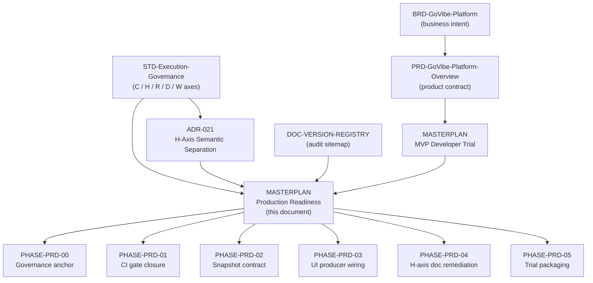

# MASTERPLAN: GoVibe Production Readiness

## 1. Purpose

This masterplan is the live plan of record for moving GoVibe from a verified **local developer
preview** to a defensible **production** claim.

It exists because a full evidence sweep on 2026-08-06 found that every automated gate passes while
several product-level claims are still unsupported: most Mission Control views have no backend
producer, the main test suite is not gated in CI, and the snapshot contract has drifted between the
TypeScript type and the runtime.

This document is **live**. Status lives in the tables below, not in a separate tracker. The roadmap
parser reads these tables directly, so editing a `Status` cell changes what Mission Control renders.

Scope boundary: this plan governs *readiness*, not new product surface. The MVP developer-trial
scope stays owned by `docs/roadmap/MASTERPLAN-govibe-mvp-developer-trial.md`; this plan depends on
it and does not supersede it.

## 2. Source-of-Truth Graph

Every phase in this plan is governed by exactly one upstream source of truth. This plan never
redefines a governed term; it points at the document that owns it.



### 2.1 Governing Authority per Phase

| Phase | Governing SoT | What that SoT owns | This plan may not |
|---|---|---|---|
| PHASE-PRD-00 | `docs/DOC-VERSION-REGISTRY.md` | Which documents are active and canonical | Register itself without an owner ratification |
| PHASE-PRD-01 | `docs/STD-Execution-Governance.md` | Gate obligations per Complexity Level | Lower a gate to make a phase pass |
| PHASE-PRD-02 | `docs/PRD-GoVibe-Platform-Overview.md` | The MissionSnapshot product contract | Add a snapshot field without a contract decision |
| PHASE-PRD-03 | `docs/PRD-GoVibe-Platform-Overview.md` | Which views exist and what they must show | Introduce mock telemetry to fill a panel |
| PHASE-PRD-04 | `docs/adr/ADR-021-H-Axis-Access-Scope-Semantic-Separation.md` | The binding meaning of the H axis | Reinterpret H as hops, budget, or risk |
| PHASE-PRD-05 | `docs/roadmap/MASTERPLAN-govibe-mvp-developer-trial.md` | Developer-trial exit criteria | Declare trial-ready ahead of that plan |

### 2.2 Terminology Lock

This plan uses the canonical axes from `docs/STD-Execution-Governance.md` v2.4.0+ga only.
`H` is Access Scope with valid values `H0`..`H4`. `H5` and `H6` are abolished. Graph distance is
`retrieval_radius`, context allowance is `context_budget`. PHASE-PRD-04 exists because several
architecture documents still violate this lock.

## 3. Evidence Baseline

Recorded 2026-08-06 by direct execution on commit `87c313d`. Every row is a command that was run,
not a claim read from a document.

| Check | Command | Result |
|---|---|---|
| Typecheck | `npm run lint` | PASS, no errors |
| Unit tests | `npx vitest run` | PASS, 417 passed / 1 skipped across 54 files |
| Security suite | `npm run test:security` | PASS, 50/50 |
| Production build | `npm run build` | PASS, 186 kB JS / 58 kB gzip |
| Doc governance | `npm run docs:validate` | PASS with warnings |
| Roadmap containers | `npm run roadmap:validate` | PASS, 0 errors / 14 warnings |
| MCP catalog | `npm run mcp:smoke` | PASS, 15 tools / 90 roadmap nodes |
| Live sidecar | `GET /mission/snapshot` | 200 with 9 agents, 34 capabilities, 4 providers, 11 roadmap sources |
| Auth boundary | unauthenticated / foreign-origin request | 401 and 403 respectively |

### 3.1 Verified Gaps

| Gap ID | Finding | Evidence | Phase |
|---|---|---|---|
| GAP-01 | The 417-test suite, `docs:validate`, and `roadmap:validate` run in no CI workflow | Only the P0 security workflow runs on PRs, and it is path-filtered | PHASE-PRD-01 |
| GAP-02 | End-to-end CI exercises a static mockup fixture, not the application | Playwright config sets no web server and targets an HTML fixture | PHASE-PRD-01 |
| GAP-03 | Seven snapshot slices are initialised empty and never written by any producer | `scripts/mcp/runtime/snapshot-store.mjs` plus zero writes in `scripts/mcp/runtime-core.mjs` | PHASE-PRD-03 |
| GAP-04 | `orchestration` is emitted by the runtime but absent from the TypeScript contract | `src/mission/domain.ts` versus the live snapshot payload | PHASE-PRD-02 |
| GAP-05 | `heatmap` exists in the TypeScript contract but no producer emits it; `masterPlanPreview` is produced only on demand by the `masterplan.preview` command (verified live 2026-08-06), so the automatic snapshot never carries it | `src/mission/domain.ts` versus `scripts/mcp/runtime/snapshot-store.mjs`; producer in `scripts/mcp/runtime/roadmap-service.mjs` | PHASE-PRD-02 |
| GAP-06 | Nine of seventeen views render an empty state because their slice has no producer | `src/app/RenderView.tsx` cross-referenced with the live snapshot | PHASE-PRD-03 |
| GAP-07 | Four sidebar labels disagree with the on-screen view title | `src/mission/navigation.ts` versus each view header | PHASE-PRD-03 |
| GAP-08 | Active documents still use abolished `H5`/`H6` or legacy Context-Scaling-Tier semantics | `docs/architecture/C4-GoVibe-Platform.md`, `docs/architecture/SDD-Genesis-Block.md`, `docs/architecture/BLUEPRINT-Translator-Core-Slice.md`; also `docs/features/agent-team/FEAT-Quota-Aware-Local-LLM-Decomposition.md` §3 (approved doc citing "Context Scaling Tier" `H0..H6`) | PHASE-PRD-04 |
| GAP-09 | A clean checkout cannot start; the sidecar requires a token with no quickstart to create one | `.env.example` exists, no `.env` bootstrap or quickstart document | PHASE-PRD-05 |

### 3.2 View Wiring Baseline

Recorded from the live snapshot. This table is the acceptance surface for PHASE-PRD-03.

| View | Slice | Live count | State |
|---|---|---|---|
| A2 Roadmap Board | roadmap, roadmapSources, agents | 5 / 11 / 9 | wired |
| A3 Capability Plugins | capabilities | 34 | wired |
| A5 Agent Management | agents | 9 | wired |
| C2 Intelligence Zoo | agents, capabilities | 9 / 34 | wired |
| A1 Real-time Dashboard | metrics, reactor, workflowRuns, providers | providers only | partial |
| A4 Vault, Context and Impact | capabilities, providers, terminal, workflowRuns | three of four | partial |
| D1 Reactor Run Trigger | command dispatch only | not applicable | command-only |
| C3 SRS-G Debugger | manual ingest only | not applicable | ingest-only |
| B1 AST Hierarchy Tree | graph | 0 | unwired |
| B2 Business Specifications | specs | 0 | unwired |
| B3 Interactive Graph | graph | 0 | unwired |
| B4 Live Call Graph | graph | 0 | unwired |
| C1 Symbol Explorer Hub | symbols | 0 | unwired |
| C4 Database ERD Schema | symbols | 0 | unwired |
| C5 HNSW Vector Space Map | graph | 0 | unwired |
| D2 Cyber Reactor Heatmap | heatmap | field absent | unwired |
| D3 EABS-01 Campaign Logs | campaignLogs | 0 | unwired |

## 4. Readiness Gates

Production is claimable only when every gate below is green. A gate is never satisfied by lowering
its own threshold.

| Gate | Definition | Current |
|---|---|---|
| GATE-CI | Every pull request runs `npm run baseline:check` with no path filter | met (2026-08-08: run 31226249238 on PR #122 executed docs, roadmap, typecheck, 70 vitest files, 65 security tests, and build; baseline-check set as a required status check on main; failure path proven red on PR #123) |
| GATE-CONTRACT | The TypeScript MissionSnapshot and the runtime snapshot agree field for field | not met |
| GATE-HONESTY | Every view either shows live data or an empty state naming the missing feed, with no fabricated values | met |
| GATE-SEMANTIC | No active document uses abolished `H5`/`H6` semantics | not met |
| GATE-BOOTSTRAP | A clean checkout reaches a running Mission Control by following one document | not met |
| GATE-SECURITY | The sidecar rejects unauthenticated and foreign-origin traffic under automated test | met |

Deployment topology beyond a loopback-bound sidecar is explicitly **out of scope** for this plan.
Hosting, TLS termination, and a multi-user identity model require their own Change Request before
any production claim that involves a network-reachable deployment.

## Phases

| Phase | Goal | Governing SoT | Exit Criteria | Status | Progress |
|---|---|---|---|---|---|
| PHASE-PRD-00 | Anchor governance and register this plan | `docs/DOC-VERSION-REGISTRY.md` | This plan is registered and the agent contracts point at it | in-progress | 60 |
| PHASE-PRD-01 | Close the CI gate so the real suite protects the branch | `docs/STD-Execution-Governance.md` | GATE-CI is met | in-progress | 75 |
| PHASE-PRD-02 | Realign the snapshot contract across TypeScript and runtime | `docs/PRD-GoVibe-Platform-Overview.md` | GATE-CONTRACT is met | planned | 0 |
| PHASE-PRD-03 | Give every view a real producer or an owned decision to retire it | `docs/PRD-GoVibe-Platform-Overview.md` | No view is unwired without a recorded decision | planned | 0 |
| PHASE-PRD-04 | Remove abolished H-axis semantics from active documents | `docs/adr/ADR-021-H-Axis-Access-Scope-Semantic-Separation.md` | GATE-SEMANTIC is met | planned | 0 |
| PHASE-PRD-05 | Package a repeatable clean-checkout developer trial | `docs/roadmap/MASTERPLAN-govibe-mvp-developer-trial.md` | GATE-BOOTSTRAP is met | planned | 0 |

## Sprints

| Sprint | Parent ID | Goal | Exit Criteria | Status | Progress |
|---|---|---|---|---|---|
| SPR-PRD-00 | PHASE-PRD-00 | Register the readiness plan and bind the agent contracts to it | Registry row exists and both agent contracts cite this plan | in-progress | 60 |
| SPR-PRD-01 | PHASE-PRD-01 | Make the full baseline gate run on every pull request | A pull request touching only frontend code still runs the full suite | in-progress | 50 |
| SPR-PRD-02 | PHASE-PRD-02 | Reconcile every MissionSnapshot field across both implementations | A contract test fails when either side adds an unmatched field | planned | 0 |
| SPR-PRD-03 | PHASE-PRD-03 | Wire the graph, symbol, and telemetry producers | Each formerly unwired view renders live data from a real feed | planned | 0 |
| SPR-PRD-04 | PHASE-PRD-04 | Correct the H-axis vocabulary in architecture documents | A repository scan finds no active `H5`/`H6` access semantics | planned | 0 |
| SPR-PRD-05 | PHASE-PRD-05 | Author and verify the clean-checkout quickstart | A reviewer reaches a running Mission Control from the document alone | planned | 0 |

## Backlog Items

| ID | Parent ID | Type | Title | Priority | Owner | Status | Dependencies | Source Section |
|---|---|---|---|---|---|---|---|---|
| TASK-PRD-001 | SPR-PRD-00 | task | Register this masterplan in the document version registry | P0 | ATHER | in-progress | - | Section 3.1 GAP-00 |
| TASK-PRD-002 | SPR-PRD-00 | task | Bind AGENTS.md and CLAUDE.md to this readiness plan | P0 | THESEUS | in-progress | TASK-PRD-001 | Section 3.1 GAP-00 |
| TASK-PRD-003 | SPR-PRD-01 | task | Add an unfiltered baseline check workflow for every pull request | P0 | ATHER | done | TASK-PRD-002 | Section 3.1 GAP-01 |
| TASK-PRD-004 | SPR-PRD-01 | task | Point end-to-end coverage at the running application | P1 | VIBE | planned | TASK-PRD-003 | Section 3.1 GAP-02 |
| TASK-PRD-005 | SPR-PRD-02 | task | Add the orchestration slice to the MissionSnapshot contract | P0 | ARCHON | planned | TASK-PRD-003 | Section 3.1 GAP-04 |
| TASK-PRD-006 | SPR-PRD-02 | task | Resolve the heatmap and master plan preview contract orphans | P1 | ARCHON | planned | TASK-PRD-005 | Section 3.1 GAP-05 |
| TASK-PRD-007 | SPR-PRD-03 | task | Publish graph and symbol producers from the workspace scan | P0 | VIBE | planned | TASK-PRD-005 | Section 3.2 |
| TASK-PRD-008 | SPR-PRD-03 | task | Reconcile sidebar labels with rendered view titles | P2 | VIBE | planned | - | Section 3.1 GAP-07 |
| TASK-PRD-009 | SPR-PRD-04 | task | Correct abolished H-axis semantics in architecture documents | P1 | ATHER | planned | - | Section 3.1 GAP-08 |
| TASK-PRD-010 | SPR-PRD-05 | task | Author the clean-checkout developer quickstart | P0 | THESEUS | planned | TASK-PRD-003 | Section 3.1 GAP-09 |
| TASK-PRD-011 | SPR-PRD-00 | task | Provide a Mission Control readiness tracking and command view | P1 | VIBE | in-progress | TASK-PRD-001 | Section 11 |

## Assignments

| Task ID | Subject ID | Subject Type | Policy Model | Assigned At | Assigned By |
|---|---|---|---|---|---|
| TASK-PRD-001 | ATHER | agent | ABAC | 2026-08-06T00:00:00Z | Boss |
| TASK-PRD-002 | THESEUS | agent | ABAC | 2026-08-06T00:00:00Z | Boss |
| TASK-PRD-003 | ATHER | agent | ABAC | 2026-08-06T00:00:00Z | Boss |
| TASK-PRD-004 | VIBE | agent | ABAC | 2026-08-06T00:00:00Z | Boss |
| TASK-PRD-005 | ARCHON | agent | ABAC | 2026-08-06T00:00:00Z | Boss |
| TASK-PRD-006 | ARCHON | agent | ABAC | 2026-08-06T00:00:00Z | Boss |
| TASK-PRD-007 | VIBE | agent | ABAC | 2026-08-06T00:00:00Z | Boss |
| TASK-PRD-008 | VIBE | agent | ABAC | 2026-08-06T00:00:00Z | Boss |
| TASK-PRD-009 | ATHER | agent | ABAC | 2026-08-06T00:00:00Z | Boss |
| TASK-PRD-010 | THESEUS | agent | ABAC | 2026-08-06T00:00:00Z | Boss |
| TASK-PRD-011 | VIBE | agent | ABAC | 2026-08-06T00:00:00Z | Boss |

## Handoffs

| Task ID | From ID | To ID | Required Artifact | Note | Created At | State |
|---|---|---|---|---|---|---|
| TASK-PRD-001 | ATHER | Boss | Registry row plus ratification decision | Draft to approved transition is an owner decision | 2026-08-06T00:00:00Z | pending |
| TASK-PRD-003 | ATHER | Boss | Green pull-request run of the full baseline gate | Confirms GATE-CI before further phases start | 2026-08-06T00:00:00Z | completed |
| TASK-PRD-006 | ARCHON | Boss | Contract decision on the two orphan fields | Produce or retire is a product decision, not an implementation choice | 2026-08-06T00:00:00Z | pending |
| TASK-PRD-007 | VIBE | ATHER | Impact analysis over the changed snapshot contract | Required before the wiring change closes | 2026-08-06T00:00:00Z | pending |

## Verification

| Task ID | QA Status | Audit Status | Deployment Status | Updated At |
|---|---|---|---|---|
| TASK-PRD-001 | pending | pending | n/a | 2026-08-06T00:00:00Z |
| TASK-PRD-002 | pending | pending | n/a | 2026-08-06T00:00:00Z |
| TASK-PRD-003 | passed | passed | n/a | 2026-08-08T00:00:00Z |
| TASK-PRD-004 | pending | pending | n/a | 2026-08-06T00:00:00Z |
| TASK-PRD-005 | pending | pending | n/a | 2026-08-06T00:00:00Z |
| TASK-PRD-006 | pending | pending | n/a | 2026-08-06T00:00:00Z |
| TASK-PRD-007 | pending | pending | n/a | 2026-08-06T00:00:00Z |
| TASK-PRD-008 | pending | pending | n/a | 2026-08-06T00:00:00Z |
| TASK-PRD-009 | pending | pending | n/a | 2026-08-06T00:00:00Z |
| TASK-PRD-010 | pending | pending | n/a | 2026-08-06T00:00:00Z |
| TASK-PRD-011 | pending | pending | n/a | 2026-08-06T00:00:00Z |

## Task Containers

### TC-TASK-PRD-001

```yaml
task_container_id: TC-TASK-PRD-001
task_id: TASK-PRD-001
parent_phase_id: PHASE-PRD-00
parent_sprint_id: SPR-PRD-00
title: Register this masterplan in the document version registry
requirement_type: NFR
complexity: C-2
access_scope: H2
status: in-progress
version: 0.1.0+draft
pic: ATHER
executor: THESEUS
approver: Boss
auditor: ATHER
symbol_links:
  code: scripts/docs/validate-docs.mjs
  doc: docs/DOC-VERSION-REGISTRY.md
  test: unavailable
definition_of_done:
  acceptance_criteria:
    - criterion: Given the registry contains a row for this plan, when docs:validate runs, then no doc_id, version, or status mismatch error is reported
      checked: false
  success_criteria:
    - criterion: Given a reader opens the registry, when they look for the readiness plan, then they find one row pointing at the active file path
      checked: false
  exit_criteria:
    - criterion: Given the owner ratifies the plan, when status changes from draft to approved, then the registry version and status are updated in the same change
      checked: false
changelog: Registry row authored alongside the initial readiness plan.
created_at: 2026-08-06T00:00:00Z,THESEUS,pending
token_telemetry:
  model_name: claude-opus-5
  context_length: 200k
  predicted_token_usage: 3000
  total_token_usage: 3000
ui_state:
  dropdown_default: expanded
  expanded: true
  disabled_reason: ""
```

### TC-TASK-PRD-002

```yaml
task_container_id: TC-TASK-PRD-002
task_id: TASK-PRD-002
parent_phase_id: PHASE-PRD-00
parent_sprint_id: SPR-PRD-00
title: Bind AGENTS.md and CLAUDE.md to this readiness plan
requirement_type: NFR
complexity: C-2
access_scope: H2
status: in-progress
version: 0.1.0+draft
pic: THESEUS
executor: THESEUS
approver: Boss
auditor: ATHER
symbol_links:
  code: scripts/docs/validate-docs.mjs
  doc: docs/STD-Execution-Governance.md
  test: unavailable
definition_of_done:
  acceptance_criteria:
    - criterion: Given an agent starts a session, when it reads the operating contract, then it is told to consult this readiness plan before proposing readiness work
      checked: false
  success_criteria:
    - criterion: Given both contract files, when either is read alone, then the readiness plan path and its live-status rule are discoverable without another lookup
      checked: false
  exit_criteria:
    - criterion: Given docs:validate runs, when it resolves referenced paths in both contract files, then every referenced path exists
      checked: false
changelog: Agent operating contracts bound to the readiness plan.
created_at: 2026-08-06T00:00:00Z,THESEUS,pending
token_telemetry:
  model_name: claude-opus-5
  context_length: 200k
  predicted_token_usage: 4000
  total_token_usage: 4000
ui_state:
  dropdown_default: expanded
  expanded: true
  disabled_reason: ""
```

### TC-TASK-PRD-003

```yaml
task_container_id: TC-TASK-PRD-003
task_id: TASK-PRD-003
parent_phase_id: PHASE-PRD-01
parent_sprint_id: SPR-PRD-01
title: Add an unfiltered baseline check workflow for every pull request
requirement_type: NFR
complexity: C-2
access_scope: H2
status: done
version: 0.1.0+draft
pic: ATHER
executor: VIBE
approver: Boss
auditor: ATHER
symbol_links:
  code: scripts/docs/validate-roadmap-containers.mjs
  doc: docs/STD-Execution-Governance.md
  test: src/missionContract.test.ts
definition_of_done:
  acceptance_criteria:
    - criterion: Given a pull request that changes only files under src, when continuous integration runs, then the unit suite, doc validation, and roadmap validation all execute
      checked: true
  success_criteria:
    - criterion: Given a deliberately failing unit test on a branch, when the pull request is opened, then the required check reports failure
      checked: true
  exit_criteria:
    - criterion: Given the workflow is merged, when a maintainer inspects branch protection, then the baseline check is a required status check
      checked: true
changelog: Closed 2026-08-08. Evidence - green run 31226249238 (PR #122, full suite on a mixed-content PR), red run on PR #123 (deliberately failing test blocked by the required check), and baseline-check required in main branch protection.
created_at: 2026-08-06T00:00:00Z,THESEUS,pending
token_telemetry:
  model_name: claude-opus-5
  context_length: 200k
  predicted_token_usage: 6000
  total_token_usage: 6000
ui_state:
  dropdown_default: expanded
  expanded: true
  disabled_reason: ""
```

### TC-TASK-PRD-004

```yaml
task_container_id: TC-TASK-PRD-004
task_id: TASK-PRD-004
parent_phase_id: PHASE-PRD-01
parent_sprint_id: SPR-PRD-01
title: Point end-to-end coverage at the running application
requirement_type: FR
complexity: C-2
access_scope: H2
status: planned
version: 0.1.0+draft
pic: VIBE
executor: VIBE
approver: Boss
auditor: ATHER
symbol_links:
  code: src/app/RenderView.tsx
  doc: docs/PRD-GoVibe-Platform-Overview.md
  test: src/missionGateway.test.ts
definition_of_done:
  acceptance_criteria:
    - criterion: Given the end-to-end configuration, when a run starts, then it boots the development server and the sidecar rather than loading a static fixture
      checked: false
  success_criteria:
    - criterion: Given a wired view, when the end-to-end run inspects it, then it asserts on live snapshot data rather than fixture markup
      checked: false
  exit_criteria:
    - criterion: Given a regression that breaks the roadmap board, when the end-to-end suite runs, then it fails
      checked: false
changelog: End-to-end coverage gap recorded from the 2026-08-06 evidence sweep.
created_at: 2026-08-06T00:00:00Z,THESEUS,pending
token_telemetry:
  model_name: claude-opus-5
  context_length: 200k
  predicted_token_usage: 9000
  total_token_usage: 9000
ui_state:
  dropdown_default: expanded
  expanded: true
  disabled_reason: ""
```

### TC-TASK-PRD-005

```yaml
task_container_id: TC-TASK-PRD-005
task_id: TASK-PRD-005
parent_phase_id: PHASE-PRD-02
parent_sprint_id: SPR-PRD-02
title: Add the orchestration slice to the MissionSnapshot contract
requirement_type: FR
complexity: C-2
access_scope: H2
status: planned
version: 0.1.0+draft
pic: ARCHON
executor: VIBE
approver: Boss
auditor: ATHER
symbol_links:
  code: src/mission/domain.ts
  doc: docs/PRD-GoVibe-Platform-Overview.md
  test: src/mission/snapshot-reducer.test.ts
definition_of_done:
  acceptance_criteria:
    - criterion: Given the runtime emits an orchestration slice, when the TypeScript contract is typechecked, then the slice is a declared field with an explicit shape
      checked: false
  success_criteria:
    - criterion: Given a consumer reads the orchestration waves, when it does so through the snapshot type, then no cast or optional-chaining escape hatch is required
      checked: false
  exit_criteria:
    - criterion: Given a contract test comparing both implementations, when either side declares a field the other lacks, then the test fails
      checked: false
changelog: Contract drift recorded from the 2026-08-06 live snapshot comparison.
created_at: 2026-08-06T00:00:00Z,THESEUS,pending
token_telemetry:
  model_name: claude-opus-5
  context_length: 200k
  predicted_token_usage: 5000
  total_token_usage: 5000
ui_state:
  dropdown_default: expanded
  expanded: true
  disabled_reason: ""
```

### TC-TASK-PRD-006

```yaml
task_container_id: TC-TASK-PRD-006
task_id: TASK-PRD-006
parent_phase_id: PHASE-PRD-02
parent_sprint_id: SPR-PRD-02
title: Resolve the heatmap and master plan preview contract orphans
requirement_type: FR
complexity: C-2
access_scope: H2
status: planned
version: 0.1.0+draft
pic: ARCHON
executor: VIBE
approver: Boss
auditor: ATHER
symbol_links:
  code: scripts/mcp/runtime/snapshot-store.mjs
  doc: docs/PRD-GoVibe-Platform-Overview.md
  test: src/mission/snapshot-reducer.test.ts
definition_of_done:
  acceptance_criteria:
    - criterion: Given the owner decides produce or retire for each orphan field, when the decision is recorded, then the code follows it in the same change
      checked: false
  success_criteria:
    - criterion: Given the heatmap field survives the decision, when the runtime publishes a snapshot, then the field carries real reactor data rather than an absent key
      checked: false
  exit_criteria:
    - criterion: Given both orphan fields are resolved, when the contract test runs, then no field exists on one side only
      checked: false
changelog: Two orphan contract fields recorded from the 2026-08-06 live snapshot comparison.
created_at: 2026-08-06T00:00:00Z,THESEUS,pending
token_telemetry:
  model_name: claude-opus-5
  context_length: 200k
  predicted_token_usage: 7000
  total_token_usage: 7000
ui_state:
  dropdown_default: expanded
  expanded: true
  disabled_reason: ""
```

### TC-TASK-PRD-007

```yaml
task_container_id: TC-TASK-PRD-007
task_id: TASK-PRD-007
parent_phase_id: PHASE-PRD-03
parent_sprint_id: SPR-PRD-03
title: Publish graph and symbol producers from the workspace scan
requirement_type: FR
complexity: C-3
access_scope: H3
status: planned
version: 0.1.0+draft
pic: VIBE
executor: VIBE
approver: Boss
auditor: ATHER
symbol_links:
  code: scripts/mcp/runtime-core.mjs
  doc: docs/PRD-GoVibe-Platform-Overview.md
  test: scripts/mcp/smoke-test.mjs
definition_of_done:
  acceptance_criteria:
    - criterion: Given a completed workspace scan, when the runtime publishes a snapshot, then the graph and symbol slices carry the discovered nodes rather than empty arrays
      checked: false
  success_criteria:
    - criterion: Given the graph slice is populated, when a reviewer opens the AST tree, interactive graph, call graph, symbol explorer, ERD, and vector map views, then each renders discovered data
      checked: false
  exit_criteria:
    - criterion: Given no scan has run, when those views render, then they still show an empty state that names the missing feed and never a fabricated value
      checked: false
changelog: Seven unproduced snapshot slices recorded from the 2026-08-06 producer audit.
created_at: 2026-08-06T00:00:00Z,THESEUS,pending
token_telemetry:
  model_name: claude-opus-5
  context_length: 200k
  predicted_token_usage: 22000
  total_token_usage: 22000
ui_state:
  dropdown_default: expanded
  expanded: true
  disabled_reason: ""
```

### TC-TASK-PRD-008

```yaml
task_container_id: TC-TASK-PRD-008
task_id: TASK-PRD-008
parent_phase_id: PHASE-PRD-03
parent_sprint_id: SPR-PRD-03
title: Reconcile sidebar labels with rendered view titles
requirement_type: NFR
complexity: C-1
access_scope: H1
status: planned
version: 0.1.0+draft
pic: VIBE
executor: VIBE
approver: Boss
auditor: ATHER
symbol_links:
  code: src/mission/navigation.ts
  doc: docs/PRD-GoVibe-Platform-Overview.md
  test: src/missionContract.test.ts
definition_of_done:
  acceptance_criteria:
    - criterion: Given a user selects any sidebar entry, when the view renders, then the on-screen title matches the sidebar label or the difference is a recorded product decision
      checked: false
  success_criteria:
    - criterion: Given the four known mismatches, when the change lands, then each is either renamed or documented as intentional
      checked: false
  exit_criteria:
    - criterion: Given a test that compares the navigation map to each view header, when a future rename desynchronises them, then the test fails
      checked: false
changelog: Four label mismatches recorded from the 2026-08-06 navigation audit.
created_at: 2026-08-06T00:00:00Z,THESEUS,pending
token_telemetry:
  model_name: claude-opus-5
  context_length: 200k
  predicted_token_usage: 4000
  total_token_usage: 4000
ui_state:
  dropdown_default: expanded
  expanded: true
  disabled_reason: ""
```

### TC-TASK-PRD-009

```yaml
task_container_id: TC-TASK-PRD-009
task_id: TASK-PRD-009
parent_phase_id: PHASE-PRD-04
parent_sprint_id: SPR-PRD-04
title: Correct abolished H-axis semantics in architecture documents
requirement_type: NFR
complexity: C-3
access_scope: H3
status: planned
version: 0.1.0+draft
pic: ATHER
executor: THESEUS
approver: Boss
auditor: ATHER
symbol_links:
  code: scripts/docs/validate-docs.mjs
  doc: docs/adr/ADR-021-H-Axis-Access-Scope-Semantic-Separation.md
  test: unavailable
definition_of_done:
  acceptance_criteria:
    - criterion: Given the platform C4, genesis block design, and translator blueprint, when each is read, then graph distance is expressed as retrieval radius and never as an H tier
      checked: false
  success_criteria:
    - criterion: Given a repository scan for active H5 or H6 usage, when it runs outside archive and audit paths, then it returns no active access semantics
      checked: false
  exit_criteria:
    - criterion: Given the MVP developer trial plan declares a planning tier, when it is corrected, then it uses a valid access scope between H0 and H4
      checked: false
changelog: Four active documents carrying abolished H-axis semantics recorded on 2026-08-06.
created_at: 2026-08-06T00:00:00Z,THESEUS,pending
token_telemetry:
  model_name: claude-opus-5
  context_length: 200k
  predicted_token_usage: 12000
  total_token_usage: 12000
ui_state:
  dropdown_default: expanded
  expanded: true
  disabled_reason: ""
```

### TC-TASK-PRD-010

```yaml
task_container_id: TC-TASK-PRD-010
task_id: TASK-PRD-010
parent_phase_id: PHASE-PRD-05
parent_sprint_id: SPR-PRD-05
title: Author the clean-checkout developer quickstart
requirement_type: NFR
complexity: C-2
access_scope: H2
status: planned
version: 0.1.0+draft
pic: THESEUS
executor: THESEUS
approver: Boss
auditor: ATHER
symbol_links:
  code: scripts/mcp/sidecar-server.mjs
  doc: docs/roadmap/MASTERPLAN-govibe-mvp-developer-trial.md
  test: scripts/mcp/smoke-test.mjs
definition_of_done:
  acceptance_criteria:
    - criterion: Given a clean checkout, when a developer follows the quickstart end to end, then Mission Control reports a connected state without further guesswork
      checked: false
  success_criteria:
    - criterion: Given the quickstart covers token creation, when a developer follows it, then the sidecar starts without the missing-token error
      checked: false
  exit_criteria:
    - criterion: Given a reviewer who has never run the project, when they follow the quickstart unaided, then they reach a connected Mission Control and record the result
      checked: false
changelog: Clean-checkout bootstrap gap recorded from the 2026-08-06 evidence sweep.
created_at: 2026-08-06T00:00:00Z,THESEUS,pending
token_telemetry:
  model_name: claude-opus-5
  context_length: 200k
  predicted_token_usage: 8000
  total_token_usage: 8000
ui_state:
  dropdown_default: expanded
  expanded: true
  disabled_reason: ""
```

### TC-TASK-PRD-011

```yaml
task_container_id: TC-TASK-PRD-011
task_id: TASK-PRD-011
parent_phase_id: PHASE-PRD-00
parent_sprint_id: SPR-PRD-00
title: Provide a Mission Control readiness tracking and command view
requirement_type: FR
complexity: C-2
access_scope: H2
status: in-progress
version: 0.1.0+draft
pic: VIBE
executor: VIBE
approver: Boss
auditor: ATHER
symbol_links:
  code: src/app/RenderView.tsx
  doc: docs/roadmap/MASTERPLAN-govibe-production-readiness.md
  test: src/features/readiness/readinessPlan.test.ts
definition_of_done:
  acceptance_criteria:
    - criterion: Given the roadmap sources feed contains the readiness plan, when the readiness view renders, then registration status (approval, active flag, score) comes from live snapshot data with no fabricated values
      checked: true
  success_criteria:
    - criterion: Given the operator issues the load or preview command from the view, when the runtime reloads the source, then the plan's phases, sprints, and tasks render in the view from the returned snapshot
      checked: true
  exit_criteria:
    - criterion: Given the plan is absent from the feed or not yet loaded, when the view renders, then it shows an empty state naming the missing feed, and npm run lint plus the readiness helper vitest file pass with recorded output
      checked: true
changelog: Readiness tracking and command surface bound to existing roadmap.select and masterplan.preview commands; no backend change.
created_at: 2026-08-06T00:00:00Z,VIBE,pending
token_telemetry:
  model_name: claude-fable-5
  context_length: 200k
  predicted_token_usage: 9000
  total_token_usage: 9000
ui_state:
  dropdown_default: expanded
  expanded: true
  disabled_reason: ""
```

## 11. Live Status Protocol

This document is the status store. There is no second tracker to reconcile.

1. Update the `Status` and `Progress` cells in the Phases, Sprints, and Backlog Items tables. The
   roadmap parser reads those cells directly, so Mission Control reflects the edit on reload.
2. Update the matching Task Container `status` and tick the relevant Definition-of-Done criterion.
   A criterion may only be ticked when its stated evidence exists.
3. Record the outcome in the Verification table. A task is not complete while its QA or audit
   status is pending.
4. Re-run `npm run docs:validate` and `npm run roadmap:validate` after any edit to this file.
5. Never mark a Readiness Gate met without the command output that proves it. Evidence recorded in
   Section 3 must be reproducible by re-running the listed command.

Status vocabulary must use tokens the roadmap parser recognises: `planned`, `in-progress`, `blocked`,
`ready`, `assigned`, `review`, `done`. Any other token silently degrades to `planned` on the board,
so `in_progress` with an underscore is wrong and will not surface as active work. Progress is an
integer percentage.

### 11.1 Execution Decomposition and Tiered Review

Execution-level decomposition of local-eligible tasks lives in
`docs/roadmap/BACKLOG-production-readiness-execution.md`. That backlog owns HOW; this plan stays
WHAT. Binding rules:

- Packet policy follows `docs/features/agent-team/FEAT-Quota-Aware-Local-LLM-Decomposition.md`
  (approved): micro/atomic packets for local models, lead agent keeps planning and verification.
- Review gating follows `docs/features/agent-team/FEAT-Tiered-Review.md`: `L0` deterministic checks
  run before any LLM review, `L1` local-SLM review is escalate-only, `L2` frontier sign-off happens
  once per composed change. No output that fails `L0` may consume LLM review tokens.
- Local packet workers run on the `T-ctx` context profile per `AGENTS.md` §5; `L2`/audit gates run
  on `M-ctx`.
- Model selection is router-resolved per `docs/STD-SLM-Tiered-Routing.md` (GoVibe canonical;
  `T0..T3` ladder, one-rung escalation, cheap-eligibility only with a deterministic verify
  command; the RWANG tiered-swarm copies are mirrors). Packets declare a `tier_hint`, never a
  concrete model as a requirement.
- A masterplan task decomposed there (currently `TASK-PRD-005`, `TASK-PRD-008`) is marked done only
  from the backlog's recorded gate evidence, in the same change that closes the backlog task.

### 11.2 Per-Task Execution Order (Docs → Links → Code)

Every task in this plan and its execution backlog follows document-driven order. Skipping a step
invalidates the evidence chain:

1. **Doc first.** The governing SoT from §2.1 carries the decision or spec change before
   implementation starts. Where the change is a contract field, the recorded owner decision
   precedes the code and lands in the same change.
2. **Links before code.** The Task Container is complete — including `symbol_links.code`,
   `symbol_links.doc`, `symbol_links.test` and testable Given/When/Then criteria — before the
   task may promote to the board. This is machine-enforced: the roadmap Definition-of-Ready gate
   fails the build on an incomplete container in an approved source.
3. **Code with gate evidence.** Implementation lands only through the tiered review gate of
   §11.1; L0 evidence is attached to the criteria it ticks.
4. **Impact before completion.** Reverse-dependency impact analysis runs and required dependents
   are updated before the task is marked done (`AGENTS.md` §8.3).

Phases execute **dependency-ordered, not number-ordered**. PHASE-PRD-04 is documentation
remediation with no dependency on the code phases and should start before or alongside them —
its position in the numbering is not a licence to defer semantic doc corrections until after
code lands.

### 11.3 Promotion Rule

This plan is `draft`. The roadmap container gate enforces completeness only for `approved` sources,
so its findings currently surface as warnings. Every Task Container in this document is already
authored to complete-container standard, so ratification to `approved` should produce zero new
errors. Ratification is an owner decision and must not be self-applied by an executing agent.

## 12. Risks

| Risk | Impact | Control |
|---|---|---|
| Wiring work is used to justify fabricated telemetry | Product rule violation and loss of trust | Empty states remain mandatory until a real feed exists |
| The readiness plan competes with the MVP developer-trial plan | Two conflicting boards | Section 1 scope boundary; this plan depends on the MVP plan and never supersedes it |
| Ratifying to approved before containers are complete | Roadmap gate fails the build | Section 11.3 promotion rule; containers authored complete while still draft |
| CI gate closure surfaces a large backlog of latent failures | Phase 1 stalls | Land the workflow first and triage findings as new backlog items rather than weakening the gate |
| Production is claimed on the strength of green gates alone | Overstated readiness | Section 4 gates are necessary, not sufficient; network deployment requires its own Change Request |

## 13. Changelog

| Version | Date | Status | Summary | Commit Hash | Agent |
|---|---|---|---|---|---|
| 0.1.6+draft | 2026-08-08 | draft | Closed TASK-PRD-003 and marked GATE-CI met on command evidence: green baseline-check run 31226249238 on PR #122 (70 vitest files, 65 security tests, docs/roadmap/typecheck/build), red baseline-check on the deliberately-failing PR #123 proving the gate blocks a broken suite, and baseline-check set as a required status check on main. Recorded per the WP-16/17 precedent as owner-directed closure of single-session-verified evidence, not an independent audit reproduction. | pending | Claude Fable 5 |
| 0.1.5+draft | 2026-08-06 | draft | Started TASK-PRD-003: added the unfiltered Baseline Check workflow (.github/workflows/baseline-check.yml) running docs, roadmap, typecheck, unit, security, and build gates on every pull request with no path filter. PHASE-PRD-01 and SPR-PRD-01 moved to in-progress. Marking GATE-CI met still requires the check to be made required in branch protection (owner action). | pending | Claude Fable 5 |
| 0.1.4+draft | 2026-08-06 | draft | Corrected GAP-05 against live evidence gathered while verifying TASK-PRD-011: masterPlanPreview does have an on-demand producer (the masterplan.preview command); only heatmap remains producerless. Recorded that the board rejects draft sources by promotion contract, surfaced in the readiness view. | pending | Claude Fable 5 |
| 0.1.3+draft | 2026-08-06 | draft | Added TASK-PRD-011 (Mission Control readiness tracking and command view, SPR-PRD-00) with a complete Task Container, following the §11.2 order: this row and container precede the implementation. | pending | Claude Fable 5 |
| 0.1.2+draft | 2026-08-06 | draft | Codified §11.2 per-task document-driven execution order (doc first, symbol links before code via the machine-enforced DoR gate, code with L0 evidence, impact before completion) and declared phases dependency-ordered so PHASE-PRD-04 doc remediation starts before or alongside code phases. Renumbered the promotion rule to §11.3 and fixed its stale reference in the risk table. | pending | Claude Fable 5 |
| 0.1.1+draft | 2026-08-06 | draft | Linked the local-packet execution backlog (§11.1): TASK-PRD-005 and TASK-PRD-008 decompose into micro/atomic packets gated by the canonical L0/L1/L2 tiered review, with T-ctx worker context. Extended GAP-08 evidence with the legacy Context-Scaling-Tier wording found in the approved quota-aware decomposition feature doc. | pending | Claude Fable 5 |
| 0.1.0+draft | 2026-08-06 | draft | Initial production-readiness masterplan derived from a direct evidence sweep on commit 87c313d. Records nine verified gaps, six readiness gates, six phases, and ten task containers. | pending | Claude Opus 5 |
